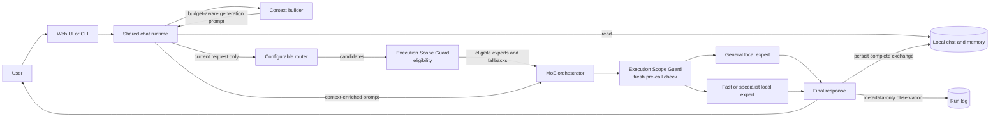

# myMoE

**Use the smallest suitable local AI expert, keep a stronger one available, and
escalate only under explicit policy.**

## In plain English

- **Problem:** using the largest model for every request can waste memory and
  time, while keeping many specialist models active can be impractical on one
  workstation. Sending everything to a paid remote assistant also gives up
  local control when the task did not require it.
- **What it does:** myMoE is a configurable local control plane that chooses an
  eligible model for each request, assembles bounded chat context, applies safe
  fallbacks, and records operational evidence. It orchestrates independent
  models; it does not train a new sparse Mixture-of-Experts model.
- **Who it is for:** developers and advanced users who run local models and want
  an inspectable way to balance capability, device resources, privacy, and
  optional premium escalation.
- **Concrete example:** in the default profile, requests such as “rewrite this
  message in a neutral tone” are configured for the smaller fast expert, while
  broad reasoning stays with the resident general expert. If the fast expert is
  offline, the configured fallback can use the resident model without widening
  the default device-only execution scope.

| Feature | Real-world benefit |
| --- | --- |
| Configuration-driven routing across independent models | Teams can change experts, weights, endpoints, budgets, and fallbacks without retraining one giant model. |
| Execution Scope Guard before every model call | A local-only request fails closed instead of silently moving to a wider mesh or remote route. |
| Shared persistent chat, memory, and budget-aware context | The web and terminal experiences can preserve useful history without sending every stored item to every model call. |
| Model lifecycle, diagnostics, and guarded fallbacks | Operators can see what is ready and recover from an unavailable expert through an explicit policy. |
| Optional Hybrid Assistant Bridge | Local execution and mechanical checks can stop a task early; a premium assistant is considered only when capability, privacy, evidence, and budget rules allow it. |
| Verified Outcome Routing Lab | Routing changes can be compared against final verification evidence offline before an operator activates a new policy. |

> **Maturity and limits:** myMoE is an alpha workstation runtime and evaluation
> harness, not a hosted multi-tenant service or an unrestricted autonomous agent.
> Current results apply only to the documented hardware, models, profiles, and
> workloads; they do not prove that routing always beats one strong model.
> Automatic specialist cold-loading and automatic live routing-policy activation
> are not implemented.

## Technical overview

myMoE is a local-first, system-level Mixture of Experts orchestration runtime. It
routes each request to one or more independent models under an explicit
execution-scope policy instead of training one large sparse MoE model from
scratch.

The project includes persistent chat, budget-aware context and memory,
configurable routing, model lifecycle tools, diagnostics, evaluation, and a
separate approval-gated agent loop.

An optional Hybrid Assistant Bridge can preflight a task with local Codex, apply
mechanical verification, and invoke premium Codex only when policy, evidence,
and a bounded budget permit escalation. It is a task-level evidence layer, not
another model gateway.

The Verified Outcome Routing Lab can then link each content-free route receipt
to final verification and operational metrics, build a versioned scorecard,
and replay alternative efficiency profiles offline. Its paired promotion gate
can emit a short-lived, structural-eligibility canary manifest from preregistered,
disjoint evidence. No manifest is consumed by the runtime in the current
release, so the lab still never changes a live route.


## Why It Exists

Local models have different strengths and hardware costs. Keeping every large specialist resident is usually wasteful, while sending every task to the largest model is slow. myMoE provides a small, inspectable control plane that can:

- keep a capable general model available;
- send simple transformations to a smaller expert;
- retry a configured fallback when an expert is unavailable;
- compare multiple expert answers when a profile requests it;
- keep chat, memory, operational evidence, and model traffic local by default;
- block routes and fallbacks that exceed the configured execution scope;
- stop verified assistant tasks locally or hand off a minimal redacted capsule;
- replace models, routes, budgets, and extension registries through configuration.

## How It Works



The router and the model deliberately receive different inputs. The router sees
only the current user request, so an old memory cannot accidentally change the
route. The selected expert receives a budget-aware prompt assembled from
memory, the durable session summary, recent turns, and the current request.
Before routing, the Execution Scope Guard filters ineligible experts; the
orchestrator obtains fresh evidence again immediately before each provider
call. The shipped profiles allow only `device_only` execution and never widen a
fallback scope automatically.

For the complete lifecycle, including execution scope, routing scores,
fallbacks, streaming, startup, persistence, and agent approvals, read
[How myMoE works](docs/how-it-works/README.md).

## Quick Start

The default profile is optimized for Apple Silicon with 24 GiB of unified
memory. The project supports Python 3.10 or newer; this reproducible MLX quick
start uses [uv](https://docs.astral.sh/uv/) with the locked Python 3.12 environment.

```bash
uv sync --locked --python 3.12 --extra mlx
PYTHONPATH=src .venv/bin/python scripts/bootstrap_runtime.py --download-models
```

Start the primary model in one terminal:

```bash
PYTHONPATH=src .venv/bin/python scripts/start_local_models.py --only-first
```

Start the web app in another terminal:

```bash
.venv/bin/mymoe-web --port 8089
```

Open `http://127.0.0.1:8089`.

Starting only the first model keeps memory use low. If a request is routed to the offline fast expert, the default bidirectional fallback order retries the resident general expert.

For Windows, Linux, Ollama, llama.cpp, optional profiles, and the guarded startup runbook, use the [installation guide](docs/installation.md).

## Choose the Right Entry Point

| Goal | Entry point | Persistence and tools |
| --- | --- | --- |
| Use the chat application | `.venv/bin/mymoe-web --port 8089` | Persistent chats, memory retrieval, streaming, and metadata-only run logging. |
| Use persistent terminal chat | `.venv/bin/mymoe --interactive` | Uses the same chat, memory, context, and run-log stores as the web app. |
| Ask one stateless question | `.venv/bin/mymoe --prompt "..."` | Calls `LocalMoE` directly; it does not load chat context or persist a session. |
| Run a bounded tool task | `.venv/bin/mymoe --agent-prompt "..." --agent-tool memory.search` | Separate CLI-only agent loop; only explicitly selected strict-schema tools are visible. |
| Preflight local versus premium Codex | `.venv/bin/mymoe --assistant-task "..." --assistant-capability code` | Dry-run by default; plans local execution, verification, bounded escalation, or a policy block without exposing task text in the receipt. |
| Inspect readiness | `.venv/bin/mymoe --doctor` | Read-only setup, health, hardware, storage, process, extension, and cron checks. |

## Default Profile

The default profile is [`configs/moe.live.general-mlx.example.json`](configs/moe.live.general-mlx.example.json).

| Expert | Model | Role | Endpoint | Execution |
| --- | --- | --- | --- | --- |
| `general` | Qwen3 4B MLX 4-bit | General reasoning and normal chat | `127.0.0.1:8101` | `device_only` / `direct_local` |
| `fast_fallback` | Qwen3 1.7B MLX 4-bit | Summarization, rewriting, translation, formatting, compaction, and fallback | `127.0.0.1:8102` | `device_only` / `direct_local` |

The profile uses top-1 `best` aggregation. Routing combines base expert weights, explicit keyword rules, local character n-gram examples, and a distilled local character n-gram centroid artifact. The models do not classify their own requests.

## Configuration-First Design

| Configuration | Responsibility |
| --- | --- |
| [`configs/app.json`](configs/app.json) | Active profile, allowed profile/evaluation directories, local work directory, backend preferences, language policy, extension paths, and permissions. |
| [`configs/moe.*.json`](configs/) | Execution-scope policy plus experts, declared transports, endpoints, models, generation parameters, routing strategy, top-k, aggregation, and fallbacks. |
| [`configs/context-policy.json`](configs/context-policy.json) | Context limit, reserved output, compaction threshold, recent-turn limit, and memory limit. |
| [`configs/assistant-bridge.json`](configs/assistant-bridge.json) | Replaceable Codex launch adapters and explicit models, capability inventories, local-first profiles, durable premium budgets, bound verifiers, and capsule limits. |
| [`configs/assistant-bridge-workflow.example.json`](configs/assistant-bridge-workflow.example.json) | Example external durable-state paths and public-only independent verification policy for the two-phase stage/resume lifecycle. |
| [`configs/verified-routing-policy.example.json`](configs/verified-routing-policy.example.json) | Shadow profile weights, quality floors, evidence counts, confidence thresholds, and normalization scales. |
| [`configs/verified-routing-promotion.example.json`](configs/verified-routing-promotion.example.json) | Paired holdout size, statistical confidence, monotone transition, latency, cost-evidence, canary-size, and expiry guardrails. |
| [`configs/tools.json`](configs/tools.json) | Tool metadata, enabled state, risk class, and side-effect declaration. |
| [`configs/mcp.json`](configs/mcp.json) | Optional MCP processes and per-server tool allowlists. |
| [`configs/cron.json`](configs/cron.json) | Startup and interval maintenance jobs with risk classes. |

The design is configurable, but not infinitely dynamic. OpenAI-compatible
experts can be exchanged through configuration alone. A new provider protocol
still requires a full-lifecycle provider adapter and explicit registry
composition. A new built-in tool
requires a strict schema and an explicit runner implementation, and executable
cron actions remain deliberately allowlisted. Trusted MCP configuration can
name a process command, but the default is disabled and launching it still
requires app-level process permission plus per-call confirmation. A model
response or tool metadata cannot create a new executable implementation.

## Safety and Local Data

- Normal chat never runs tools automatically. Tool-calling is a separate CLI path with an explicit tool selection.
- The Execution Scope Guard applies to every local-orchestration generation entry point. The default is `device_only`, fallback scope widening is disabled, and missing or contradictory evidence fails with `scope_blocked` before an ineligible provider call.
- A loopback URL proves only the first network hop. Mesh and gateway transports require an external attestor even when they listen on `127.0.0.1`; the current Mesh adapter is disabled and fail-closed.
- Read-only and compute-only agent tools may run automatically; risky calls pause and require an approval bound to the canonical tool name and exact argument SHA-256.
- `chats.json` and `memory.jsonl` contain user content. `runs.jsonl` and `audit.jsonl` contain operational metadata, not prompt or answer bodies.
- The portable local-data backup contains private chats and memory and requires confirmation. The support bundle is a different, metadata-focused diagnostic artifact, but it still includes configured Git/model URLs and must be reviewed before sharing; credentials should never be embedded in URLs.
- Model process commands come from the active profile. The web process stops only model processes that it started itself.
- Assistant Bridge planning is read-only. Execution requires the exact confirmation hash from the inspected task/config/runtime/workspace, command, evidence, and capsule-options receipt; a boolean confirmation is insufficient. It passes task data over stdin, uses argv without a shell, stores metadata-only audit/run events, and returns the answer separately to the user.
- Local Bridge runs use an isolated Codex home, ignore ambient Codex configuration and rules, sanitize the environment, omit web search, and request network-disabled tool sandboxing. Remote workspace access is separate from remote-model consent and must be opted into explicitly for write tasks.

See [Agent Runtime](docs/agent-runtime.md) for the exact permission model and [Context and Memory](docs/context-architecture.md) for storage details.

## Documentation

Start with the [documentation hub](docs/README.md).

- [How myMoE works](docs/how-it-works/README.md) — end-to-end diagrams and code-level contracts.
- [Installation](docs/installation.md) — platforms, runtimes, models, and startup.
- [Architecture](docs/architecture.md) — design decisions, components, modes, and validation gates.
- [Execution Scope Guard](docs/execution-scopes.md) — scope/transport policy, fail-closed behavior, and Mesh trust boundary.
- [Routing](docs/router.md) — scoring, multilingual coverage, distillation, and fallback behavior.
- [Context and Memory](docs/context-architecture.md) — prompt budgets, persistence, compaction, and observability.
- [UI and CLI](docs/ui.md) — user workflows, HTTP endpoints, and screenshots.
- [Agent Runtime](docs/agent-runtime.md) — tools, approvals, MCP, cron, plugins, and diagnostics.
- [Hybrid Assistant Bridge](docs/hybrid-assistant-bridge.md) — local verification, premium escalation capsules, profiles, and CLI usage.
- [Verified Outcome Routing Lab](docs/verified-outcome-routing.md) — content-free outcome lineage, scorecards, shadow recommendations, preregistered paired qualification, and structural-eligibility canary manifests.
- [Evaluation](docs/evaluation.md) — evaluation contracts and release evidence.

## Verification

Run the complete cross-platform check with the locked Python 3.12 environment:

```bash
uv run --locked --python 3.12 python scripts/run_ci_checks.py
```

It compiles the project, runs the unit and contract tests, regenerates deterministic routing evaluations, validates holdout provenance, evaluates the offline quality gate, produces a hardware report, and verifies installed console entry points.

Current measured results and their limits are documented in [Tested Performance](docs/tested-performance.md). The provenance-bound artifacts live under [`outputs/`](outputs/); generated historical reports are evidence snapshots, not runtime policy.

## Product Boundary

myMoE is primarily a local workstation orchestration runtime and evaluation harness. The
Hybrid Assistant Bridge may start a separately configured premium Codex process
only when its profile, explicit privacy choice, capability evidence, and budget
allow it. myMoE is not a trained sparse transformer, a hosted multi-tenant
service, or an unrestricted autonomous agent platform. Automatic specialist
cold-loading and automatic durable compaction are not implemented; both remain
explicit operator decisions. Verified Outcome Routing remains observational at
runtime: the offline paired gate can produce an eligibility manifest, but there
is no online learning, exploration, or automatic activation.

## License

Licensed under the [Apache License 2.0](LICENSE).
