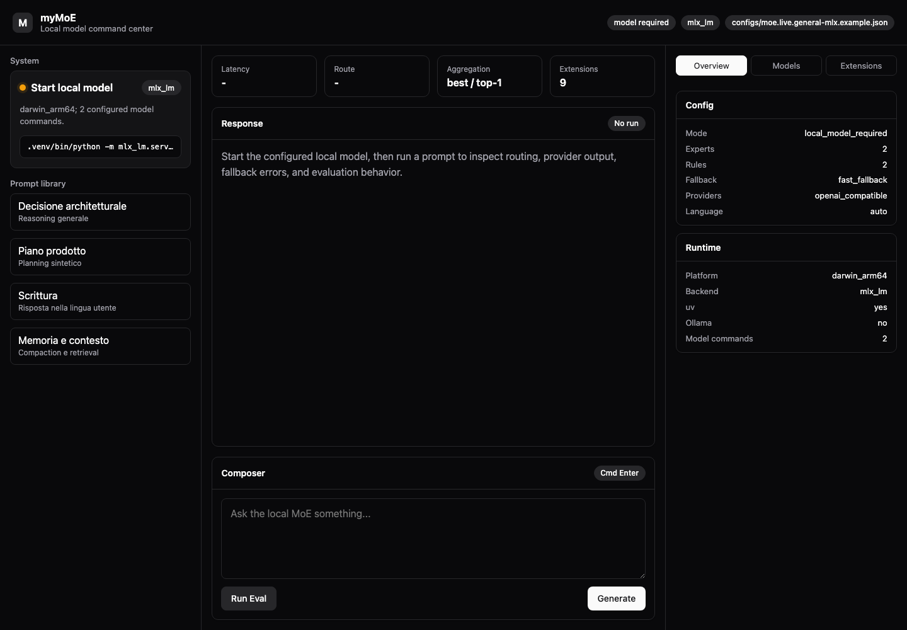
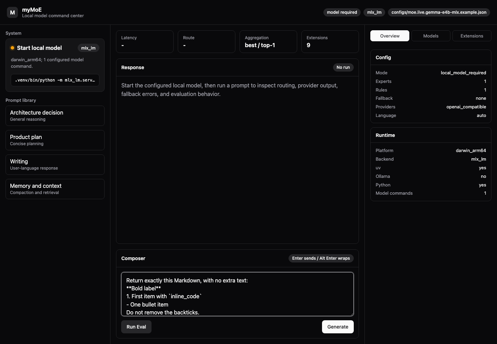
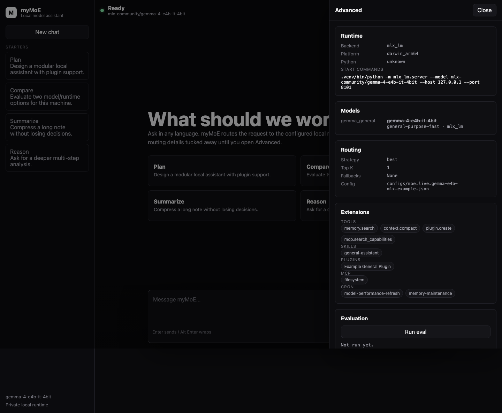
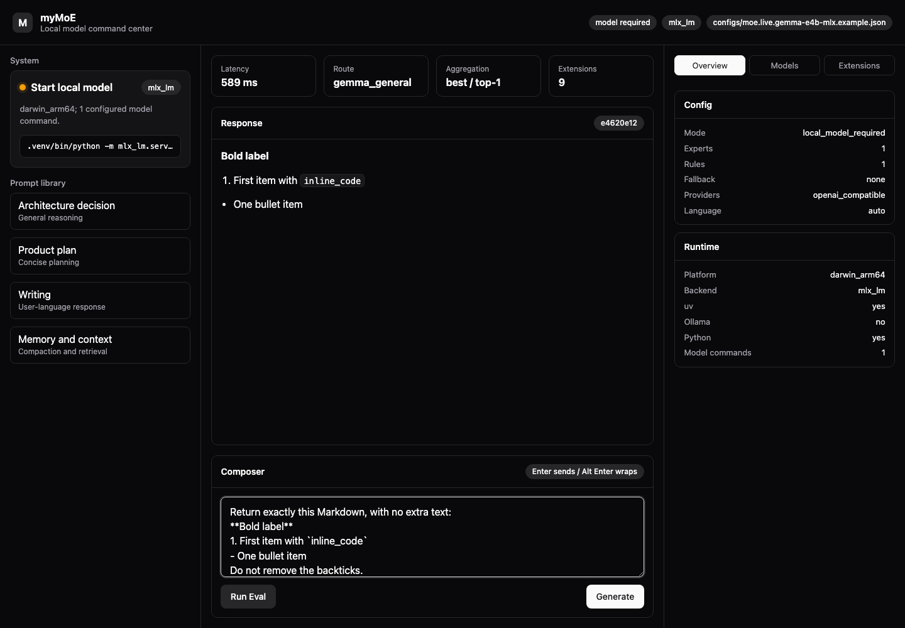
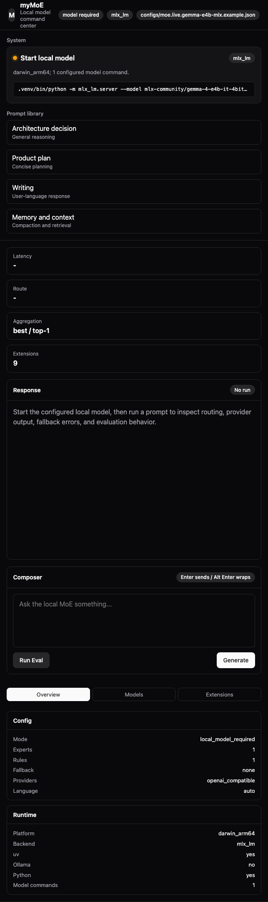

# Local MoE Orchestrator

Goal: design and prototype a local-first, general-purpose Mixture-of-Experts system that can run on a workstation without requiring cloud inference.

This project does not try to train a monolithic MoE from scratch. That would be expensive and brittle for local hardware. The first viable architecture is a system-level MoE:

1. run one strong resident local expert plus smaller or cold-loaded experts,
2. route each request with a lightweight configurable router,
3. optionally synthesize multiple expert answers,
4. distill routing decisions and/or expert outputs later.

The current live profile uses a distilled local router: base expert weights, explicit rules, multilingual semantic examples, and a local classifier artifact trained from curated route labels. See `docs/router.md`.

## Quick Start

Install and download the configured local model:

```bash
uv venv --python 3.12 .venv
uv pip install --python .venv/bin/python ".[mlx]"
PYTHONPATH=src .venv/bin/python scripts/bootstrap_runtime.py --download-models
```

The `.[mlx]` extra intentionally pins the MLX stack that was validated with both Qwen and Gemma E4B on the tested machine. Use `.[mlx-current]` only when you explicitly want to track the newest MLX packages.

Start the configured local model server:

```bash
PYTHONPATH=src .venv/bin/python scripts/start_local_models.py --only-first
```

For a faster first run on smaller machines:

```bash
PYTHONPATH=src .venv/bin/python scripts/bootstrap_runtime.py \
  --config configs/moe.live.fast-mlx.example.json \
  --download-models
PYTHONPATH=src .venv/bin/python scripts/start_local_models.py \
  --config configs/moe.live.fast-mlx.example.json
```

Run Gemma 4 E4B directly:

```bash
PYTHONPATH=src .venv/bin/python scripts/bootstrap_runtime.py \
  --config configs/moe.live.gemma-e4b-mlx.example.json \
  --download-models
PYTHONPATH=src .venv/bin/python scripts/start_local_models.py \
  --config configs/moe.live.gemma-e4b-mlx.example.json
```

Run the optional Gemma 4 12B GGUF coding/agentic specialist through llama.cpp:

```bash
# Install llama.cpp first:
# https://github.com/ggml-org/llama.cpp/releases
uv pip install --python .venv/bin/python ".[gguf]"
PYTHONPATH=src .venv/bin/python scripts/bootstrap_runtime.py \
  --config configs/moe.live.gemma-12b-agentic-gguf.example.json \
  --download-models
PYTHONPATH=src .venv/bin/python scripts/start_local_models.py \
  --config configs/moe.live.gemma-12b-agentic-gguf.example.json
```

Run the full local quality gate:

```bash
./scripts/run_all_checks.sh
```

or:

```bash
make check
```

Ask the orchestrator directly:

```bash
PYTHONPATH=src .venv/bin/python -m local_moe.cli \
  --prompt "Analyze the tradeoff between a single local model and a routed MoE."
```

Open the local UI:

```bash
PYTHONPATH=src .venv/bin/python -m local_moe.web \
  --port 8089
```

Then visit `http://127.0.0.1:8089`.

or:

```bash
make ui
```

Use the interactive CLI:

```bash
PYTHONPATH=src .venv/bin/python -m local_moe.cli --interactive
```

or:

```bash
make cli
```

## Visual Walkthrough

The default UI is chat-first, with operational details hidden behind the Advanced drawer.



The composer supports normal chat usage, rendered Markdown responses, `Enter` to send, and `Alt+Enter` for multiline prompts.



Advanced runtime, model, routing, extension, MCP, cron, and eval details are available only when the user opens the drawer.



Live generation was verified against a local Gemma 4 E4B model on the tested Apple Silicon machine.



The layout has also been checked on a mobile viewport.



## Recommended Local Model Path

For Antonio's machine class (Apple Silicon, 24 GB RAM), this is a general-purpose app, so the default is not a coder model.

- `primary general`: Qwen3-30B-A3B-Instruct-2507 MLX 4-bit.
- `multimodal alternative`: Gemma 4 26B-A4B OptiQ MLX 4-bit.
- `fast fallback`: Qwen3 4B or Gemma 4 E4B, selected by local benchmark and task quality.
- `optional specialist`: Gemma 4 12B Agentic GGUF v2 or Qwen3-Coder-30B-A3B only for coding-heavy workflows.
- `rejected stretch on tested 24 GB`: Qwen3.6-35B-A3B OptiQ MLX 4-bit failed with Metal OOM at both 8192 and 2048 KV cache sizes.
- `judge/router-teacher`: use Codex/GPT-class teacher offline during dataset creation, not in runtime.

The runtime must remain local. Distillation data can be created with a stronger teacher, then used to train a local router or small student.

The user-facing app requires a real local model. Synthetic providers are confined to automated test fixtures and are not shipped as runnable app profiles.

## Multilingual And Tooling Model

myMoE is designed to preserve the user's language at runtime: the UI and docs stay English, while the model is instructed to answer in the user's language unless asked otherwise. Real quality still depends on the selected local model and must be covered by eval cases per language.

Similar local assistant tools tend to combine chat, local/remote providers, RAG, tool calling, memory, and agent presets. myMoE's differentiator is the configurable local control plane: route cheaply first, keep the heavy model for generation, use MCP and local tools only through allowlists and confirmations, and cold-load specialists only when evals justify them.

## Project Layout

```text
configs/
  moe.local.example.json   # template for real llama.cpp/Ollama/LM Studio endpoints
  moe.live.general-mlx.example.json
  moe.live.fast-mlx.example.json
  moe.live.gemma-e4b-mlx.example.json
  moe.live.gemma-12b-coder-gguf.example.json
  moe.live.gemma-12b-agentic-gguf.example.json
  moe.live.ollama.example.json
  quality-gate.json        # thresholds and project artifact checks
docs/
  agent-runtime.md
  architecture.md
  context-architecture.md
  ci.md
  distillation-plan.md
  evaluation.md
  gemma-e4b-runtime.md
  installation.md
  model-selection.md
  performance-benchmarking.md
  router.md
  tested-performance.md
  ui.md
experiments/
  eval_set.jsonl
  eval_set_extended.jsonl
  eval_set_live_general.jsonl
  run_quality_gate.py
  run_smoke_eval.py
src/local_moe/
  config.py
  cli.py
  evaluator.py
  distilled_router.py
  text_features.py
  context.py
  compaction.py
  hardware.py
  memory.py
  router.py
  providers.py
  orchestrator.py
  runtime.py
  model_downloads.py
  web.py
tests/
  test_cli.py
  test_config.py
  test_context.py
  test_evaluator.py
  test_memory.py
  test_orchestrator.py
  test_providers.py
  test_runtime.py
  test_router.py
  test_web.py
```

## Current Experiment

The first experiment validates the routing harness, not model quality. It checks that prompts are routed to the intended expert from configuration alone. This is the right first gate because model downloads are large, while a broken router wastes every later run.

The live experiment can plug in real local MLX or GGUF endpoints and compare:

- single general model,
- system-level MoE top-1 routing,
- top-2 routing with synthesis.

On the detected Apple M5 Pro / 24 GB machine, the current recommendation is:

1. Use one strong resident general expert first.
2. Keep MoE as routing, context, memory, fallback, and cold-load specialist harness.
3. Keep only small fallback/compaction experts resident alongside the heavy model.
4. Add large specialist models only if evals beat the general baseline enough to justify memory and latency.

The linked `yuxinlu1/gemma-4-12B-coder-fable5-composer2.5-v1-GGUF` model is not worse by definition, but it is a Python/coding specialist and its own model card now points to a v2 agentic successor. myMoE therefore keeps v1 as a legacy optional profile, adds v2 as the preferred GGUF coding/agentic profile, and leaves Qwen3 30B-A3B as the general-purpose default.

The current quality gate compiles source/tests/scripts, runs unit and contract tests, evaluates 34 deterministic routing cases across the base and extended sets, checks required files, and verifies no live eval server remains on `127.0.0.1:8101`.

Run local model performance benchmarks with:

```bash
uv venv --python 3.12 .venv
uv pip install --python .venv/bin/python ".[mlx]"
PYTHONPATH=src .venv/bin/python experiments/benchmark_models.py
```

For a cheaper first pass:

```bash
make benchmark-small
```

Regenerate the local distilled router artifact with:

```bash
make distill-router
```

Inspect and run allowlisted local cron jobs with:

```bash
make cron-status
make run-cron
make run-cron-writes
```

Run an allowlisted local tool from the CLI:

```bash
PYTHONPATH=src .venv/bin/python -m local_moe.cli \
  --run-tool mcp.search_capabilities \
  --tool-input '{"query":"filesystem"}'
```

Tools are allowlisted by name. Local write tools and write-local cron jobs require explicit confirmation, for example `{"confirm": true}` for `plugin.create` or `--cron-confirm-writes` for CLI cron execution.

MCP stdio discovery is also available for trusted, enabled MCP servers:

```bash
PYTHONPATH=src .venv/bin/python -m local_moe.cli \
  --app-config configs/app.mcp-enabled.local.example.json \
  --run-tool mcp.list_tools \
  --tool-input '{"server":"filesystem","confirm_process_execution":true}'
```

The default app config keeps `allow_process_execution=false`, so MCP process startup requires an explicit local app config override plus per-call confirmation.

Call an allowlisted MCP tool from the same profile:

```bash
PYTHONPATH=src .venv/bin/python -m local_moe.cli \
  --app-config configs/app.mcp-enabled.local.example.json \
  --run-tool mcp.call_tool \
  --tool-input '{"server":"filesystem","tool_name":"list_allowed_directories","arguments":{},"confirm_process_execution":true,"confirm_tool_call":true}'
```

For the Gemma E4B regression benchmark:

```bash
make benchmark-gemma
```
