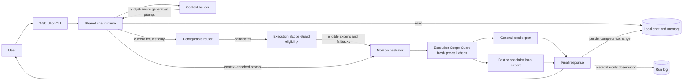

# myMoE

**Run coding agents with local models, qualify each exact runtime cell, and let
the built-in agent inspect one selected desktop window without screenshots.**

In plain terms: myMoE helps you do AI-assisted coding on your own computer
without paying for every request. Today it connects local models to a coding
agent, explains which fully evidenced local setup is eligible for a task, can
recheck that exact recommendation against current resources, prevents
participating local agents from counting the same observed free memory twice,
and can use the bound cell for one guarded local attempt,
tests whether one exact setup can complete a controlled coding task, lets its
built-in agent exercise simple local web apps, and can read the semantic
controls in one operator-selected desktop window. The desktop cell is read-only:
it does not click, type, capture screenshots, or replace a complete frontier
coding agent. Its current runtime is implemented on POSIX and has been
live-qualified on macOS; Windows currently receives provider-contract checks
only and the desktop runtime fails closed there.

## Did the declared local cell change?

In plain terms, the **Bound Cell Attestor** fingerprints the runtime, driver,
harness, model artifacts, and configuration bindings you explicitly declare,
without starting the cell. `mymoe cell-bind inspect` compares the observed
model, runtime, harness, and tool-contract identities with separately reviewed
catalog anchors, then emits one manifest plus a short-lived `verified` or
`abstained` receipt. It does not discover or prove every file that a future
process will load.

From a fresh clone, run the self-contained contract benchmark first; it creates
temporary sample artifacts, exercises verified, abstained, and drift cases, and
prints a machine-readable report without needing a model download:

```bash
uv run python experiments/benchmark_runtime_binding.py
```

To inspect a real local cell, copy the linked request template, replace every
placeholder with paths and identities from files you already have, then run:

```bash
mymoe cell-bind inspect \
  --request ./cell-binding-request.json \
  --json \
  --out ./cell-binding-inspection.json
```

The inspection is offline and read-only. Optional `--out` publication is the
only write and is allowed only outside the request, catalog, configuration,
runtime, and model-artifact roots. The command does not start or download a
model, use the network, reserve resources, or authorize execution. Embedded
self-digests check internal consistency; detecting later drift or deliberate
rewriting requires comparison with a separately trusted anchor. They are not
signatures or authenticated provenance. The snapshot can age, and it does not
prove dynamic dependencies or process residency. See the
[Bound Cell Attestor guide](docs/cell-runtime-binding.md) for the request,
output, threat, and comparison contracts.
Start from the
[`cell-binding-request.example.json`](configs/cell-binding-request.example.json)
template; it is intentionally not executable until its local paths and catalog
identities are replaced with files you already have.

## Which local setup should handle this task?

The **Adaptive Cell Advisor** answers that question before a model is run. A
cell is one exact model + quantization + runtime + harness + tool surface +
hardware placement. The advisor compares only cells configured in a local
catalog, rejects any cell whose identity, capabilities, measurement, or current
memory headroom is missing or incompatible, and explains why. It makes no
universal ranking claim; it reports the **best eligible configured cell with
current verified evidence**, or abstains.

For example, imagine that a laptop has a small fast cell and a larger general
cell configured. For a short local summary, the advisor can prefer the smaller
cell only if a trusted local producer has proved that the exact model, runtime,
harness, evaluation contract, workload, and current machine all match. If that
proof is missing after the live resource gates pass, the honest result is `Not
enough verified evidence`. If the machine is already outside a declared
resource boundary, the advisor stops earlier with `Not available now`. The
deliberately unqualified checked-in example therefore abstains instead of
inventing a recommendation:

```bash
uv run mymoe advisor \
  --catalog configs/adaptive-cells.example.json \
  --task "Summarize this local design note." \
  --workload local-summary \
  --capability summarization \
  --risk-class compute_only \
  --context-tokens 4096 \
  --evaluation-contract configs/adaptive-evaluation-contract.example.json \
  --goal balanced
```

This command is offline and advisory-only. It does not download, start, call,
or stop a model; modify runtime configuration; or authorize execution. The
task wording is fingerprinted, not interpreted: workload, capabilities, tool
surfaces, risk class, context ceiling, and goal are explicit caller or policy
declarations.

Installed from a wheel? Materialize the complete zero-claim starter and launch
the included mini-app:

```bash
mymoe advisor-init --out ./.mymoe-advisor
mymoe-web --app-config ./.mymoe-advisor/app.json
```

Open `http://127.0.0.1:8089`, enter a task, and the **Find the right local
setup** card shows one of three honest states: `Recommended now`, `Not available
now`, or `Not enough evidence`. The starter cannot recommend a cell until a
trusted local producer supplies applicable evidence; current resource pressure
can make it report `Not available now` before that evidence check. The UI can
download the complete metadata receipt in the browser; it does not persist the
task on the server or turn the receipt into execution authority.

Run the synthetic contract benchmark to see deterministic profile selection,
stale/resource-pressure abstention, and distinct paraphrase lineage without a
model call:

```bash
uv run python experiments/benchmark_adaptive_cell_advisor.py
```

See the
[Adaptive Cell Advisor guide](docs/adaptive-cell-advisor.md) for passports,
evidence, profiles, reason codes, platform limits, the mini-app/API contract,
market positioning, and full JSON receipts.

## Is that recommendation still valid right now?

The **Adaptive Cell Execution Gate** narrows the gap between receiving a
recommendation and acting on it. It reloads the earlier receipt, repeats the
Advisor check with current local resources, and verifies that the exact task,
catalog, evaluation contract, selected cell, and cell passport have not
changed. If anything drifted, it blocks and explains why.

```bash
mymoe cell-exec preview \
  --receipt ./advisor-receipt.json \
  --task-file ./task.txt \
  --catalog ./adaptive-cells.json \
  --evaluation-contract ./adaptive-evaluation-contract.json \
  --policy ./adaptive-execution-policy.json \
  --json
```

This is a dry-run preview, not an executor. A passing result does not reserve
resources, run a model or tool, modify configuration, or grant execution
authority. `mymoe advisor-init` includes the strict policy file and the command
template in its six-file starter. See the
[Adaptive Cell Execution Gate guide](docs/cell-execution-gate.md) for the
workflow, policy, reason codes, receipt contract, and deterministic benchmark.

## Can several local agents safely share one memory budget?

The **Cooperative Resource Lease** closes a practical race between local
agents. If two participating myMoE processes both observe 16 GiB free and each
selects a cell with a 16 GiB conservative peak, a snapshot-only check can let
both proceed. The lease serializes the final fresh snapshot and Advisor check
in one local SQLite transaction, records the first claim, and blocks the second
before it contacts the model endpoint.

Bound Cell Run uses this ledger automatically. The selected cell, catalog,
Advisor profile, resource snapshot, memory pool, safety reserve, and
`conservative_peak` estimate are linked by content digests. CPU and Apple
unified-memory claims share the physical system pool. Discrete-GPU accounting
is represented by the contract, but the built-in collector does not yet
qualify a reliable singleton discrete GPU and therefore fails closed there.

```bash
uv run python experiments/benchmark_cooperative_resource_lease.py --check
```

This is **cooperative accounting**, not an operating-system RAM/VRAM
reservation. It cannot control applications that ignore the ledger and it does
not start, stop, load, unload, swap, or evict models. The full peak claim can
overblock an already-resident model; that conservative limitation is explicit.
See the [Cooperative Resource Lease guide](docs/cooperative-resource-lease.md)
for the state machine, crash behavior, privacy boundary, threat model, and
comparison with existing model servers and swappers.

## Can myMoE use that exact cell once?

The alpha **Bound Cell Run** turns one passing recommendation into one narrowly
bounded local attempt. It composes the fresh execution preview with Bound Cell
inspection, requires the selected model endpoint to be already running on the
configured explicit numeric loopback address, acquires the cooperative claim,
and performs one inference attempt bracketed by model-list and static-binding
checks.

```bash
mymoe cell-exec run \
  --receipt ./advisor-receipt.json \
  --binding-request ./cell-binding-request.json \
  --task-file ./task.txt \
  --catalog ./adaptive-cells.json \
  --evaluation-contract ./adaptive-evaluation-contract.json \
  --policy ./adaptive-execution-policy.json \
  --confirm \
  --receipt-out ./bound-cell-run-envelope.json \
  > ./answer.txt
```

The answer and evidence envelope are deliberately separate. The answer goes to
standard output; `BoundCellRunEnvelopeV2` contains the unchanged v1 run receipt
plus claim, admission, delivery-fence, and release receipts, but not the task,
answer, or raw lease token. Any failed precondition causes zero inference
attempts, and there is no retry or fallback after an attempted inference.
`--confirm` is explicit one-shot authority for this invocation only; it cannot
authorize a later run.

An owner-only sibling recovery journal is reserved before endpoint traffic and
contains no task or answer body. The full metadata envelope is synced there
before canonical no-clobber publication; the journal is removed on success and
retained for recovery if final publication races or fails.

On the complete attempted path, endpoint traffic is exactly two read-only
`GET /models` probes plus one `POST /chat/completions` inference request. The
endpoint must use a numeric loopback IP such as `127.0.0.1` or `[::1]`, with an
explicit port; the hostname `localhost` is rejected. The first static binding
inspection happens before the atomic lease transaction. Inside that final gate,
myMoE captures one fresh snapshot, repeats the Advisor preview, derives the
exact selected claim, and commits it. The first model probe follows immediately.
The inference `POST` is enabled only after a durable `delivery_armed` fence; the
known response or ambiguous outcome is settled before the post-inference model
probe and binding inspection sample later drift.

This alpha does not start, load, unload, swap, or stop a model, ask the operating
system to reserve memory, or invoke tools, MCP, browser, shell, editor, or an
agent loop. Its cooperative claim affects only processes using the same ledger.
Pre/post
inspection can detect changes in the declared static artifacts and
configuration, but it does not prove which operating-system process owns the
loopback port, that the inspected runtime is the resident server, or which
binary produced the response. A completed request also does not prove that its
answer is semantically correct. See
[Bound Cell Run v1](docs/bound-cell-run.md) for the workflow, receipt,
architecture, threat model, and exact non-guarantees.

## Local coding without per-token model fees

myMoE can supply [Cline](https://github.com/cline/cline) with models running on
your own computer. Cline provides the coding-agent harness; myMoE provides one
OpenAI-compatible local endpoint, configurable model selection, and an
explicit device-only path with no implicit paid-model fallback.

The automated coding-cell check is `mymoe coding-canary`. It runs one pinned
Cline CLI 3.0.46 executable against one pinned `mymoe/<expert>` alias in a
disposable workspace. The agent must read two tiny files, make one exact
single-file fix, and run one exact test. A pre-tool hook gates that sequence, a
targeted macOS sandbox restricts workspace writes and network access, and a
separate verifier reruns the pristine test. The report binds the observed
Cline executable digest, complete effective gateway-configuration digest,
pinned model, and hardware fingerprint.

```text
Cline CLI -> parent-owned loopback broker -> myMoE -> pinned local model
     |                                        |
     +-> disposable edit + test               +-> no per-token model fee
```

With the matching model server and myMoE gateway already running, invoke the
qualification with a SHA-256 recorded when the trusted direct native Cline
executable was admitted. Do not pass Cline's npm `bin/cline` JavaScript wrapper;
use the compiled Mach-O binary it resolves (commonly `bin/.cline`) so the digest
binds the process that actually runs:

```bash
uv sync --locked --extra coding-canary
```

```bash
mymoe coding-canary \
  --cline /absolute/path/to/native/.cline \
  --cline-sha256 "$TRUSTED_CLINE_SHA256" \
  --base-url http://127.0.0.1:8089/v1 \
  --gateway-config configs/moe.live.qwen3-coder-mlx.example.json \
  --model mymoe/coder \
  --out coding-canary.json
```

See the [Local Coding Fabric guide](docs/local-coding-fabric.md) for the exact
setup, result meanings, 24 GiB model advice, offline modes, and security
boundary.

myMoE now also ships a separate **Browser Capability Cell** for local web-app
development. A tool-capable local model can navigate, observe, type, and click
on one explicitly approved local scheme + host + port. It never receives
Playwright MCP's raw tool catalog. myMoE owns four strict contracts, keeps one
stateful browser session, rejects schema drift and changed pre-action snapshots,
constrains normal browser HTTP(S) requests to that origin through a parent-owned
proxy, and
binds approval to the session, origin, snapshot hash, target, and accessible
label. With Node.js 20+, npm, and Google Chrome installed, a deterministic
canary verifies the adapter without a model. Cached archive verification has a
separate bounded 10-180 second timeout (60 seconds in the example), independent
from MCP action timeouts. From a source checkout:

```bash
uv run mymoe browser-prefetch \
  --mcp-config configs/mcp.playwright-browser.example.json \
  --server browser-local
uv run mymoe \
  --app-config configs/app.browser.example.json \
  --browser-canary browser-local \
  --browser-canary-confirm
```

See [Browser Capability Cell](docs/browser-capability-cell.md) for the one-time
package admission step, agent command, configuration contract, threat model,
and the deliberately separate desktop-control roadmap.

Installed from a wheel? Materialize a self-contained opt-in workspace, prefetch
the resolved dependency tree without executing the provider package, then run the
offline canary:

```bash
mymoe browser-init --out ./.mymoe-browser
mymoe browser-prefetch \
  --mcp-config .mymoe-browser/mcp.playwright-browser.json \
  --server browser-local
mymoe \
  --app-config .mymoe-browser/app.browser.json \
  --browser-canary browser-local \
  --browser-canary-confirm
```

`browser-init` also returns those two follow-up invocations as JSON argv arrays,
so paths containing spaces or shell metacharacters remain unambiguous.

The **Desktop Semantic Cell** is a separate read-only boundary for native
applications. A local model receives one tool, `desktop.observe`, that returns
a bounded and redacted accessibility tree for one process and window selected
by the operator. It does not receive Cua Driver's raw tool catalog, and cannot
enumerate apps or windows, capture screenshots, use coordinates, read the
clipboard, run commands, or perform an action. The first provider is pinned to
Cua Driver `0.10.0` over local stdio; `include_screenshot=false` disables
capture before the provider observes the window. myMoE owns a fresh daemon on
a private socket, runs it in bounded mode with an exact read-only target policy,
binds approval to target plus configuration, and tears it down after use.

> **Platform boundary:** the owned-daemon runtime is implemented on POSIX and
> has been live-qualified on macOS. Linux requires its own bound-window canary
> because toolkit and compositor behavior varies. Windows CI verifies only the
> locked provider package/version, its exact 50-tool Windows catalog-name
> digest, and admitted schema, while reporting the observed native executable digest;
> the runtime deliberately fails closed there.

```bash
uv sync --locked --extra desktop
uv run mymoe desktop-init \
  --out ./.mymoe-desktop \
  --target-id editor \
  --target-pid 12345 \
  --window-id 67890
uv run mymoe \
  --app-config .mymoe-desktop/app.desktop.json \
  --desktop-canary desktop-local \
  --desktop-canary-confirm
```

Replace the numeric values with one window selected through the exact
operator-only discovery sequence in the
[Desktop Semantic Cell runbook](docs/desktop-semantic-cell.md#operator-only-target-discovery).
That temporary discovery daemon is never exposed to the model and is stopped
before the bound cell starts. `desktop-init` then binds the current process
instance, pins the installed native provider executable, persistently disables
its telemetry, erases its telemetry identifier, validates the exact native
catalog and schema for the current operating system, and returns exact canary
and agent argv arrays. The checked-in desktop files are schemas and examples;
their zero executable and target digests are intentionally not runnable
bindings.

On the shipped deterministic 512-node accessibility fixture, the firewall
keeps 14 useful nodes within the normal agent-result budget, reduces the
serialized observation by 98.52%, and reduces the model-visible provider
surface from the 49-tool macOS reference catalog to 1, with zero secret
sentinels or provider-addressing keys delivered. This is a payload/safety
benchmark, not a desktop task-success or accessibility-completeness claim.

See [Desktop Semantic Cell](docs/desktop-semantic-cell.md) for the simple use
case, target-binding contract, provider admission, platform limits, threat
model, and semantic-first roadmap.

> **Coding-canary boundary:** this removes per-token cloud-model charges, not hardware,
> electricity, or model-license obligations. The current canary is a
> macOS-only diagnostic for one disposable single-file edit-and-test contract.
> Its hook gate and targeted `sandbox-exec` policy are not VM containment. It
> does not qualify real repositories, the separate Browser Capability Cell,
> desktop control, MCP, Git publication, unrestricted terminal use, or general autonomy. Every report,
> including a passing one, sets `diagnostic_only=true` and
> `authorizes_routing=false`.

The current Apple M5 Pro / 24 GiB Qwen3 Coder 30B cell is **not qualified**:
the live canary passed its isolation, executable, gateway, and model-binding
checks, then rejected an editor request outside the exact fixture contract. That
is a useful negative result for this exact cell, not a claim that the model
cannot perform other coding tasks.

## In plain English

- **Problem:** using the largest model for every request can waste memory and
  time, while keeping many specialist models active can be impractical on one
  workstation. Sending everything to a paid remote assistant also gives up
  local control when the task did not require it.
- **What it does:** myMoE is a configurable local control plane that chooses an
  eligible model for each request, assembles bounded chat context, applies safe
  fallbacks, and records operational evidence. Its coding canary separately
  tests whether one exact local coding cell can complete a controlled edit and
  test before you try it on real code. It orchestrates independent models; it
  does not train a new sparse Mixture-of-Experts model.
- **Who it is for:** developers and advanced users who run local models and want
  an inspectable way to balance capability, device resources, privacy, and
  optional premium escalation.
- **Concrete example:** in the default profile, requests such as “rewrite this
  message in a neutral tone” are configured for the smaller fast expert, while
  broad reasoning stays with the resident general expert. If the fast expert is
  offline, the configured fallback can use the resident model without widening
  the default device-only execution scope.

| Feature | Real-world benefit |
| --- | --- |
| Bound Cell Attestor | Fingerprint the local model, runtime, driver, harness, and configuration bindings you declared, then detect drift against separately reviewed catalog anchors without starting the cell. |
| Adaptive Cell Advisor | See the best eligible configured cell with current verified evidence—or a precise abstention—before spending time or memory loading a model. The v1 command is offline, read-only, and non-authorizing. |
| Adaptive Cell Execution Gate | Recheck the exact advised cell, receipt freshness, catalog identity, task binding, and current resource pressure immediately before a later launcher makes its own execution decision. |
| Cooperative Resource Lease (alpha) | Stop participating local agents from counting the same observed free memory twice. Claims are atomic, conservative, and receipted, but they do not reserve RAM/VRAM at operating-system level or control other applications. |
| Bound Cell Run (alpha) | Use that exact configured numeric-loopback cell for one compute-only inference attempt after atomic cooperative admission, bracketed by two `GET /models` probes and pre/post sampled static evidence, with a separate metadata-only V2 evidence envelope. It does not run tools or prove process/residency identity or answer correctness. |
| Loopback OpenAI-compatible gateway for Cline | Use a familiar VS Code coding agent with local inference and no implicit paid-model fallback. |
| Local Coding Cell Canary | Test one exact Cline CLI, gateway/runtime, pinned model, and hardware cell on a disposable edit-and-test task before trusting it with real code. |
| Local Browser Capability Cell | Let a local model inspect and exercise a local web app through four approval-gated tools, while normal external browser HTTP(S) traffic and raw MCP authority stay blocked. |
| Local Desktop Semantic Cell | Let a local model read one selected application's semantic controls locally through an owned bounded daemon, without screenshots or desktop actions. |
| Configuration-driven routing across independent models | Teams can change experts, weights, endpoints, budgets, and fallbacks without retraining one giant model. |
| Execution Scope Guard before every model call | A local-only request fails closed instead of silently moving to a wider mesh or remote route. |
| Shared persistent chat, memory, and budget-aware context | The web and terminal experiences can preserve useful history without sending every stored item to every model call. |
| Model lifecycle, diagnostics, and guarded fallbacks | Operators can see what is ready and recover from an unavailable expert through an explicit policy. |
| Optional Hybrid Assistant Bridge | Local execution and mechanical checks can stop a task early; a premium assistant is considered only when capability, privacy, evidence, and budget rules allow it. |
| Local Provider Compatibility Probe | A disposable read-only check attempts one exact Codex tool task before operators advertise filesystem or test capabilities; timeout and launcher failures remain explicitly indeterminate. |
| Verified Hybrid Execution | Runs baseline and less-premium candidate routes in both orders on one frozen snapshot, persists resumable claims, and verifies independently signed pass/fail evidence before admitting a bounded canary. |
| Signed Route Canary Authority | After enough real paired tests pass and an operator signs a short trial, myMoE can try a less-premium route for a repeatable sample of matching requests and retain the current route on any authority or evidence failure. |

> **Maturity and limits:** myMoE is an alpha workstation runtime and evaluation
> harness, not a hosted multi-tenant service or an unrestricted autonomous agent.
> Current results apply only to the documented hardware, models, profiles, and
> workloads; they do not prove that routing always beats one strong model.
> Automatic specialist cold-loading and automatic broad routing-policy
> activation are not implemented. The optional signed canary path is disabled
> by default, short-lived, and limited to at most 500 of 10,000 deterministic
> assignment buckets. That threshold samples hash space; it is not a hard quota
> on observed requests. Any authority or evidence failure retains the guarded
> baseline.

> **Evidence boundary:** no real paired evidence has yet established lower
> cost, lower latency, or equivalent quality. Signed evidence proves the
> integrity and provenance of the recorded evaluation result, not the truth or
> representativeness of its benchmark inputs. The shipped `qwen3:4b` Assistant
> Bridge provider did not complete the bounded Codex workspace-tool probe on
> the documented machine. The result is operationally indeterminate, not a
> negative compatibility judgment, so its default declaration and technical
> ceilings remain conservatively limited to read-only analysis. The diagnostic
> grants no routing authority.

## Technical overview

myMoE is a local-first, system-level Mixture of Experts orchestration runtime. It
routes each request to one or more independent models under an explicit
execution-scope policy instead of training one large sparse MoE model from
scratch.

The project includes persistent chat, budget-aware context and memory,
configurable routing, model lifecycle tools, diagnostics, evaluation, and a
separate approval-gated agent loop.

An optional Hybrid Assistant Bridge can preflight a task with local Codex, apply
mechanical verification, and invoke premium Codex only when policy, evidence,
and a bounded budget permit escalation. It is a task-level evidence layer, not
another model gateway.

The Verified Outcome Routing Lab can then link each content-free route receipt
to final verification and operational metrics, build a versioned scorecard,
and replay alternative efficiency profiles offline. Verified Hybrid Execution
runs preregistered baseline/candidate arms in AB/BA order from one frozen source
snapshot and never applies either candidate. Each paired arm is claimed durably
before that arm can issue any provider command, then its outcome is
checkpointed through a metadata-only append-only journal. The files omit task
and response bodies, but stable hashes and provider/runtime metadata remain
linkable and potentially guessable; treat them as sensitive and never publish
them. The store enforces `0700` directories and `0600` files on POSIX; Windows
ACL privacy remains operator-managed, and filesystems that cannot provide a
stable file identity fail closed. A crash after a claim but before its
checkpoint is deliberately indeterminate and is never retried automatically.
Each completed arm stores the original result metadata, task signals,
manifest, changeset, and evaluation-only DSSE envelopes in a content-addressed
store. Qualification reloads those objects, verifies the signed pass or fail
result, recomputes exact configured token cost, and reconstructs the outcome;
the JSONL row is only an index. The journal checkpoint remains the authority
for safe resume, while the signed CAS receipt is the authority for evaluation
evidence. A valid signed pair can therefore remain analyzable after a crash
makes its journal permanently non-resumable, but it never authorizes a retry.
The paired promotion gate can emit a short-lived, structural-eligibility
manifest only from complete, disjoint, lineage- and pricing-bound evidence.
The optional Signed Route Canary Authority consumes that
manifest only after an operator signs an activation bound to the stable bridge
configuration, route policy, scorecard, pinned public key, size, and expiry.
Assignment is deterministic and secret-keyed; only monotone transitions toward
less premium use can apply. The shipped profile keeps this path disabled and
the repository ships no empirical manifest or activation. Its configured basis
points select assignment buckets, not a guaranteed percentage of live traffic:
repeated or uneven task fingerprints can produce a different observed share.
The optional directory attestation sidecar separates the signing key from the
myMoE process, but this is process and key separation rather than hardware
trust: an attacker controlling the same operating-system account can still
delete or disrupt the exchange. Use a stronger service or hardware boundary
when that threat is in scope.


## Why It Exists

Local models have different strengths and hardware costs. Keeping every large specialist resident is usually wasteful, while sending every task to the largest model is slow. myMoE provides a small, inspectable control plane that can:

- keep a capable general model available;
- send simple transformations to a smaller expert;
- retry a configured fallback when an expert is unavailable;
- compare multiple expert answers when a profile requests it;
- keep chat, memory, operational evidence, and model traffic local by default;
- block routes and fallbacks that exceed the configured execution scope;
- stop verified assistant tasks locally or hand off a minimal redacted capsule;
- replace models, routes, budgets, and extension registries through configuration.

## How It Works



The router and the model deliberately receive different inputs. The router sees
only the current user request, so an old memory cannot accidentally change the
route. The selected expert receives a budget-aware prompt assembled from
memory, the durable session summary, recent turns, and the current request.
Before routing, the Execution Scope Guard filters ineligible experts; the
orchestrator obtains fresh evidence again immediately before each provider
call. The shipped profiles allow only `device_only` execution and never widen a
fallback scope automatically.

For the complete lifecycle, including execution scope, routing scores,
fallbacks, streaming, startup, persistence, and agent approvals, read
[How myMoE works](docs/how-it-works/README.md).

## Quick Start

The default profile is optimized for Apple Silicon with 24 GiB of unified
memory. The project supports Python 3.10 or newer; this reproducible MLX quick
start uses [uv](https://docs.astral.sh/uv/) with the locked Python 3.12 environment.

```bash
uv sync --locked --python 3.12 --extra mlx
PYTHONPATH=src .venv/bin/python scripts/bootstrap_runtime.py --download-models
```

Start the primary model in one terminal:

```bash
PYTHONPATH=src .venv/bin/python scripts/start_local_models.py --only-first
```

Start the web app in another terminal:

```bash
.venv/bin/mymoe-web --port 8089
```

Open `http://127.0.0.1:8089`.

Starting only the first model keeps memory use low. If a request is routed to the offline fast expert, the default bidirectional fallback order retries the resident general expert.

To qualify one exact local Cline coding cell, follow the
[coding canary runbook](docs/local-coding-fabric.md#4-run-the-automated-coding-canary).
The same guide also explains how to connect the Cline editor interface after
qualification.

To qualify the separate browser adapter and exercise a local web app, follow
the [Browser Capability Cell runbook](docs/browser-capability-cell.md).

To qualify the read-only native-window adapter, then expose only
`desktop.observe` to a local model, follow the
[Desktop Semantic Cell runbook](docs/desktop-semantic-cell.md).

For Windows, Linux, Ollama, llama.cpp, optional profiles, and the guarded startup runbook, use the [installation guide](docs/installation.md).

## Choose the Right Entry Point

| Goal | Entry point | Persistence and tools |
| --- | --- | --- |
| Qualify one local coding cell | `mymoe coding-canary --cline … --cline-sha256 … --model mymoe/coder` | Disposable macOS-only single-file edit and pristine test; metadata-only diagnostic with no routing authority. |
| Experiment from VS Code with a local model | Cline with Base URL `http://127.0.0.1:8089/v1` and a pinned model such as `mymoe/coder` | Cline owns workspace and tools; browser, desktop, MCP, Git publication, and general autonomy are not qualified by the current canary. |
| Use the chat application | `.venv/bin/mymoe-web --port 8089` | Persistent chats, memory retrieval, streaming, and metadata-only run logging. |
| Use persistent terminal chat | `.venv/bin/mymoe --interactive` | Uses the same chat, memory, context, and run-log stores as the web app. |
| Ask one stateless question | `.venv/bin/mymoe --prompt "..."` | Calls `LocalMoE` directly; it does not load chat context or persist a session. |
| Run a bounded tool task | `.venv/bin/mymoe --agent-prompt "..." --agent-tool memory.search` | Separate CLI-only agent loop; only explicitly selected strict-schema tools are visible. |
| Test a local web app with the built-in agent | `.venv/bin/mymoe --app-config configs/app.browser.example.json --agent-prompt "..." --agent-browser-server browser-local --agent-interactive-approvals` | One ephemeral, stateful browser; loopback only, normal browser HTTP(S) egress denied, exact approval per call, raw MCP tools hidden. |
| Qualify the installed browser adapter | `.venv/bin/mymoe --app-config configs/app.browser.example.json --browser-canary browser-local --browser-canary-confirm` | Deterministic navigate/observe/type/click fixture; qualifies only local web-app interaction. |
| Inspect one selected desktop window | `.venv/bin/mymoe --app-config .mymoe-desktop/app.desktop.json --agent-prompt "..." --agent-desktop-server desktop-local --agent-interactive-approvals` | One read-only `desktop.observe` tool; accessibility-tree output only, with screenshots, discovery, coordinates, actions, clipboard, shell, and secure values unavailable. |
| Qualify the desktop semantic boundary | `.venv/bin/mymoe --app-config .mymoe-desktop/app.desktop.json --desktop-canary desktop-local --desktop-canary-confirm` | Live provider and bound-window check; it grants no desktop-action authority. |
| Preflight local versus premium Codex | `.venv/bin/mymoe --assistant-task "..." --assistant-capability code` | Dry-run by default; plans local execution, verification, bounded escalation, or a policy block without exposing task text in the receipt. |
| Check local Codex compatibility | `.venv/bin/mymoe assistant-probe --json` | Uses a random marker in a disposable read-only workspace; emits public command/runtime/model identity, never authorizes routing, and never invokes the premium provider. |
| Inspect or collect one frozen paired case | `.venv/bin/mymoe-paired --help` | Status is provider-free. Execution composes a public-trust workflow and private directory sidecar; without both it fails closed instead of manufacturing evidence. |
| Inspect readiness | `.venv/bin/mymoe --doctor` | Read-only setup, health, hardware, storage, process, extension, and cron checks. |

## Default Profile

The default profile is [`configs/moe.live.general-mlx.example.json`](configs/moe.live.general-mlx.example.json).

| Expert | Model | Role | Endpoint | Execution |
| --- | --- | --- | --- | --- |
| `general` | Qwen3 4B MLX 4-bit | General reasoning and normal chat | `127.0.0.1:8101` | `device_only` / `direct_local` |
| `fast_fallback` | Qwen3 1.7B MLX 4-bit | Summarization, rewriting, translation, formatting, compaction, and fallback | `127.0.0.1:8102` | `device_only` / `direct_local` |

The profile uses top-1 `best` aggregation. Routing combines base expert weights, explicit keyword rules, local character n-gram examples, and a distilled local character n-gram centroid artifact. The models do not classify their own requests.

## Configuration-First Design

| Configuration | Responsibility |
| --- | --- |
| [`configs/app.json`](configs/app.json) | Active profile, allowed profile/evaluation directories, local work directory, backend preferences, language policy, extension paths, permissions, and the loopback gateway policy. |
| [`configs/moe.*.json`](configs/) | Execution-scope policy plus experts, declared transports, endpoints, models, generation parameters, routing strategy, top-k, aggregation, and fallbacks. |
| [`configs/context-policy.json`](configs/context-policy.json) | Context limit, reserved output, compaction threshold, recent-turn limit, and memory limit. |
| [`configs/assistant-bridge.json`](configs/assistant-bridge.json) | Replaceable Codex launch adapters and explicit models, capability inventories, local-first profiles, durable premium budgets, bound verifiers, and capsule limits. |
| [`configs/assistant-bridge-workflow.example.json`](configs/assistant-bridge-workflow.example.json) | Example external durable-state paths and public-only independent verification policy for the two-phase stage/resume lifecycle. |
| [`configs/verified-routing-policy.example.json`](configs/verified-routing-policy.example.json) | Shadow profile weights, quality floors, evidence counts, confidence thresholds, and normalization scales. |
| [`configs/verified-routing-promotion.example.json`](configs/verified-routing-promotion.example.json) | Paired holdout size, statistical confidence, monotone transition, latency, cost-evidence, canary-size, and expiry guardrails. |
| [`configs/verified-routing-runtime.example.json`](configs/verified-routing-runtime.example.json) | Disabled-by-default canary artifact and chronology paths, pinned operator public key, and environment-secret name for deterministic hash-bucket assignment. |
| [`configs/tools.json`](configs/tools.json) | Tool metadata, enabled state, risk class, and side-effect declaration. |
| [`configs/mcp.json`](configs/mcp.json) | Optional MCP processes and per-server tool allowlists. |
| [`configs/mcp.playwright-browser.example.json`](configs/mcp.playwright-browser.example.json) | Disabled-from-default, pinned local Browser Capability Cell provider, schema digests, loopback hosts, and result budget. |
| [`configs/app.desktop.example.json`](configs/app.desktop.example.json) | Opt-in application-policy schema for the read-only Desktop Semantic Cell; use `desktop-init` for a runnable binding. |
| [`configs/mcp.cua-desktop.example.json`](configs/mcp.cua-desktop.example.json) | Non-runnable binding example for the pinned Cua adapter, accepted schema, screenshot denial, and semantic-result budgets. |
| [`configs/cron.json`](configs/cron.json) | Startup and interval maintenance jobs with risk classes. |

The design is configurable, but not infinitely dynamic. OpenAI-compatible
experts can be exchanged through configuration alone. A new provider protocol
still requires a full-lifecycle provider adapter and explicit registry
composition. A new built-in tool
requires a strict schema and an explicit runner implementation, and executable
cron actions remain deliberately allowlisted. Trusted MCP configuration can
name a process command, but the default is disabled and launching it still
requires app-level process permission plus per-call confirmation. A model
response or tool metadata cannot create a new executable implementation.

## Safety and Local Data

- Normal chat never runs tools automatically. Tool-calling is a separate CLI path with an explicit tool selection.
- The Cline gateway is a separate path: myMoE forwards OpenAI-compatible model requests, while Cline owns file and tool execution. The coding canary adds a narrow pre-tool hook policy and targeted macOS sandbox only for its disposable fixture; ordinary Cline sessions, browser/desktop actions, MCP servers, Git, and real repositories remain separate, unqualified trust boundaries.
- The Execution Scope Guard applies to every local-orchestration generation entry point. The default is `device_only`, fallback scope widening is disabled, and missing or contradictory evidence fails with `scope_blocked` before an ineligible provider call.
- A loopback URL proves only the first network hop. Mesh and gateway transports require an external attestor even when they listen on `127.0.0.1`; the current Mesh adapter is disabled and fail-closed.
- Bound Cell Run makes one inference attempt against an already-running explicit numeric-loopback endpoint after pre-inspection and atomic cooperative admission. The complete attempted path uses two `GET /models` probes and one completion `POST`; only an applied delivery fence enables the POST, ambiguous outcomes remain sticky, and known outcomes release promptly. It performs no lifecycle or tool action, never retries or falls back, and cannot attest process/residency identity or arbitrary semantic correctness.
- Read-only and compute-only agent tools may run automatically; risky calls pause and require an approval bound to the canonical tool name and exact argument SHA-256.
- `chats.json` and `memory.jsonl` contain user content. `runs.jsonl` and `audit.jsonl` contain operational metadata, not prompt or answer bodies.
- The portable local-data backup contains private chats and memory and requires confirmation. The support bundle is a different, metadata-focused diagnostic artifact, but it still includes configured Git/model URLs and must be reviewed before sharing; credentials should never be embedded in URLs.
- Model process commands come from the active profile. The web process stops only model processes that it started itself.
- Assistant Bridge planning is read-only. Execution requires the exact confirmation hash from the inspected task/config/runtime/workspace, command, evidence, and capsule-options receipt; a boolean confirmation is insufficient. It passes task data over stdin, uses argv without a shell, stores metadata-only audit/run events, and returns the answer separately to the user.
- Bridge runs require Codex CLI 0.138 or newer and request a strict named permission profile: Codex's minimal runtime plus the selected workspace, explicit `write_local` authority for workspace writes, and no shell network. The profile API is beta and myMoE cannot attest the effective profile selected after device or cloud managed requirements are applied, so receipts record that limitation and managed policy remains part of the trusted computing base. Unsupported profile configuration fails closed. Local runs also isolate Codex state, ignore ambient configuration and rules, sanitize the environment, and disable native web search; an authorized remote web route receives cached native search without shell network.

See [Agent Runtime](docs/agent-runtime.md) for the exact permission model and [Context and Memory](docs/context-architecture.md) for storage details.

## Documentation

Start with the [documentation hub](docs/README.md).

- [How myMoE works](docs/how-it-works/README.md) — end-to-end diagrams and code-level contracts.
- [Local Coding Fabric](docs/local-coding-fabric.md) — exact Cline setup, local gateway contract, resource profiles, offline semantics, and roadmap.
- [Installation](docs/installation.md) — platforms, runtimes, models, and startup.
- [Architecture](docs/architecture.md) — design decisions, components, modes, and validation gates.
- [Adaptive Cell Execution Gate](docs/cell-execution-gate.md) — fresh exact-cell admission preview, drift reasons, and non-authorizing receipt.
- [Cooperative Resource Lease](docs/cooperative-resource-lease.md) — atomic same-host accounting, memory-pool claims, crash fencing, receipts, and explicit non-guarantees.
- [Bound Cell Run v1](docs/bound-cell-run.md) — one guarded inference attempt on an explicit numeric-loopback cell, atomic cooperative admission, two model probes, pre/post sampled static evidence, a metadata-only V2 envelope, and explicit alpha limits.
- [Execution Scope Guard](docs/execution-scopes.md) — scope/transport policy, fail-closed behavior, and Mesh trust boundary.
- [Routing](docs/router.md) — scoring, multilingual coverage, distillation, and fallback behavior.
- [Context and Memory](docs/context-architecture.md) — prompt budgets, persistence, compaction, and observability.
- [UI and CLI](docs/ui.md) — user workflows, HTTP endpoints, and screenshots.
- [Agent Runtime](docs/agent-runtime.md) — tools, approvals, MCP, cron, plugins, and diagnostics.
- [Hybrid Assistant Bridge](docs/hybrid-assistant-bridge.md) — local verification, premium escalation capsules, profiles, and CLI usage.
- [Verified Outcome Routing and Signed Canary Authority](docs/verified-outcome-routing.md) — content-free outcome lineage, paired qualification, operator-signed activation, deterministic hash-bucket sampling, and fail-closed rollback.
- [Evaluation](docs/evaluation.md) — evaluation contracts and release evidence.

## Verification

Run the complete cross-platform check with the locked Python 3.12 environment:

```bash
uv run --locked --extra assistant-bridge --python 3.12 python scripts/run_ci_checks.py
```

It compiles the project, runs the unit and contract tests, regenerates deterministic routing evaluations, validates holdout provenance, evaluates the offline quality gate, produces a hardware report, and verifies installed console entry points.

Current measured results and their limits are documented in [Tested Performance](docs/tested-performance.md). The provenance-bound artifacts live under [`outputs/`](outputs/); generated historical reports are evidence snapshots, not runtime policy.

## Product Boundary

myMoE is primarily a local workstation orchestration runtime and evaluation harness. Its
OpenAI-compatible gateway can supply local inference to an external coding
harness such as Cline, but Cline owns its workspace tools and permissions. The
coding canary qualifies only one pinned, macOS, disposable edit-and-test cell;
it is not a production sandbox and never grants routing authority. The
Hybrid Assistant Bridge may start a separately configured premium Codex process
only when its profile, explicit privacy choice, capability evidence, and budget
allow it. myMoE is not a trained sparse transformer, a hosted multi-tenant
service, or an unrestricted autonomous agent platform. Automatic specialist
cold-loading and automatic durable compaction are not implemented; both remain
explicit operator decisions. Verified Outcome Routing does not learn or explore
online and cannot activate a broad policy automatically. Its optional runtime
authority can apply only an operator-signed, short-lived canary for an exact
qualified cell and only when that moves toward less premium use. Eligibility is
limited to at most 500 of 10,000 secret-keyed assignment buckets; this is a
deterministic sampling threshold, not an observed-traffic quota. It is disabled
by default, fails closed to the baseline, and ships without an empirical canary
manifest.

## License

Licensed under the [Apache License 2.0](LICENSE).
