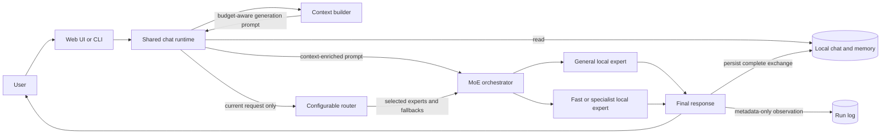

# myMoE

myMoE is a local-first, system-level Mixture of Experts orchestrator. It routes each request to one or more independent local models instead of training one large sparse MoE model from scratch.

The project is currently an MVP local control plane with persistent chat,
budget-aware context and memory, configurable routing, model lifecycle tools,
diagnostics, evaluation, and a separate approval-gated agent loop. The current
release evidence applies to the tested profile and workloads; it is not a claim
that routing beats every single-model setup.


## Why It Exists

Local models have different strengths and hardware costs. Keeping every large specialist resident is usually wasteful, while sending every task to the largest model is slow. myMoE provides a small, inspectable control plane that can:

- keep a capable general model available;
- send simple transformations to a smaller expert;
- retry a configured fallback when an expert is unavailable;
- compare multiple expert answers when a profile requests it;
- keep chat, memory, operational evidence, and model traffic local by default;
- replace models, routes, budgets, and extension registries through configuration.

## How It Works



The router and the model deliberately receive different inputs. The router sees
only the current user request, so an old memory cannot accidentally change the
route. The selected expert receives a budget-aware prompt assembled from
memory, the durable session summary, recent turns, and the current request.

For the complete lifecycle, including routing scores, fallbacks, streaming, startup, persistence, and agent approvals, read [How myMoE works](docs/how-it-works/README.md).

## Quick Start

The default profile is optimized for Apple Silicon with 24 GiB of unified
memory. The project supports Python 3.10 or newer; this reproducible MLX quick
start uses [uv](https://docs.astral.sh/uv/) with the locked Python 3.12 environment.

```bash
uv sync --locked --python 3.12 --extra mlx
PYTHONPATH=src .venv/bin/python scripts/bootstrap_runtime.py --download-models
```

Start the primary model in one terminal:

```bash
PYTHONPATH=src .venv/bin/python scripts/start_local_models.py --only-first
```

Start the web app in another terminal:

```bash
.venv/bin/mymoe-web --port 8089
```

Open `http://127.0.0.1:8089`.

Starting only the first model keeps memory use low. If a request is routed to the offline fast expert, the default bidirectional fallback order retries the resident general expert.

For Windows, Linux, Ollama, llama.cpp, optional profiles, and the guarded startup runbook, use the [installation guide](docs/installation.md).

## Choose the Right Entry Point

| Goal | Entry point | Persistence and tools |
| --- | --- | --- |
| Use the chat application | `.venv/bin/mymoe-web --port 8089` | Persistent chats, memory retrieval, streaming, and metadata-only run logging. |
| Use persistent terminal chat | `.venv/bin/mymoe --interactive` | Uses the same chat, memory, context, and run-log stores as the web app. |
| Ask one stateless question | `.venv/bin/mymoe --prompt "..."` | Calls `LocalMoE` directly; it does not load chat context or persist a session. |
| Run a bounded tool task | `.venv/bin/mymoe --agent-prompt "..." --agent-tool memory.search` | Separate CLI-only agent loop; only explicitly selected strict-schema tools are visible. |
| Inspect readiness | `.venv/bin/mymoe --doctor` | Read-only setup, health, hardware, storage, process, extension, and cron checks. |

## Default Profile

The default profile is [`configs/moe.live.general-mlx.example.json`](configs/moe.live.general-mlx.example.json).

| Expert | Model | Role | Endpoint |
| --- | --- | --- | --- |
| `general` | Qwen3 4B MLX 4-bit | General reasoning and normal chat | `127.0.0.1:8101` |
| `fast_fallback` | Qwen3 1.7B MLX 4-bit | Summarization, rewriting, translation, formatting, compaction, and fallback | `127.0.0.1:8102` |

The profile uses top-1 `best` aggregation. Routing combines base expert weights, explicit keyword rules, local character n-gram examples, and a distilled local character n-gram centroid artifact. The models do not classify their own requests.

## Configuration-First Design

| Configuration | Responsibility |
| --- | --- |
| [`configs/app.json`](configs/app.json) | Active profile, local work directory, backend preferences, language policy, extension paths, and permissions. |
| [`configs/moe.*.json`](configs/) | Experts, endpoints, models, generation parameters, routing strategy, top-k, aggregation, and fallbacks. |
| [`configs/context-policy.json`](configs/context-policy.json) | Context limit, reserved output, compaction threshold, recent-turn limit, and memory limit. |
| [`configs/tools.json`](configs/tools.json) | Tool metadata, enabled state, risk class, and side-effect declaration. |
| [`configs/mcp.json`](configs/mcp.json) | Optional MCP processes and per-server tool allowlists. |
| [`configs/cron.json`](configs/cron.json) | Startup and interval maintenance jobs with risk classes. |

The design is configurable, but not infinitely dynamic. OpenAI-compatible
experts can be exchanged through configuration alone. A new provider protocol
still requires a provider adapter and factory registration. A new built-in tool
requires a strict schema and an explicit runner implementation, and executable
cron actions remain deliberately allowlisted. Trusted MCP configuration can
name a process command, but the default is disabled and launching it still
requires app-level process permission plus per-call confirmation. A model
response or tool metadata cannot create a new executable implementation.

## Safety and Local Data

- Normal chat never runs tools automatically. Tool-calling is a separate CLI path with an explicit tool selection.
- In `local_model_required` mode, the agent path rejects any configured HTTP model endpoint that is not loopback.
- Read-only and compute-only agent tools may run automatically; risky calls pause and require an approval bound to the canonical tool name and exact argument SHA-256.
- `chats.json` and `memory.jsonl` contain user content. `runs.jsonl` and `audit.jsonl` contain operational metadata, not prompt or answer bodies.
- The portable local-data backup contains private chats and memory and requires confirmation. The support bundle is a different, metadata-focused diagnostic artifact, but it still includes configured Git/model URLs and must be reviewed before sharing; credentials should never be embedded in URLs.
- Model process commands come from the active profile. The web process stops only model processes that it started itself.

See [Agent Runtime](docs/agent-runtime.md) for the exact permission model and [Context and Memory](docs/context-architecture.md) for storage details.

## Documentation

Start with the [documentation hub](docs/README.md).

- [How myMoE works](docs/how-it-works/README.md) — end-to-end diagrams and code-level contracts.
- [Installation](docs/installation.md) — platforms, runtimes, models, and startup.
- [Architecture](docs/architecture.md) — design decisions, components, modes, and validation gates.
- [Routing](docs/router.md) — scoring, multilingual coverage, distillation, and fallback behavior.
- [Context and Memory](docs/context-architecture.md) — prompt budgets, persistence, compaction, and observability.
- [UI and CLI](docs/ui.md) — user workflows, HTTP endpoints, and screenshots.
- [Agent Runtime](docs/agent-runtime.md) — tools, approvals, MCP, cron, plugins, and diagnostics.
- [Evaluation](docs/evaluation.md) — evaluation contracts and release evidence.

## Verification

Run the complete cross-platform check with the locked Python 3.12 environment:

```bash
uv run --locked --python 3.12 python scripts/run_ci_checks.py
```

It compiles the project, runs the unit and contract tests, regenerates deterministic routing evaluations, validates holdout provenance, evaluates the offline quality gate, produces a hardware report, and verifies installed console entry points.

Current measured results and their limits are documented in [Tested Performance](docs/tested-performance.md). The provenance-bound artifacts live under [`outputs/`](outputs/); generated historical reports are evidence snapshots, not runtime policy.

## Product Boundary

myMoE is a local workstation application and evaluation harness. It is not a trained sparse transformer, a hosted multi-tenant service, or an unrestricted autonomous agent platform. Automatic specialist cold-loading and automatic durable compaction are not implemented; both remain explicit operator decisions.
