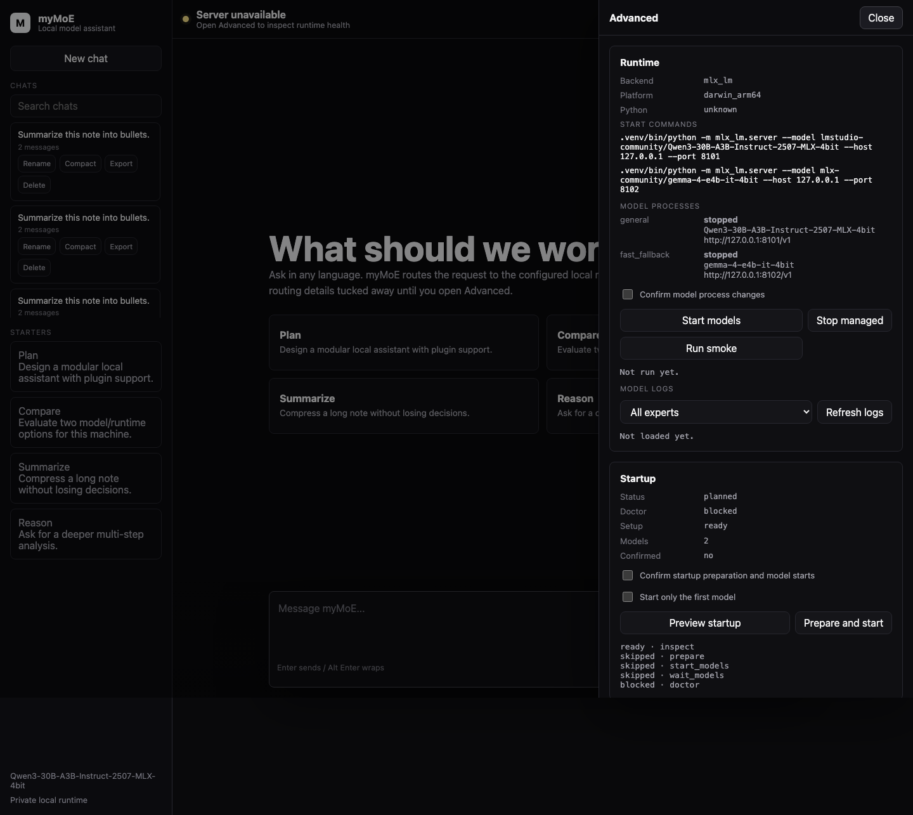
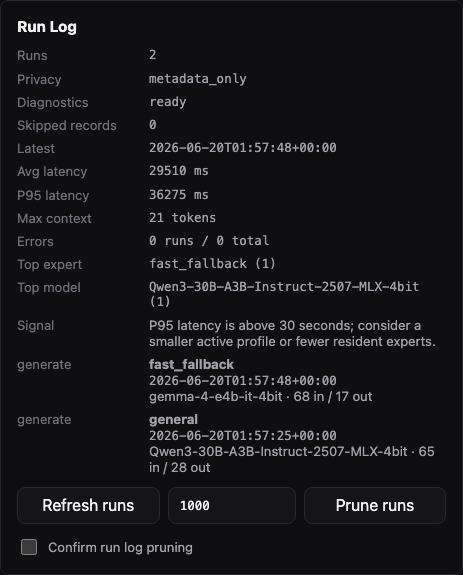
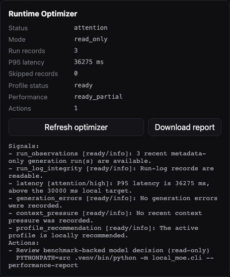

# Local MoE Orchestrator

Goal: design and prototype a local-first, general-purpose Mixture-of-Experts system that can run on a workstation without requiring cloud inference.

This project does not try to train a monolithic MoE from scratch. That would be expensive and brittle for local hardware. The first viable architecture is a system-level MoE:

1. run one strong resident local expert plus smaller or cold-loaded experts,
2. route each request with a lightweight configurable router,
3. optionally synthesize multiple expert answers,
4. distill routing decisions and/or expert outputs later.

The current live profile uses a distilled local router: base expert weights, explicit rules, multilingual semantic examples, and a local classifier artifact trained from curated route labels. See `docs/router.md`.

## Quick Start

Install and download the configured local model:

```bash
uv venv --python 3.12 .venv
uv pip install --python .venv/bin/python ".[mlx]"
PYTHONPATH=src .venv/bin/python scripts/bootstrap_runtime.py --download-models
```

You can also run the same guarded preparation flow through the app CLI:

```bash
make prepare-runtime
```

For one guarded readiness flow that inspects setup, prepares missing assets, starts configured local model servers, and returns the System Doctor result:

```bash
PYTHONPATH=src .venv/bin/python -m local_moe.cli \
  --startup \
  --startup-prepare \
  --startup-download-models \
  --startup-start-models \
  --startup-confirm
```

The `.[mlx]` extra intentionally pins the MLX stack that was validated with both Qwen and Gemma E4B on the tested machine. Use `.[mlx-current]` only when you explicitly want to track the newest MLX packages.

Start the configured local model server:

```bash
PYTHONPATH=src .venv/bin/python scripts/start_local_models.py --only-first
```

The web UI can also manage configured model processes from the Advanced Runtime panel. It starts only app-generated model commands, requires the confirmation checkbox, skips endpoints that are already reachable, and stops only processes that were started by the current web server.

For a faster first run on smaller machines:

```bash
PYTHONPATH=src .venv/bin/python scripts/bootstrap_runtime.py \
  --config configs/moe.live.fast-mlx.example.json \
  --download-models
PYTHONPATH=src .venv/bin/python scripts/start_local_models.py \
  --config configs/moe.live.fast-mlx.example.json
```

Run Gemma 4 E4B directly:

```bash
PYTHONPATH=src .venv/bin/python scripts/bootstrap_runtime.py \
  --config configs/moe.live.gemma-e4b-mlx.example.json \
  --download-models
PYTHONPATH=src .venv/bin/python scripts/start_local_models.py \
  --config configs/moe.live.gemma-e4b-mlx.example.json
```

Run the optional Gemma 4 12B GGUF coding/agentic specialist through llama.cpp:

```bash
# Install llama.cpp first:
# https://github.com/ggml-org/llama.cpp/releases
uv pip install --python .venv/bin/python ".[gguf]"
PYTHONPATH=src .venv/bin/python scripts/bootstrap_runtime.py \
  --config configs/moe.live.gemma-12b-agentic-gguf.example.json \
  --download-models
PYTHONPATH=src .venv/bin/python scripts/start_local_models.py \
  --config configs/moe.live.gemma-12b-agentic-gguf.example.json
```

Run the full local quality gate:

```bash
python3 scripts/run_ci_checks.py
```

or:

```bash
make check
```

The quality gate runner is implemented in Python so the same command shape works on macOS, Linux, and Windows. Use `python3 scripts/run_ci_checks.py --dry-run --json` to inspect the exact argv-based steps before wiring it into CI.

Ask the orchestrator directly:

```bash
PYTHONPATH=src .venv/bin/python -m local_moe.cli \
  --prompt "Analyze the tradeoff between a single local model and a routed MoE."
```

Open the local UI:

```bash
PYTHONPATH=src .venv/bin/python -m local_moe.web \
  --port 8089
```

Then visit `http://127.0.0.1:8089`.

or:

```bash
make ui
```

Use the interactive CLI:

```bash
PYTHONPATH=src .venv/bin/python -m local_moe.cli --interactive
```

or:

```bash
make cli
```

Inspect local setup readiness before starting the app:

```bash
PYTHONPATH=src .venv/bin/python -m local_moe.cli --setup
```

Ask myMoE to recommend the best local runtime profile for the detected machine and current model cache:

```bash
PYTHONPATH=src .venv/bin/python -m local_moe.cli --recommend-profile
```

Guardedly update the default runtime profile for the next app start:

```bash
PYTHONPATH=src .venv/bin/python -m local_moe.cli \
  --activate-recommended-profile \
  --profile-confirm
```

Prepare the recommended profile's dependencies and model assets without making it active:

```bash
PYTHONPATH=src .venv/bin/python -m local_moe.cli \
  --prepare-recommended-profile \
  --prepare-execute \
  --prepare-download-models \
  --prepare-confirm
```

Run the full local system doctor when you want one readiness report across setup, runtime health, active-profile hardware fit, storage capacity, model processes, extension audit, and cron state:

```bash
PYTHONPATH=src .venv/bin/python -m local_moe.cli --doctor
PYTHONPATH=src .venv/bin/python -m local_moe.cli --doctor --doctor-format markdown
```

Capture a metadata-only environment snapshot with platform, Python, package versions, git revision, active config, hardware summary, and configured local model identities:

```bash
PYTHONPATH=src .venv/bin/python -m local_moe.cli --about
PYTHONPATH=src .venv/bin/python -m local_moe.cli --about --about-format markdown
```

Run a real local generation smoke test when endpoints are reachable but you want proof that the selected model returns visible content:

```bash
PYTHONPATH=src .venv/bin/python -m local_moe.cli --smoke-generate
```

Inspect the latest local performance decision without running a new benchmark:

```bash
PYTHONPATH=src .venv/bin/python -m local_moe.cli --performance-report
PYTHONPATH=src .venv/bin/python -m local_moe.cli --performance-report --performance-report-format markdown
```

Ask the read-only runtime optimizer to combine recent run metadata, profile recommendation, and benchmark status into concrete next actions:

```bash
PYTHONPATH=src .venv/bin/python -m local_moe.cli --runtime-optimizer
PYTHONPATH=src .venv/bin/python -m local_moe.cli --runtime-optimizer --runtime-optimizer-format markdown
```

Inspect metadata-only generation runs:

```bash
PYTHONPATH=src .venv/bin/python -m local_moe.cli --runs --runs-limit 20
PYTHONPATH=src .venv/bin/python -m local_moe.cli --runs-prune --runs-keep 1000 --runs-confirm
```

Create a privacy-safe support bundle for issues or handoff:

```bash
PYTHONPATH=src .venv/bin/python -m local_moe.cli --support-bundle-out outputs/support-bundle.json
```

The bundle includes the System Doctor report, environment snapshot, quality gate status, sanitized performance report, read-only runtime optimizer summary, storage capacity summary, hardware profile, runtime file paths, model log paths, and the generation run log path. It intentionally excludes chat transcripts, memory records, environment variables, benchmark response excerpts, generation run log contents, API keys, and log contents.

Inspect configured model process status:

```bash
make models-status
PYTHONPATH=src .venv/bin/python -m local_moe.cli --models-status
```

Inspect sanitized model server log tails without opening log files manually:

```bash
make models-logs
PYTHONPATH=src .venv/bin/python -m local_moe.cli --models-logs --models-log-lines 80
```

Preview or run runtime preparation from the CLI:

```bash
PYTHONPATH=src .venv/bin/python -m local_moe.cli --prepare-runtime
PYTHONPATH=src .venv/bin/python -m local_moe.cli \
  --prepare-runtime \
  --prepare-execute \
  --prepare-download-models \
  --prepare-confirm
```

## Visual Walkthrough

The default UI is chat-first, with operational details hidden behind the Advanced drawer.


The composer supports normal chat usage, progressive streamed responses, rendered Markdown responses, `Enter` to send, and `Alt+Enter` for multiline prompts.


Chat sessions are persisted locally under the configured runtime work directory. Refreshing the UI reloads saved sessions, while `?new_chat=true` starts with an empty composer. Saved chats can be searched, renamed, compacted, exported, and deleted. Continued chats use the configured context policy, durable summaries, retrieved local memories, imported knowledge chunks, and recent turns in the next local model prompt. The browser uses `/api/generate/stream` when available and falls back to `/api/generate` when streaming is unavailable.

The Advanced drawer includes Local Data, Audit Trail, Run Log, Memory, and Knowledge panels. Local Data can export and restore a portable JSON backup containing chat sessions and memory records, with explicit confirmation because the backup contains private user content. Audit Trail records host-side sensitive actions such as data export/import, model process changes, setup runs, tool calls, plugin creation, and memory or knowledge deletion without duplicating chat or memory content. Older audit events can be pruned with an explicit keep count and confirmation, and the prune action keeps its own audit event. Run Log records metadata-only generation observations such as selected experts, models, latency, token counts, context pressure, and prompt hash in `<runtime.work_dir>/runs.jsonl`; it also summarizes average and p95 latency, top models/experts, context pressure, token totals, errors, and recommendations without storing prompt text or answer text. The Run Log reader skips malformed or legacy JSONL records, reports the skipped-record count through CLI/API/UI diagnostics, and pruning rewrites only retained valid metadata records. Knowledge import chunks pasted local notes or documentation into the local memory store with document metadata, then the normal local context retrieval path can use those chunks in future chat prompts. Memory records and imported knowledge documents can be removed through guarded forget controls that require explicit confirmation. The browser never receives permission to read arbitrary local files; users paste content or call the guarded API/tool explicitly.

Advanced runtime, startup, setup, profile discovery, model, routing, extension, MCP, cron, and eval details are available only when the user opens the drawer. Startup combines setup inspection, guarded runtime preparation, guarded model starts, and System Doctor verification into one operator flow. Extension Studio adds guided MCP server and cron job configuration from safe presets, so operators can add or remove local extension entries without hand-editing registry JSON.




Profiles lists runnable local model configs, active/default/recommended flags, setup readiness, backend, model names, hardware fit, and copyable launch hints for setup, model startup, UI startup, and CLI usage without switching runtime state. The recommendation is computed locally from setup readiness, hardware fit, general-purpose coverage, routing capability, and active/default tie-breaks. A profile can be prepared before activation through the same guarded setup runner used by the active config. Updating the default profile requires explicit confirmation, writes only `default_moe_config` in the app config file, and returns a restart command because the running MoE instance is not hot-swapped.


Extension Studio configures MCP server and cron job entries through guarded presets and confirmation-based writes.


Audit Trail includes guarded retention pruning for older operational events.


Run Log shows recent metadata-only generation observations, aggregate health signals, corrupt-record diagnostics, and guarded retention pruning.



Runtime Optimizer combines recent run-log health, profile recommendation, and benchmark status into read-only next actions.



The Advanced drawer includes System Doctor, environment snapshot, generation smoke test, setup status, local runtime profile recommendation, read-only runtime profile discovery, performance decision, runtime health checks, storage capacity checks, and sanitized model log tails for every configured expert endpoint, so missing model assets, hardware-fit issues, disk-space pressure, model-server issues, blank generation failures, benchmark evidence, plugin registry problems, cron status, downloadable Markdown reports, and a downloadable support bundle are visible before the first prompt.

Model Logs exposes bounded, sanitized tails from runtime-plan-generated log paths only.


Live generation was verified against a local Gemma 4 E4B model on the tested Apple Silicon machine.


The layout has also been checked on a mobile viewport.


## Recommended Local Model Path

For Antonio's machine class (Apple Silicon, 24 GB RAM), this is a general-purpose app, so the default is not a coder model.

- `primary general`: Qwen3-30B-A3B-Instruct-2507 MLX 4-bit.
- `multimodal alternative`: Gemma 4 26B-A4B OptiQ MLX 4-bit.
- `fast fallback`: Qwen3 4B or Gemma 4 E4B, selected by local benchmark and task quality.
- `optional specialist`: Gemma 4 12B Agentic GGUF v2 or Qwen3-Coder-30B-A3B only for coding-heavy workflows.
- `rejected stretch on tested 24 GB`: Qwen3.6-35B-A3B OptiQ MLX 4-bit failed with Metal OOM at both 8192 and 2048 KV cache sizes.
- `judge/router-teacher`: use Codex/GPT-class teacher offline during dataset creation, not in runtime.

The runtime must remain local. Distillation data can be created with a stronger teacher, then used to train a local router or small student.

The user-facing app requires a real local model. Synthetic providers are confined to automated test fixtures and are not shipped as runnable app profiles.

## Multilingual And Tooling Model

myMoE is designed to preserve the user's language at runtime: the UI and docs stay English, while the model is instructed to answer in the user's language unless asked otherwise. Real quality still depends on the selected local model and must be covered by eval cases per language.

The default live router is covered by 52 curated multilingual route cases across English, Italian, Spanish, French, German, Portuguese, Dutch, Polish, Arabic, Hindi, Japanese, Korean, and Chinese prompts.

Similar local assistant tools tend to combine chat, local/remote providers, RAG, tool calling, memory, and agent presets. myMoE's differentiator is the configurable local control plane: route cheaply first, keep the heavy model for generation, use MCP and local tools only through allowlists and confirmations, and cold-load specialists only when evals justify them.

## Project Layout

```text
configs/
  moe.local.example.json   # template for real llama.cpp/Ollama/LM Studio endpoints
  moe.live.general-mlx.example.json
  moe.live.fast-mlx.example.json
  moe.live.gemma-e4b-mlx.example.json
  moe.live.gemma-12b-coder-gguf.example.json
  moe.live.gemma-12b-agentic-gguf.example.json
  moe.live.ollama.example.json
  quality-gate.json        # thresholds and project artifact checks
docs/
  agent-runtime.md
  architecture.md
  context-architecture.md
  ci.md
  distillation-plan.md
  evaluation.md
  gemma-e4b-runtime.md
  installation.md
  model-selection.md
  performance-benchmarking.md
  router.md
  tested-performance.md
  ui.md
experiments/
  eval_set.jsonl
  eval_set_extended.jsonl
  eval_set_live_general.jsonl
  run_quality_gate.py
  run_smoke_eval.py
src/local_moe/
  config.py
  cli.py
  evaluator.py
  distilled_router.py
  text_features.py
  chat_store.py
  context.py
  compaction.py
  hardware.py
  memory.py
  performance_report.py
  run_log.py
  router.py
  providers.py
  orchestrator.py
  runtime.py
  model_downloads.py
  web.py
tests/
  test_cli.py
  test_config.py
  test_context.py
  test_evaluator.py
  test_memory.py
  test_orchestrator.py
  test_providers.py
  test_runtime.py
  test_router.py
  test_web.py
```

## Current Experiment

The first experiment validates the routing harness, not model quality. It checks that prompts are routed to the intended expert from configuration alone. This is the right first gate because model downloads are large, while a broken router wastes every later run.

The live experiment can plug in real local MLX or GGUF endpoints and compare:

- single general model,
- system-level MoE top-1 routing,
- top-2 routing with synthesis.

On the detected Apple M5 Pro / 24 GB machine, the current recommendation is:

1. Use one strong resident general expert first.
2. Keep MoE as routing, context, memory, fallback, and cold-load specialist harness.
3. Keep only small fallback/compaction experts resident alongside the heavy model.
4. Add large specialist models only if evals beat the general baseline enough to justify memory and latency.

The linked `yuxinlu1/gemma-4-12B-coder-fable5-composer2.5-v1-GGUF` model is not worse by definition, but it is a Python/coding specialist and its own model card now points to a v2 agentic successor. myMoE therefore keeps v1 as a legacy optional profile, adds v2 as the preferred GGUF coding/agentic profile, and leaves Qwen3 30B-A3B as the general-purpose default.

The current quality gate uses `scripts/run_ci_checks.py` to compile source/tests/scripts, run unit and contract tests, evaluate 64 deterministic routing cases across the base and extended sets, verify the 52-case live general routing report, check required files, and verify no live eval server remains on `127.0.0.1:8101`.

Run local model performance benchmarks with:

```bash
uv venv --python 3.12 .venv
uv pip install --python .venv/bin/python ".[mlx]"
PYTHONPATH=src .venv/bin/python experiments/benchmark_models.py
```

For a cheaper first pass:

```bash
make benchmark-small
```

Regenerate the local distilled router artifact with:

```bash
make distill-router
```

Inspect and run allowlisted local cron jobs with:

```bash
make cron-status
make run-cron
make run-cron-writes
```

When the web UI is running, `runtime.cron_auto_run=true` starts a lightweight in-process scheduler that executes safe due jobs such as extension audits, read-only memory maintenance, storage inspection, and the read-only runtime optimizer monitor. Expired-memory pruning, router distillation, and optimizer report file exports are write-local jobs and stay manual unless `runtime.cron_confirm_writes=true` is set.

Run an allowlisted local tool from the CLI:

```bash
PYTHONPATH=src .venv/bin/python -m local_moe.cli \
  --run-tool mcp.search_capabilities \
  --tool-input '{"query":"filesystem"}'
```

Memory maintenance is available without deleting data:

```bash
PYTHONPATH=src .venv/bin/python -m local_moe.cli \
  --run-tool memory.maintenance \
  --tool-input '{}'
```

Storage inspection is also available as a read-only tool and cron-safe action:

```bash
PYTHONPATH=src .venv/bin/python -m local_moe.cli \
  --run-tool storage.inspect \
  --tool-input '{"min_free_gib":5}'
```

Expired memory pruning is intentionally separate and confirmation-gated:

```bash
PYTHONPATH=src .venv/bin/python -m local_moe.cli \
  --run-tool memory.prune_expired \
  --tool-input '{"confirm":true}'
```

Tools are allowlisted by name. Local write tools and write-local cron jobs require explicit confirmation, for example `{"confirm": true}` for `plugin.create`, `{"confirm": true}` for `extension.configure`, `{"confirm": true}` for `profile.activate`, or `--cron-confirm-writes` for CLI cron execution.

The Advanced drawer also includes Plugin Studio for creating a local plugin scaffold without writing JSON by hand. It creates `plugin.json` plus plugin-local `SKILL.md`, requires confirmation, and refreshes the registry in the running web app.

Import local knowledge through the guarded tool runner:

```bash
PYTHONPATH=src .venv/bin/python -m local_moe.cli \
  --run-tool knowledge.ingest \
  --tool-input '{"title":"Project notes","content":"Paste local reference text here.","scope":"default","confirm":true}'
```

Forget a local memory record or imported knowledge document through the same guarded tool runner:

```bash
PYTHONPATH=src .venv/bin/python -m local_moe.cli \
  --run-tool memory.forget \
  --tool-input '{"document_id":"<document-id>","confirm":true}'
```

Export a portable local data backup, then restore it into another runtime with merge semantics:

```bash
PYTHONPATH=src .venv/bin/python -m local_moe.cli \
  --run-tool data.export \
  --tool-input '{"confirm":true}' > outputs/local-data-export-result.json

PYTHONPATH=src .venv/bin/python -m local_moe.cli \
  --run-tool data.import \
  --tool-input "$(.venv/bin/python -c 'import json; p=json.load(open("outputs/local-data-export-result.json")); print(json.dumps({"bundle": p["payload"]["bundle"], "mode": "merge", "confirm": True}))')"
```

Use the same Extensions panel to run a registry audit. The audit validates plugin references to tools, skills, MCP servers, cron jobs, and permission risk classes before the plugin is used by an agent workflow.

The `extension.configure` tool lets the app self-configure MCP server and cron job registry entries through the allowlisted tool runner. It writes only to the registry files declared by the active app config, validates entries with the same parsers used at startup, requires `confirm: true`, then refreshes the running web registry and cron state.

Example guarded cron configuration:

```bash
PYTHONPATH=src .venv/bin/python -m local_moe.cli \
  --run-tool extension.configure \
  --tool-input '{"surface":"cron_job","definition":{"id":"daily-audit","description":"Run extension audit once per day.","enabled":true,"schedule":{"type":"interval","seconds":86400},"command":["extension.audit"],"risk_class":"compute_only"},"confirm":true}'
```

The bundled cron registry also includes hourly `storage.inspect` and `runtime.optimizer` monitors. Storage inspection is read-only; the optimizer computes signals in memory by default. If an optimizer job uses `--out` to persist a Markdown or JSON report, mark it `write_local` and run it with `--cron-confirm-writes`.

MCP stdio discovery is also available for trusted, enabled MCP servers:

```bash
PYTHONPATH=src .venv/bin/python -m local_moe.cli \
  --app-config configs/app.mcp-enabled.local.example.json \
  --run-tool mcp.list_tools \
  --tool-input '{"server":"filesystem","confirm_process_execution":true}'
```

The default app config keeps `allow_process_execution=false`, so MCP process startup requires an explicit local app config override plus per-call confirmation.

Call an allowlisted MCP tool from the same profile:

```bash
PYTHONPATH=src .venv/bin/python -m local_moe.cli \
  --app-config configs/app.mcp-enabled.local.example.json \
  --run-tool mcp.call_tool \
  --tool-input '{"server":"filesystem","tool_name":"list_allowed_directories","arguments":{},"confirm_process_execution":true,"confirm_tool_call":true}'
```

For the Gemma E4B regression benchmark:

```bash
make benchmark-gemma
```
