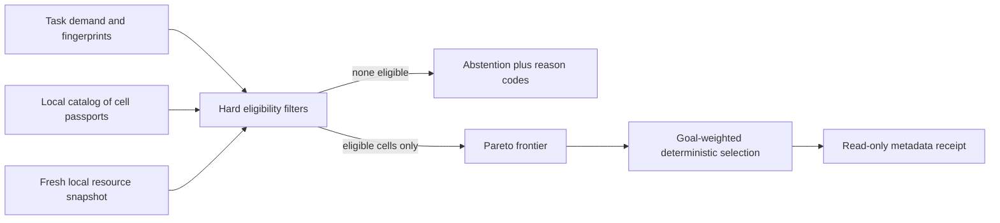

# Adaptive Cell Advisor v1

## In plain English

Local AI is not just a choice of model. The same model can behave differently
with another quantization, runtime, agent harness, tool contract, context size,
or hardware placement. The Adaptive Cell Advisor treats that complete setup as
one **cell**.

Given a task, the advisor asks:

> Which configured cell is eligible now, on this machine, for this exact demand,
> with evidence that is current and applicable?

It first rejects every unsafe, incompatible, or unproved option. It then
compares only the remaining cells across verified quality, latency, and peak
memory according to the selected goal. The result is the **best eligible
configured cell with current verified evidence**, not a claim of universal
model superiority. If nothing satisfies every boundary, it abstains and
reports exact reason codes.

Version 1 is deliberately a read-only advisor. It does **not**:

- download, start, invoke, load, unload, or stop a model;
- use the network;
- change myMoE, model-server, harness, or operating-system configuration;
- reserve memory or apply the recommendation;
- authorize a model call, agent action, route, or execution.

During one evaluation, the only optional server-side write is the CLI output
path explicitly supplied with `--out`. The separate `advisor-init` setup command
creates a starter only when requested, and a browser receipt download is a
client-side action. The advice contract still records `applied=false`,
`authorizes_execution=false`, `network_used=false`, and
`model_invocations=0`.



## Setup and first honest result

From a source checkout, install the locked base environment; the advisor does
not need a model-provider extra:

```bash
uv sync --locked
uv run mymoe advisor --help
```

When myMoE is installed from a wheel, materialize a complete opt-in starter:

```bash
mymoe advisor-init --out ./.mymoe-advisor
mymoe-web --app-config ./.mymoe-advisor/app.json
```

`advisor-init` creates a new `0700` directory and six `0600` files on POSIX:
`app.json`, `adaptive-cells.json`, `adaptive-execution-policy.json`,
`adaptive-evaluation-contract.json`, `moe.json`, and `context-policy.json`. It
never overwrites an existing path.
On Windows the destination directory's inherited ACL applies; the command does
not claim to install an owner-only DACL. Its JSON result contains metadata-only
`status`, `files`, and exact `next` argv arrays. The included catalog and
evaluation contract are zero-claim examples, so the first honest result is an
abstention rather than an invented recommendation.

The advisor command accepts exactly one bounded task input:

```text
mymoe advisor \
  --catalog PATH \
  (--task TEXT | --task-file PATH | --task-stdin) \
  --workload ID \
  --capability ID [--capability ID ...] \
  [--tool-surface ID ...] \
  --risk-class ID \
  --context-tokens N \
  --evaluation-contract PATH \
  --goal PROFILE \
  [--intent-family-sha256 SHA256] \
  [--json] [--out PATH]
```

Run the checked-in example from a source checkout:

```bash
uv run mymoe advisor \
  --catalog configs/adaptive-cells.example.json \
  --task "Summarize this local design note." \
  --workload local-summary \
  --capability summarization \
  --risk-class compute_only \
  --context-tokens 4096 \
  --evaluation-contract configs/adaptive-evaluation-contract.example.json \
  --goal balanced
```

The stable headline is:

```text
Not enough verified evidence
```

That is intentional. `configs/adaptive-cells.example.json` declares two
vendor-neutral placeholders but contains no observed component identities,
resource estimates, or qualified measurements. It is an example of safe
abstention, not a benchmark and not a runnable model catalog. The exact reasons
may include additional live-host boundaries, such as swap use, so they can vary
by machine.

Add `--json` for the complete content-addressed receipt envelope: request,
advice, candidate assessments, display state, task character count, and the
digest that binds the whole envelope. Add `--out advice.json` together with
`--json` to print and save the same JSON. Without `--json`, `--out` saves the
human rendering. The parent directory must already exist and be a real
directory; the destination must not exist or alias an input. Publication is
atomic and no-clobber. Receipt files are forced to mode `0600` on POSIX. On
Windows they inherit the destination directory ACL; myMoE does not claim an
owner-only DACL there. Choose a private destination: stable hashes and
environment lineage can still be sensitive even though task and model-output
bodies are absent.

## Command inputs

| Option | Meaning |
| --- | --- |
| `--catalog` | Strict JSON catalog containing sorted cell passports and named advisor profiles. |
| `--task` | Raw task text. The receipt retains only its SHA-256 and character count. The shell or process list may still expose command-line text. |
| `--task-file` | Read task text from one bounded regular non-link UTF-8 file. Mutually exclusive with the other task inputs. |
| `--task-stdin` | Read bounded UTF-8 task text from standard input, avoiding command-line disclosure. Mutually exclusive with the other task inputs. |
| `--workload` | Stable identifier for the evaluation workload, such as `local-summary`. |
| `--capability` | Required declared capability. Repeat the option when more than one capability is required. |
| `--tool-surface` | Required bounded tool surface. Omit it for a compute-only task; repeat it for multiple surfaces. |
| `--risk-class` | Required risk class, such as the checked-in `compute_only` policy. There is no implicit permissive default. |
| `--context-tokens` | Required context capacity, checked against the cell declaration. It is a demand, not a measured tokenizer result. |
| `--evaluation-contract` | Regular non-symlink file whose exact bytes are hashed and used to bind matching measurement evidence. The file is bounded to 2 MiB. |
| `--goal` | Profile name from the catalog, for example `balanced`, `efficiency`, or `quality` in the checked-in example. `--profile` is an alias. |
| `--intent-family-sha256` | Optional caller-supplied structural family digest. v1 does not derive it and does not use it to cache answers or authorize execution. |
| `--json` | Render the metadata-only receipt as JSON rather than the concise human explanation. |
| `--out` | Atomically create the selected rendering at a new path under an existing real parent. Existing files and input aliases are rejected. POSIX mode is `0600`; Windows inherits the parent ACL. |

The dedicated
`configs/adaptive-evaluation-contract.example.json` is a zero-claim structural
contract. It demonstrates exact file binding but is not qualified empirical
evidence. A real measurement must be produced under the evaluation contract it
claims and bind the resulting file digest exactly.

### Declared demand, not inferred intent

The advisor does **not** interpret the task sentence. The CLI or app policy
explicitly declares workload, capabilities, tool surfaces, risk class, context
ceiling, and goal. Only the exact UTF-8 task fingerprint and character count
enter the receipt. Changing the words does not silently change the declared
demand, and the advisor never infers permissions from natural language. This
keeps admission deterministic and separates future intent research from the
execution boundary.

## Catalogs and cell passports

An adaptive catalog has three top-level concerns:

1. `cells`: one or more passports, sorted by stable `cell_id`;
2. `profiles`: named quality, latency, memory, sample, freshness, swap, and
   reserve-memory policies;
3. `mode: "advisory_offline"`: the only v1 mode.

Every catalog, profile, passport, declaration, and evidence section is
content-addressed. Strict parsing rejects missing or unknown fields, duplicate
or unsorted cell identifiers, unsupported schemas, and digests that do not
match their content. Do not edit one nested field without regenerating all
affected digests.

A **cell passport** binds four intentionally separate layers:

| Layer | What it says | What it does not prove by itself |
| --- | --- | --- |
| `declaration` | The exact cell ID, model, quantization, runtime, harness, supported capabilities/tool surfaces/risk classes/platforms, context ceiling, offline support, and expected component digests. | That any component is installed, available, correctly configured, or effective. |
| `observed` | Current availability and observed digests for model, runtime, harness, and tool contract; optional residency state; capture/expiry times and source provenance. | Task quality, latency, memory needs, or truthfulness of an untrusted producer. Residency is recorded but is not a ranking advantage in v1. |
| `estimated` | Expected CPU/integrated-accelerator/discrete-accelerator placement, memory pool, and peak host/unified/accelerator memory, with a source file. | Actual consumption on the present task or machine. |
| `measured` | Sample count, verified success rate, p95 latency, peak memory, placement, and expiry, bound to the exact demand digest, evaluation-contract digest, and current resource-class digest. | General capability outside that exact workload/evaluation/resource class, or future performance after the host state changes. |

Known evidence sections point to `source_path` plus `source_sha256`. Source paths
are relative POSIX paths below the catalog directory. The loader rejects
absolute paths, `..`, backslashes, symlinks anywhere in the evidence path,
non-regular files, out-of-root resolution, oversized files, byte changes during
the read, and digest mismatches. Catalog files are bounded to 2 MiB and evidence
files to 16 MiB each.

These checks prove which local bytes were loaded. They do not authenticate who
created those bytes and do not prove that a stated benchmark was performed
honestly. A production catalog therefore needs a separately trusted local
evidence producer and a controlled evidence directory. Source authenticity
depends on that producer even when path, bytes, and SHA-256 are verified.

The Python contracts in `local_moe.cell_contracts`, the passport loader and
builder in `local_moe.cell_passport`, and the selector in
`local_moe.adaptive_selector` are the integration boundary for such a producer.
The repository does not ship a tool that fabricates qualified evidence from
the placeholder catalog.

## Exact request fingerprint and intent family are different

The command computes `exact_request_fingerprint` as SHA-256 over the exact UTF-8
bytes supplied through `--task`, `--task-file`, or `--task-stdin`. A punctuation
or wording change produces another fingerprint. It supports request lineage and
exact identity; it is not semantic similarity and is not encryption. A short or
predictable task may still be guessable by hashing candidate text.

`intent_family_sha256` is an optional digest supplied by the caller. Two
paraphrases can carry the same family digest while retaining different exact
request fingerprints. In v1 the advisor preserves this distinction in the
request and receipt but does not compute, validate semantically, or rank by the
family. In particular:

- the family never replaces the exact request fingerprint;
- it does not make one measurement applicable to a different demand;
- it does not authorize execution or tool access;
- a model response must never be reused solely because the family digest
  matches.

There is no embedding or LLM semantic normalizer in v1. A future normalizer can
implement the same optional contract only after collision and paraphrase
evaluation exists; it must not weaken exact request identity.

## Mini-app and local API

The installed starter carries the existing myMoE web application plus an
opt-in **Find the right local setup** card. Launch it with:

```bash
mymoe-web --app-config ./.mymoe-advisor/app.json
```

The app renders only three user-facing outcomes:

- **Recommended now**: one configured cell passed every declared boundary;
- **Not available now**: current verified incompatibility or resource pressure
  rules out every cell;
- **Not enough evidence**: unknown, stale, incomplete, or inapplicable
  evidence prevents a safe recommendation.

The card shows at most three short badges and lets the browser download the
complete receipt with a `Blob`. The download is client-side. The server does
not store the task, add it to chat history, write a receipt, invoke a model, or
apply the recommendation. The task can still exist in browser memory and in
the HTTP request while the call is active.

The same boundary is available through strict loopback JSON endpoints:

```bash
curl http://127.0.0.1:8089/api/advisor/config

curl -X POST http://127.0.0.1:8089/api/advisor \
  -H 'Content-Type: application/json' \
  --data '{"task":"Summarize this local design note.","profile":"balanced","context_tokens":4096}'
```

The `POST` body accepts only `task`, optional allowlisted `profile`, and an
optional `context_tokens` value no larger than the app policy. Catalog,
evaluation contract, workload, capabilities, tool surfaces, and risk class come
only from the local app configuration, so a browser request cannot widen them.
Requests require one fixed `Content-Length`, strict UTF-8 JSON without duplicate
keys, and configured byte/character limits. Advisor GET/POST responses use
`Cache-Control: no-store` and return a non-technical presentation plus the full
technical receipt. Operational failures return generic public errors rather
than task content or filesystem details. The shared local control plane also
rejects non-loopback clients, malformed or wrong-port Host headers, and browser
origins that do not exactly match the request authority. This closes the
DNS-rebinding and cross-port local-origin paths on every HTTP method, not only
Advisor. The separately authenticated `/v1/*` model gateway keeps its broader
documented loopback-origin contract for local editor and web clients. Generic
control-plane JSON bodies are likewise size-bounded, depth-limited, strict
UTF-8 objects with duplicate keys rejected.

## Live resource snapshot

At invocation, myMoE collects a fresh local snapshot containing operating
system and release, normalized machine architecture, CPU count and identity,
physical and currently available memory, effective memory limit, swap use when
available, accelerator identity/memory when supported, and the Python/runtime
environment identity. The advice binds both the snapshot digest and a stable
resource-class digest; the raw snapshot is not written by the advisor.

Apple Silicon is represented correctly as one unified memory pool, not invented
VRAM. Linux reads host and cgroup memory locally, and Windows reads physical
memory locally. Current limitations are fail-closed:

- Windows cannot distinguish true swap use from commit charge, so
  `swap_used_bytes` is `unknown` and every v1 advisory run abstains with
  `swap_usage_unknown`.
- Linux and Windows do not currently discover a trustworthy GPU identity or
  accelerator-memory pool. A cell requiring integrated or discrete accelerator
  evidence therefore abstains there. A fully evidenced CPU cell can still be
  considered on Linux when every other boundary passes.
- A snapshot is only a point-in-time observation. Another process can consume
  memory immediately after collection. The advisor neither reserves resources
  nor converts its result into execution authority.

## Hard filters before ranking

Ranking never compensates for missing safety or applicability evidence. A cell
must first pass all relevant hard filters:

1. **Scope and platform:** offline capability, operating system, architecture,
   requested capabilities, tool surfaces, risk class, and context ceiling.
2. **Exact component identity:** expected and observed digests for the model,
   runtime, harness, and tool contract, plus current availability and
   observation freshness.
3. **Applicable evaluation:** known placement and memory estimate; nonzero and
   fresh measurements; the profile's sample and quality floors; and exact
   demand, evaluation-contract, resource-class, and placement matches.
4. **Current resources:** complete resource class, known swap state within the
   profile limit, accelerator identity when required, correct memory topology,
   and enough current memory after the configured reserve.
5. **Ranking inputs:** verified success rate, p95 latency, placement, and peak
   memory must all be known.

Missing information remains `unknown`; it is never converted to a favorable
default. Measured peak memory is combined conservatively with the estimate by
using the larger applicable value.

## Pareto selection and goals

Only hard-eligible cells reach the Pareto stage. One cell dominates another
only when it is no worse on every active profile dimension and strictly better
on at least one:

- higher verified success rate;
- lower verified p95 latency;
- lower effective peak memory.

Dominated cells are removed. The selected profile then computes a deterministic
weighted utility on the remaining frontier using its quality, latency, and
memory weights and reference values. Ties are resolved deterministically by
active metrics and then `cell_id`. Profiles also control minimum success,
minimum samples, memory reserve, snapshot age, and maximum swap use, so
`balanced`, `efficiency`, and `quality` can produce different valid advice from
the same catalog and snapshot.

The comparison remains local to the configured catalog and exact evidence. A
recommended result makes no claim about models not listed, another
quantization/runtime/harness, an unmeasured workload, or a different machine.

## Reason codes

Human output translates common codes into short explanations. JSON preserves
the exact top-level and per-candidate codes for automation and audit.

| Boundary | Reason codes |
| --- | --- |
| Final status | `advisory_only`, `pareto_frontier_selected`, `no_eligible_cell` |
| Snapshot | `snapshot_from_future`, `snapshot_stale`, `swap_usage_unknown`, `swap_limit_exceeded` |
| Demand/platform | `offline_not_supported`, `system_not_supported`, `machine_not_supported`, `capability_gap`, `tool_surface_gap`, `risk_class_not_supported`, `context_window_exceeded` |
| Component identity | For each of `model`, `runtime`, `harness`, and `tool_contract`: `*_expected_identity_unknown`, `*_availability_unknown`, `*_unavailable`, `*_identity_mismatch` |
| Observation | `observation_from_future`, `observation_expired` |
| Estimates and measurements | `resource_estimate_unknown`, `measurement_unknown`, `measurement_demand_mismatch`, `measurement_evaluation_contract_mismatch`, `measurement_not_applicable`, `measurement_placement_mismatch`, `insufficient_samples`, `quality_floor_not_met`, `measurement_from_future`, `measurement_expired` |
| Resource identity/headroom | `resource_class_unknown`, `accelerator_identity_unknown`, `host_memory_unknown`, `host_memory_headroom_insufficient`, `unified_memory_unavailable`, `unified_memory_unknown`, `unified_memory_headroom_insufficient`, `accelerator_memory_unknown`, `accelerator_memory_headroom_insufficient` |
| Ranking | `ranking_metric_unknown` |

Top-level snapshot failures block every candidate. Other failures remain on the
specific candidate assessment, allowing an operator to distinguish a catalog
gap from a host-wide uncertainty without exposing task or response content.

## Three honest scenarios

### 1. The repository example abstains

The checked-in cells have declarations only. Their expected identities,
observations, estimates, and measurements are deliberately unknown. The advisor
therefore returns `Not enough verified evidence`. This proves fail-closed
behavior; it is not a negative judgment about either placeholder model.

### 2. A fully qualified cell can be recommended conditionally

Suppose a trusted local producer records a CPU or Apple-unified-memory cell with
matching model/runtime/harness/tool digests, fresh observations, a sourced
memory estimate, and enough fresh evaluation samples for the exact workload,
evaluation contract, placement, and current resource class. If live swap and
memory headroom also satisfy the chosen profile, that cell can enter the Pareto
frontier and be recommended. This repository does not claim such a result for
the placeholder catalog and supplies no invented success, latency, or memory
numbers.

### 3. Incomplete or changed host evidence abstains

The same otherwise qualified passport abstains if its measurement belongs to a
different machine, the snapshot or evidence has expired, current swap exceeds
the profile, or memory headroom has disappeared. Windows always reaches this
outcome in v1 because swap use is unknown. Linux and Windows accelerator cells
also abstain while GPU identity and accelerator memory remain unknown. The
advisor does not fall back to an optimistic estimate.

## Deterministic contract benchmark

The repository includes a synthetic, model-free benchmark for the selector
contract:

```bash
uv run python experiments/benchmark_adaptive_cell_advisor.py
```

It prints a stable machine-readable JSON report. The canonical CI plan also
writes that report to `outputs/adaptive-cell-advisor-contract.json`. Its fixed
fixture proves only that the implemented contracts behave deterministically:

- an efficiency profile and a quality profile can select different valid
  cells from the same evidenced catalog;
- a stale snapshot and insufficient live memory both produce abstention;
- two paraphrases retain different exact request fingerprints and different
  advice records even when the caller supplies the same intent-family digest
  and declared demand;
- every result is read-only, non-authorizing, network-free, and records zero
  model invocations.

The synthetic success rates, latency values, and memory values are test inputs,
not measurements. This benchmark does **not** measure model quality, real
latency, real resource use, runtime compatibility, or semantic intent-family
accuracy. It does not run a cache and never reuses a response. Passing it is a
contract regression check, not evidence that one model or cell is better in the
real world.

## Where this fits in the local-agent market

The Adaptive Cell Advisor is intentionally not another editor, inference
router, or model picker. Existing projects already cover those layers well:

- [llmfit](https://github.com/AlexsJones/llmfit) helps match local models to
  detected hardware and presents fit, speed, quality, and context trade-offs;
- [pi-smart-router](https://github.com/beettlle/pi-smart-router) focuses on
  dynamic inference routing for agent requests;
- [Bodega's model and provider guidance](https://www.bodegaone.ai/docs/code/models-providers)
  organizes local model/runtime roles for coding;
- [LM Studio Bionic](https://lmstudio.ai/blog/introducing-lm-studio-bionic) and
  [Zed local models](https://zed.dev/blog/local-ai-in-zed) provide agent/editor
  experiences around local inference.

myMoE's narrower contribution is a **verifiable admission controller for the
whole cell**: model + quantization + runtime + harness + tool contract +
hardware placement. It asks whether that exact combination has applicable
evidence and enough current resources before execution. This positioning is an
architectural boundary, not a claim that myMoE replaces those products or has
empirically outperformed them.

Two research directions remain outside the current whole-cell preview. The
[harness-native routing paper](https://arxiv.org/abs/2607.11399) motivates
making routing aware of the agent harness and individual steps, while
[TwinRouterBench](https://arxiv.org/abs/2605.18859) highlights the need for
explicit router evaluation rather than anecdotal model choice. A future myMoE
executor could re-admit a cell at each step and expose the boundary through the
[Agent Client Protocol](https://agentclientprotocol.com/get-started/introduction),
but step-level harness-native routing and ACP delivery remain roadmap items, not
current features. The implemented
[Adaptive Cell Execution Gate](cell-execution-gate.md) instead performs one
fresh, non-authorizing whole-cell admission preview.

## Threat model

The advisor is designed to reduce accidental overcommit and evidence-free
selection, not to establish a sandbox or a cryptographic chain of human trust.

| Threat or failure | v1 behavior | Remaining boundary |
| --- | --- | --- |
| Malformed or drifted catalog | Strict schema, ordering, content digests, and size limits reject it. | A well-formed malicious catalog can still lie. Trust the producer and storage location. |
| Replaced evidence file | In-root regular-file, non-symlink, size, stable-read, and SHA-256 checks reject byte or path drift. | SHA-256 identifies bytes; it does not authenticate the producer or validate benchmark methodology. |
| Measurement reused too broadly | Exact demand, evaluation-contract, resource-class, placement, freshness, and sample floors are hard requirements. | A biased evaluation contract or dishonest samples can still produce misleading claims. |
| Task disclosure | Receipts omit task text and retain its digest plus character count. | `--task` can appear in shell history/process inspection; predictable text can be guessed from its hash. |
| Memory pressure changes after advice | The current snapshot, reserve, swap policy, and effective memory limit gate eligibility. | Snapshot-to-execution is a race. No memory is reserved and the receipt is non-authorizing. |
| Recommendation treated as permission | Contract flags always say not applied and not authorized; human output repeats the boundary. | A separate caller must continue to enforce its own execution, tool, privacy, and approval policies. |
| Network or model side effect | The advisor performs no network request and no model lifecycle or inference operation. | The trusted Python process and local OS probes remain inside the host trust boundary. |

Use receipts as sensitive operational metadata. Hashes can correlate runs,
catalogs, machines, workloads, and evaluation artifacts even when prompt and
response bodies are absent.

## Deliberate v1 boundaries

The Adaptive Cell Advisor does not yet provide:

- ACP integration or a custom IDE/editor protocol;
- step-level, harness-native routing;
- browser or desktop actions;
- automatic model loading, unloading, eviction, or multi-model concurrency;
- resource reservations or an atomic handoff from advice to execution;
- response caching;
- semantic response reuse based on an intent family;
- an embedding or LLM-based intent normalizer;
- automatic downloads, online discovery, or remote-model fallback;
- proof that source evidence came from an authentic producer.

These are separate authority and evaluation problems. The current dry-run gate
binds fresh admission to the advice receipt but still reserves nothing. A
future executor must bind itself to a fresh passing preview, recheck resources
again at its own execution boundary, and obtain separate authority—not make
either the advice or preview receipt executable.
