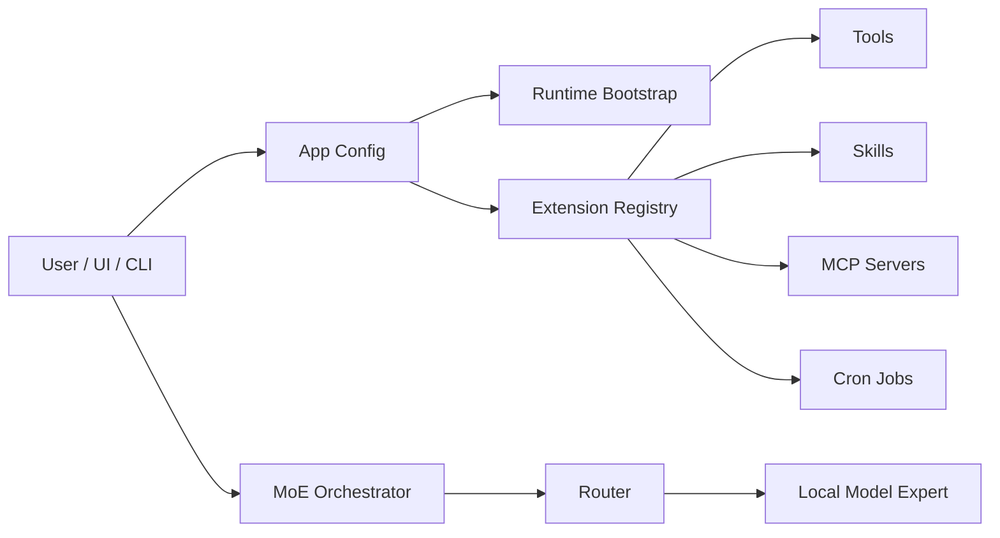

# Agent Runtime

myMoE is structured as a local model control plane plus a system-level MoE harness.

## Components

## Extension Surfaces

- `configs/tools.json`: typed tool inventory with risk class and side-effect metadata.
- `configs/mcp.json`: MCP server declarations, disabled by default until configured.
- `configs/cron.json`: app-managed recurring jobs.
- `skills/*/SKILL.md`: portable skill instructions with progressive disclosure.
- `plugins/*/plugin.json`: plugin manifests that can reference skills, tools, MCP servers, and cron jobs.

## Permission Policy

The app config defaults to:

- local writes: approval-required,
- connector installation: approval-required,
- external communication: draft-only,
- process execution: disabled in the model-facing policy.

The current implementation discovers and reports these surfaces. Execution of high-risk tools is intentionally not exposed as a broad `execute_anything` interface.

## Local Model Requirement

The user-facing default is `configs/moe.live.general-mlx.example.json`, not a mock config. The mock config remains only for deterministic tests and CI-style routing checks.

## Multilingual Policy

The default provider system message instructs the model to response in the user's language unless the user asks otherwise. The app config uses `language.mode = auto` and documents supported language hints.

Actual multilingual quality depends on the selected model. Qwen3 30B-A3B 2507 is preferred partly because its public model description emphasizes broad multilingual and instruction-following capability.
