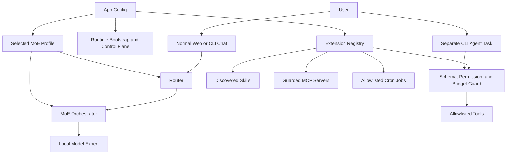
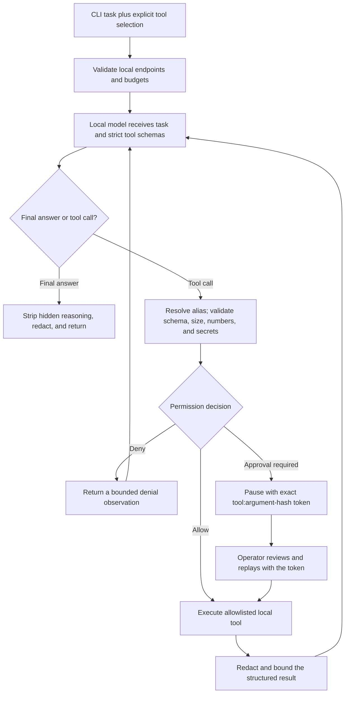

# Agent Runtime

myMoE is structured as a local model control plane plus a system-level MoE harness.

For the end-to-end distinction between normal chat and agent mode, see [How myMoE works](how-it-works/README.md#7-the-separate-agent-tool-loop).

## Components



## Extension Surfaces

- `configs/tools.json`: typed tool inventory with risk class and side-effect metadata.
- `configs/mcp.json`: MCP server declarations, disabled by default until configured.
- `configs/cron.json`: app-managed recurring jobs.
- `skills/*/SKILL.md`: portable skill instructions with progressive disclosure.
- `plugins/*/plugin.json`: plugin manifests that can reference skills, tools, MCP servers, and cron jobs.

## Agent Tool Loop

The agent loop is intentionally a narrow local harness, not a broad autonomous
runtime. `src/local_moe/agent_loop.py` asks one configured OpenAI-compatible
expert for tool calls, executes only visible allowlisted local tools through
strict JSON schemas, returns bounded observations, and then lets the model
produce a final answer grounded in delivered successful tool results.



Safety properties:

- model-visible tool names are aliases of configured local tools, not arbitrary commands;
- tools without strict schemas are not exposed to the model;
- risky tools pause for an external approval handler and receive exact
  harness-owned confirmation fields only after approval;
- model-supplied confirmation, secret-like arguments, and non-finite JSON
  numbers are rejected before execution;
- tool results are redacted and size-bounded before being added to model context;
- traces store operational metadata only: ids, statuses, hashes, token counts,
  risk classes, and result lengths, never prompts, arguments, tool bodies, or raw
  reasoning.

### CLI contract

`--agent-prompt` is separate from normal `--prompt` generation and cannot be
combined with another CLI action. It selects one OpenAI-compatible expert from
the active MoE config, builds the local tool registry from the active app config,
and runs the same provider-neutral loop described above. It requires a narrow,
explicit, repeatable `--agent-tool <canonical-name>` selection for each task:

```bash
mymoe \
  --config configs/moe.live.general-mlx.example.json \
  --agent-prompt "Find local notes about router thresholds." \
  --agent-expert general \
  --agent-tool memory.search \
  --json
```

With `mode=local_model_required`, the CLI validates every configured HTTP model
endpoint before the first agent request. Only `localhost`, IPv4 loopback, and
IPv6 loopback endpoints are accepted. This whole-config check also prevents a
local primary agent from sending tool data to a remote fallback through a
model-backed tool. Remote egress requires an explicitly non-local app mode; no
agent flag silently opts into it.

When a risky call is proposed without approval, the command exits non-zero and
returns a JSON result with `status=approval_required`, the sanitized approval
request, and an `approval_token` in
`<canonical-tool>:<arguments-sha256>` format. After reviewing the exact request,
the operator can replay the task with `--agent-approve '<approval-token>'`.
Only a request with the same canonical tool name and argument hash is approved;
any different request is denied. The provider call id is not trusted as an
approval because it may change when the task is replayed. Harness-owned
confirmation fields are injected only after the exact match.

The default app config additionally denies model-facing process execution and
external communication. An alternate app config may enable process execution,
but each process/tool call still needs its own exact approval and remains bound
to the MCP server allowlist. Per-run budget flags expose the existing
`AgentLoopBudget` limits for model turns, tool calls, proposed calls per turn,
task/argument/result size, and a soft wall-time deadline. Use
`--agent-soft-wall-time-seconds`; the old `--agent-max-wall-time-seconds` name is
accepted only as a deprecated compatibility alias because arbitrary synchronous
local/custom tools cannot be safely preempted mid-side-effect. The loop checks
the soft deadline between operations and passes its remaining time into the
built-in OpenAI-compatible HTTP, MCP, and model-backed compaction timeouts.

`connector_install_policy=deny` is a harness-enforced tool denial: it blocks
`extension.configure` before approval evaluation, so an exact approval token
cannot override the app policy.

With `--json`, the top-level result is stable and includes completion status,
bounded tool observations, sanitized approval requests, grounding ids, and a
metadata-only trace. The trace never contains prompt, arguments, observations,
or reasoning. The broader command result can contain the requested final answer
and sanitized tool data, so it must not be treated as the metadata-focused
support bundle.

## Extension Execution Matrix

| Surface | Runtime behavior | Safety policy | Entry points |
| --- | --- | --- | --- |
| CLI agent task | Runs a bounded model -> tool -> observation loop against one configured OpenAI-compatible local expert. | Strict-schema configured tools only; narrow tool selection is recommended; risky calls require exact tool+argument-hash approval; app permission policy can deny additional risks; trace is metadata-only. | CLI `--agent-prompt`, repeatable `--agent-tool`, optional exact `--agent-approve`, and `--json`. |
| `memory.search` | Searches the local memory store. | Read-only, no path override through the web API. | CLI `--run-tool`, web `/api/tools/run`, Advanced Tools panel. |
| `memory.maintenance` | Reports local memory totals, active temporal records, pending future records, and expired records. | Read-only; no deletion or path override through the web API. | CLI `--run-tool`, web `/api/tools/run`, web `/api/memory/maintenance`, Advanced Memory panel, cron. |
| `memory.prune_expired` | Deletes only records whose `valid_until` timestamp is expired. | Requires `confirm=true` from tools/API and `confirm_writes=true` for cron; future `valid_from` records are preserved. | CLI `--run-tool`, web `/api/tools/run`, web `/api/memory/prune-expired`, Advanced Memory panel, optional cron. |
| `memory.forget` | Deletes one memory record by id or all chunks for one imported knowledge document id. | Requires `confirm=true`; deletes only from `<runtime.work_dir>/memory.jsonl`; no arbitrary path input. | CLI `--run-tool`, web `/api/tools/run`, web `DELETE /api/memory/<id>`, web `DELETE /api/knowledge/<id>`, Advanced Memory and Knowledge panels. |
| Web memory API | Saves, searches, and guard-deletes local memory records. | Writes and deletes only in `<runtime.work_dir>/memory.jsonl`; delete requires `confirm=true`; no arbitrary path input. | Web `/api/memory`, Advanced Memory panel. |
| `knowledge.ingest` | Chunks pasted local notes or documentation into knowledge records in the local memory store. | Requires `confirm=true`; writes only to `<runtime.work_dir>/memory.jsonl`; does not read arbitrary local file paths. | CLI `--run-tool`, web `/api/tools/run`, web `/api/knowledge`, Advanced Knowledge panel. |
| `data.export` | Returns a portable JSON backup containing local chat sessions and memory records. | Requires `confirm=true` because the response contains private user content; reads only `<runtime.work_dir>/chats.json` and `<runtime.work_dir>/memory.jsonl`. | CLI `--run-tool`, web `/api/tools/run`, web `/api/data/export`, Advanced Local Data panel. |
| `data.import` | Restores a portable local data backup into chat and memory stores with `merge` or `replace` mode. | Requires `confirm=true`; writes only `<runtime.work_dir>/chats.json` and `<runtime.work_dir>/memory.jsonl`; no arbitrary path input. | CLI `--run-tool`, web `/api/tools/run`, web `/api/data/import`, Advanced Local Data panel. |
| Audit Trail | Records sensitive host-side actions such as local data export/import, setup runs, model process changes, tool calls, plugin creation, and memory or knowledge deletion. | Writes metadata only to `<runtime.work_dir>/audit.jsonl`; it does not copy chat transcripts or memory text. | Web `/api/audit`, Advanced Audit Trail panel. |
| Generation Run Log | Records successful generation observations for tuning and troubleshooting, then summarizes recent run health. | Writes metadata only to `<runtime.work_dir>/runs.jsonl`: prompt hash, prompt length, selected experts, model ids, latency, token counts, context pressure, memory ids, and error counts. It never stores prompt text or answer text. Summary metrics are derived from the same metadata. Malformed or legacy JSONL rows are skipped and reported as diagnostics; retention pruning requires explicit confirmation and rewrites only valid retained records. | CLI `--runs`, CLI `--runs-prune`, web `/api/runs`, web `/api/runs/prune`, Advanced Run Log panel. |
| CLI chat sessions | Creates, searches, continues, compacts, exports, renames, and deletes local chat sessions without the web UI. | Uses the same `<runtime.work_dir>/chats.json`, context policy, memory retrieval, route/generation separation, metadata-only run log, and compaction provider as the web UI. Compaction and deletion require `--chat-confirm`. | CLI `--interactive`, `--new-chat`, `--chat-session`, `--list-chats --chat-query`, `--export-chat`, `--compact-chat --chat-confirm`, `--rename-chat`, `--delete-chat --chat-confirm`. |
| `context.compact` | Builds a compaction prompt and, by default, asks the configured local model to summarize it. | Compute-only; uses the configured MoE expert and does not call cloud APIs. | CLI `--run-tool`, web `/api/tools/run`, Advanced Tools panel. |
| `extension.audit` | Validates the active extension registry and returns structured plugin reference issues. | Read-only; no filesystem writes or process execution. | CLI `--run-tool`, web `/api/tools/run`, web `/api/extensions/audit`, Advanced Extensions panel, cron. |
| Extension Studio | Provides guided MCP server and cron job presets, then writes validated registry entries. | Template discovery is read-only; writes require confirmation and use the same registry paths and validators as `extension.configure`; the web registry and cron runner refresh immediately. | Web `/api/extensions/templates`, web `/api/extensions/configure`, Advanced Extensions panel. |
| `extension.configure` | Adds, updates, or removes MCP server and cron job registry entries from JSON payloads. | Requires `confirm=true`; writes only to the MCP and cron registry paths from the active app config; validates entries before writing; refreshes the running web registry and cron runner. | CLI `--run-tool`, web `/api/tools/run`, Advanced Tools panel. |
| `storage.inspect` | Returns read-only storage capacity diagnostics for the configured model cache and runtime work directory. | Does not create missing paths; inspects the nearest existing parent and reports optional low-free-space warnings. | CLI `--run-tool`, web `/api/tools/run`, Advanced Tools panel, cron. |
| `models.inventory` | Inventories configured model assets and estimates local cache/file size. | Read-only; scans only configured model cache repositories or local model files, deduplicates Hugging Face symlinks, and never downloads or deletes models. | CLI `--run-tool`, web `/api/tools/run`, web `/api/models/inventory`, Advanced Runtime panel. |
| System Doctor | Aggregates setup readiness, runtime health, active-profile hardware fit, storage capacity, model process state, extension audit, and cron state into one readiness report. | Read-only; probes local configured endpoints and disk capacity only. Hardware fit is advisory except profiles marked too large, which fail the required check. Storage warnings are optional readiness checks. Markdown export is metadata-only. | CLI `--doctor`, CLI `--doctor-format markdown`, web `/api/doctor`, web `/api/doctor/report.md`, Advanced System Doctor panel. |
| Environment Snapshot | Captures app mode, config paths, platform, Python, selected package versions, git revision, hardware summary, storage capacity, routing policy, and configured local model identities. | Read-only and metadata-only; excludes chat transcripts, memory records, environment variables, secrets, model log bodies, and benchmark response excerpts. | CLI `--about`, CLI `--about-format markdown`, web `/api/about`, web `/api/about/report.md`, Advanced Environment panel. |
| Performance Report | Exposes the latest benchmark decision as a sanitized runtime status. | Read-only; never starts benchmarks or model downloads and excludes benchmark response excerpts. | CLI `--performance-report`, web `/api/performance`, web `/api/performance/report.md`, Advanced Performance panel. |
| Runtime Optimizer | Combines recent run-log health, profile recommendation, and benchmark status into local next actions. | Read-only; does not start models, download assets, or change profiles. Suggested actions reuse existing guarded commands and include side-effect/confirmation metadata. | CLI `--runtime-optimizer`, CLI `--runtime-optimizer-format markdown`, web `/api/runtime/optimizer`, web `/api/runtime/optimizer/report.md`, Advanced Runtime Optimizer panel. |
| Support Bundle | Exports a metadata-focused diagnostic bundle for issue reports or handoff. | Read-only; includes Doctor, Environment Snapshot, performance, runtime optimizer summary, storage capacity summary, model asset inventory, quality gate, hardware, paths, model log paths, the generation run log path, configured Git remote URL, and model base URLs. It excludes content stores and log bodies, but must still be reviewed before sharing. | CLI `--support-bundle`, web `/api/support-bundle`, web `/api/support-bundle/download.json`, Advanced System Doctor panel. |
| Streaming generation | Streams local model output as server-sent events and persists the exchange only after the final response is available. | Uses the same routing, context, provider, and chat-store contracts as non-streaming generation; hides reasoning-channel content before emitting visible text. | Web `/api/generate/stream`, chat UI with `/api/generate` fallback. |
| Runtime setup | Runs configured install commands and model downloads from the runtime plan. | Requires explicit confirmation; executes only app-generated commands, never arbitrary user input. | CLI `--prepare-runtime`, web `/api/setup/run`, Advanced Setup panel. |
| Startup runbook | Combines setup inspection, optional runtime preparation, optional model starts, and System Doctor verification into one operator flow. | Preview is read-only; installs, downloads, and model starts require confirmation; execution is limited to app-generated setup/model commands. | CLI `--startup`, web `/api/startup`, web `/api/startup/run`, Advanced Startup panel. |
| Runtime profile discovery | Lists runnable local model config profiles, setup readiness summaries, hardware fit, and copyable launch hints. | Read-only; does not switch profiles, start processes, download models, or edit config files. Hardware fit is advisory and based on detected RAM plus configured candidate manifests. Generated commands are labeled with side effects and must be copied or run explicitly by the operator. | Web `/api/config/profiles`, Advanced Profiles panel. |
| Runtime profile recommendation | Selects the best local profile for the detected machine and current model cache. | Read-only; scores existing profile metadata only and returns next actions without mutating config, downloading models, or starting processes. | CLI `--recommend-profile`, web `/api/config/recommendation`, embedded in `/api/config/profiles`, Advanced Profiles panel. |
| Runtime profile preparation | Runs setup inspection, dependency install, and model download workflow for an explicit or recommended profile. | Preview is read-only; install/download side effects require confirmation and execute only app-generated setup commands for the selected profile. | CLI `--prepare-profile`, CLI `--prepare-recommended-profile`, web `/api/config/prepare-profile`, Advanced Profiles panel. |
| Runtime profile activation | Updates the app config default MoE profile for the next app start. | Requires `confirm=true`; validates the target profile, writes only `default_moe_config`, does not hot-swap the running MoE instance, and returns a restart command when needed. | CLI `--activate-profile`, CLI `--activate-recommended-profile`, web `/api/config/activate-profile`, `profile.activate`, Advanced Profiles panel. |
| Model process manager | Starts configured local model server commands and tracks processes started by the web server. | Requires explicit confirmation; skips already reachable endpoints; stops only managed child processes. | CLI `--models-status`, web `/api/models/processes`, `/api/models/start`, `/api/models/stop`, Advanced Runtime panel. |
| Model log diagnostics | Reads bounded tails from configured model server log files. | Read-only; callers cannot pass arbitrary paths; secret-looking tokens, bearer values, API keys, passwords, and secrets are redacted before output. | CLI `--models-logs`, web `/api/models/logs`, Advanced Runtime Model Logs panel. |
| Generation Smoke Test | Sends a short local prompt through the configured MoE route and fails when the selected expert returns no visible content. | Compute-only; no chat persistence, no local writes, no cloud provider dependency. Custom prompts are returned only to the caller and are not added to support bundles. | CLI `--smoke-generate`, web `/api/smoke/generate`, Advanced Runtime panel. |
| `plugin.create` | Scaffolds a local plugin manifest and plugin-local `SKILL.md`. | Requires `confirm=true` because it writes local files. | CLI `--run-tool`, web `/api/tools/run`, web `/api/plugins`, Advanced Plugin Studio. |
| `profile.activate` | Activates an explicit or recommended runtime profile as the app default. | Requires `confirm=true`; same validated write path as `/api/config/activate-profile`; current process remains unchanged until restart. | CLI `--run-tool`, web `/api/tools/run`, Advanced Tools panel. |
| `mcp.search_capabilities` | Returns declared MCP servers and capability metadata. | Read-only discovery; it does not launch MCP processes. | CLI `--run-tool`, web `/api/tools/run`, Advanced Tools panel. |
| `mcp.list_tools` | Starts an enabled stdio MCP server, performs the MCP `initialize` handshake, and calls `tools/list`. | Requires `app.permissions.allow_process_execution=true` and `confirm_process_execution=true`; it lists tools only and does not call them. | CLI `--run-tool`, web `/api/tools/run`, Advanced Tools panel. |
| `mcp.call_tool` | Starts an enabled stdio MCP server and calls `tools/call` for a configured tool. | Requires app process permission, process confirmation, tool-call confirmation, and the tool name in the server `allowed_tools` list. | CLI `--run-tool`, web `/api/tools/run`, Advanced Tools panel. |
| Cron jobs | Runs due allowlisted actions such as memory maintenance, storage inspection, extension audit, runtime optimization, and router distillation. The web process can auto-run eligible jobs in the background. | Jobs declared `write_local` require `confirm_writes=true`; dry runs never persist state; background auto-run skips jobs declared write-risk unless configured otherwise. The registry's risk declaration is trusted and must match the command's real side effects. | CLI `--cron-status`, `--run-cron`, web `/api/cron`, Advanced Cron panel. |
| MCP servers | Parsed from config and exposed for discovery; enabled stdio servers can be inspected for tool metadata. | Disabled by default; process startup requires both app policy and per-call confirmation. | Extension registry, `mcp.search_capabilities`, and `mcp.list_tools`. |
| Plugins | Discovered from manifests and scaffolded locally. Plugin-local `SKILL.md` files are loaded into the skill registry. | Plugin references are metadata until a tool/skill/MCP/cron entry is configured and allowlisted. | Extension registry, `plugin.create`, and Advanced Plugin Studio. |

## Permission Policy

The app config defaults to:

- local writes: approval-required,
- connector installation: approval-required,
- external communication: draft-only,
- process execution: disabled in the model-facing policy.

The implementation discovers and reports these surfaces, and the explicit CLI
agent path applies them as an additional deny layer over its exact per-call
approval policy. Cron jobs use a local allowlisted runner for supported actions
such as `memory.maintenance`, `storage.inspect`, `runtime.optimizer`,
`router.distill`, and `extension.audit`. Execution of high-risk tools is
intentionally not exposed as a broad `execute_anything` interface.

Enabled tools are also executed through a local allowlist in `src/local_moe/tool_runner.py`. The runner maps configured names to concrete Python functions and rejects arbitrary commands. Write-local operations require explicit confirmation in the tool payload or cron request.

Local knowledge import is intentionally paste/API based. `knowledge.ingest` chunks caller-provided text, stores it as `knowledge` records with document id, title, and chunk metadata, and reuses the existing scoped memory retrieval path. `memory.forget` and the guarded web DELETE endpoints provide local data removal without exposing arbitrary filesystem access. This gives the app a local RAG layer without granting the browser broad filesystem read permission.

Local data backup lives in `src/local_moe/data_bundle.py`. It intentionally
differs from the metadata-focused support bundle: `data.export` includes chat
transcripts and memory records for migration or recovery, so it requires
confirmation and marks the bundle as containing user content. `data.import`
validates the schema, then merges or replaces only the configured runtime chat
and memory stores.

Audit trail logging lives in `src/local_moe/audit.py`. The web host appends JSONL events for sensitive actions, exposes a filtered recent-event view through `/api/audit`, and supports guarded retention through `/api/audit/prune`. Pruning keeps the latest configured number of events, requires confirmation, and records its own `audit.prune` event. Audit metadata is deliberately operational: action, status, risk class, subject id, counts, and short error messages. It does not store prompt text, chat transcript text, memory text, environment variables, or model log bodies.

Generation run logging lives in `src/local_moe/run_log.py`. Successful streaming and non-streaming chat generations append metadata records to `<runtime.work_dir>/runs.jsonl` after the chat exchange is persisted. The run log is for model and context observability, not content history: it stores prompt SHA-256, prompt character count, route/model ids, context telemetry, latency, token usage, throughput, error counts, and disagreement status, but it excludes prompt text and generated answer text. The same module derives metadata-only summaries for average and p95 latency, token totals, top models/experts, context pressure, memory usage, error totals, and operator recommendations. It also tolerates malformed, interrupted, or legacy JSONL rows by skipping them and returning diagnostics through CLI/API/UI instead of failing the whole read path. Guarded pruning rewrites only the retained valid records, which cleans skipped rows during retention maintenance.

Guarded self-configuration is exposed through Extension Studio and the lower-level `extension.configure` tool. Extension Studio provides read-only starter templates for common local filesystem MCP, custom stdio MCP, startup audit, memory maintenance, storage inspection, runtime optimizer monitoring, and router distillation entries. Saving or removing an entry uses `/api/extensions/configure`, requires confirmation, writes only to `app.extensions.mcp_config` or `app.extensions.cron_config`, validates the entry with the same parser used by startup, reloads the extension registry, and updates the web process cron runner. The JSON tool path remains available through `/api/tools/run` and CLI `--run-tool` for automation.

Plugin scaffolding is exposed through `plugin.create` and web `/api/plugins`. The scaffold creates `plugin.json` plus a plugin-local `SKILL.md`, then refreshes and audits the extension registry so the new plugin and skill are visible without restarting the web server.

Manual registry auditing is exposed through `extension.audit` and web `/api/extensions/audit`. It reuses the same validator as the background cron job and reports missing tool, skill, MCP server, cron job, or risk-class references as structured issues.

System Doctor lives in `src/local_moe/doctor.py`. It does not introduce a new policy engine; it composes existing readiness contracts and returns normalized `pass`, `warn`, and `fail` checks with operator recommendations. The Doctor includes the same active-profile hardware fit used by runtime profile discovery: `recommended`, `fits`, and `compatible` pass; `stretch` and `unknown` warn; `too_large` fails as a required readiness check. It also includes optional storage diagnostics for the model cache and runtime work directory. The same storage diagnostic is exposed as `storage.inspect` for operators and cron-safe automation. The Markdown renderer produces a metadata-only handoff report with status, checks, recommendations, runtime summary, hardware fit, storage, and privacy notes.

Environment Snapshot lives in `src/local_moe/environment.py`. It is the reproducibility inventory for a running install: app and config paths, platform, Python, package versions, git revision, hardware strategy, storage capacity, routing policy, and model identities. It deliberately avoids environment variables, secrets, chat content, memory content, log bodies, and benchmark response excerpts.

Support bundle generation lives in `src/local_moe/support_bundle.py`. The bundle
is intentionally metadata-focused: it includes the Doctor report, Environment
Snapshot, quality gate status, hardware profile, storage capacity summary,
model asset inventory, runtime file paths, model log paths, and the generation
run log path, but never includes chat content, memory content, generation run
log contents, environment variable names or values, or log bodies. MCP registry
env values are kept in the runtime registry for local process startup, while
public payloads expose only `env_configured` and `env_count`. The Environment
Snapshot includes the configured Git remote URL and model base URLs, so review
the bundle before sharing and never embed credentials in those URLs.

Security audit generation lives in `src/local_moe/security_audit.py`. It is read-only and inspects app permission policy, local-model mode, model endpoint locality, MCP env counts, MCP allowlists, cron write-risk automation, enabled write-risk tools, plugin risk classes, and extension registry health. It never includes environment variable names or values, chat content, memory content, MCP tool results, local data bundles, or log bodies.

Model asset inventory lives in `src/local_moe/model_inventory.py`. It reuses the configured runtime plan and model download requests to report the active profile's Hugging Face cache folders, local GGUF files, Ollama-managed assets, statuses, file counts, and estimated sizes. It is intentionally read-only: cleanup remains a human-controlled filesystem operation outside myMoE.

Performance report generation lives in `src/local_moe/performance_report.py`. It reads `configs/model-benchmark.json` plus the latest benchmark artifacts, sanitizes away prompt response excerpts, and exposes only model decisions, score, latency, throughput, memory, load-time, and coverage status.

MCP stdio integration lives in `src/local_moe/mcp_client.py`. It follows MCP JSON-RPC lifecycle basics: `initialize`, `notifications/initialized`, then `tools/list` or `tools/call`. Calls are intentionally narrow: myMoE only invokes tools listed in the server-level `allowed_tools` configuration.

The default `configs/app.json` keeps `allow_process_execution=false`, so `mcp.list_tools` is blocked even when a user sends `confirm_process_execution=true`. To inspect enabled MCP servers, use or adapt `configs/app.mcp-enabled.local.example.json`, keep only trusted MCP server commands enabled, and run the tool manually from CLI or Advanced.

On the tested machine, the example filesystem MCP server starts through `npx -y @modelcontextprotocol/server-filesystem .` and returns 14 tools from `tools/list`. That server is classified as `write_local` because its advertised tools include file-writing and file-editing operations. The example allowlist contains read-oriented tools such as `list_allowed_directories`, `list_directory`, `directory_tree`, `get_file_info`, `search_files`, and `read_text_file`.

Cron schedules are evaluated by the local Python runner. A `startup` schedule means the job is due the first time the scheduler is run for the current state file. CLI and API calls can still run jobs manually, and the web server starts a cross-platform in-process background runner when `runtime.cron_auto_run=true`.

The background runner polls every `runtime.cron_poll_seconds` seconds. With the
default `runtime.cron_confirm_writes=false`, it auto-runs only jobs whose
configured risk class does not require write confirmation, for example
`extension.audit`, read-only `memory.maintenance`, read-only `storage.inspect`,
and read-only `runtime.optimizer`. Jobs declared `write_local`, such as
`memory.prune_expired`, `router.distill`, and `runtime.optimizer --out ...`,
remain manual-only unless `runtime.cron_confirm_writes=true` is set by the
operator. The scheduler trusts the registry's `risk_class`; registry authors
must classify jobs correctly because side effects are not inferred from command
arguments.

The Advanced Cron panel and `/api/cron` expose the automatic runner state: enabled/running flags, policy, auto-runnable job IDs, manual-only job IDs, due jobs, last run time, and the last run summary. This keeps unattended maintenance observable without introducing OS-specific launchd, systemd, or Task Scheduler services.

The `extension.audit` cron action validates the active registry: plugin references to tools, skills, MCP servers, cron jobs, and permission risk classes are reported as structured issues.

## Local Model Requirement

The user-facing default is `configs/moe.live.general-mlx.example.json`. Public configs are live local-model profiles or templates for live local-model profiles; synthetic providers are confined to automated test fixtures.

Runtime profile discovery and recommendation live in `src/local_moe/config_profiles.py`. Discovery scans runnable `moe.*.json` and `single.*.json` config files below `runtime.profile_dir`, includes the trusted active config for diagnostics even when it is outside that directory, and reuses setup readiness checks to summarize whether model assets are cached, missing, runtime-dependent, or local-file based. Explicit profile paths received through the web or tool surfaces are canonicalized and must remain below `runtime.profile_dir`; symlink escapes and non-regular files fail closed. It also reports hardware fit by comparing each profile's resident experts with the detected machine profile and the configurable model candidate manifests. When a model is not in the manifests, it falls back to conservative model-name memory heuristics and marks that rationale in the payload. It also generates copyable launch hints for setup inspection, runtime preparation, model startup, UI startup, and interactive CLI usage. Recommendation scores those same local facts by hardware fit, setup readiness, general-purpose coverage, routing capability, and active/default tie-breaks, then returns rationale plus next actions.

The web evaluation endpoint applies the same boundary contract to `runtime.evaluation_dir`. Requested JSONL files must resolve below that configured directory, be regular files, and remain below the 16 MiB input cap. Local CLI evaluation remains an explicit operator-controlled file path.

Runtime optimization lives in `src/local_moe/runtime_optimizer.py`. It is an advisory composer over existing evidence: recent metadata-only run-log summaries, run-log integrity diagnostics, profile recommendation, and sanitized performance report status. Its output is intentionally read-only and action-oriented. Each suggested command declares side effects and whether confirmation is required, then points back to existing guarded flows such as generation smoke, performance report review, recommended-profile preparation, profile activation, model log inspection, or run-log pruning.

Runtime profile preparation reuses `src/local_moe/setup_runner.py` for any explicit or recommended profile. This allows operators to download a recommended profile's model assets before activating it. Runtime profile activation lives in `src/local_moe/profile_activation.py`. It is deliberately narrower than a hot-swap mechanism: it validates the target profile, writes only `default_moe_config` in the app config file after confirmation, reports that the current process is unchanged, and returns the exact restart command that will use the activated profile.

The runtime planner reads each expert's `params.runtime_backend`. MLX experts generate `mlx_lm.server` commands, GGUF experts generate `llama-server -hf ...` commands, and mixed configs are represented as mixed runtime plans instead of hardcoding one global backend.

Setup readiness is exposed through CLI `--setup` and web `/api/setup`. It is side-effect free: the app reports the bootstrap command, runtime plan, model cache path, and model asset status without downloading or starting models. Hugging Face profiles inspect the local cache, local GGUF profiles validate file existence, and Ollama profiles surface the required pull command/runtime dependency.

Runtime preparation is exposed separately through CLI `--prepare-runtime` and web `/api/setup/run`. Preview mode has no side effects. Installs and model downloads require explicit confirmation, then execute only the install commands and model download requests generated from the active config.

Startup runbook orchestration lives in `src/local_moe/startup.py`. It does not create a second runtime path; it calls the same setup runner, model process manager, and System Doctor contracts already used elsewhere. `GET /api/startup` and CLI `--startup` produce a read-only readiness plan. `POST /api/startup/run` and CLI `--startup --startup-prepare --startup-download-models --startup-start-models --startup-confirm` can prepare dependencies, ensure model assets, start configured model endpoints, and return the post-action Doctor report in one response.

Model process management is exposed through `/api/models/processes`, `/api/models/start`, and `/api/models/stop`. The manager uses the same runtime plan as the bootstrap output, so it cannot run arbitrary commands supplied by a browser request. Start actions skip an expert when its endpoint is already reachable, which prevents duplicate model servers on the same port. Stop actions terminate only child processes launched by the current web process.

Model log diagnostics are exposed through CLI `--models-logs` and web `/api/models/logs`. The reader only opens log paths generated by the runtime plan, limits byte and line counts, and redacts secret-looking values before returning text. This gives operators enough evidence to debug missing models, artifact errors, or server startup failures without adding log bodies to the support bundle.

The web API exposes `/api/health` to probe configured expert endpoints before generation. OpenAI-compatible experts are checked through `/v1/models` or `/health`; non-HTTP test providers are reported as skipped. The Advanced drawer displays the same status and latency metadata.

Generation smoke testing lives in `src/local_moe/smoke.py`. It uses the same `LocalMoE` route and provider path as normal chat, but does not build chat context or persist a session. This catches endpoint responses that are technically healthy but produce blank visible output after parsing and reasoning-channel stripping.

Chat continuation uses the configured context policy profile from `configs/context-policy.json`. The shared chat runtime in `src/local_moe/chat_runtime.py` builds a `ContextBundle`, retrieves matching default-scope memories, truncates recent turns to budget, separates the routing prompt from the context-enriched generation prompt, persists the exchange, and records metadata-only run observations. The web API and persistent CLI chat both use this path. Saved chats can be compacted through `POST /api/chats/<session-id>/compact`; the local compaction expert writes a durable summary that is reused in later prompts.

Routing and generation prompts are separated: the router sees the current user request, while the selected local expert receives the context-enriched prompt. This prevents a relevant memory about coding, architecture, or translation from accidentally changing the route for an unrelated current request.

Streaming generation is exposed through `POST /api/generate/stream`. It emits `route`, `content`, `final`, and `error` server-sent events. The OpenAI-compatible provider sends `stream=true` to local model servers and normalizes SSE chunks into visible content updates. Raw thinking/channel markers are stripped from the accumulated content before each visible update, and the chat exchange is persisted only when the final event is produced.

## Routing Policy

The live general profile uses distilled routing. It combines expert base weights, explicit rules, local semantic route examples, and a local centroid classifier artifact trained from route labels. The semantic and distilled matchers are intentionally lightweight: they use normalized character n-grams, so they are cross platform and do not require a third model server.

The resident Qwen3 4B general model is not used as the default request
classifier. It is reserved for general-purpose answers, while routing stays
cheap enough to run before every request. Qwen3 30B belongs to a separate
quality-first profile rather than an automatic escalation path. A stronger
teacher model can still be used offline to label route datasets for later
distillation.

## Multilingual Policy

The default provider system message instructs the model to respond in the user's language unless the user asks otherwise. The app config uses `language.mode = auto`, enables `language.respond_in_user_language`, and documents supported language hints.

Actual multilingual quality depends on the selected model. The default Qwen3 4B profile prioritizes responsive local operation; Qwen3 30B-A3B 2507 remains the quality-first isolated option when its broader instruction-following ceiling justifies the memory cost.

Routing language coverage is separate from response-language policy. The
app-level hints are Italian, English, French, German, Spanish, Portuguese,
Dutch, Polish, Arabic, Hindi, Japanese, Korean, and Chinese, plus `auto`.
Profile-owned routing examples may cover a different set. The current disjoint
52-case router holdout evaluates four cases each in Arabic, German, English,
Spanish, French, Hindi, Italian, Japanese, Korean, Dutch, Swedish, Turkish, and
Chinese. A new language should receive both configured routing examples and an
independent holdout before support is claimed. The current parser supports only
the character n-gram semantic backend; a multilingual embedding backend would
require a new implementation and validated config method.

The application UI and documentation are written in English. Model responses follow the user prompt language and the provider system instruction; this keeps the product surface consistent while still allowing multilingual interaction.

## Gemma 4 E4B Runtime Note

Gemma 4 E4B is supported through `configs/moe.live.gemma-e4b-mlx.example.json` and the pinned `.[mlx]` dependency profile. The newer MLX package set tested during development reproduced an upstream artifact/runtime mismatch, so the stable profile is deliberately pinned until the upstream issue is resolved.

See `docs/gemma-e4b-runtime.md` for the exact versions, commands, and benchmark result.

## Thinking Policy

Experts can declare:

```json
"supports_thinking": true,
"thinking_policy": "auto"
```

For supported models, `auto` is deliberately latency-bounded: it enables thinking for explicit security/threat or formal-proof work, while routine architecture, comparison, and planning remain non-thinking. A dedicated profile can set `thinking_policy` to `on` when the user accepts the extra latency. Raw thinking/channel tokens are stripped from the returned answer. Qwen3 30B-A3B Instruct 2507 remains configured as non-thinking because its public model card says that release supports only non-thinking mode.
