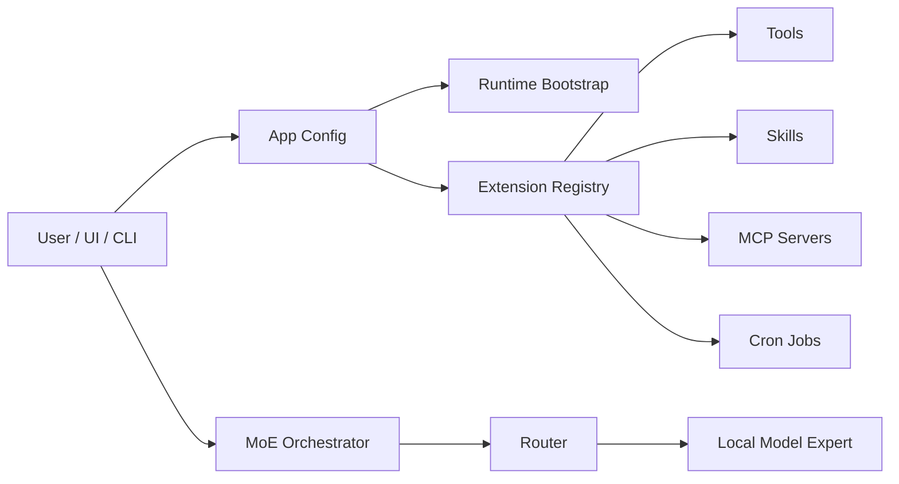

# Agent Runtime

myMoE is structured as a local model control plane plus a system-level MoE harness.

## Components



## Extension Surfaces

- `configs/tools.json`: typed tool inventory with risk class and side-effect metadata.
- `configs/mcp.json`: MCP server declarations, disabled by default until configured.
- `configs/cron.json`: app-managed recurring jobs.
- `skills/*/SKILL.md`: portable skill instructions with progressive disclosure.
- `plugins/*/plugin.json`: plugin manifests that can reference skills, tools, MCP servers, and cron jobs.

## Extension Execution Matrix

| Surface | Runtime behavior | Safety policy | Entry points |
| --- | --- | --- | --- |
| `memory.search` | Searches the local memory store. | Read-only, no path override through the web API. | CLI `--run-tool`, web `/api/tools/run`, Advanced Tools panel. |
| `memory.maintenance` | Reports local memory totals, active temporal records, pending future records, and expired records. | Read-only; no deletion or path override through the web API. | CLI `--run-tool`, web `/api/tools/run`, web `/api/memory/maintenance`, Advanced Memory panel, cron. |
| `memory.prune_expired` | Deletes only records whose `valid_until` timestamp is expired. | Requires `confirm=true` from tools/API and `confirm_writes=true` for cron; future `valid_from` records are preserved. | CLI `--run-tool`, web `/api/tools/run`, web `/api/memory/prune-expired`, Advanced Memory panel, optional cron. |
| `memory.forget` | Deletes one memory record by id or all chunks for one imported knowledge document id. | Requires `confirm=true`; deletes only from `<runtime.work_dir>/memory.jsonl`; no arbitrary path input. | CLI `--run-tool`, web `/api/tools/run`, web `DELETE /api/memory/<id>`, web `DELETE /api/knowledge/<id>`, Advanced Memory and Knowledge panels. |
| Web memory API | Saves, searches, and guard-deletes local memory records. | Writes and deletes only in `<runtime.work_dir>/memory.jsonl`; delete requires `confirm=true`; no arbitrary path input. | Web `/api/memory`, Advanced Memory panel. |
| `knowledge.ingest` | Chunks pasted local notes or documentation into knowledge records in the local memory store. | Requires `confirm=true`; writes only to `<runtime.work_dir>/memory.jsonl`; does not read arbitrary local file paths. | CLI `--run-tool`, web `/api/tools/run`, web `/api/knowledge`, Advanced Knowledge panel. |
| `data.export` | Returns a portable JSON backup containing local chat sessions and memory records. | Requires `confirm=true` because the response contains private user content; reads only `<runtime.work_dir>/chats.json` and `<runtime.work_dir>/memory.jsonl`. | CLI `--run-tool`, web `/api/tools/run`, web `/api/data/export`, Advanced Local Data panel. |
| `data.import` | Restores a portable local data backup into chat and memory stores with `merge` or `replace` mode. | Requires `confirm=true`; writes only `<runtime.work_dir>/chats.json` and `<runtime.work_dir>/memory.jsonl`; no arbitrary path input. | CLI `--run-tool`, web `/api/tools/run`, web `/api/data/import`, Advanced Local Data panel. |
| Audit Trail | Records sensitive host-side actions such as local data export/import, setup runs, model process changes, tool calls, plugin creation, and memory or knowledge deletion. | Writes metadata only to `<runtime.work_dir>/audit.jsonl`; it does not copy chat transcripts or memory text. | Web `/api/audit`, Advanced Audit Trail panel. |
| `context.compact` | Builds a compaction prompt and, by default, asks the configured local model to summarize it. | Compute-only; uses the configured MoE expert and does not call cloud APIs. | CLI `--run-tool`, web `/api/tools/run`, Advanced Tools panel. |
| `extension.audit` | Validates the active extension registry and returns structured plugin reference issues. | Read-only; no filesystem writes or process execution. | CLI `--run-tool`, web `/api/tools/run`, web `/api/extensions/audit`, Advanced Extensions panel, cron. |
| Extension Studio | Provides guided MCP server and cron job presets, then writes validated registry entries. | Template discovery is read-only; writes require confirmation and use the same registry paths and validators as `extension.configure`; the web registry and cron runner refresh immediately. | Web `/api/extensions/templates`, web `/api/extensions/configure`, Advanced Extensions panel. |
| `extension.configure` | Adds, updates, or removes MCP server and cron job registry entries from JSON payloads. | Requires `confirm=true`; writes only to the MCP and cron registry paths from the active app config; validates entries before writing; refreshes the running web registry and cron runner. | CLI `--run-tool`, web `/api/tools/run`, Advanced Tools panel. |
| System Doctor | Aggregates setup readiness, runtime health, active-profile hardware fit, model process state, extension audit, and cron state into one readiness report. | Read-only; probes local configured endpoints only. Hardware fit is advisory except profiles marked too large, which fail the required check. | CLI `--doctor`, web `/api/doctor`, Advanced System Doctor panel. |
| Performance Report | Exposes the latest benchmark decision as a sanitized runtime status. | Read-only; never starts benchmarks or model downloads and excludes benchmark response excerpts. | CLI `--performance-report`, web `/api/performance`, web `/api/performance/report.md`, Advanced Performance panel. |
| Support Bundle | Exports a privacy-safe diagnostic bundle for issue reports or handoff. | Read-only; excludes chat transcripts, memory records, environment variables, secrets, benchmark response excerpts, and log contents. | CLI `--support-bundle`, web `/api/support-bundle`, web `/api/support-bundle/download.json`, Advanced System Doctor panel. |
| Streaming generation | Streams local model output as server-sent events and persists the exchange only after the final response is available. | Uses the same routing, context, provider, and chat-store contracts as non-streaming generation; hides reasoning-channel content before emitting visible text. | Web `/api/generate/stream`, chat UI with `/api/generate` fallback. |
| Runtime setup | Runs configured install commands and model downloads from the runtime plan. | Requires explicit confirmation; executes only app-generated commands, never arbitrary user input. | CLI `--prepare-runtime`, web `/api/setup/run`, Advanced Setup panel. |
| Runtime profile discovery | Lists runnable local model config profiles, setup readiness summaries, hardware fit, and copyable launch hints. | Read-only; does not switch profiles, start processes, download models, or edit config files. Hardware fit is advisory and based on detected RAM plus configured candidate manifests. Generated commands are labeled with side effects and must be copied or run explicitly by the operator. | Web `/api/config/profiles`, Advanced Profiles panel. |
| Model process manager | Starts configured local model server commands and tracks processes started by the web server. | Requires explicit confirmation; skips already reachable endpoints; stops only managed child processes. | CLI `--models-status`, web `/api/models/processes`, `/api/models/start`, `/api/models/stop`, Advanced Runtime panel. |
| Model log diagnostics | Reads bounded tails from configured model server log files. | Read-only; callers cannot pass arbitrary paths; secret-looking tokens, bearer values, API keys, passwords, and secrets are redacted before output. | CLI `--models-logs`, web `/api/models/logs`, Advanced Runtime Model Logs panel. |
| `plugin.create` | Scaffolds a local plugin manifest and plugin-local `SKILL.md`. | Requires `confirm=true` because it writes local files. | CLI `--run-tool`, web `/api/tools/run`, web `/api/plugins`, Advanced Plugin Studio. |
| `mcp.search_capabilities` | Returns declared MCP servers and capability metadata. | Read-only discovery; it does not launch MCP processes. | CLI `--run-tool`, web `/api/tools/run`, Advanced Tools panel. |
| `mcp.list_tools` | Starts an enabled stdio MCP server, performs the MCP `initialize` handshake, and calls `tools/list`. | Requires `app.permissions.allow_process_execution=true` and `confirm_process_execution=true`; it lists tools only and does not call them. | CLI `--run-tool`, web `/api/tools/run`, Advanced Tools panel. |
| `mcp.call_tool` | Starts an enabled stdio MCP server and calls `tools/call` for a configured tool. | Requires app process permission, process confirmation, tool-call confirmation, and the tool name in the server `allowed_tools` list. | CLI `--run-tool`, web `/api/tools/run`, Advanced Tools panel. |
| Cron jobs | Runs due allowlisted actions such as memory maintenance, extension audit, and router distillation. The web process can auto-run safe jobs in the background. | `write_local` jobs require `confirm_writes=true`; dry runs never persist state; background auto-run skips write-risk jobs unless configured otherwise. | CLI `--cron-status`, `--run-cron`, web `/api/cron`, Advanced Cron panel. |
| MCP servers | Parsed from config and exposed for discovery; enabled stdio servers can be inspected for tool metadata. | Disabled by default; process startup requires both app policy and per-call confirmation. | Extension registry, `mcp.search_capabilities`, and `mcp.list_tools`. |
| Plugins | Discovered from manifests and scaffolded locally. Plugin-local `SKILL.md` files are loaded into the skill registry. | Plugin references are metadata until a tool/skill/MCP/cron entry is configured and allowlisted. | Extension registry, `plugin.create`, and Advanced Plugin Studio. |

## Permission Policy

The app config defaults to:

- local writes: approval-required,
- connector installation: approval-required,
- external communication: draft-only,
- process execution: disabled in the model-facing policy.

The current implementation discovers and reports these surfaces. Cron jobs use a local allowlisted runner for supported actions such as `memory.maintenance`, `router.distill`, and `extension.audit`. Execution of high-risk tools is intentionally not exposed as a broad `execute_anything` interface.

Enabled tools are also executed through a local allowlist in `src/local_moe/tool_runner.py`. The runner maps configured names to concrete Python functions and rejects arbitrary commands. Write-local operations require explicit confirmation in the tool payload or cron request.

Local knowledge import is intentionally paste/API based. `knowledge.ingest` chunks caller-provided text, stores it as `knowledge` records with document id, title, and chunk metadata, and reuses the existing scoped memory retrieval path. `memory.forget` and the guarded web DELETE endpoints provide local data removal without exposing arbitrary filesystem access. This gives the app a local RAG layer without granting the browser broad filesystem read permission.

Local data backup lives in `src/local_moe/data_bundle.py`. It intentionally differs from the privacy-safe support bundle: `data.export` includes chat transcripts and memory records for migration or recovery, so it requires confirmation and marks the bundle as containing user content. `data.import` validates the schema, then merges or replaces only the configured runtime chat and memory stores.

Audit trail logging lives in `src/local_moe/audit.py`. The web host appends JSONL events for sensitive actions, exposes a filtered recent-event view through `/api/audit`, and supports guarded retention through `/api/audit/prune`. Pruning keeps the latest configured number of events, requires confirmation, and records its own `audit.prune` event. Audit metadata is deliberately operational: action, status, risk class, subject id, counts, and short error messages. It does not store prompt text, chat transcript text, memory text, environment variables, or model log bodies.

Guarded self-configuration is exposed through Extension Studio and the lower-level `extension.configure` tool. Extension Studio provides read-only starter templates for common local filesystem MCP, custom stdio MCP, startup audit, memory maintenance, and router distillation entries. Saving or removing an entry uses `/api/extensions/configure`, requires confirmation, writes only to `app.extensions.mcp_config` or `app.extensions.cron_config`, validates the entry with the same parser used by startup, reloads the extension registry, and updates the web process cron runner. The JSON tool path remains available through `/api/tools/run` and CLI `--run-tool` for automation.

Plugin scaffolding is exposed through `plugin.create` and web `/api/plugins`. The scaffold creates `plugin.json` plus a plugin-local `SKILL.md`, then refreshes and audits the extension registry so the new plugin and skill are visible without restarting the web server.

Manual registry auditing is exposed through `extension.audit` and web `/api/extensions/audit`. It reuses the same validator as the background cron job and reports missing tool, skill, MCP server, cron job, or risk-class references as structured issues.

System Doctor lives in `src/local_moe/doctor.py`. It does not introduce a new policy engine; it composes existing readiness contracts and returns normalized `pass`, `warn`, and `fail` checks with operator recommendations. The Doctor includes the same active-profile hardware fit used by runtime profile discovery: `recommended`, `fits`, and `compatible` pass; `stretch` and `unknown` warn; `too_large` fails as a required readiness check.

Support bundle generation lives in `src/local_moe/support_bundle.py`. The bundle is intentionally metadata-only: it includes the Doctor report, quality gate status, hardware profile, runtime file paths, and model log paths, but never includes chat content, memory content, environment variables, or log bodies.

Performance report generation lives in `src/local_moe/performance_report.py`. It reads `configs/model-benchmark.json` plus the latest benchmark artifacts, sanitizes away prompt response excerpts, and exposes only model decisions, score, latency, throughput, memory, load-time, and coverage status.

MCP stdio integration lives in `src/local_moe/mcp_client.py`. It follows MCP JSON-RPC lifecycle basics: `initialize`, `notifications/initialized`, then `tools/list` or `tools/call`. Calls are intentionally narrow: myMoE only invokes tools listed in the server-level `allowed_tools` configuration.

The default `configs/app.json` keeps `allow_process_execution=false`, so `mcp.list_tools` is blocked even when a user sends `confirm_process_execution=true`. To inspect enabled MCP servers, use or adapt `configs/app.mcp-enabled.local.example.json`, keep only trusted MCP server commands enabled, and run the tool manually from CLI or Advanced.

On the tested machine, the example filesystem MCP server starts through `npx -y @modelcontextprotocol/server-filesystem .` and returns 14 tools from `tools/list`. That server is classified as `write_local` because its advertised tools include file-writing and file-editing operations. The example allowlist contains read-oriented tools such as `list_allowed_directories`, `list_directory`, `directory_tree`, `get_file_info`, `search_files`, and `read_text_file`.

Cron schedules are evaluated by the local Python runner. A `startup` schedule means the job is due the first time the scheduler is run for the current state file. CLI and API calls can still run jobs manually, and the web server starts a cross-platform in-process background runner when `runtime.cron_auto_run=true`.

The background runner polls every `runtime.cron_poll_seconds` seconds. With the default `runtime.cron_confirm_writes=false`, it auto-runs only jobs whose risk class does not require write confirmation, for example `extension.audit` and read-only `memory.maintenance`. Write-local jobs such as `memory.prune_expired` and `router.distill` remain manual-only unless `runtime.cron_confirm_writes=true` is set by the operator.

The Advanced Cron panel and `/api/cron` expose the automatic runner state: enabled/running flags, policy, auto-runnable job IDs, manual-only job IDs, due jobs, last run time, and the last run summary. This keeps unattended maintenance observable without introducing OS-specific launchd, systemd, or Task Scheduler services.

The `extension.audit` cron action validates the active registry: plugin references to tools, skills, MCP servers, cron jobs, and permission risk classes are reported as structured issues.

## Local Model Requirement

The user-facing default is `configs/moe.live.general-mlx.example.json`. Public configs are live local-model profiles or templates for live local-model profiles; synthetic providers are confined to automated test fixtures.

Runtime profile discovery lives in `src/local_moe/config_profiles.py`. It scans runnable `moe.*.json` and `single.*.json` config files, includes the active config even when it is outside `configs/`, and reuses setup readiness checks to summarize whether model assets are cached, missing, runtime-dependent, or local-file based. It also reports hardware fit by comparing each profile's resident experts with the detected machine profile and the configurable model candidate manifests. When a model is not in the manifests, it falls back to conservative model-name memory heuristics and marks that rationale in the payload. It also generates copyable launch hints for setup inspection, runtime preparation, model startup, UI startup, and interactive CLI usage. It intentionally does not hot-swap the running MoE instance or execute any generated command.

The runtime planner reads each expert's `params.runtime_backend`. MLX experts generate `mlx_lm.server` commands, GGUF experts generate `llama-server -hf ...` commands, and mixed configs are represented as mixed runtime plans instead of hardcoding one global backend.

Setup readiness is exposed through CLI `--setup` and web `/api/setup`. It is side-effect free: the app reports the bootstrap command, runtime plan, model cache path, and model asset status without downloading or starting models. Hugging Face profiles inspect the local cache, local GGUF profiles validate file existence, and Ollama profiles surface the required pull command/runtime dependency.

Runtime preparation is exposed separately through CLI `--prepare-runtime` and web `/api/setup/run`. Preview mode has no side effects. Installs and model downloads require explicit confirmation, then execute only the install commands and model download requests generated from the active config.

Model process management is exposed through `/api/models/processes`, `/api/models/start`, and `/api/models/stop`. The manager uses the same runtime plan as the bootstrap output, so it cannot run arbitrary commands supplied by a browser request. Start actions skip an expert when its endpoint is already reachable, which prevents duplicate model servers on the same port. Stop actions terminate only child processes launched by the current web process.

Model log diagnostics are exposed through CLI `--models-logs` and web `/api/models/logs`. The reader only opens log paths generated by the runtime plan, limits byte and line counts, and redacts secret-looking values before returning text. This gives operators enough evidence to debug missing models, artifact errors, or server startup failures without adding log bodies to the support bundle.

The web API exposes `/api/health` to probe configured expert endpoints before generation. OpenAI-compatible experts are checked through `/v1/models` or `/health`; non-HTTP test providers are reported as skipped. The Advanced drawer displays the same status and latency metadata.

Chat continuation uses the configured context policy profile from `configs/context-policy.json`. The web API builds a `ContextBundle`, retrieves matching default-scope memories, truncates recent turns to budget, and returns context telemetry with each generation so compaction pressure is observable before quality degrades. Saved chats can be compacted through `POST /api/chats/<session-id>/compact`; the local compaction expert writes a durable summary that is reused in later prompts.

Routing and generation prompts are separated: the router sees the current user request, while the selected local expert receives the context-enriched prompt. This prevents a relevant memory about coding, architecture, or translation from accidentally changing the route for an unrelated current request.

Streaming generation is exposed through `POST /api/generate/stream`. It emits `route`, `content`, `final`, and `error` server-sent events. The OpenAI-compatible provider sends `stream=true` to local model servers and normalizes SSE chunks into visible content updates. Raw thinking/channel markers are stripped from the accumulated content before each visible update, and the chat exchange is persisted only when the final event is produced.

## Routing Policy

The live general profile uses distilled routing. It combines expert base weights, explicit rules, local semantic route examples, and a local centroid classifier artifact trained from route labels. The semantic and distilled matchers are intentionally lightweight: they use normalized character n-grams, so they are cross platform and do not require a third model server.

The heavy general model is not used as the default request classifier. That model is reserved for actual general-purpose answers, while routing stays cheap enough to run before every request. A stronger teacher model can still be used offline to label route datasets for later distillation.

## Multilingual Policy

The default provider system message instructs the model to reply in the user's language unless the user asks otherwise. The app config uses `language.mode = auto` and documents supported language hints.

Actual multilingual quality depends on the selected model. Qwen3 30B-A3B 2507 is preferred partly because its public model description emphasizes broad multilingual and instruction-following capability.

Routing language coverage depends on route examples and eval coverage. The current live profile includes routing examples and eval cases for English, Italian, French, Spanish, German, Portuguese, Dutch, Polish, Arabic, Hindi, Japanese, Korean, and Chinese intent families. Additional languages should be added by configuration plus matching eval cases, or by swapping the semantic matcher for a local multilingual embedding backend.

The application UI and documentation are written in English. Model responses follow the user prompt language and the provider system instruction; this keeps the product surface consistent while still allowing multilingual interaction.

## Gemma 4 E4B Runtime Note

Gemma 4 E4B is supported through `configs/moe.live.gemma-e4b-mlx.example.json` and the pinned `.[mlx]` dependency profile. The newer MLX package set tested during development reproduced an upstream artifact/runtime mismatch, so the stable profile is deliberately pinned until the upstream issue is resolved.

See `docs/gemma-e4b-runtime.md` for the exact versions, commands, and benchmark result.

## Thinking Policy

Experts can declare:

```json
"supports_thinking": true,
"thinking_policy": "auto"
```

For supported models, `auto` enables thinking only for complex prompts and strips raw thinking/channel tokens from the returned answer. Qwen3 30B-A3B Instruct 2507 remains configured as non-thinking because its public model card says that release supports only non-thinking mode.
