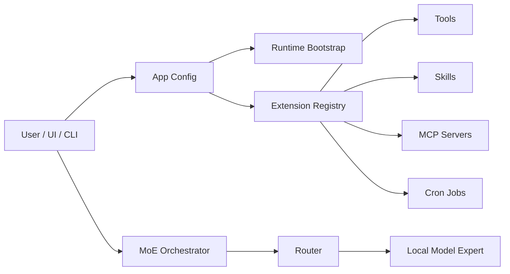

# Agent Runtime

myMoE is structured as a local model control plane plus a system-level MoE harness.

## Components



## Extension Surfaces

- `configs/tools.json`: typed tool inventory with risk class and side-effect metadata.
- `configs/mcp.json`: MCP server declarations, disabled by default until configured.
- `configs/cron.json`: app-managed recurring jobs.
- `skills/*/SKILL.md`: portable skill instructions with progressive disclosure.
- `plugins/*/plugin.json`: plugin manifests that can reference skills, tools, MCP servers, and cron jobs.

## Extension Execution Matrix

| Surface | Runtime behavior | Safety policy | Entry points |
| --- | --- | --- | --- |
| `memory.search` | Searches the local append-only memory store. | Read-only, no path override through the web API. | CLI `--run-tool`, web `/api/tools/run`, Advanced Tools panel. |
| Web memory API | Saves and searches append-only local memory records. | Writes only to `<runtime.work_dir>/memory.jsonl`; no arbitrary path input. | Web `/api/memory`, Advanced Memory panel. |
| `context.compact` | Builds a compaction prompt and, by default, asks the configured local model to summarize it. | Compute-only; uses the configured MoE expert and does not call cloud APIs. | CLI `--run-tool`, web `/api/tools/run`, Advanced Tools panel. |
| `plugin.create` | Scaffolds a local plugin manifest and `SKILL.md`. | Requires `confirm=true` because it writes local files. | CLI `--run-tool`, web `/api/tools/run`, Advanced Tools panel. |
| `mcp.search_capabilities` | Returns declared MCP servers and capability metadata. | Read-only discovery; it does not launch MCP processes. | CLI `--run-tool`, web `/api/tools/run`, Advanced Tools panel. |
| `mcp.list_tools` | Starts an enabled stdio MCP server, performs the MCP `initialize` handshake, and calls `tools/list`. | Requires `app.permissions.allow_process_execution=true` and `confirm_process_execution=true`; it lists tools only and does not call them. | CLI `--run-tool`, web `/api/tools/run`, Advanced Tools panel. |
| `mcp.call_tool` | Starts an enabled stdio MCP server and calls `tools/call` for a configured tool. | Requires app process permission, process confirmation, tool-call confirmation, and the tool name in the server `allowed_tools` list. | CLI `--run-tool`, web `/api/tools/run`, Advanced Tools panel. |
| Cron jobs | Runs due allowlisted actions such as memory maintenance, extension audit, and router distillation. | `write_local` jobs require `confirm_writes=true`; dry runs never persist state. | CLI `--cron-status`, `--run-cron`, web `/api/cron`, Advanced Cron panel. |
| MCP servers | Parsed from config and exposed for discovery; enabled stdio servers can be inspected for tool metadata. | Disabled by default; process startup requires both app policy and per-call confirmation. | Extension registry, `mcp.search_capabilities`, and `mcp.list_tools`. |
| Plugins | Discovered from manifests and scaffolded locally. | Plugin references are metadata until a tool/skill/MCP/cron entry is configured and allowlisted. | Extension registry and `plugin.create`. |

## Permission Policy

The app config defaults to:

- local writes: approval-required,
- connector installation: approval-required,
- external communication: draft-only,
- process execution: disabled in the model-facing policy.

The current implementation discovers and reports these surfaces. Cron jobs use a local allowlisted runner for supported actions such as `memory.maintenance`, `router.distill`, and `extension.audit`. Execution of high-risk tools is intentionally not exposed as a broad `execute_anything` interface.

Enabled tools are also executed through a local allowlist in `src/local_moe/tool_runner.py`. The runner maps configured names to concrete Python functions and rejects arbitrary commands. Write-local operations require explicit confirmation in the tool payload or cron request.

MCP stdio integration lives in `src/local_moe/mcp_client.py`. It follows MCP JSON-RPC lifecycle basics: `initialize`, `notifications/initialized`, then `tools/list` or `tools/call`. Calls are intentionally narrow: myMoE only invokes tools listed in the server-level `allowed_tools` configuration.

The default `configs/app.json` keeps `allow_process_execution=false`, so `mcp.list_tools` is blocked even when a user sends `confirm_process_execution=true`. To inspect enabled MCP servers, use or adapt `configs/app.mcp-enabled.local.example.json`, keep only trusted MCP server commands enabled, and run the tool manually from CLI or Advanced.

On the tested machine, the example filesystem MCP server starts through `npx -y @modelcontextprotocol/server-filesystem .` and returns 14 tools from `tools/list`. That server is classified as `write_local` because its advertised tools include file-writing and file-editing operations. The example allowlist contains read-oriented tools such as `list_allowed_directories`, `list_directory`, `directory_tree`, `get_file_info`, `search_files`, and `read_text_file`.

Cron schedules are evaluated by the local runner, not by a background daemon. A `startup` schedule means the job is due the first time the scheduler is run for the current state file. This makes cron behavior cross-platform and testable from CLI, API, or UI; an OS-level service can call the same CLI if unattended background execution is needed later.

The `extension.audit` cron action validates the active registry: plugin references to tools, skills, MCP servers, cron jobs, and permission risk classes are reported as structured issues.

## Local Model Requirement

The user-facing default is `configs/moe.live.general-mlx.example.json`. Public configs are live local-model profiles or templates for live local-model profiles; synthetic providers are confined to automated test fixtures.

The runtime planner reads each expert's `params.runtime_backend`. MLX experts generate `mlx_lm.server` commands, GGUF experts generate `llama-server -hf ...` commands, and mixed configs are represented as mixed runtime plans instead of hardcoding one global backend.

Setup readiness is exposed through CLI `--setup` and web `/api/setup`. It is side-effect free: the app reports the bootstrap command, runtime plan, model cache path, and model asset status without downloading or starting models. Hugging Face profiles inspect the local cache, local GGUF profiles validate file existence, and Ollama profiles surface the required pull command/runtime dependency.

The web API exposes `/api/health` to probe configured expert endpoints before generation. OpenAI-compatible experts are checked through `/v1/models` or `/health`; non-HTTP test providers are reported as skipped. The Advanced drawer displays the same status and latency metadata.

Chat continuation uses the configured context policy profile from `configs/context-policy.json`. The web API builds a `ContextBundle`, retrieves matching default-scope memories, truncates recent turns to budget, and returns context telemetry with each generation so compaction pressure is observable before quality degrades. Saved chats can be compacted through `POST /api/chats/<session-id>/compact`; the local compaction expert writes a durable summary that is reused in later prompts.

Routing and generation prompts are separated: the router sees the current user request, while the selected local expert receives the context-enriched prompt. This prevents a relevant memory about coding, architecture, or translation from accidentally changing the route for an unrelated current request.

## Routing Policy

The live general profile uses distilled routing. It combines expert base weights, explicit rules, local semantic route examples, and a local centroid classifier artifact trained from route labels. The semantic and distilled matchers are intentionally lightweight: they use normalized character n-grams, so they are cross platform and do not require a third model server.

The heavy general model is not used as the default request classifier. That model is reserved for actual general-purpose answers, while routing stays cheap enough to run before every request. A stronger teacher model can still be used offline to label route datasets for later distillation.

## Multilingual Policy

The default provider system message instructs the model to reply in the user's language unless the user asks otherwise. The app config uses `language.mode = auto` and documents supported language hints.

Actual multilingual quality depends on the selected model. Qwen3 30B-A3B 2507 is preferred partly because its public model description emphasizes broad multilingual and instruction-following capability.

Routing language coverage depends on route examples and eval coverage. The current live profile includes routing examples for English, Italian, French, Spanish, German, and Portuguese intent families. Additional languages should be added by configuration plus matching eval cases, or by swapping the semantic matcher for a local multilingual embedding backend.

The application UI and documentation are written in English. Model responses follow the user prompt language and the provider system instruction; this keeps the product surface consistent while still allowing multilingual interaction.

## Gemma 4 E4B Runtime Note

Gemma 4 E4B is supported through `configs/moe.live.gemma-e4b-mlx.example.json` and the pinned `.[mlx]` dependency profile. The newer MLX package set tested during development reproduced an upstream artifact/runtime mismatch, so the stable profile is deliberately pinned until the upstream issue is resolved.

See `docs/gemma-e4b-runtime.md` for the exact versions, commands, and benchmark result.

## Thinking Policy

Experts can declare:

```json
"supports_thinking": true,
"thinking_policy": "auto"
```

For supported models, `auto` enables thinking only for complex prompts and strips raw thinking/channel tokens from the returned answer. Qwen3 30B-A3B Instruct 2507 remains configured as non-thinking because its public model card says that release supports only non-thinking mode.
