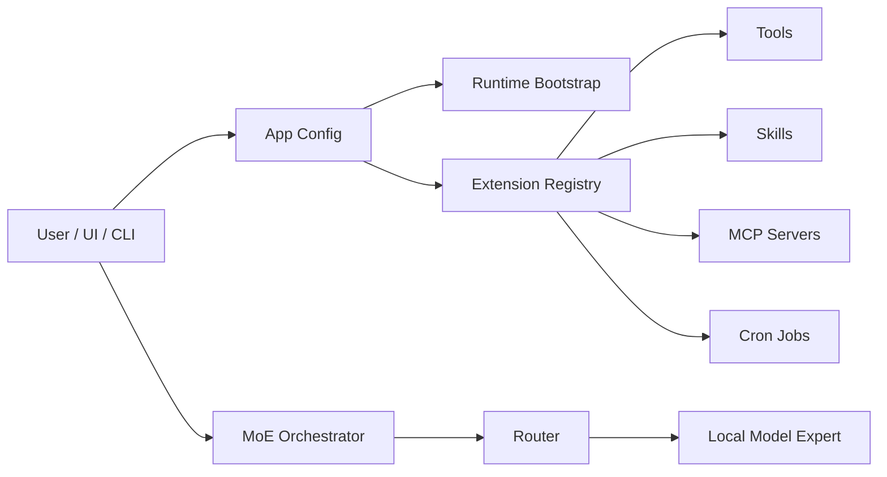

# Agent Runtime

myMoE is structured as a local model control plane plus a system-level MoE harness.

## Components



## Extension Surfaces

- `configs/tools.json`: typed tool inventory with risk class and side-effect metadata.
- `configs/mcp.json`: MCP server declarations, disabled by default until configured.
- `configs/cron.json`: app-managed recurring jobs.
- `skills/*/SKILL.md`: portable skill instructions with progressive disclosure.
- `plugins/*/plugin.json`: plugin manifests that can reference skills, tools, MCP servers, and cron jobs.

## Permission Policy

The app config defaults to:

- local writes: approval-required,
- connector installation: approval-required,
- external communication: draft-only,
- process execution: disabled in the model-facing policy.

The current implementation discovers and reports these surfaces. Execution of high-risk tools is intentionally not exposed as a broad `execute_anything` interface.

## Local Model Requirement

The user-facing default is `configs/moe.live.general-mlx.example.json`. Public configs are live local-model profiles or templates for live local-model profiles; synthetic providers are confined to automated test fixtures.

The runtime planner reads each expert's `params.runtime_backend`. MLX experts generate `mlx_lm.server` commands, GGUF experts generate `llama-server -hf ...` commands, and mixed configs are represented as mixed runtime plans instead of hardcoding one global backend.

## Multilingual Policy

The default provider system message instructs the model to reply in the user's language unless the user asks otherwise. The app config uses `language.mode = auto` and documents supported language hints.

Actual multilingual quality depends on the selected model. Qwen3 30B-A3B 2507 is preferred partly because its public model description emphasizes broad multilingual and instruction-following capability.

The application UI and documentation are written in English. Model responses follow the user prompt language and the provider system instruction; this keeps the product surface consistent while still allowing multilingual interaction.

## Gemma 4 E4B Runtime Note

Gemma 4 E4B is supported through `configs/moe.live.gemma-e4b-mlx.example.json` and the pinned `.[mlx]` dependency profile. The newer MLX package set tested during development reproduced an upstream artifact/runtime mismatch, so the stable profile is deliberately pinned until the upstream issue is resolved.

See `docs/gemma-e4b-runtime.md` for the exact versions, commands, and benchmark result.

## Thinking Policy

Experts can declare:

```json
"supports_thinking": true,
"thinking_policy": "auto"
```

For supported models, `auto` enables thinking only for complex prompts and strips raw thinking/channel tokens from the returned answer. Qwen3 30B-A3B Instruct 2507 remains configured as non-thinking because its public model card says that release supports only non-thinking mode.
