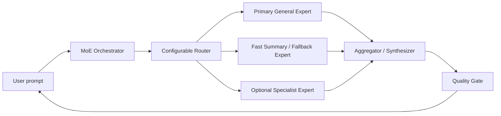

# Architecture

## Design Decision

Use a system-level MoE first, not a trained monolithic sparse transformer.

Reason: local hardware can run quantized local experts, but training or fine-tuning a true sparse MoE is much more expensive than routing among already-good local experts. This design keeps the runtime local while leaving room for later distillation.

The target product is general-purpose. Coding is only one route, not the default identity of the app.

## Components

## Core Contracts

- `MoEConfig`: immutable parsed configuration.
- `ExpertConfig`: provider id, endpoint, model id, generation params, weight.
- `RoutingRule`: configured keyword/weight mapping to expert ids.
- `Router`: pure deterministic scorer with rules and optional local semantic examples, no provider names in code.
- `Provider`: local inference boundary. Normal use is OpenAI-compatible HTTP against local model servers; synthetic providers are confined to deterministic test fixtures.
- `Orchestrator`: applies route, fallback, timeout, correlation id propagation.
- `Evaluator`: deterministic routing and behavior checks.

## Runtime Modes

### Mode 0: Deterministic Test Fixture

No model required. Validates config, router behavior, evaluator, provider contracts, and CLI in tests. This is not a user-facing application mode.

### Mode 1: Top-1 Resident General Expert

Route to one strong general local endpoint. This is the cheapest real baseline.

### Mode 2: MoE With One Heavy Resident Expert

Keep one heavy general model resident plus one small fast model for compaction/fallback. Cold-load specialists when their eval slice justifies it.

### Mode 3: Top-2 Expert Comparison

Call two experts in parallel and expose a deterministic disagreement report. More expensive, but useful for high-risk, ambiguous, or multimodal tasks. The current report compares lexical overlap, length delta, and expert-specific terms; it does not call another model to judge the answers.

### Mode 4: Distilled Router

Replace hand-written routing rules with a trained small classifier. The experts remain local.

### Mode 5: Distilled Student

If system-level MoE is too slow, distill common expert behavior into one smaller local model.

## Failure Modes

- Router examples overfit narrow phrasing and miss semantic intent outside the evaluated languages.
- Multiple experts increase latency linearly if called sequentially.
- Synthesis can hide a bad expert answer instead of exposing disagreement.
- Local context limits differ per model; routing must know each expert context budget.
- Model-specific chat templates can break answer quality if endpoints are not normalized.

## Validation Gates

1. Config loads and validates.
2. Router selects expected experts on known prompts.
3. Provider boundary preserves `correlation_id`.
4. Local endpoint smoke test returns valid text under timeout.
5. MoE beats single-model baseline on a small rubric before adding complexity.
