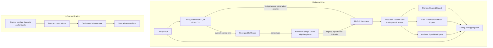

# Architecture

For a guided end-to-end explanation, start with [How myMoE works](how-it-works/README.md).

## Design Decision

Use a system-level MoE first, not a trained monolithic sparse transformer.

Reason: local hardware can run quantized local experts, but training or fine-tuning a true sparse MoE is much more expensive than routing among already-good local experts. This design keeps the runtime local by default, makes any broader execution boundary explicit, and leaves room for later distillation.

The target product is general-purpose. Coding is only one route, not the default identity of the app.

## Components

The quality gate is deliberately outside the online request path. `LocalMoE`
returns the configured aggregation result directly; tests, routing holdouts,
and answer-quality benchmarks make offline CI or release decisions.

## Core Contracts

- `MoEConfig`: immutable parsed configuration, including the execution policy.
- `ExpertConfig`: provider id, endpoint, model id, generation params, weight,
  declared transport, and declared execution scope.
- `RoutingRule`: configured keyword/weight mapping to expert ids.
- `Execution Scope Guard`: provider-neutral eligibility and fresh
  pre-invocation boundary. It defaults to `device_only`, filters ineligible
  candidates and fallbacks, prevents implicit scope widening, and reports
  `scope_blocked` when no target can satisfy policy.
- `Router`: deterministic scorer over guard-eligible experts, using rules and
  optional local semantic examples with no provider names in code.
- `Provider`: local inference boundary. Normal use is OpenAI-compatible HTTP against local model servers; synthetic providers are confined to deterministic test fixtures. Providers can expose streaming generation while preserving the same final result contract.
- `Orchestrator`: applies route, fallback, timeout, correlation id propagation, and optional progressive generation events.
- `Evaluator`: deterministic routing and behavior checks.
- `System Doctor`: read-only control-plane aggregator for setup readiness, endpoint health, active-profile hardware fit, storage capacity, model process reachability, extension audit, and cron state.
- `Startup Runbook`: guarded control-plane flow that previews readiness, prepares runtime assets, starts configured local model servers, and returns System Doctor evidence.
- `Support Bundle`: metadata-focused diagnostic export for issue reports and handoffs, including storage capacity summaries without local file contents. Review it before sharing because configured Git remotes and model base URLs are included.
- `Profile Recommender`: read-only control-plane scorer that chooses the best local runtime profile from setup readiness, hardware fit, general-purpose coverage, routing capability, and active/default tie-breaks.
- `Profile Preparation`: guarded setup runner entry point for explicit or recommended profiles before activation.
- `Profile Activation`: guarded write-local control-plane action that updates only the app default MoE profile and requires a restart to change the running instance.
- `Performance Report`: sanitized read-only benchmark decision surface for runtime, CLI, and support handoff.
- `Knowledge Import`: paste/API-based local RAG layer that chunks user-provided text into scoped memory records and supports guarded document deletion without granting browser filesystem access.
- `Local Data Bundle`: confirmed export/import path for user-owned chat sessions and memory records, scoped to the configured runtime work directory.
- `Audit Trail`: local JSONL metadata log for sensitive host-side actions, intentionally excluding chat and memory text.
- `Generation Run Log`: local JSONL metadata log for successful generations, intentionally excluding prompt and answer text while retaining route, model, latency, token, context, prompt-hash observations, and aggregate health summaries.
- `Agent Loop`: provider-neutral OpenAI-compatible model/tool/observation loop with strict local tool schemas, approval-gated side effects, bounded redacted observations, and metadata-only traces.
- `Quality Benchmark`: deterministic answer-quality comparison harness for single-general, routed top-1, and routed top-2 variants, with endpoint/model readiness checks and provenance-rich artifacts.

The scope policy is separate from model capability and semantic routing. A
high-scoring expert is still ineligible when its execution evidence cannot
satisfy the active policy. The complete contract and Mesh-LLM limitations are
documented in [Execution Scope Guard](execution-scopes.md).

## Runtime Modes

### Mode 0: Deterministic Test Fixture

No model required. Validates config, router behavior, evaluator, provider contracts, and CLI in tests. This is not a user-facing application mode.

### Mode 1: Top-1 Resident General Expert

Route to one strong general local endpoint. This is the cheapest real baseline.

### Mode 2: Resident Primary Plus Small Fallback

Keep Qwen3 4B resident as the default general model and Qwen3 1.7B resident as
the fast compaction/fallback model. Select Qwen3 30B through its isolated
quality-first profile instead of co-residing it with the default pair. Other
specialists remain explicit manual profiles; automatic cold-loading is not
implemented.

### Mode 3: Top-2 Expert Comparison

Call two experts in parallel and expose a deterministic disagreement report.
This is more expensive, but useful for high-risk or ambiguous text tasks. The
current request/provider contracts are text-only. The report compares lexical
overlap, length delta, and expert-specific terms; it does not call another model
to judge the answers.

### Mode 4: Distilled Router

Add a trained local classifier contribution to the existing base weights,
keyword rules, and optional semantic examples. The current `distilled` strategy
combines these signals; it does not silently replace the configured rules. The
experts remain local.

### Mode 5: Distilled Student

If system-level MoE is too slow, distill common expert behavior into one smaller local model.

## Comparable Tool Pattern

The closest local-first assistants usually share the same control-plane shape:

- Chat front end with switchable local or remote model providers.
- Knowledge/RAG layer for files, workspaces, or synced sources.
- Tool calling layer where the model proposes a tool call, the host executes it, then the result is returned to the model.
- Agent presets or workspaces that bind a model, instructions, tools, memory, and retrieval settings.
- Optional automations for scheduled prompts or maintenance jobs.

myMoE implements the local routing, memory, permission metadata, diagnostics,
manual tools, MCP control-plane, and a bounded model-proposed tool-call loop for
local OpenAI-compatible experts. It should still not be described as a
general-purpose autonomous agent platform: the loop is deliberately narrow,
approval-gated, schema-validated, and optimized for local evidence gathering.
The Execution Scope Guard now applies to normal web/CLI generation, streaming,
parallel comparison, fallbacks, and the agent runtime. The agent CLI's
whole-config loopback validation remains a defense-in-depth preflight for
`local_model_required`; it is no longer the only locality control.
Open WebUI and AnythingLLM already cover the broad assistant workspace. LM
Studio, Ollama, and llama.cpp cover model serving. The defensible myMoE layer is
the privacy-first, hardware-aware routing, tool-safety, and evidence plane above
those runtimes.

## Multilingual Behavior

The app can work across languages when the selected local model supports them, but this should be treated as an evaluated capability rather than a blanket guarantee.

The runtime uses a language-preserving policy:

- Keep UI and documentation in English for product consistency.
- Detect or infer the user's language from the prompt.
- Ask the selected model to answer in the user's language unless the user requests otherwise.
- Keep routing examples multilingual so task classification does not depend only on English keywords.
- Add eval cases per language before claiming support for that language.
- Prefer local multilingual embedding or classifier backends later if rule/character-ngram routing becomes too brittle.

This is why the primary general expert matters more than a coding specialist. A coder-only model may be excellent for Python and terminal tasks, but a general-purpose assistant needs stronger multilingual instruction following, summarization, planning, tool-use comprehension, and conversational behavior.

## Routing Cost Policy

Do not use the resident general model as the default request classifier.
Classification runs before every request, so it should be cheap, deterministic,
debuggable, and trainable. The resident general model should be reserved for
answer generation, synthesis, or ambiguous fallback.

The practical policy is:

- Use configured rules, semantic examples, and a distilled local classifier for normal routing.
- Use the small fallback model for compaction, lightweight classification experiments, and cheap retries.
- Route to the resident Qwen3 4B general expert when confidence or task
  complexity requires it. Selecting the isolated Qwen3 30B profile remains an
  explicit operator decision, not an automatic escalation.
- Use stronger teacher models offline to label routing datasets, then distill those labels into local artifacts.

## Failure Modes

- Router examples overfit narrow phrasing and miss semantic intent outside the evaluated languages.
- Multiple experts increase latency linearly if called sequentially.
- Concatenation is not synthesis; compare mode exposes only lexical disagreement.
- Local context limits differ per model; routing must know each expert context budget.
- Model-specific chat templates can break answer quality if endpoints are not normalized.

## Validation Gates

1. Config loads and validates.
2. Router selects expected experts on known prompts.
3. Scope policy filters ineligible candidates and fallbacks before scoring,
   blocks implicit scope widening, and rechecks evidence immediately before
   every provider invocation.
4. Provider boundary preserves `correlation_id`.
5. Streaming and non-streaming generation return the same persisted chat contract.
6. Streaming and non-streaming generation append metadata-only run records without leaking prompt or answer text.
7. Local endpoint smoke test returns valid text under timeout.
8. A leakage-free routing holdout passes before routing claims are published.
9. Doctor and environment diagnostics expose configured runtime storage status without creating missing directories.
10. Agent tool calls must use strict schemas, reject model-supplied confirmations
   or secrets, pause risky operations for external approval, and avoid storing
   prompt/tool-result content in traces.
11. Before claiming product advantage, routed top-1 must not regress against the
    single-general baseline while reporting latency, memory, and failure rate.
    Top-2 is diagnostic evidence and cannot rescue a top-1 regression. The
    historical 72-record Qwen3 4B + 1.7B run satisfied this gate: quality delta
    `0.0`, routed median latency ratio `0.6889`, and zero failures or
    truncation. Any response-contract change requires fresh live evidence before
    the release gate can return `release_ready: true` again.
