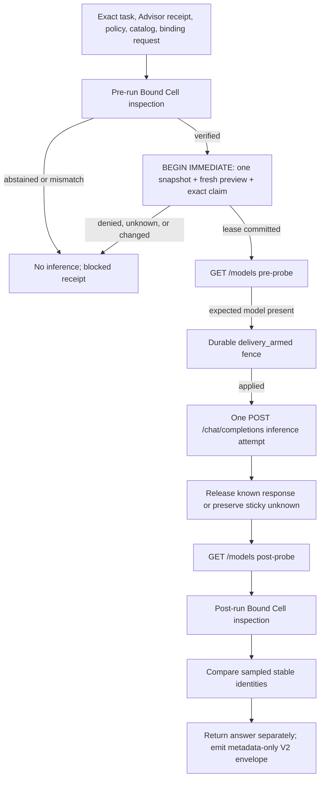

# Bound Cell Run v1

## In plain English

**Bound Cell Run is the smallest honest step from advice to useful local
execution.** It takes the exact cell recommended by the Adaptive Cell Advisor,
checks the recommendation again, fingerprints the declared local cell, sends
one compute-only inference request to that cell's already-running numeric
loopback endpoint, and checks the declared bindings again afterward. The full
endpoint sequence is two `GET /models` probes around one
`POST /chat/completions` inference attempt.

For example, if myMoE recommends one particular model, quantization, runtime,
harness, configuration, and hardware placement for a summarization task, Bound
Cell Run can use that exact configured endpoint once. It does not silently
choose another model, launch a server, use a tool, or turn the result into a
general claim that the model is correct.

The useful result is the model response. The audit result is a separate,
content-addressed, **metadata-only V2 evidence envelope**. It preserves the
`BoundCellRunReceipt` v1 unchanged and adds the cooperative resource claim,
admission, delivery-fence, and settlement receipts. It may contain hashes,
identifiers, timestamps, sizes, status, counters, and reason codes; it must not
contain the task text, model response, or raw lease token.

This document describes the implemented alpha v1 contract.

## Command workflow

First produce a recent Advisor receipt for one `compute_only` request with no
tool surfaces, as described in
[Adaptive Cell Advisor](adaptive-cell-advisor.md). Then prepare the same
`CellBindingInspectRequest` used by the
[Bound Cell Attestor](cell-runtime-binding.md).

Run:

```bash
mymoe cell-exec run \
  --receipt ./advisor-receipt.json \
  --binding-request ./cell-binding-request.json \
  --task-file ./task.txt \
  --catalog ./adaptive-cells.json \
  --evaluation-contract ./adaptive-evaluation-contract.json \
  --policy ./adaptive-execution-policy.json \
  --confirm \
  --receipt-out ./bound-cell-run-envelope.json \
  > ./answer.txt
```

`--task-stdin` is the mutually exclusive alternative to `--task-file`.
The task is read once within the existing bound and its exact bytes are used
for both the admission fingerprint and the single model invocation. The model
answer goes to standard output. `--receipt-out` creates a new private envelope
file and never overwrites an existing path. Keeping these channels separate is
important: redirecting the answer is an explicit caller choice, while the
evidence remains safe to inspect without becoming a transcript store.

Before any endpoint traffic, the CLI also creates an owner-only sibling recovery
journal. It records no task or answer body. After the runner returns, the full
metadata envelope is durably appended before canonical no-clobber publication.
The journal is removed only after that publication succeeds; if publication
loses a race or the process is interrupted, the retained
`.RECEIPT.mymoe-pending-*` JSONL file preserves either a conservative
unknown-delivery marker or the finalized envelope for recovery.

`--confirm` is the operator's explicit one-shot authority for this exact
invocation. Omitting it blocks before endpoint probing or inference. The flag
does not authorize a retry, another task, a later run, a lifecycle action, or a
tool call. A passing `mymoe cell-exec preview` receipt remains non-authorizing
and cannot be reused as a general execution capability.

## V1 workflow and invariants



Before network I/O, the runner must:

1. validate the explicit confirmation, bounded task input, receipt destination,
   and binding-request publication boundary;
2. resolve the configured target, run Bound Cell inspection, and require a
   current `verified` receipt;
3. bind its cell, passport declaration, runtime configuration, selected expert,
   adapter, and endpoint authority;
4. require the configured uncredentialed HTTP endpoint to use a literal numeric
   loopback IP and explicit port, such as `http://127.0.0.1:8101/v1` or an IPv6
   `[::1]` authority. `localhost`, credentials, redirects, proxy routing, query
   strings, fragments, and caller-provided endpoint overrides are rejected;
5. enter one SQLite `BEGIN IMMEDIATE` transaction, capture one fresh resource
   snapshot, strictly reload the source Advisor receipt, and repeat the preview
   against the exact task, catalog, evaluation contract, and policy; and
6. require the same selected `cell_id` and passport digest, `compute_only`, and
   zero tool surfaces, derive its `conservative_peak` claim, account every
   active participating claim and the applicable maximum safety reserve, and
   commit one `reserved` lease.

No file, configuration, or snapshot read occurs between the lease commit and
the first `GET /models`. If the exact configured model ID is present, the
runner durably changes the lease from `reserved` to `delivery_armed`; only that
applied transition permits exactly one OpenAI-compatible
`POST /chat/completions`. A known response releases the claim immediately. A
timeout, interruption, or crash whose delivery outcome is ambiguous keeps an
`unknown_blocking` fence with no automatic TTL. The runner then issues the
second `GET /models`. Thus a complete attempted path contains three HTTP
requests but only one inference. There is no retry, fallback, speculative call,
judge call, semantic cache lookup, alternate candidate, or hidden router call.

After the post-inference model probe, the runner repeats Bound Cell inspection
using the same bounded request and compares the stable declaration, artifact,
configuration, adapter, launch-plan, endpoint, and advertised-model-set
identities. Free memory and other volatile counters
are observations, not byte-for-byte postconditions: normal inference can change
them. A post-run mismatch cannot undo a completed call, so it produces an
`invalidated` result rather than a verified completion claim.

The unchanged v1 run receipt binds:

- the run-policy digest and final execution-preview digest, which in turn binds
  the checked Advisor request, catalog, evaluation contract, policy, selected
  passport, and fresh resource snapshot;
- the pre- and post-run binding-manifest and inspection-receipt digests;
- the selected cell, passport declaration, expert, pre/post configuration, and
  advertised-model-set identities;
- task digest and byte count, but not task bytes;
- start/end timestamps, elapsed milliseconds, delivery status, response digest,
  byte and character counts, but not response bytes;
- `endpoint_probe_requests: 2` and `invocation_attempts: 1` on a completed run;
- pre/post drift status and stable reason codes; and
- explicit `risk_class: compute_only`, no tool surfaces,
  `lifecycle_operations: 0`, `process_mutations: false`,
  `endpoint_process_identity_verified: false`, and
  `authorizes_future_execution: false` values.

`BoundCellRunEnvelopeV2` additionally binds the exact conservative claim and
the available admission, transition, and release receipts to that v1 digest.
It carries `cooperative_only: true`, `os_memory_reserved: false`, and
`runtime_managed: false`. A denied admission maps to the existing v1
`adaptive_admission_blocked` reason; the envelope retains the precise resource
or ownership reason without changing the v1 schema.

A response digest provides linkage, not truth. Short or predictable tasks and
answers may be dictionary-guessed from unsalted hashes, so receipts remain
sensitive local artifacts even though they are metadata-only.

## Architecture boundary

Bound Cell Run is an orchestration layer over existing contracts, not another
inference runtime or model router:

| Component | Responsibility | Not its responsibility |
| --- | --- | --- |
| Adaptive Cell Advisor | Select the best currently eligible configured cell from applicable evidence. | Start or invoke the selected cell. |
| Execution preview | Recheck exact task, lineage, policy, evidence, and live-resource admission immediately before use. | Grant reusable execution authority. |
| Cooperative Resource Lease | Serialize the final snapshot-bound preview and conservative memory claim among same-user, same-host participants, then fence delivery and preserve ambiguity. | Reserve RAM/VRAM in the operating system or manage a model runtime. |
| Bound Cell Attestor | Fingerprint declared model/runtime/harness/tool-contract files and configuration anchors. | Prove which process owns a port. |
| Bound Cell Run | Pre-inspect, acquire the exact cooperative claim, perform two model probes around one delivery-fenced inference attempt, settle the lease, then sample bindings again. | Manage or attest model residency, tools, agent loops, or arbitrary workflows. |
| Existing local runtime | Execute inference and return the response. | Establish myMoE evidence or receipt semantics. |

The implementation calls the existing Advisor preview and Bound Cell
inspection services directly rather than duplicate their validation logic.
Runtime-specific behavior belongs behind the existing versioned adapter
contract; adding another runtime shape requires another adapter, not relaxed
validation.

## Honest v1 limits

Version 1 deliberately does **not**:

- download, install, start, stop, load, unload, swap, pin, or evict a model;
- select a different cell after the fresh Advisor result;
- invoke MCP, browser, shell, filesystem, editor, or any other tool surface;
- execute an agent loop or more than one inference `POST`;
- contact a non-loopback host or use a cloud fallback;
- reserve, pin, or lock RAM, unified memory, or accelerator memory through the
  operating system; its claim is cooperative metadata only;
- store task or response bodies in its receipt;
- prove that a response is factually or semantically correct;
- prove that a benchmark producer or local receipt producer is trustworthy; or
- prove the identity of the resident process that answered the HTTP request.

That last boundary is fundamental. Bound Cell inspection fingerprints declared
files and configuration. It does not bind an operating-system process ID,
executable mapping, open socket, loaded dynamic libraries, environment, or
runtime memory image to those bytes. Another local process could occupy or
proxy the same port. A completed v1 receipt therefore means **one inference was
attempted through the exact sampled configuration boundary with no detected
pre/post static drift**, not “the hashed binary cryptographically proved that
it generated this answer.” The sampled `GET /models` responses show only that
an endpoint advertised the expected model before and after the inference; they
do not attest process identity or prove runtime/model residency.

Likewise, pre/post inspection reduces but cannot eliminate time-of-check versus
time-of-use risk. Files or processes could change during the request and be
restored before the post-check. Stronger process identity requires a future
runtime-side nonce/attestation protocol, OS process inspection, or a separately
trusted launcher.

## Threat model

V1 fails closed before invocation for malformed or oversized input,
duplicate JSON keys, invalid content digests, links or special files, path
escape, stale receipts, task mismatch, catalog/evaluation/policy drift,
different cell selection, missing identity evidence, non-loopback endpoints,
credentials in endpoint configuration, declared tools, non-compute risk,
insufficient cooperative capacity, unknown lease ownership, store corruption,
or schema/path replacement.

It also defends the receipt boundary against task/answer leakage,
overwrite and symlink attacks, input/output aliasing, partial publication, and
unbounded response bodies. Timeouts, disconnects, malformed upstream JSON, and
post-run inspection failures must preserve whether an invocation was attempted
or may have completed. An ambiguous armed attempt remains `unknown_blocking`;
it must never be reported as a clean pre-call block, released by a TTL, or
automatically retried.

V1 does not defend against a privileged attacker, a compromised Python/myMoE
process, kernel compromise, a malicious same-user service on the loopback
port, dishonest evidence producers, or side channels in the inference runtime.
HTTP loopback is a locality boundary, not remote attestation or authenticated
transport.

## Market boundary and originality

The surrounding market already solves much of local model serving, so myMoE
should reuse it rather than claim generic routing or lifecycle as novel:

| Project | Capability documented by the project | Boundary relevant here |
| --- | --- | --- |
| [Ollama](https://github.com/ollama/ollama/blob/main/docs/faq.mdx) | Model residency controls, parallel requests, queueing, and automatic unload when capacity is needed. | The client still names a model; it does not issue an exact-cell evidence and pre/post drift receipt. |
| [llama.cpp server](https://github.com/ggml-org/llama.cpp/blob/master/tools/server/README.md) | Multi-model router mode, dynamic load/unload, memory fitting, parallel slots, and continuous batching. | It is the inference/lifecycle layer, not a coding-harness and evidence admission boundary. |
| [llama-swap](https://github.com/mostlygeek/llama-swap/blob/main/docs/configuration.md) | Runtime-agnostic process swapping, TTL, concurrency matrices, and eviction costs. | Its declared scheduling matrix does not attest the complete model/runtime/harness/tool cell around one outcome. |
| [LocalAI distributed mode](https://localai.io/features/distributed-mode/index.html) and [intelligent routing](https://localai.io/features/middleware/index.html) | VRAM-aware placement, concurrent model workers, LRU eviction, backend installation, and prompt classification to candidate models. | It is a general serving and cluster-routing platform; Bound Cell Run is a narrow local execution-evidence contract. |
| [local-engine-router](https://github.com/rxxusp/local-engine-router) | Hardware-conscious local engine swapping plus task, residency, reliability, and swap-cost scoring. | This makes a generic “smart local router” non-original; it does not replace exact artifact/harness binding and post-call lineage. |
| [vLLM Semantic Router](https://github.com/vllm-project/semantic-router) | Task/complexity-based model, LoRA, and tool selection with routing observability. | It expects serving endpoints; it does not prove the identity or post-call drift of one local coding cell. |

These comparisons describe public project documentation as of 2026-07-22; they
are not comparative benchmarks or a formal patent/prior-art opinion.

The defensible contribution is therefore not “myMoE picks a local model.” It is
the narrow composition of:

1. evidence-scoped selection of a complete cell rather than a model name;
2. fresh fail-closed admission for the exact task and current host;
3. atomic cooperative accounting that prevents participating processes from
   double-counting the same observed free-memory budget;
4. bounded inspection of model, runtime, harness, tool-contract, configuration,
   and endpoint lineage;
5. one deliberately capability-poor, delivery-fenced execution;
6. pre/post drift evidence; and
7. a replayable metadata-only envelope that keeps the answer separate.

This is useful even before process attestation or semantic verification exists:
it turns a recommendation into one auditable local action without pretending
to be a general autonomous agent. Future work can add process-bound challenges,
independent task verifiers, resource reservation, or lifecycle adapters as new
versioned contracts. None of those stronger claims belongs in this alpha.

## Implemented contract checks

The v1 contract tests demonstrate that:

- every failing precondition causes zero model invocations;
- two competing processes with capacity for one produce exactly one acquired
  lease and one authorized delivery;
- one completed run causes exactly two bounded `GET /models` requests and one
  bounded `POST /chat/completions`, with only the POST counted as inference;
- tools, retries, redirects, proxies, lifecycle actions, and remote hosts cannot
  be enabled by CLI or configuration;
- task and answer bodies never enter the receipt or error output;
- pre/post static drift is detected and prevents a verified-completion claim;
- delivery is armed before the POST, known responses release before post-run
  checks, and ambiguous transport failures remain sticky and are never retried;
- an interruption is post-checked, receipted, durably published, and only then
  re-raised by the CLI; a final-publication race retains the finalized recovery
  journal;
- the v1 receipt remains byte/schema-compatible inside a strict V2 envelope,
  and all nested digests verify after round-trip serialization; and
- human output repeats the process-identity and semantic-correctness limits.
