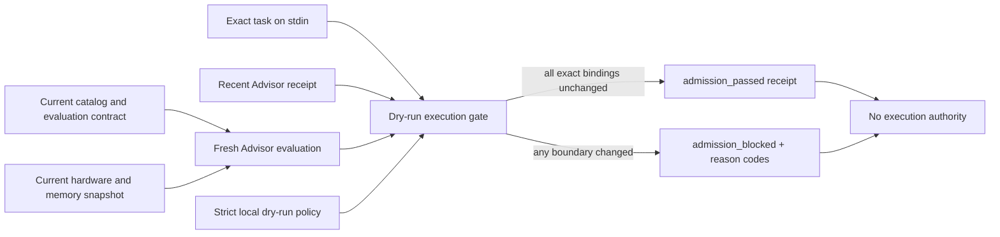

# Adaptive Cell Execution Gate

The Adaptive Cell Execution Gate answers one narrow question:

> Is the exact local setup recommended a moment ago still admissible now?

In plain terms, a recommendation can become stale before work begins. Memory
pressure can change, the catalog can be edited, evidence can expire, or the
task can differ by even one byte. `mymoe cell-exec preview` rechecks those
bindings and returns a content-addressed receipt. It still does **not** run the
model, reserve memory, call a tool, change configuration, or authorize a later
execution.

This first version is deliberately a dry-run admission preview. It creates the
verification boundary that a future, separately authorized executor could
consume without pretending that such an executor exists today.

## What It Checks



The gate verifies all of the following:

- the source Advisor receipt and every nested content digest are valid;
- the receipt is recent and is not dated in the future;
- the task fingerprint and character count still match;
- the request remains `compute_only` and declares no tool surface;
- the catalog and evaluation-contract digests have not changed;
- a fresh live-resource evaluation still recommends the same cell;
- the selected cell passport digest is unchanged.

Any failed check blocks the preview. Reason codes are sorted, stable machine
data; more than one can be present when several boundaries changed together.

## Five-Minute Workflow

Create the self-contained starter installed with myMoE:

```bash
mymoe advisor-init --out ./.mymoe-advisor
```

It now creates six private files on POSIX, including
`adaptive-execution-policy.json`. The checked-in policy permits only a receipt
up to 60 seconds old, `compute_only`, and zero tool surfaces.

Put the task in a private UTF-8 file, then ask the Advisor to write its
metadata-only receipt:

```bash
cd ./.mymoe-advisor
mymoe advisor \
  --catalog ./adaptive-cells.json \
  --task-file ./task.txt \
  --workload local-summary \
  --capability summarization \
  --risk-class compute_only \
  --context-tokens 4096 \
  --evaluation-contract ./adaptive-evaluation-contract.json \
  --goal balanced \
  --json \
  --out ./advisor-receipt.json
```

Immediately preview admission with the exact same task bytes:

```bash
mymoe cell-exec preview \
  --receipt ./advisor-receipt.json \
  --task-file ./task.txt \
  --catalog ./adaptive-cells.json \
  --evaluation-contract ./adaptive-evaluation-contract.json \
  --policy ./adaptive-execution-policy.json \
  --json
```

`--task-file` is the portable choice and guarantees that the Advisor and gate
read the same bytes on POSIX shells, PowerShell, and `cmd.exe`. For callers that
already control standard input, `--task-stdin` remains available and is
mutually exclusive with `--task-file`.

The zero-claim starter intentionally cannot produce a passing source
recommendation until a trusted local evidence producer qualifies a cell. With
the starter unchanged, the honest result is therefore blocked rather than a
simulated success.

Exit status is part of the interface:

| Exit | Meaning |
| --- | --- |
| `0` | The exact cell passed this fresh dry-run admission preview. |
| `1` | The invocation was valid, but one or more admission checks blocked it. |
| `2` | The invocation, input, policy, or receipt was invalid and failed safely. |

## Policy Contract

The example and installed default are
[`configs/adaptive-execution-policy.example.json`](../configs/adaptive-execution-policy.example.json).
The v1 schema is intentionally not a general authorization language:

```json
{
  "schema_version": "1.0",
  "contract": "AdaptiveCellExecutionPolicy",
  "mode": "dry_run",
  "max_source_receipt_age_seconds": 60,
  "allowed_risk_classes": ["compute_only"],
  "max_tool_surfaces": 0,
  "digest": "content-addressed SHA-256"
}
```

`max_source_receipt_age_seconds` may be tightened but cannot exceed 120 seconds.
The other safety values cannot be widened in v1: the mode must remain
`dry_run`, the only risk class is `compute_only`, and the maximum number of tool
surfaces is zero. The digest covers every policy field except the digest itself.

## Receipt Contract

The result is an `AdaptiveCellExecutionPreviewReceipt`. It binds:

- source and fresh Advisor receipt/request digests;
- the execution-policy digest;
- source and fresh selected cell identifiers;
- source and fresh cell-passport digests;
- the fresh resource-snapshot digest and evaluation timestamp;
- status, sorted reason codes, and task character count;
- explicit `false` values for `applied`, `authorizes_execution`, and
  `network_used`, plus `model_invocations: 0`.

The raw task is never stored in either receipt. Its digest provides
deterministic content identity and detects accidental or unacknowledged byte
changes; it does not authenticate who produced the receipt. The record also
does not prove that evidence producers are trustworthy or that resources will
remain available afterward. A future executor must recompute the gate inside
its own trusted boundary or verify a separate producer attestation.

## Block Reasons

| Reason | Plain meaning |
| --- | --- |
| `source_receipt_not_recommended` | The earlier Advisor result did not recommend a cell. |
| `source_receipt_from_future` | The earlier receipt is later than the fresh evaluation. |
| `source_receipt_expired` | The earlier receipt is older than the policy allows. |
| `task_fingerprint_mismatch` | The exact task bytes changed. |
| `task_size_mismatch` | The decoded task character count changed. |
| `risk_class_blocked` | The request is outside the v1 `compute_only` boundary. |
| `tool_surface_blocked` | The request declares a tool surface; v1 permits none. |
| `request_semantics_changed` | Workload, capability, profile, intent family, offline mode, or another declared request boundary changed during fresh admission. |
| `catalog_drift` | The current cell catalog digest changed. |
| `evaluation_contract_drift` | The evaluation contract digest changed. |
| `selected_cell_changed` | Fresh admission selected a different cell or no cell. |
| `selected_passport_changed` | The selected cell's exact passport changed or disappeared. |
| `fresh_admission_blocked` | Current evidence or resources no longer recommend a cell. |

Malformed, oversized, duplicate-key, non-finite, symlinked, or
digest-inconsistent JSON is rejected as invalid input rather than converted
into a normal blocked receipt.

## Deterministic Contract Benchmark

Run:

```bash
uv run python experiments/benchmark_cell_execution_gate.py
```

The checked-in synthetic artifact covers an unchanged pass, exact-task drift,
receipt expiry, catalog drift, and fresh resource pressure. It checks contract
behavior only. It does not measure model quality, real latency, real memory
performance, or the safety of a future executor.

## Current Boundary and Next Step

This gate narrows the time-of-check gap but does not close the time-of-use gap.
A live snapshot can become stale immediately, and no resource is reserved. A
future execution layer would need a separate authority contract, bind itself
to a fresh passing preview receipt, recheck resources at its own invocation
boundary, and retain independent tool and runtime permissions. None of that is
implied by `admission_passed` today.

See also [Adaptive Cell Advisor](adaptive-cell-advisor.md),
[Architecture](architecture.md), and [CI](ci.md).
