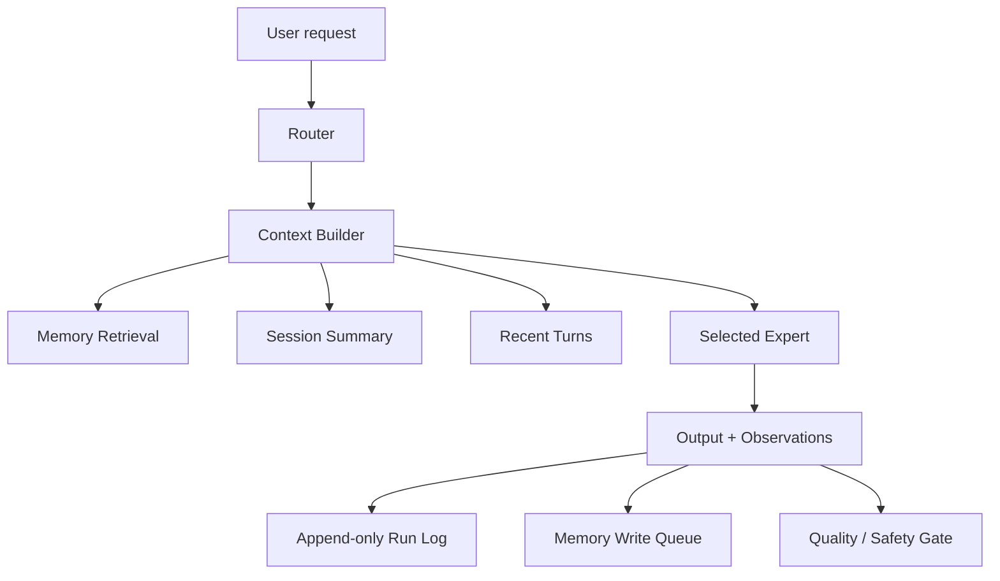

# Context And Memory Architecture

## Goal

The app should behave like a local general-purpose assistant, not just a model chat window. That requires an application context layer around the model.

## Layers



## Context Policy

The implementation starts with `src/local_moe/context.py`.

It provides:

- stable section ordering for cache-friendly prompts,
- explicit token budget estimates,
- memory snippet selection,
- recent-turn truncation,
- compaction triggers,
- compaction prompt generation.

Recommended initial policy lives in:

```text
configs/context-policy.json
```

For the 24 GB machine:

- default primary: `32K` context cap,
- stretch primary: `16K` context cap,
- reserved output: `2048` tokens,
- compaction trigger: `70-75%`,
- memory snippets: `6-8`.

Do not start at 256K context. The model may advertise it, but KV cache and app responsiveness will suffer on 24 GB.

## Chat History

The first durable conversation layer is `src/local_moe/chat_store.py`. It stores web chat sessions in:

```text
<runtime.work_dir>/chats.json
```

Chat history is intentionally separate from semantic memory. Chat history preserves what happened in a UI session, while memory stores selected durable facts, decisions, and reusable context.

When `/api/generate` receives a `session_id`, the web layer builds a `ContextBundle` with the configured policy profile before calling the local MoE runtime. This gives normal chat continuity without making the browser responsible for prompt assembly. The bundle reports estimated tokens, section totals, dropped turns, and whether compaction is needed.

Saved sessions include a durable `summary` field. `POST /api/chats/<session-id>/compact` calls the configured local compaction expert, updates that summary, appends a system metadata event, and reuses the summary in later context bundles.

The active policy is configured through the app runtime fields:

```json
{
  "context_policy_config": "configs/context-policy.json",
  "context_policy_profile": "qwen3_30b_a3b_general_24gb"
}
```

## Context Pipeline

1. collect active conversation turns,
2. persist conversation turns in the local chat store,
3. merge durable memory records,
4. add the current session summary,
5. add relevant artifacts or tool output,
6. fit context to the selected expert budget,
7. compact when the budget is near exhaustion.

## Compression

Use anchored iterative summarization:

1. keep a durable session summary,
2. summarize only newly dropped turns,
3. merge into mandatory sections,
4. preserve exact file paths, model ids, decisions, risks, test status, and next actions,
5. probe the summary with tests before trusting it.

The code creates compaction prompts deterministically and includes a `LocalCompactionProvider` that calls the configured fallback, summary, or compaction expert directly. In the default live profile this selects `fast_fallback`, so compaction does not spend the primary model's context budget.

## Memory

The first memory layer is intentionally simple:

```text
src/local_moe/memory.py
```

It is an append-only JSONL store with:

- `scope`,
- `kind`,
- `metadata`,
- `valid_from`,
- `valid_until`,
- keyword scoring.

This is not the final semantic memory engine. It is the right first layer because it is inspectable, local, versionable, and cheap. Upgrade path:

1. file-backed JSONL memory,
2. local embeddings + SQLite/FAISS/LanceDB,
3. hybrid keyword + vector retrieval,
4. temporal graph only when entity/relationship queries justify it.

## MoE For General Purpose

Use task-level routing:

- general reasoning and normal chat: primary general expert,
- summarization/translation/compaction: small fast expert,
- visual input: Gemma 4 26B-A4B or another multimodal expert,
- coding: optional Qwen3-Coder specialist,
- uncertain or high-risk answer: compare two experts or ask for verification.

The router now learns from curated route-label data through a local distilled artifact while remaining configurable.

## Observability

Every generation should record:

- correlation id,
- selected expert,
- context policy id,
- estimated tokens by section,
- compaction decision,
- memory ids retrieved,
- latency,
- tokens/sec when provider reports it,
- fallback errors.

This gives us a way to compare single-model vs MoE behavior honestly.

The web API now returns context telemetry in `/api/generate` and stores it on the assistant message metadata. That metadata is reused when a saved chat is loaded.

## Evaluation Targets

Add eval suites for:

- general QA,
- reasoning/planning,
- summarization and compression fidelity,
- multilingual responses,
- tool-use formatting,
- memory retrieval correctness,
- model routing accuracy,
- latency and memory footprint.

Do not promote a specialist into resident runtime unless it beats the primary general model on its own eval slice.
