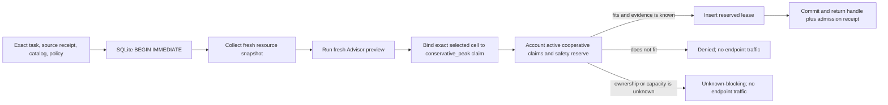
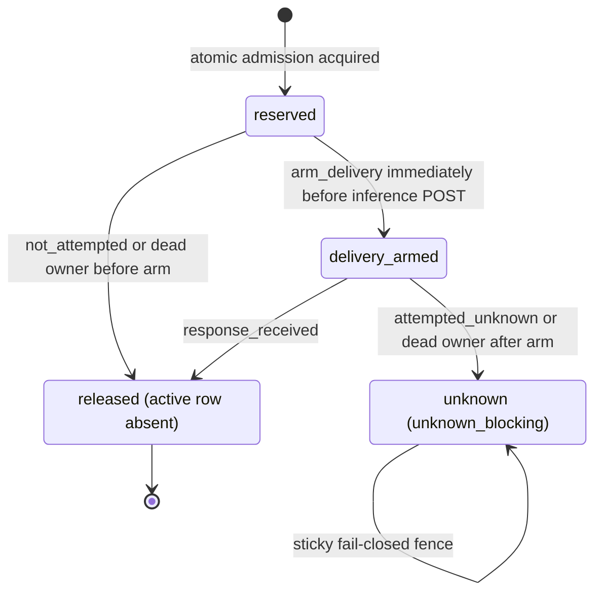

# Cooperative Resource Lease v1

## In plain English

**Cooperative Resource Lease stops cooperating local agents from promising the
same observed memory to different jobs at the same time.** It is a small,
runtime-neutral admission ledger: each participant checks the current machine,
runs the Adaptive Cell Advisor again, and records the selected cell's
conservative peak claim before any inference request can begin.

For example, imagine that a laptop has 24 GiB available and two local agents
simultaneously choose cells whose conservative peaks are 16 GiB. Without a
shared ledger, both snapshots can say "16 GiB fits" and both agents can start,
causing severe swapping or a crash. With the lease, one agent records its claim
atomically. The second sees that active claim and is blocked before endpoint
traffic. After the first agent releases its lease, the second may take a new
snapshot and try a new admission; it is never silently retried.

This is useful even when the model server already has its own queue. The lease
coordinates multiple myMoE processes around evidence and current machine
capacity. It does not replace the server's scheduler.

This document describes the foundation alpha contract and its Bound Cell Run
integration. The store remains a programmatic API rather than a standalone
lease CLI or dashboard, and it is not a model lifecycle manager.

## One narrow guarantee

Participants using the same coordination domain cannot both win a capacity
race that the ledger says has room for only one of them. The decision is made
under one SQLite write transaction and produces explicit `acquired`, `denied`,
or `unknown_blocking` evidence.



`SQLiteCooperativeResourceLeaseStore.evaluate_and_acquire(...)` owns this
boundary. The integration callback must collect the fresh `ResourceSnapshot`,
run the fresh Advisor preview, and derive the claim from the exact selected
candidate while the `BEGIN IMMEDIATE` transaction is held. The store then
validates snapshot/claim linkage, checks active leases, and either inserts the
`reserved` row or returns a blocked receipt before commit. Moving the snapshot
or preview outside this callback would reintroduce the race the lease is meant
to close.

SQLite uses a single-writer `BEGIN IMMEDIATE` transaction, WAL journaling,
`synchronous = FULL`, a strict versioned schema, and a configurable busy
timeout. A busy, corrupt, replaced, or foreign-schema database fails closed; it
does not degrade to uncoordinated execution.

## Exact state machine

The durable active states are `reserved`, `delivery_armed`, and
`unknown_blocking`. `released` is terminal and is represented by deleting the
authenticated active row, not by retaining a released row.



The normal Bound Cell Run order is:

1. acquire `reserved` after the final fresh preview;
2. perform only the pre-invocation checks that cannot cause inference;
3. durably call `arm_delivery` immediately before the inference `POST`;
4. release with `response_received` when a response was unambiguously received;
   or
5. fence as `unknown_blocking` when the request may have reached the runtime but
   its outcome is ambiguous.

The delivery outcome and state must agree:

| Current state | Reported delivery | Result |
| --- | --- | --- |
| `reserved` | `not_attempted` | `released` |
| `reserved` | `response_received` | `denied` with `lease_state_outcome_mismatch` |
| `delivery_armed` | `response_received` | `released` |
| `delivery_armed` | `not_attempted` | `denied` with `lease_state_outcome_mismatch` |
| Any active state | `attempted_unknown` | sticky `unknown_blocking` |
| `unknown_blocking` | Any later outcome | remains `unknown_blocking` |
| Missing row | `attempted_unknown` | quarantine the whole coordination domain |

A repeated known release can return `already_absent`. If the database row was
successfully removed but native sentinel cleanup failed, the receipt reports
`released_cleanup_deferred`; the stale unlocked file is not counted as an
active lease. None of these statuses says that the model answer was correct.

## What is actually claimed

Every `CooperativeResourceClaim` uses the fixed basis
`claim_basis: conservative_peak`. It binds the fresh preview, selected
candidate, passport, resource snapshot, resource class, catalog, and Advisor
profile by SHA-256 digest. It also records the applicable memory pool, byte
claims, accelerator identity where required, and the profile safety reserve.

`conservative_peak` means the full qualified peak estimate for the selected
cell, **not incremental memory caused by this request**. If a model is already
resident and a second request would reuse most of that allocation, the alpha
still claims the full peak. It can therefore overblock resident models. This is
intentional until runtime residency and sharing can be measured and bound
without turning an optimistic estimate into a safety claim.

| Placement | Alpha treatment | Current support |
| --- | --- | --- |
| CPU / system memory | `pool: system`; the host peak is charged to the shared system pool. Available capacity is the smaller of observed available memory and the effective memory limit. | Implemented foundation path. |
| Apple integrated accelerator / unified memory | `pool: unified`; the full unified peak is charged once to the same system pool used by CPU claims. Accelerator bytes stay zero because RAM and GPU memory are the same physical pool. CPU and unified leases are accounted together. | Implemented foundation path when the snapshot proves unified topology and an integrated accelerator. |
| Discrete accelerator | `pool: discrete`; the contract requires both host bytes and accelerator bytes plus an exact accelerator-identity digest, and admission must check both pools. | Contract-only in this alpha. The current live collector does not yet qualify reliable discrete-GPU capacity end to end, so this must not be advertised as operational support. |

Unknown capacity, unsupported placement, incomplete peak evidence, a changed
resource class, or conflicting discrete-accelerator identity blocks admission.
Unknown is never converted into zero use or spare capacity.

## Cooperation boundary

A coordination domain is the digest of the store contract plus the normalized
SQLite database path and sentinel-directory path. All participants must run on
the same host, under the same user, and use those exact two paths. Processes
using another database, another sentinel root, another user account, another
container mount, or another machine are outside the domain.

This is cooperative accounting, not an operating-system reservation:

- it does not allocate, pin, lock, or reserve RAM, unified memory, or VRAM;
- it cannot stop a nonparticipating process from consuming memory;
- it does not start, stop, load, unload, swap, pin, or evict a model;
- it does not control a runtime's parallelism, queue, context allocation, or
  cache;
- it does not coordinate remote nodes or separate local users; and
- it trusts participants to enter the boundary and to provide truthful,
  qualified Advisor evidence.

A fresh snapshot reduces stale-advice risk at admission. It cannot prevent an
unrelated process from changing memory pressure immediately after commit.

## Configuration and default paths

The default root is resolved portably with
`platformdirs.user_state_path("myMoE", appauthor=False)`, then extended with
`resource-lease/v1`:

```text
<platform user state>/myMoE/resource-lease/v1/leases.sqlite3
<platform user state>/myMoE/resource-lease/v1/sentinels/
```

On macOS this currently resolves to:

```text
~/Library/Application Support/myMoE/resource-lease/v1/leases.sqlite3
~/Library/Application Support/myMoE/resource-lease/v1/sentinels/
```

`database_path` and `sentinel_root` can be supplied programmatically. When only
a custom database is supplied, its sibling `sentinels` directory is used. A
deployment must configure every participant with the same pair; sharing only
one of the paths does not create one coordination domain.

`CooperativeResourceLeasePolicy` defaults are:

| Field | Default | Meaning |
| --- | ---: | --- |
| `busy_timeout_ms` | `5000` | Maximum SQLite lock wait before failing closed. |
| `max_active_leases` | `256` | Hard bound on active rows in one domain. |
| `claim_basis` | `conservative_peak` | Fixed; incremental claims are rejected. |
| `cooperative_only` | `true` | Fixed statement of authority. |
| `os_memory_reserved` | `false` | Fixed: no OS allocation or reservation is claimed. |
| `runtime_managed` | `false` | Fixed: no lifecycle action is claimed. |

There is no supported environment variable, JSON setting, CLI command, or UI
for this foundation alpha. Adding those surfaces is roadmap work; callers must
not invent an incompatible parallel store format.

On POSIX, store directories are made owner-only (`0700`) and database/sentinel
files owner-only (`0600`). Links, reparse points, and non-regular database or
sentinel files are rejected. These checks protect the expected local path
boundary; they are not isolation from malicious code already running as the
same user.

## Privacy and receipts

The strict, content-addressed contracts are:

- `CooperativeResourceLeasePolicy`;
- `CooperativeResourceClaim`;
- `CooperativeResourceLeaseAdmissionReceipt`;
- `CooperativeResourceLeaseTransitionReceipt`; and
- `CooperativeResourceLeaseReleaseReceipt`.

They contain metadata such as digests, random lease ID, timestamps, states,
reason codes, byte counts, pool identity, and active-lease counters. They do not
contain the task body, model response, prompt, model weights, or raw ownership
token. The 32-byte token exists only in the in-memory handle; SQLite and the
admission receipt retain only its SHA-256 digest.

The programmatic store returns receipts but does not itself keep an append-only
event history. Bound Cell Run embeds the exact claim and available
admission/transition/release receipts in `BoundCellRunEnvelopeV2`, while keeping
the nested `BoundCellRunReceipt` v1 byte- and schema-compatible. Its CLI writes
that metadata-only envelope through the existing owner-only, no-clobber
publication boundary and finalizes the sibling recovery journal first. SQLite
still retains current active rows and store metadata rather than a complete
project or inference history.

Hashes provide content linkage and tamper detection, not confidentiality,
authorship, or remote attestation. They can reveal equality and may allow
guessing of predictable source metadata. Row digests also do not defend against
a malicious same-user process that can rewrite the database and recompute
hashes.

## Crash and quarantine behavior

Recovery favors avoiding duplicate or overcommitted work over automatic
availability:

- A process owns an OS-locked sentinel for each lease.
- If it dies while the row is still `reserved`, a later admission can prove the
  owner lock is dead and atomically reap the row because inference was never
  armed.
- If it dies after `delivery_armed`, a later admission changes the row to
  `unknown_blocking`. The request may have completed, so no TTL or restart may
  pretend it did not.
- If owner status cannot be probed, the row becomes `unknown_blocking`.
- If an ambiguous release finds its row missing, the store records quarantine
  evidence and puts the entire coordination domain in `unknown_blocking`.
- Corruption, schema drift, database replacement, arithmetic overflow, and
  unavailable durability guarantees fail closed with stable store errors.

An unknown row or quarantined domain blocks new admissions. It is deliberately
sticky across process restarts. The alpha has no `reconcile_unknown` or
`clear-quarantine` operation. Deleting the database is not a safe recovery
procedure: it destroys the very fence that says work may still be active.

The safe operational response today is to stop new work, preserve the database
and related runtime evidence, determine whether delivery or execution can still
be active, and wait for an explicit evidence-backed reconciliation feature.

## Threat model

| Threat | Behavior | Residual risk |
| --- | --- | --- |
| Two cooperating processes observe the same free memory | SQLite serializes evaluation and insertion, so the second sees the first active claim. | Participants outside the domain are invisible to the ledger. |
| Process crash before inference is armed | A provably dead `reserved` owner is reaped. | An unavailable owner probe fails closed instead of guessing. |
| Timeout or crash after inference may have started | The lease becomes sticky `unknown_blocking`; there is no automatic retry or TTL release. | Availability can be lost until explicit reconciliation exists. |
| Wrong or stale handle | Token, claim, and admission digests must match; otherwise transition/release is denied. | A compromised participant can steal in-process capabilities. |
| Store/path replacement or malformed data | File identity, strict schema, row digests, and path checks fail closed. | Same-user or privileged malicious code is outside the trust model. |
| Resource pressure changes after admission | The cooperative claim remains visible until release. | The OS does not enforce the claim; nonparticipants can still consume memory. |
| Dishonest evidence producer | Exact digest linkage makes the decision auditable. | A digest cannot prove that the original measurement was truthful. |

The design does not defend against a compromised myMoE process, malicious code
running as the same user, administrator or kernel compromise, direct runtime
misreporting, side channels, or denial of service by a participant that
intentionally creates an ambiguous lease.

## Honest comparison with existing runtime managers

This capability has a different boundary; it is not a novelty claim and it is
not a reason to reimplement mature model servers.

| System | What its official documentation already provides | Relationship to this lease |
| --- | --- | --- |
| Ollama | Concurrent model loading when memory permits, per-model parallel requests, queueing and idle unload, controlled by `OLLAMA_MAX_LOADED_MODELS`, `OLLAMA_NUM_PARALLEL`, and `OLLAMA_MAX_QUEUE` ([official FAQ](https://docs.ollama.com/faq)). | Ollama schedules work inside its server. The lease coordinates evidence-bound admission among cooperating myMoE processes before they call a runtime. It neither replaces nor overrides Ollama's scheduler. |
| llama-swap | Runtime process start/stop, global and per-model TTL, per-model `concurrencyLimit`, and a matrix that declares valid concurrent model sets and eviction costs ([official configuration](https://github.com/mostlygeek/llama-swap/blob/main/docs/configuration.md)). | llama-swap is a lifecycle-aware proxy. The lease deliberately performs no lifecycle action; it can guard a caller above llama-swap, but overlapping conservative limits may double-throttle the machine. |
| LocalAI | Loaded-backend limits with LRU eviction, per-model concurrency groups, watchdog unload, and a VRAM allocation ceiling ([official VRAM guide](https://localai.io/advanced/vram-management/)); distributed workers also expose a per-node VRAM budget to placement ([official distributed-mode guide](https://localai.io/features/distributed-mode/index.html)). | LocalAI manages backends and node placement. The lease is only a same-user, same-host admission and receipt boundary. Its discrete-GPU path remains contract-only. |

When one of these runtimes is used, configure its native concurrency and memory
controls first. Add the myMoE lease only when multiple cooperating callers need
one evidence-linked admission boundary. Observe both layers so conservative
limits do not turn into unexplained under-utilization.

## Operations and status roadmap

The foundation alpha now includes programmatic acquire, arm, release, crash
fencing, strict metadata receipts, and Bound Cell Run integration with zero
endpoint traffic on admission failure. The next useful increments are:

1. add a read-only `status` view that reports domain identity, active claims,
   state, age, pool totals, and reason codes without prompt or response data;
2. persist append-only admission, arm, unknown, reconciliation, and release
   events atomically with state mutations, then bind their log root into a
   future envelope without changing the Bound Cell Run v1 receipt schema;
3. add explicit, authenticated `reconcile_unknown` and quarantine recovery that
   requires external evidence and emits its own receipt—never a TTL guess;
4. expose bounded metrics for denied, unknown, reaped, and cleanup-deferred
   outcomes without identifiers or task data;
5. qualify discrete-GPU collectors and identity evidence before enabling that
   contract path; and
6. validate runtime-residency-aware accounting separately before considering
   any less conservative claim basis.

Until those items exist, the truthful claim is narrow: **the alpha serializes
conservative memory admission for cooperating local participants and preserves
ambiguity; it does not make local inference resources exclusive, managed, or
incrementally accounted.**
