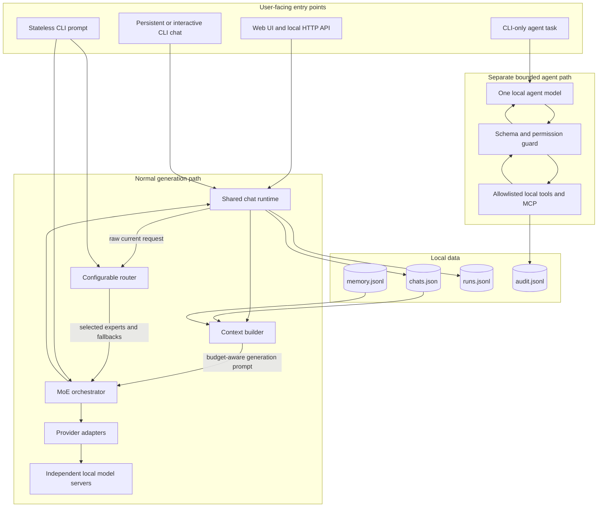
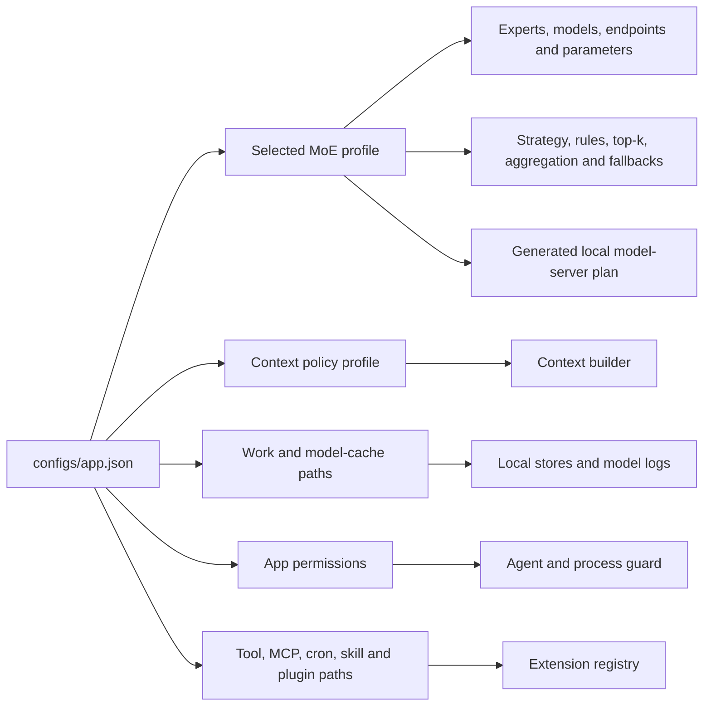
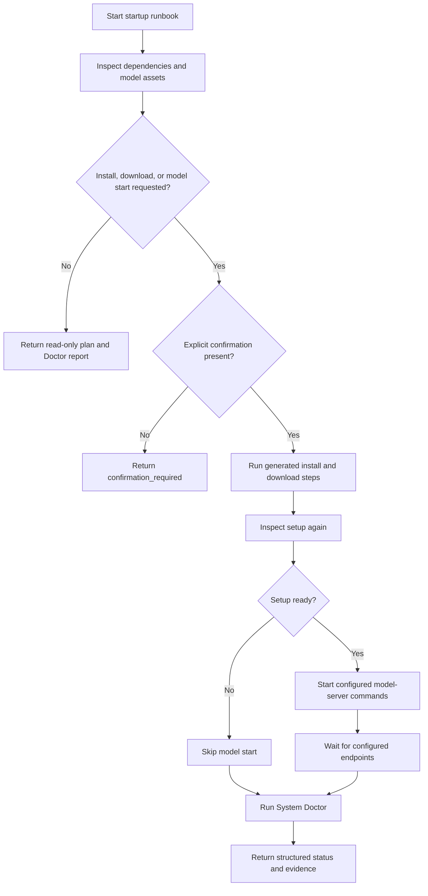
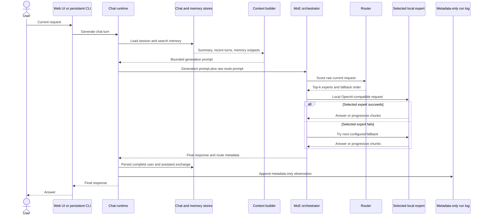
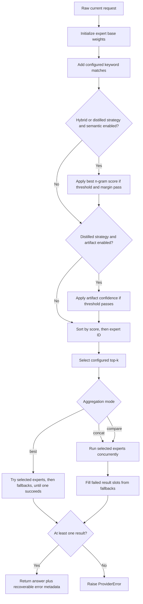
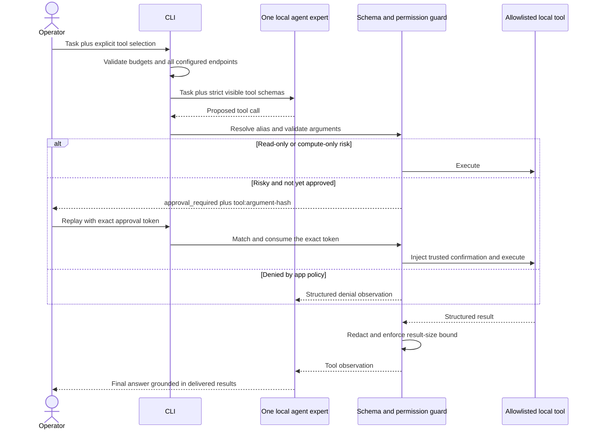
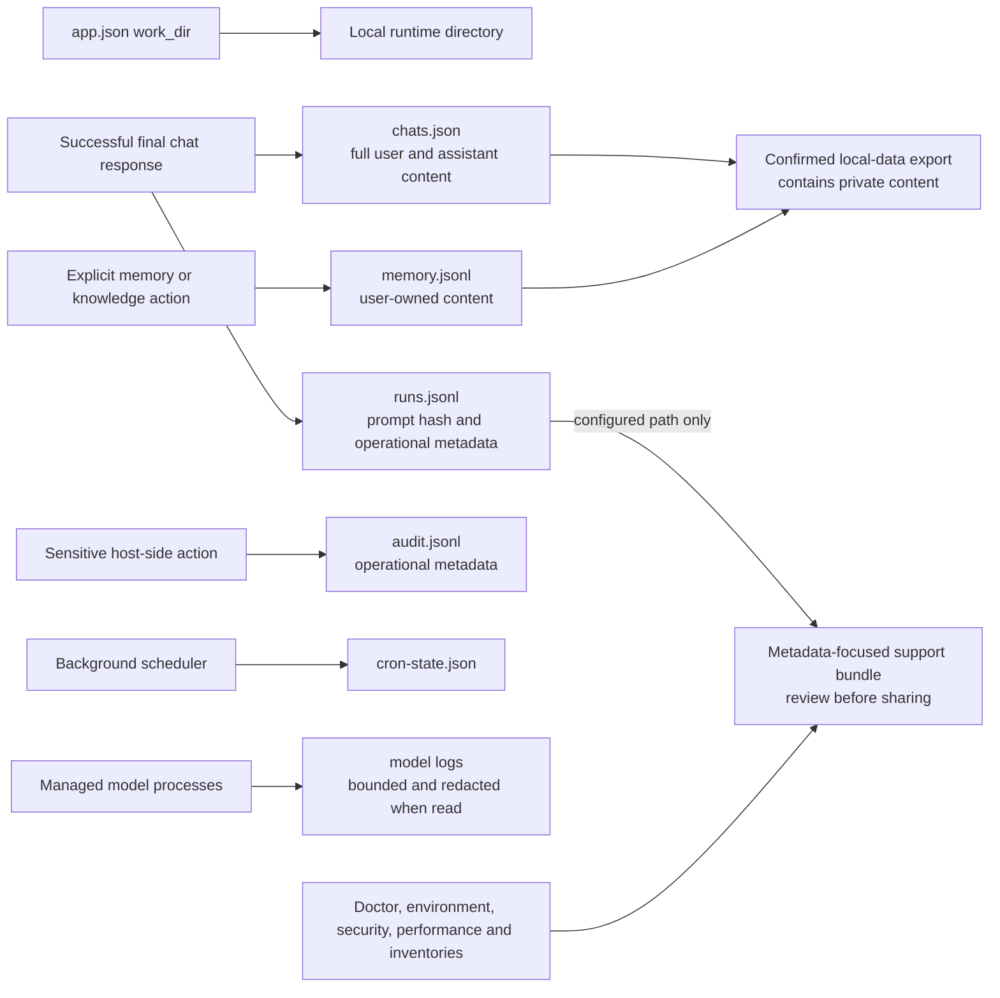
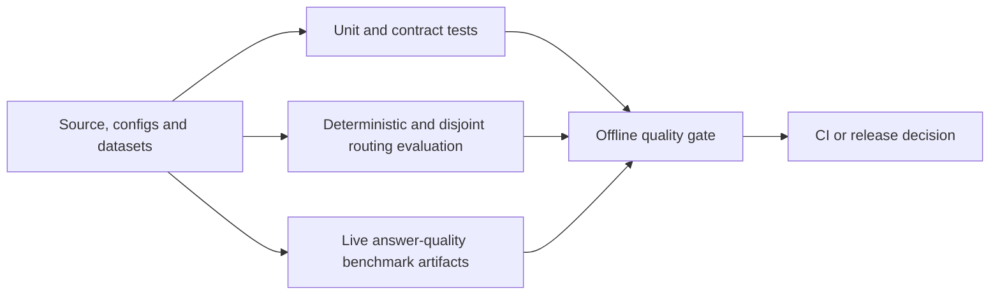

# How myMoE Works

This guide explains the implemented myMoE runtime from startup to a persisted answer. It separates normal chat, offline evaluation, and the optional agent loop because they are different execution paths with different safety rules.

## 1. The System in One Diagram



myMoE is a **system-level MoE**: the experts are separate model processes selected by an application router. It is not a sparse transformer whose expert layers are trained inside one neural network.

## 2. Configuration Composition

The runtime is assembled from independent configuration files rather than one monolithic settings object.



| File or directory | What it controls |
| --- | --- |
| [`configs/app.json`](../../configs/app.json) | Product mode, default MoE profile, language hints, runtime paths, backend preferences, extension paths, scheduler policy, and permissions. |
| [`configs/moe.*.json`](../../configs/) | Expert IDs, provider, endpoint, model, role, weight, timeout, generation parameters, routing signals, top-k, aggregation, and fallbacks. |
| [`configs/context-policy.json`](../../configs/context-policy.json) | Input/output budgets, compaction threshold, recent-turn cap, and memory-item cap. |
| [`configs/tools.json`](../../configs/tools.json) | Tool metadata, enabled state, risk class, and declared side effects. |
| [`configs/mcp.json`](../../configs/mcp.json) | Optional MCP stdio servers and per-server tool allowlists. |
| [`configs/cron.json`](../../configs/cron.json) | Startup and interval jobs plus their risk classes. |
| [`outputs/router-distilled-live-general.json`](../../outputs/router-distilled-live-general.json) | The default profile's local distilled routing artifact. |

### What is replaceable without code?

- Any OpenAI-compatible local model, endpoint, role, weight, timeout, generation parameter, rule, example, fallback order, top-k value, or aggregation mode can be changed in a profile.
- Context budgets and registry file locations can be changed independently.
- MCP server definitions and cron schedules can be added through guarded configuration paths. An MCP definition is trusted configuration and can name an executable command; process policy and per-call confirmation guard whether it is launched.

### What still requires code?

- The provider abstraction is modular, but the factory currently implements only `openai_compatible` and the synthetic test provider. A different wire protocol needs a provider adapter and factory registration.
- A built-in tool needs both a strict model-visible schema and an explicit implementation in the local tool runner. Tool metadata alone cannot create executable code.
- Cron definitions are configurable, but executable cron actions are deliberately hard-allowlisted.
- Skills and plugin manifests are discovered and audited as metadata; they are not automatically injected into the model or executed as arbitrary instructions.

Those boundaries are intentional security controls as well as current extension seams.

## 3. Startup and Model Lifecycle

The startup runbook composes the setup inspector, setup runner, model process manager, endpoint wait, and System Doctor. It does not introduce a second runtime path.



Important details:

1. Preview operations are read-only.
2. Install, model download, start, stop, and profile activation require explicit confirmation.
3. Model commands are generated from the active profile and backend plan; the browser cannot submit an arbitrary shell command.
4. A start skips an endpoint that is already reachable, preventing a duplicate server on the same port.
5. The web process can stop only child model processes created by its own model manager.
6. Profile activation changes only `default_moe_config` for the next process start; it does not hot-swap the running runtime.
7. System Doctor combines setup, endpoint health, hardware fit, storage, managed processes, extension audit, and cron state into one report.

Implementation: [`startup.py`](../../src/local_moe/startup.py), [`setup_runner.py`](../../src/local_moe/setup_runner.py), [`model_servers.py`](../../src/local_moe/model_servers.py), and [`doctor.py`](../../src/local_moe/doctor.py).

## 4. A Normal Chat Request

This sequence applies to the web app and persistent CLI chat. A direct CLI `--prompt` is simpler and stateless: it routes and generates without loading a chat session, retrieving memory, or writing the chat/run stores.



### Context construction

The context builder uses this stable order:

1. system instruction for a continued session;
2. matching default-scope memory snippets;
3. durable session summary;
4. recent user and assistant turns;
5. current user request.

The configured output allowance is reserved first. Memory items are capped and
ranked, then recent turns use only the budget remaining after the fixed
sections. Token counts are inexpensive estimates based on text length, not
exact model-tokenizer counts. This is budget-aware, not a hard prompt-size
guarantee: the system instruction, selected memories, durable summary, and
current request are retained, so unusually large fixed sections can still
exceed the reported input budget.

`compaction_needed` becomes true when the estimated prompt reaches the configured threshold or recent turns had to be dropped. This signal does **not** automatically summarize or write anything. Durable compaction is an explicit CLI, API, UI, or tool action that calls a configured local compaction expert and stores the resulting session summary.

Memory retrieval is currently a simple inspectable local keyword-overlap search
with scope and temporal-validity filtering. Normal generation reads memory but
never creates a memory record automatically. Memory writes are explicit user
actions: `POST /api/memory` saves directly, while destructive operations and
tool-driven knowledge writes use their documented confirmation guards.

Implementation: [`chat_runtime.py`](../../src/local_moe/chat_runtime.py), [`context.py`](../../src/local_moe/context.py), [`memory.py`](../../src/local_moe/memory.py), and [`compaction.py`](../../src/local_moe/compaction.py).

## 5. Routing, Selection, and Fallbacks

For each expert, routing starts with the configured base weight and may add three signals:

```text
score = base expert weight
      + keyword rule contributions
      + accepted semantic contribution
      + accepted distilled-artifact contribution
```

- Each matching configured keyword adds `rule weight × number of matches` to that expert.
- With `hybrid` or `distilled` strategy, semantic routing compares the prompt with configured examples using normalized word and character n-gram vectors. The best expert receives `semantic weight × best cosine score` only when the minimum-score and winner-margin thresholds pass.
- With `distilled` strategy, the local centroid artifact predicts an expert and confidence. It contributes `distilled weight × confidence` only when the confidence threshold passes.
- Experts are sorted by descending score and then by expert ID for deterministic ties. The first configured `top_k` experts are selected.



Aggregation behavior is exact and intentionally simple:

| Mode | Behavior |
| --- | --- |
| `best` | Tries the selected expert order followed by fallback order and stops at the first success. |
| `concat` | Calls selected experts concurrently, fills failed slots from fallbacks, and returns labeled expert sections. It does not synthesize a new answer. |
| `compare` | Uses the same concurrent calls, then prepends a deterministic lexical disagreement report based on Jaccard term overlap and answer-length delta. It does not call an LLM judge. |

For `concat` and `compare`, the current streaming method waits for normal aggregate generation and then emits the completed content; it does not stream multiple experts token by token.

The default profile uses distilled top-1 `best` routing. Its fallback list contains both expert IDs; the already-selected ID is removed before execution. As a result, either default expert can fall back to the other.

An enabled but missing, invalid, or incompatible distilled artifact fails runtime initialization rather than silently changing the routing policy.

Implementation: [`router.py`](../../src/local_moe/router.py), [`distilled_router.py`](../../src/local_moe/distilled_router.py), [`text_features.py`](../../src/local_moe/text_features.py), and [`orchestrator.py`](../../src/local_moe/orchestrator.py).

## 6. Streaming and Failure Semantics

The browser prefers `POST /api/generate/stream`. The server emits:

1. `route` after expert selection;
2. zero or more `content` events;
3. one `final` event after a complete successful response; or
4. an `error` event when generation cannot complete.

The provider normalizes OpenAI-compatible SSE chunks and strips hidden reasoning/channel markers before content becomes visible. The user/assistant exchange and run observation are persisted only on the final successful response.

If streaming fails before any visible content starts, the browser retries the regular JSON endpoint. If content has already started, it shows the streaming error and does not silently repeat the request.

| Failure | Runtime behavior |
| --- | --- |
| Empty prompt | HTTP `400`; no model call. |
| Unknown chat session | HTTP `404`; no model call. |
| Selected expert transport, HTTP, JSON, or payload error | Try the next configured fallback. |
| All selected and fallback experts fail | HTTP `502` for JSON, or an SSE `error` event. |
| Generation ends without producing a `final` event | No completed exchange is persisted. |

Implementation: [`providers.py`](../../src/local_moe/providers.py), [`orchestrator.py`](../../src/local_moe/orchestrator.py), and [`web.py`](../../src/local_moe/web.py).

## 7. The Separate Agent Tool Loop

Normal chat does not expose tools to the model. The agent loop is a separate CLI-only path selected with `--agent-prompt`, and the caller must explicitly select at least one visible tool with `--agent-tool`.



The guard applies these checks before execution:

1. the tool is enabled, explicitly visible, and has a strict root JSON object schema;
2. the tool name resolves to a known canonical tool;
3. arguments match the schema and size budget;
4. numbers are finite and secret-like fields or values are absent;
5. the app permission policy allows the risk class;
6. risky calls have an exact, single-use approval for `canonical-tool:arguments-sha256`;
7. the model-turn, tool-call, result-size, argument-size, task-size, and soft-time budgets remain available.

Harness-owned confirmation fields are added only after approval. A model cannot approve its own call by writing `confirm=true`. Tool observations are structured, redacted, and bounded before they return to the model. The trace contains statuses, hashes, counts, model/tool labels, and token metadata, but not prompts, arguments, tool bodies, or hidden reasoning.

When `app.mode` is `local_model_required`, this agent path checks **every configured HTTP model endpoint** before its first model request and rejects the run if any endpoint is not loopback. That check belongs to agent mode; general `LocalMoE.generate()` does not itself enforce endpoint locality.

Implementation: [`agent_loop.py`](../../src/local_moe/agent_loop.py), [`agent_tools.py`](../../src/local_moe/agent_tools.py), [`agent_tool_schemas.py`](../../src/local_moe/agent_tool_schemas.py), [`agent_provider.py`](../../src/local_moe/agent_provider.py), and [`tool_runner.py`](../../src/local_moe/tool_runner.py).

## 8. Local Data and Privacy Boundaries



| Store | Contains content? | Purpose |
| --- | --- | --- |
| `chats.json` | Yes | Durable chat sessions, messages, summaries, and assistant metadata. |
| `memory.jsonl` | Yes | Explicit memory records and imported knowledge chunks. |
| `runs.jsonl` | No prompt or answer bodies | Prompt SHA-256 and length, selected experts/models, latency, tokens, context pressure, memory IDs, and error counts. |
| `audit.jsonl` | No chat or memory bodies | Metadata for sensitive host-side actions and guarded retention. |
| `cron-state.json` | No chat content | Last-run and scheduling state for the in-process scheduler. |
| model log files | Model-server output | Read only through bounded, path-constrained, secret-redacting diagnostics. Log bodies are excluded from support bundles. |

The **local-data bundle** and the **support bundle** serve different purposes:

- Local-data export includes complete chats and memory for backup or migration, so export and import require confirmation.
- The support bundle is designed for issue reports. It includes diagnostics,
  inventories, decisions, and paths, while excluding chat transcripts, memory
  records, run-log contents, environment variables, MCP tool results,
  local-data payloads, benchmark answer excerpts, and model log bodies. It also
  includes the configured Git remote URL and model base URLs; review the bundle
  before sharing and never place credentials in those URLs.

Implementation: [`chat_store.py`](../../src/local_moe/chat_store.py), [`memory.py`](../../src/local_moe/memory.py), [`run_log.py`](../../src/local_moe/run_log.py), [`audit.py`](../../src/local_moe/audit.py), [`data_bundle.py`](../../src/local_moe/data_bundle.py), and [`support_bundle.py`](../../src/local_moe/support_bundle.py).

## 9. Control Plane and Background Work

The web Advanced drawer and CLI expose the same underlying control-plane contracts:

- setup inspection and guarded preparation;
- profile discovery, hardware-fit recommendation, preparation, and next-start activation;
- managed model status, start, stop, health, smoke generation, inventory, and sanitized logs;
- System Doctor, environment snapshot, security audit, performance report, runtime optimizer, and support bundle;
- chats, memory, knowledge, local-data backup, audit, and run-log retention;
- tool, skill, plugin, MCP, and cron registry discovery and audit.

The background scheduler runs in the web process when enabled. It evaluates
`startup` and `interval` schedules, records state locally, and auto-runs only
allowlisted jobs permitted by the configured risk policy. With the default
`cron_confirm_writes=false`, jobs declared `write_local` remain manual. The
filter trusts each job's configured `risk_class`; registry authors must classify
jobs correctly because the scheduler does not infer side effects from command
arguments. This keeps scheduling cross-platform without requiring launchd,
systemd, or Windows Task Scheduler.

MCP servers are disabled by default. An enabled stdio server still requires app-level process permission, per-operation confirmation, and a configured `allowed_tools` entry before a tool can be called.

Implementation: [`scheduler.py`](../../src/local_moe/scheduler.py), [`extensions.py`](../../src/local_moe/extensions.py), [`mcp_client.py`](../../src/local_moe/mcp_client.py), and [`security_audit.py`](../../src/local_moe/security_audit.py).

## 10. Offline Evaluation Is Not in the Request Path

Quality and release gates do not run after every answer. They are offline workflows that evaluate configuration, routing, provider contracts, answer quality, latency, failure rate, provenance, packaging, and required artifacts.



The current release contract treats routed top-1 as the value variant and top-2 comparison as diagnostic evidence. Top-2 cannot compensate for a top-1 regression. Holdout integrity rejects duplicated or overlapping prompt IDs and normalized prompt hashes and binds reports to configuration, dataset, and artifact fingerprints.

See [Evaluation](../evaluation.md), [Tested Performance](../tested-performance.md), and [CI](../ci.md).

## 11. Source Map

| Concern | Primary implementation |
| --- | --- |
| App and MoE configuration | [`app_config.py`](../../src/local_moe/app_config.py), [`config.py`](../../src/local_moe/config.py) |
| Routing and distilled classifier | [`router.py`](../../src/local_moe/router.py), [`distilled_router.py`](../../src/local_moe/distilled_router.py), [`text_features.py`](../../src/local_moe/text_features.py) |
| Expert execution and aggregation | [`orchestrator.py`](../../src/local_moe/orchestrator.py), [`providers.py`](../../src/local_moe/providers.py) |
| Persistent chat and context | [`chat_runtime.py`](../../src/local_moe/chat_runtime.py), [`chat_store.py`](../../src/local_moe/chat_store.py), [`context.py`](../../src/local_moe/context.py) |
| Memory and compaction | [`memory.py`](../../src/local_moe/memory.py), [`compaction.py`](../../src/local_moe/compaction.py) |
| Web and CLI entry points | [`web.py`](../../src/local_moe/web.py), [`cli.py`](../../src/local_moe/cli.py), [`ui/index.html`](../../src/local_moe/ui/index.html) |
| Agent safety and tools | [`agent_loop.py`](../../src/local_moe/agent_loop.py), [`agent_tools.py`](../../src/local_moe/agent_tools.py), [`tool_runner.py`](../../src/local_moe/tool_runner.py) |
| Runtime preparation and processes | [`bootstrap.py`](../../src/local_moe/bootstrap.py), [`setup_runner.py`](../../src/local_moe/setup_runner.py), [`model_servers.py`](../../src/local_moe/model_servers.py), [`startup.py`](../../src/local_moe/startup.py) |
| Extensions, MCP, and cron | [`extensions.py`](../../src/local_moe/extensions.py), [`mcp_client.py`](../../src/local_moe/mcp_client.py), [`scheduler.py`](../../src/local_moe/scheduler.py) |
| Diagnostics and support | [`doctor.py`](../../src/local_moe/doctor.py), [`security_audit.py`](../../src/local_moe/security_audit.py), [`environment.py`](../../src/local_moe/environment.py), [`support_bundle.py`](../../src/local_moe/support_bundle.py) |

## Next Reading

- [Architecture](../architecture.md)
- [Routing](../router.md)
- [Context and Memory Architecture](../context-architecture.md)
- [Agent Runtime](../agent-runtime.md)
- [Installation](../installation.md)
- [Documentation hub](../README.md)

[Back to the project README](../../README.md)
