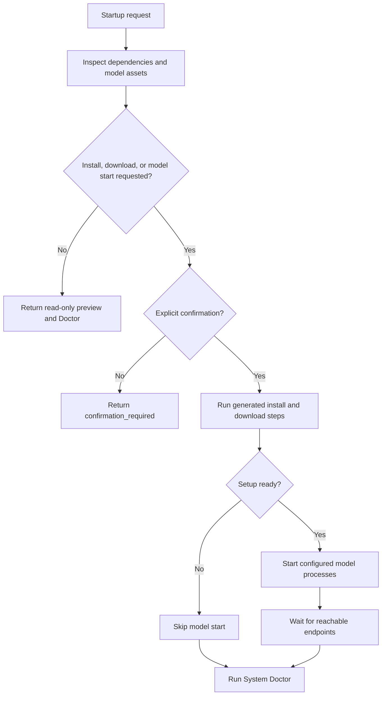

# Installation

myMoE is local-first and requires a real local model for normal CLI/UI usage.
The public configs under `configs/` are live local-model profiles or templates for live local-model profiles.

For the runtime lifecycle behind these commands, see [How myMoE works](how-it-works/README.md#3-startup-and-model-lifecycle).

Commands below use the POSIX virtual-environment path `.venv/bin/python`. On
Windows, use `.venv\Scripts\python.exe` or the installed `mymoe` and
`mymoe-web` entry points. Verified paired evidence additionally uses the
installed `mymoe-paired` entry point. Do not use an older system `python3`: the
project requires Python 3.10 or newer, and the locked examples use Python 3.12.

## Supported Platforms

| Platform | Preferred backend | Notes |
| --- | --- | --- |
| macOS Apple Silicon | MLX (`mlx-lm`) | Fastest path for this repo's tested machine class. The default `.[mlx]` extra pins the stack validated with Qwen and Gemma E4B. |
| Windows | Ollama | Cross-platform local daemon with OpenAI-compatible API. |
| Linux | Ollama | Good default; llama.cpp can be configured manually for GGUF. |
| Fallback | llama.cpp | Use when you need direct GGUF control. |

## Setup

### Apple Silicon with MLX

```bash
uv sync --locked --python 3.12 --extra mlx
PYTHONPATH=src .venv/bin/python scripts/bootstrap_runtime.py --download-models
```

### Windows or Linux with Ollama

Install [Ollama](https://ollama.com/download), then use the cross-platform
profile without installing the MLX extra:

```bash
uv sync --locked --python 3.12
ollama pull qwen3:4b
ollama serve
```

With Ollama running, start myMoE from another terminal:

```bash
uv run --locked --python 3.12 mymoe-web --config configs/moe.live.ollama.example.json --port 8089
```

Open `http://127.0.0.1:8089`. The later POSIX command examples have equivalent
installed `mymoe` or `mymoe-web` forms, so Windows does not need `PYTHONPATH` or
the `.venv/bin` path.

`uv.lock` pins all optional dependency graphs. Use `--locked` for reproducible
installs; update the lock deliberately when testing a newer runtime stack.

Editable installs expose the `mymoe`, `mymoe-paired`, and `mymoe-web` console
scripts. The quality gate runs `scripts/run_packaging_smoke.py` to install the
project in a temporary virtual environment and verify all three entry points
without relying on `PYTHONPATH`.

Validated Apple Silicon MLX package profile:

```text
mlx==0.31.2
mlx-metal==0.31.2
mlx-lm==0.31.3
transformers==5.12.1
```

This pin is intentional. `transformers==5.13.0` was observed to break
`mlx_lm.server` import in this environment; the pinned profile imports and
generates with the configured Qwen and Gemma MLX servers.

Optional extras:

- `.[desktop]`: installs the pinned Cua Driver adapter and process-inspection
  dependency required by `mymoe desktop-init` and the Desktop Semantic Cell.
  The locked provider package/version, digest of the complete platform-native
  tool-name set, and admitted schema are checked on Linux, macOS, and Windows;
  `desktop-init` writes the matching schema into the generated binding. CI
  reports but does not
  independently admit the observed native executable digest. The owned-daemon
  runtime is implemented on POSIX and live-qualified on macOS; Linux requires a
  local bound-window canary. Windows receives provider-contract checks only,
  and the runtime fails closed there
  until its named-pipe lifecycle is qualified.
- `.[coding-canary]`: installs the canonical-JSON dependency required by the
  isolated Cline coding-cell qualification command.
- `.[assistant-bridge]`: installs the dependencies required by the Hybrid
  Assistant Bridge CLI, its two-phase lifecycle commands, and `mymoe-paired`.
- `.[gguf]`: installs the Python-side downloader dependencies for llama.cpp/GGUF profiles. The `llama-server` binary is still installed from llama.cpp releases.
- `.[mlx-current]`: tracks the latest `mlx-lm` stack for experiments.
- `.[mlx-vlm]`: installs `mlx-vlm` for future multimodal server experiments. Do not use it as the default Gemma E4B path until the upstream compatibility issue is resolved.

Install the Assistant Bridge extra before running its CLI examples. Use the
locked dependency graph with uv, or install the same project extra with pip:

```bash
uv sync --locked --extra assistant-bridge
pip install '.[assistant-bridge]'
```

Install the coding canary independently when you need that command:

```bash
uv sync --locked --extra coding-canary
pip install '.[coding-canary]'
```

Or let the bootstrap script run the safe install commands:

```bash
PYTHONPATH=src .venv/bin/python scripts/bootstrap_runtime.py --execute --download-models
```

The same guarded flow is available through the app CLI:

```bash
PYTHONPATH=src .venv/bin/python -m local_moe.cli --prepare-runtime
PYTHONPATH=src .venv/bin/python -m local_moe.cli \
  --prepare-runtime \
  --prepare-execute \
  --prepare-download-models \
  --prepare-confirm
```

After installation, the shorter equivalent is:

```bash
mymoe --prepare-runtime
```

`--prepare-runtime` without side-effect flags is a preview. Installs and model downloads require `--prepare-confirm`, and the web UI uses the same confirmation policy in the Advanced Setup panel.

Before or after bootstrap, inspect setup readiness:

```bash
PYTHONPATH=src .venv/bin/python -m local_moe.cli --setup
```

The setup report lists the selected runtime backend, model cache path, model asset status, and the exact bootstrap command for the active config. Hugging Face snapshots are checked in the local cache, local GGUF paths are validated, and Ollama profiles report the required pull command.

To combine setup inspection, runtime preparation, model startup, and System Doctor verification in one guarded flow:

```bash
PYTHONPATH=src .venv/bin/python -m local_moe.cli \
  --startup \
  --startup-prepare \
  --startup-download-models \
  --startup-start-models \
  --startup-confirm
```

`--startup` without side-effect flags is a read-only preview. `--startup-start-models` can also be combined with `--startup-only-first` when a machine should launch only the primary local expert.



To choose the best local profile for the detected machine and current model cache without editing config files:

```bash
PYTHONPATH=src .venv/bin/python -m local_moe.cli --recommend-profile
```

The same read-only decision is exposed by `/api/config/recommendation` and embedded in `/api/config/profiles` for the Advanced Profiles panel.

To prepare the recommended profile's runtime dependencies and model assets before activation:

```bash
PYTHONPATH=src .venv/bin/python -m local_moe.cli \
  --prepare-recommended-profile \
  --prepare-execute \
  --prepare-download-models \
  --prepare-confirm
```

To set the recommended profile as the app default for the next start:

```bash
PYTHONPATH=src .venv/bin/python -m local_moe.cli \
  --activate-recommended-profile \
  --profile-confirm
```

Profile activation validates the target profile, writes only `default_moe_config` in the app config file, and returns a restart command. The running process keeps using the profile it started with.

## Start Models

```bash
PYTHONPATH=src .venv/bin/python scripts/start_local_models.py
```

For constrained machines, start only the first configured model:

```bash
PYTHONPATH=src .venv/bin/python scripts/start_local_models.py --only-first
```

Inspect model process status from the app CLI:

```bash
PYTHONPATH=src .venv/bin/python -m local_moe.cli --models-status
```

Inspect sanitized model server log tails from the app CLI:

```bash
PYTHONPATH=src .venv/bin/python -m local_moe.cli --models-logs --models-log-lines 80
```

Start models from the app CLI in the foreground:

```bash
PYTHONPATH=src .venv/bin/python -m local_moe.cli \
  --start-models \
  --models-confirm
```

The web UI exposes equivalent guarded start/stop controls in Advanced Runtime. It skips endpoints that already respond, stops only processes started by the current web server, and shows bounded sanitized log tails from runtime-plan-generated log files.

Fast MLX config for first-run demos:

```bash
PYTHONPATH=src .venv/bin/python scripts/bootstrap_runtime.py \
  --config configs/moe.live.fast-mlx.example.json \
  --download-models
PYTHONPATH=src .venv/bin/python scripts/start_local_models.py \
  --config configs/moe.live.fast-mlx.example.json
```

Quality-first isolated Qwen3 30B config:

```bash
PYTHONPATH=src .venv/bin/python scripts/bootstrap_runtime.py \
  --config configs/moe.live.qwen30-mlx.example.json \
  --download-models
PYTHONPATH=src .venv/bin/python scripts/start_local_models.py \
  --config configs/moe.live.qwen30-mlx.example.json
```

On the tested 24 GiB desktop workload, run this profile by itself. The default
Qwen3 4B + 1.7B profile is the responsive resident MoE; the 30B profile trades
headroom for a higher isolated quality ceiling.

Gemma 4 E4B config:

```bash
PYTHONPATH=src .venv/bin/python scripts/bootstrap_runtime.py \
  --config configs/moe.live.gemma-e4b-mlx.example.json \
  --download-models
PYTHONPATH=src .venv/bin/python scripts/start_local_models.py \
  --config configs/moe.live.gemma-e4b-mlx.example.json
```

Thinking-capable configs declare `supports_thinking = true` and a policy. The default `auto` policy is latency-bounded: explicit security/threat and formal-proof prompts may think, while routine planning and architecture do not. Dedicated reasoning profiles can opt into `thinking_policy = on`; raw thinking/channel tokens are always stripped from the user-visible response.

OpenAI-compatible experts can also set `params.system_prompt`. This is consumed
locally by myMoE rather than forwarded as an arbitrary provider parameter, so
each profile can define its own response style and length contract. The default
general profile uses a concise interactive budget and a loopback-first safety
default for local services; quality-first profiles can replace it and raise
`max_tokens` without changing provider code.

Optional Gemma 4 12B GGUF coding/agentic specialist:

```bash
# Install llama.cpp first:
# https://github.com/ggml-org/llama.cpp/releases
uv pip install --python .venv/bin/python ".[gguf]"
PYTHONPATH=src .venv/bin/python scripts/bootstrap_runtime.py \
  --config configs/moe.live.gemma-12b-agentic-gguf.example.json \
  --download-models
PYTHONPATH=src .venv/bin/python scripts/start_local_models.py \
  --config configs/moe.live.gemma-12b-agentic-gguf.example.json
```

For Hugging Face GGUF specs such as `owner/repo:Q4_K_M`, bootstrap downloads only matching `*.gguf` files instead of cloning the whole repository. Local `.gguf` file paths are validated and reused.

The older `configs/moe.live.gemma-12b-coder-gguf.example.json` profile is retained for the v1 model that was evaluated during research. Prefer the v2 agentic profile for new coding/tool-use experiments.

## Process-bound llama.cpp supervisor (POSIX alpha)

The process-bound v1 boundary is for a stricter question than normal model
startup: did one exact, directly launched `llama-server` keep ownership of its
numeric-loopback endpoint for one already-anchored GGUF?

Before running this installable alpha, provide all of the following:

- an exact local `llama-server` executable whose SHA-256 identity is already in
  a reviewed Bound Cell binding;
- an exact local `.gguf` whose identity is separately anchored by that binding;
- an absolute working directory and explicit numeric loopback host and port;
- a foreground POSIX owner process that can retain the lease and perform
  teardown;
- the core dependency set, including `psutil`, for process and listener
  observations.

Install the optional observer dependency and inspect the replaceable starter
configuration before producing its separately anchored Bound Cell catalog:

```bash
uv sync --extra runtime-supervisor
cp configs/moe.process-bound-runtime.example.json ./moe.process-bound-runtime.json
```

The copied file contains no machine-specific binary or model digest. Replace
its paths and endpoint, create the corresponding Bound Cell request/catalog,
and verify those static identities first. Once the request resolves as
`verified`, an explicitly confirmed one-shot lifecycle is:

```bash
mymoe-runtime check \
  --binding-request ./cell-binding-request.json \
  --confirm --json
```

The equivalent integrated entry point is `mymoe runtime-supervisor check ...`.
The installed CLI always uses its canonical private state directory so a sticky
endpoint lease cannot be bypassed accidentally by selecting another directory.
Use `supervise` instead of `check` only when a foreground owner should keep the
runtime available and continuously re-inspect it until `SIGINT` or `SIGTERM`.
Both commands attempt verified cleanup; neither daemonizes.

The supervisor does not download either file, discover a server, attach to an
existing port owner, run a router, or expose agent, editor, MCP, or UI authority.
Its own control plane issues only bounded `GET` probes; the directly owned
`llama-server` retains its native local inference API. It has no automatic
restart. One model means one directly owned server, binding, port, and lease.
Windows lifecycle support is not claimed in v1.

[`runtime-supervisor-policy.example.json`](../configs/runtime-supervisor-policy.example.json)
is the complete strict metadata-ledger policy payload, including its canonical
digest. It is not a launch profile: model, binary, endpoint, and launch-plan
identities remain separately bound inputs. The fixed policy values prohibit
adoption, automatic restart, raw-token persistence, and process mutation by the
ledger.

Validate the deterministic contract without starting a process or model:

```bash
uv run python experiments/benchmark_process_bound_runtime.py --check
```

The benchmark blocks real socket, process, subprocess, and URL side effects. A
pass confirms only the fake scenario matrix; it is not evidence for production
process containment, llama.cpp compatibility, security, model behavior,
latency, memory, or throughput. Read the
[Process-bound Runtime Supervisor guide](process-bound-runtime-supervisor.md)
before building a local canary.

## Start UI

```bash
PYTHONPATH=src .venv/bin/python -m local_moe.web --port 8089
```

After installation:

```bash
mymoe-web --port 8089
```

The wheel includes a minimal loopback configuration, so this command also
starts from an empty working directory. That fallback exposes `mymoe` and
`mymoe/local` and expects an OpenAI-compatible local model endpoint at
`127.0.0.1:8101`; it does not download or start a model implicitly. Pass
`--app-config` and `--config` to use a custom profile or the richer source
checkout examples.

Open `http://127.0.0.1:8089`.

## Connect Cline

The same web process exposes the local OpenAI-compatible gateway. In Cline,
select `OpenAI Compatible` and set:

```text
Base URL: http://127.0.0.1:8089/v1
API key:  local
Model:    mymoe
```

`local` is only a placeholder when the default `gateway.api_key_env` is empty.
Use `mymoe/coder` only when the active profile contains the `coder` expert, such
as `configs/moe.live.qwen3-coder-mlx.example.json`. The model process and web
server must use the same profile.

Confirm the exposed aliases before opening a coding task:

```bash
curl http://127.0.0.1:8089/v1/models
```

Managed model processes run with Hugging Face and Transformers offline mode
enforced. Download or update model assets explicitly with
`scripts/bootstrap_runtime.py --download-models`; runtime startup will not
silently fetch a missing model.

The full [Local Coding Fabric guide](local-coding-fabric.md) includes the exact
Cline steps, read-only canary, 24 GiB resource advice, and the distinction
between air-gapped and browser-connected operation.

## Add the local Browser Capability Cell

The browser adapter is separate from Cline and opt-in. It requires Node.js 20+
with npm and a compatible local Google Chrome. From an installed wheel,
materialize the packaged configuration, prefetch the exact provider without
executing its package binary or lifecycle scripts, then run the deterministic
fixture:

```bash
mymoe browser-init --out ./.mymoe-browser
mymoe browser-prefetch \
  --mcp-config .mymoe-browser/mcp.playwright-browser.json \
  --server browser-local
mymoe \
  --app-config .mymoe-browser/app.browser.json \
  --browser-canary browser-local \
  --browser-canary-confirm
```

From a source checkout, use `uv run mymoe browser-prefetch --mcp-config
configs/mcp.playwright-browser.example.json --server browser-local`, followed by
the same canary with `configs/app.browser.example.json`. Normal execution uses
the pinned package with `npx --offline`, recomputes the cached archive integrity,
and never downloads a dependency implicitly. Follow the
[Browser Capability Cell](browser-capability-cell.md) runbook for model-driven
local-app testing, exact-origin confinement, state-bound interactive approvals,
and the security boundary.

## Cross-Platform Ollama Config

Use `configs/moe.live.ollama.example.json` when running through Ollama:

```bash
ollama pull qwen3:4b
ollama serve
PYTHONPATH=src .venv/bin/python -m local_moe.web --config configs/moe.live.ollama.example.json
```

## Doctor

```bash
PYTHONPATH=src .venv/bin/python -m local_moe.cli --doctor
PYTHONPATH=src .venv/bin/python -m local_moe.cli --doctor --doctor-format markdown
```

The doctor output reports an overall `ready`, `attention`, or `blocked` status with normalized checks, recommendations, platform, backend choice, install commands, model commands, setup readiness, active-profile hardware fit, storage capacity, runtime health, model process state, extension audit, configured tools, skills, plugins, MCP servers, and cron jobs. The same report is available in the web UI through `/api/doctor` and Advanced System Doctor. The Markdown form is available from CLI and `/api/doctor/report.md` for issue reports and handoffs.

To capture a metadata-only environment snapshot for reproducibility or issue reports:

```bash
PYTHONPATH=src .venv/bin/python -m local_moe.cli --about
PYTHONPATH=src .venv/bin/python -m local_moe.cli --about --about-format markdown
```

The snapshot includes app mode, config paths, platform, Python version, selected package versions, git revision, hardware summary, storage capacity, routing policy, and configured local model identities. The same data is exposed by the web UI through `/api/about`, `/api/about/report.md`, and Advanced Environment.

To verify that the configured local model endpoint can produce visible content, not only answer health probes:

```bash
PYTHONPATH=src .venv/bin/python -m local_moe.cli --smoke-generate
```

The same generation smoke test is exposed in the web UI through `/api/smoke/generate` and Advanced Runtime.

To inspect the latest local model benchmark decision without starting a new benchmark:

```bash
PYTHONPATH=src .venv/bin/python -m local_moe.cli --performance-report
PYTHONPATH=src .venv/bin/python -m local_moe.cli --performance-report --performance-report-format markdown
```

The web UI exposes the same sanitized data through `/api/performance` and a Markdown handoff report through `/api/performance/report.md`.

To combine recent run metadata, profile recommendation, and benchmark status into read-only next actions:

```bash
PYTHONPATH=src .venv/bin/python -m local_moe.cli --runtime-optimizer
PYTHONPATH=src .venv/bin/python -m local_moe.cli --runtime-optimizer --runtime-optimizer-format markdown
```

The web UI exposes the same advisory report through `/api/runtime/optimizer` and `/api/runtime/optimizer/report.md`.

Inspect the read-only local security posture:

```bash
PYTHONPATH=src .venv/bin/python -m local_moe.cli --security-audit
PYTHONPATH=src .venv/bin/python -m local_moe.cli --security-audit --security-audit-format markdown
```

The web UI exposes the same metadata-only report through `/api/security` and `/api/security/report.md`.

For issue reports or handoffs, generate a metadata-focused support bundle:

```bash
PYTHONPATH=src .venv/bin/python -m local_moe.cli --support-bundle-out outputs/support-bundle.json
```

The bundle includes the Doctor report, quality gate status, sanitized
performance report, runtime optimizer summary, security audit summary, storage
capacity summary, model asset inventory, hardware profile, runtime file paths,
model log paths, the configured Git remote URL, and model base URLs. It excludes
chat transcripts, memory records, environment variable names and values,
benchmark response excerpts, generation run log contents, MCP tool results,
local data bundle contents, and log contents. Review it before sharing and never
embed credentials in configured URLs. MCP registry payloads expose only
`env_configured` and `env_count`; actual env values remain runtime-only. The web
UI exposes the same artifact through Advanced System Doctor.

## Configuration Migration

The response-language boolean is `language.respond_in_user_language`. Config
files created by earlier checkouts must rename their obsolete language boolean
to this key while preserving its value. This is an intentional breaking config
migration: the loader now rejects unknown keys inside the `language` section
instead of silently applying a default.

## Background Maintenance

The default `configs/app.json` enables `runtime.cron_auto_run=true`. When the web
UI starts, it also starts a lightweight in-process scheduler that polls every
`runtime.cron_poll_seconds` seconds and runs due jobs allowed by their configured
risk classes. The bundled registry correctly classifies extension audit, memory
maintenance, storage inspection, and runtime optimizer monitoring as safe jobs.
By default, `runtime.cron_confirm_writes=false`, so jobs declared write-local,
such as expired-memory pruning, router distillation, or
`runtime.optimizer --out ...` report exports, remain manual. The scheduler
trusts the registry classification, so custom jobs must declare their risk
honestly.

This design stays cross-platform because it does not require launchd, systemd, Windows Task Scheduler, or a separate daemon. Operators who prefer OS-level scheduling can still call the same CLI commands from their scheduler of choice.
