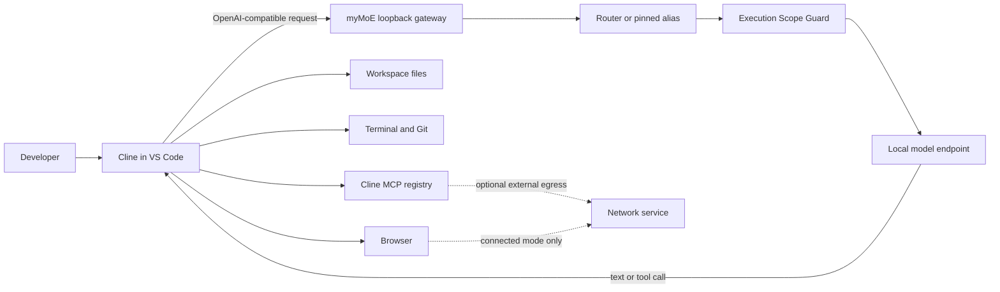

# Local Coding Fabric

## What this gives you

myMoE can be the local inference layer for a coding agent in VS Code. The first
integration target is [Cline](https://github.com/cline/cline): Cline reads and
edits the workspace, runs terminal and Git commands, opens a browser, and calls
MCP tools; myMoE receives the model requests on localhost and sends them only
to an eligible model from the active local profile.

The intended practical result is an agent workflow without a per-token API
bill:

> Ask Cline to inspect a repository, implement a change, run the tests, explain
> the diff, and check the local web page. Cline performs those actions in VS
> Code, while one or more local models provide the reasoning through myMoE.

This split is intentional. myMoE is the configurable inference control plane;
Cline is the mature coding harness. It avoids duplicating file editors,
terminal sessions, browser automation, approval UX, and the MCP ecosystem. In
this alpha, the OpenAI-compatible protocol, a real local model tool loop, and
an isolated read-only task through the Cline extension are validated. A
representative write, terminal, browser, or MCP task driven through the Cline
UI is still a release canary, so the whole integration remains experimental.

## What is implemented now

| Capability | Owner | Current status |
| --- | --- | --- |
| `GET /v1/models` | myMoE | Implemented on the loopback web server. Lists the routed alias and one pinned alias per configured OpenAI-compatible expert. |
| `POST /v1/chat/completions` | myMoE | Implemented for regular and streaming OpenAI-compatible requests, including tool definitions and tool-call payloads supported by the selected model endpoint. |
| Routed model alias `mymoe` | myMoE | Implemented. The configured router chooses one eligible expert from the request text. |
| Pinned aliases such as `mymoe/coder` | myMoE | Implemented when that expert ID exists in the active profile. Unknown aliases fail explicitly. |
| File search, reads, patches, and edits | Cline | Isolated file reads passed end to end through myMoE; search, patches, and edits remain pending. |
| Terminal, tests, and Git | Cline | Provided by Cline; keep approvals enabled during the integration canary. |
| Browser actions | Cline | Provided by Cline. Network access is a separate policy boundary described below, and the integration canary is pending. |
| MCP tools | Cline or the separate myMoE CLI agent | Available, but the two registries are independent. Installing or enabling an MCP server grants executable capability and requires review. |
| General desktop control outside the editor/browser | Future native sidecar | Not implemented. The accessibility-first design is documented in the roadmap below. |

The gateway does not silently call a paid provider. Its configured experts,
execution declarations, and scope guard remain authoritative. The default
server accepts loopback clients only. The shared process also contains the UI
and administrative `/api/*` routes, so it refuses every non-loopback bind even
if a future gateway policy permits remote clients. Remote inference requires a
separate, gateway-only authenticated listener; that listener is not implemented
in this alpha.

## Validated Cline canary

On 2026-07-20, an isolated Cline 4.0.10 extension instance completed a bounded
read-only task through myMoE `0.5.0a1` and the local MLX Qwen3-4B model:

- Cline read only `README.md` and `pyproject.toml`, then reported the project
  purpose and version `0.5.0a1` correctly.
- The Cline task recorded three file-read events. It invoked no write,
  terminal, browser, Git, MCP, or subagent tool.
- The myMoE gateway audit recorded four successful streamed requests with
  `requested_model=mymoe/general` and `route_selected=[general]`; the local
  model server returned HTTP 200 for all four.
- The two-file workspace remained byte-identical after the task.
- Cline emitted its XML-style file-tool protocol even with native tool calls
  enabled. The gateway's OpenAI `tool_calls` fidelity is covered separately by
  HTTP integration tests, not by this specific Cline canary.

The canary used temporary home, Cline data, extension, VS Code user-data, and
workspace directories. VS Code sync, telemetry, and updates were disabled, as
were Cline browser, MCP, hooks, checkpoints, and subagents. It proves this exact
read-only combination, not general write safety or reliable browser/desktop
autonomy.

## Five-minute Cline setup

### 1. Install and start a local model

For the default Apple Silicon profile:

```bash
uv sync --locked --python 3.12 --extra mlx
PYTHONPATH=src .venv/bin/python scripts/bootstrap_runtime.py --download-models
PYTHONPATH=src .venv/bin/python scripts/start_local_models.py --only-first
```

Keep that terminal open. In a second terminal, start the myMoE web server and
gateway:

```bash
.venv/bin/mymoe-web --port 8089
```

For the isolated Qwen3 Coder profile, use the same profile for both the model
server and myMoE:

```bash
PYTHONPATH=src .venv/bin/python scripts/bootstrap_runtime.py \
  --config configs/moe.live.qwen3-coder-mlx.example.json \
  --download-models
PYTHONPATH=src .venv/bin/python scripts/start_local_models.py \
  --config configs/moe.live.qwen3-coder-mlx.example.json \
  --only-first
.venv/bin/mymoe-web \
  --config configs/moe.live.qwen3-coder-mlx.example.json \
  --port 8089
```

Do not run the 30B coder beside the default pair on a 24 GiB machine. See
[24 GiB resource advice](#24-gib-resource-advice).

### 2. Confirm the local gateway

```bash
curl http://127.0.0.1:8089/v1/models
```

The response should contain `mymoe`. It contains `mymoe/coder` only when the
active profile has an expert whose ID is `coder`.

### 3. Configure Cline in VS Code

The extension surface checked for this alpha is
`saoudrizwan.claude-dev@4.0.10`. On a connected machine, install and verify that
exact version before opening its settings:

```bash
code --install-extension saoudrizwan.claude-dev@4.0.10 --force
code --list-extensions --show-versions
```

For an air-gapped machine, download that specific VSIX on a connected machine,
record its SHA-256 digest (`shasum -a 256 cline.vsix` on macOS), transfer both
the file and expected digest through the approved channel, verify the digest,
then install it with `code --install-extension /path/to/cline.vsix`. A VSIX is
executable extension code: keep the version and digest in the environment's
software inventory.

Then configure:

| Cline setting | Value |
| --- | --- |
| API Provider | `OpenAI Compatible` |
| Base URL | `http://127.0.0.1:8089/v1` |
| API Key | `local` if the form requires a value |
| Model ID | `mymoe`, or `mymoe/coder` with the coder profile |
| Context window | `16384` for the first 24 GiB coder canary |

The default myMoE gateway configuration does not require a key because it
accepts only loopback clients. In that default configuration, `local` is a
placeholder stored by Cline and is not a cloud credential. If
`gateway.api_key_env` is set in `configs/app.json`, start myMoE with that
environment variable and enter the exact same value in Cline instead.

Cline's current setup screen and terminology are documented in its official
[OpenAI Compatible provider guide](https://docs.cline.bot/provider-config/openai-compatible).

### 4. Run a read-only canary first

Start with a bounded request:

```text
Read README.md without changing files or running network commands. Summarize
what this repository does, then show which files you inspected.
```

Check that Cline proposes the expected file tools, receives valid tool-call
results, and stops. Then try a disposable repository task that runs one local
test and shows the diff. Keep write and terminal approvals enabled until that
exact model, quantization, runtime, context size, and Cline version have passed
your own canary.

If the model answers with prose instead of calling a tool, emits malformed tool
arguments, loops, or loses the task after an observation, the HTTP connection
is working but the selected model/runtime combination is not ready for that
agent workflow. Switch to a tool-capable profile or reduce the task. Do not fix
this by auto-approving more actions.

## Two honest network modes

"Local inference" and "air-gapped agent" are not synonyms. Browser research
requires network access; an air-gapped computer cannot browse the public web.

### Air-gapped

Use this mode when the machine must not send project data to the Internet:

- download the model, Python packages, Cline extension, and dependencies before
  disconnecting;
- use myMoE's managed model launcher after bootstrap: it forces Hugging Face,
  Transformers, and dataset loaders into offline mode and disables their
  telemetry, so a missing model fails instead of being fetched implicitly;
- keep the myMoE gateway and every configured model endpoint on loopback;
- restrict Cline browser work to `localhost` applications and local files;
- disable web/fetch tools and every MCP server that can make an external call;
- enforce the network boundary with the operating system or an external
  sandbox, not with prompt instructions.

myMoE currently enforces its inference endpoint policy, but it does not attest
or firewall Cline's browser, terminal, extension telemetry, or MCP processes.
An enforceable whole-agent egress broker is roadmap work. Until then, describe
this mode as air-gapped only when the host network boundary is independently
enforced.

### Browser-connected, inference-local

Use this mode when the agent may inspect documentation, issue trackers, or web
applications:

- model inference still goes from Cline to `127.0.0.1` and then to the selected
  local expert;
- Cline's browser/fetch tools and any networked MCP servers may contact external
  systems;
- the visited site or MCP service can receive queries, page interactions, and
  data the tool sends, even though the model is local;
- credentials, authenticated browser profiles, uploads, messages, and remote
  Git operations need their own explicit policy.

This mode can remain free of model API charges, but it is not offline and is
not a zero-egress environment.

## Architecture and trust boundaries



The responsibilities are deliberately separate:

- **myMoE owns inference selection:** request limits, loopback authorization,
  model aliases, routing, execution-scope eligibility, provider forwarding, and
  metadata-only gateway audit events.
- **The local model owns tool-call quality:** a compatible API shape does not
  prove that a model can plan, emit strict arguments, interpret observations,
  or finish a multi-step coding task.
- **Cline owns agent execution:** workspace selection, file changes, terminal
  processes, browser sessions, MCP connections, approvals, and conversation
  state.
- **The operating system owns the hard boundary:** filesystem permissions,
  process isolation, network firewalling, keychain access, and desktop privacy
  consent.

The gateway accepts OpenAI-compatible chat payloads and forwards the selected
expert's response. It does not import Cline conversations into myMoE chat or
memory stores. Gateway audit records contain operational metadata such as
hashes, correlation IDs, model selection, status, and byte counts rather than
request or response bodies. The selected model server and Cline can maintain
their own logs, so inspect their settings separately.

Multimodal message parts may use bounded inline `data:` URLs. The gateway
rejects `file:`, `http:`, and `https:` content URLs by default so a model server
cannot be turned into an implicit local-file reader or network proxy.

## 24 GiB resource advice

The Apple M5 Pro / 24 GiB machine has one measured resident shape and one
quality-first candidate that must run alone:

| Shape | Use it for | Evidence | Advice |
| --- | --- | --- | --- |
| Qwen3 4B + Qwen3 1.7B | Responsive chat, routing, summaries, and initial coding canaries | 2.49 GiB + 1.09 GiB model memory in isolated measurements | This is the default resident pair. Start only the first model when maximum headroom matters. |
| Qwen3 Coder 30B-A3B 4-bit | Quality-first coding experiments | Approximately 17.2 GB of model artifacts; runtime memory, swap, latency, 16K context, and multi-step tool use are not yet validated | Candidate only. Run alone, close memory-heavy apps, keep decode and prompt concurrency at `1`, use a 16K client context, and watch swap. |

The similarly sized measured Qwen3 30B general model used 17.29 GiB. Prior
joint-residency experiments with a 30B model caused severe swap pressure on the
24 GiB desktop. Therefore:

- do not keep the 30B coder and the default pair resident together;
- keep `decode_concurrency=1` and `prompt_concurrency=1`, as shipped in the
  coder profile, rather than running parallel coding generations;
- retain the shipped `prefill_step_size=1024`, one-entry prompt cache, and
  1 GiB prompt-cache byte cap (`prompt_cache_size=1` and
  `prompt_cache_bytes=1073741824`) for the first 24 GiB runs;
- configure Cline's client context window to `16384` and keep output bounded;
  lower the client budget if the complete desktop workload develops swap
  pressure;
- treat that 16K value as a client context recommendation, not as a server
  `max_kv_size` setting; the MLX profile controls pressure through concurrency,
  prefill, and prompt-cache parameters;
- use System Doctor, model inventory, model logs, and the performance report to
  inspect the runtime instead of guessing;
- treat automatic specialist cold-loading and resource admission as roadmap
  items, not implemented behavior.

The numbers above are evidence from one machine and runtime stack, not a
universal capacity promise. See [Tested Performance](tested-performance.md) for
the exact benchmark boundary.

## MCP without confusion

There are currently two MCP surfaces:

1. Cline can load MCP servers and expose their tools to the coding agent.
2. myMoE's separate CLI agent has its own registry in `configs/mcp.json`, with
   app-level process permission, per-call confirmation, and tool allowlists.

Connecting Cline to the myMoE inference gateway does not merge these
registries. Configure the tool where it will run. Every MCP server is executable
code with the permissions and network access of its process; review its source,
pin its version, minimize its allowlist, and do not assume MCP is a sandbox.

## Desktop accessibility sidecar roadmap

The browser and VS Code cover most coding work. General interaction with native
desktop applications needs a separate, narrow component; it should not be
implemented as unrestricted screen clicking inside the Python web process.

The planned architecture is a small native sidecar behind the same capability
broker:

1. **Semantic observation first.** On macOS, use the Accessibility API
   (`AXUIElement`) to return a bounded element tree, app identity, roles, labels,
   values, and available actions.
2. **Structured actions.** Address a specific app and element, then request a
   named accessibility action. Use allowlisted applications, visible action
   previews, deadlines, cancellation, and receipts.
3. **Visual evidence only when needed.** Use ScreenCaptureKit for a scoped
   screenshot when the accessibility tree is insufficient. Avoid continuous
   full-desktop capture.
4. **Input synthesis as a supervised fallback.** Mouse/keyboard events are less
   stable and less explainable than accessibility actions, so they remain an
   explicit high-risk fallback.
5. **Real user consent.** Accessibility and Screen Recording permissions are
   granted through macOS TCC. The project will never try to bypass those
   prompts, access secure input fields, or extract keychain credentials.
6. **Replaceable platform adapters.** Windows UI Automation and Linux AT-SPI can
   implement the same broker contract later without hard-coding macOS behavior
   into model prompts.

Vision-language desktop control remains experimental. It can help when an app
has a poor accessibility tree, but it is not the default authority for clicks,
credentials, purchases, messages, or destructive actions.

## Delivery roadmap

- **Now:** loopback OpenAI-compatible gateway, routed and pinned aliases,
  streaming proxy, experimental Cline setup, explicit network semantics, and
  evidence-qualified per-profile resource guidance.
- **Next:** a capability broker and execution receipts for filesystem,
  terminal, Git, and browser actions, a representative Cline-driven canary,
  plus repeatable local coding-agent evaluations across model/runtime
  combinations.
- **Then:** resource admission, session-sticky model selection, guarded
  specialist cold-loading, and measurable multi-model scheduling.
- **Later:** the accessibility-first desktop sidecar and replaceable platform
  adapters.

The release criterion is not "the endpoint answered." This alpha releases the
gateway layer, not a claim that the entire Cline fabric is production-ready.
That stronger claim requires representative Cline-driven repository tasks,
preserved sandbox and network policy, valid multi-step tool calls, controlled
swap, and an inspectable diff and test result.

## Related documentation

- [Installation](installation.md)
- [UI and CLI](ui.md)
- [Architecture](architecture.md)
- [Agent Runtime](agent-runtime.md)
- [Execution Scope Guard](execution-scopes.md)
- [Tested Performance](tested-performance.md)

[Back to the documentation hub](README.md)
