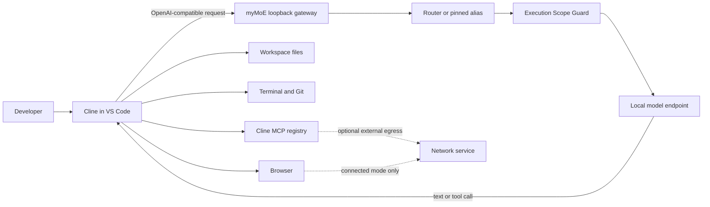

# Local Coding Fabric

## What this gives you

myMoE lets a coding agent use models running on your computer without a
per-token model fee. Its first integration target is
[Cline](https://github.com/cline/cline): Cline supplies the agent harness, while
myMoE receives model requests on loopback and forwards them only to the pinned,
device-only expert selected for the qualification.

Before trusting a local model with real code, `mymoe coding-canary` tests one
exact Cline/runtime/model/hardware cell. The disposable task is deliberately
small: read two fixture files, make one exact fix in one source file, and run
one exact test. The canary checks the tool sequence, workspace change, live
gateway binding, model alias, process result, and an independent rerun of the
pristine test.

This split avoids building another editor or agent UI. It also keeps the claim
narrow: passing proves only that exact disposable edit-and-test cell. It does
not qualify work on a real repository, browser or desktop control, MCP, Git
publication, unrestricted terminal use, or general autonomy.

> No per-token model fee does not mean zero cost. You still provide hardware,
> electricity, storage, and any obligations imposed by the model and tool
> licenses.

## What is implemented now

| Capability | Owner | Current status |
| --- | --- | --- |
| `GET /v1/models` | myMoE | Implemented on the loopback web server. Lists the routed alias and one pinned alias per configured OpenAI-compatible expert. |
| `POST /v1/chat/completions` | myMoE | Implemented for regular and streaming OpenAI-compatible requests, including tool definitions and tool-call payloads supported by the selected model endpoint. |
| Routed model alias `mymoe` | myMoE | Implemented. The configured router chooses one eligible expert from the request text. |
| Pinned aliases such as `mymoe/coder` | myMoE | Implemented when that expert ID exists in the active profile. Unknown aliases fail explicitly. |
| `mymoe coding-canary` | myMoE + Cline CLI | Implemented for Cline CLI 3.0.46 on macOS. Qualifies one pinned, disposable single-file edit and pristine-test contract. |
| File reads, one exact edit, and one exact test command | Cline under the canary gate | Implemented only inside the disposable fixture. The hook gate permits the expected sequence and the targeted sandbox permits only the source-file write. |
| Independent verification | myMoE | Implemented. A separate isolated verifier receives the candidate source and the pristine embedded test; it has no network access. |
| Real repository edits, unrestricted terminal, and Git | Cline | Cline can provide these capabilities, but the current canary does not qualify or contain them. |
| Browser actions inside Cline | Cline | Not qualified by the coding canary. The separate myMoE [Browser Capability Cell](browser-capability-cell.md) qualifies four local-web-app actions only. |
| MCP tools | Cline or the separate myMoE CLI agent | Not qualified by this canary. The registries are independent, and every MCP server is executable capability. |
| General desktop control outside the editor/browser | Future capability adapter | Not implemented. Accessibility-first adapters require separate OS-specific contracts and qualification. |

The gateway does not silently call a paid provider. Its configured experts,
execution declarations, and scope guard remain authoritative. The default
server accepts loopback clients only. The shared process also contains the UI
and administrative `/api/*` routes, so it refuses every non-loopback bind even
if a future gateway policy permits remote clients. Remote inference requires a
separate, gateway-only authenticated listener; that listener is not implemented
in this alpha.

## What the canary actually contains

The canary is pinned to Cline CLI `3.0.46` and requires the exact SHA-256 of its
direct native executable. It also requires a canonical numeric loopback gateway
URL, a device-only myMoE configuration, and a pinned `mymoe/<expert-id>` alias. It
compares the declared configuration with the live `/v1/models` and `/api/config`
identity before and after execution. The comparison uses a canonical digest of
the complete effective runtime configuration, including routing, timeouts, and
all provider-facing expert parameters; it does not expose those parameters.

For the disposable run, myMoE creates isolated Cline state and configuration,
disables MCP and unrelated Cline tools, and installs a `PreToolUse` hook. The
hook accepts only the expected `read_files` -> `editor` -> `run_commands`
contract. A generated macOS `sandbox-exec` profile is live-probed before Cline
starts; it restricts writes in the disposable workspace to the exact source
file, denies other host-file writes, denies network bind, and permits outbound
network only to a random, parent-owned loopback inference broker. The broker
accepts only the expected model and chat-completions path.

After the run, myMoE rejects extra, missing, renamed, linked, or special files
and compares Cline's event lifecycle with the hook evidence. Only an expected
single-file change reaches a separate verifier, which reruns the pristine test
without network access.

This is a hook policy gate plus targeted host-data and egress sandbox. It is
not a VM, container, different operating-system user, or general Cline
containment boundary. The report explicitly records
`process_tree=observed_cleanup_not_vm_containment`.

## Start and qualify one local coding cell

### 1. Install and start a local model

For the default Apple Silicon profile:

```bash
uv sync --locked --python 3.12 --extra mlx --extra coding-canary
PYTHONPATH=src .venv/bin/python scripts/bootstrap_runtime.py --download-models
PYTHONPATH=src .venv/bin/python scripts/start_local_models.py --only-first
```

Keep that terminal open. In a second terminal, start the myMoE web server and
gateway:

```bash
.venv/bin/mymoe-web --port 8089
```

For the isolated Qwen3 Coder profile, use the same profile for both the model
server and myMoE:

```bash
PYTHONPATH=src .venv/bin/python scripts/bootstrap_runtime.py \
  --config configs/moe.live.qwen3-coder-mlx.example.json \
  --download-models
PYTHONPATH=src .venv/bin/python scripts/start_local_models.py \
  --config configs/moe.live.qwen3-coder-mlx.example.json \
  --only-first
.venv/bin/mymoe-web \
  --config configs/moe.live.qwen3-coder-mlx.example.json \
  --port 8089
```

Do not run the 30B coder beside the default pair on a 24 GiB machine. See
[24 GiB resource advice](#24-gib-resource-advice).

### 2. Confirm the local gateway

```bash
curl http://127.0.0.1:8089/v1/models
```

The response should contain `mymoe`. It contains `mymoe/coder` only when the
active profile has an expert whose ID is `coder`.

### 3. Pin the trusted Cline CLI

The automated contract currently supports exactly Cline CLI `3.0.46`. Obtain
that version through your trusted software-admission process and record the
SHA-256 of the direct compiled Mach-O executable in an inventory separate from
the canary run. The npm package's small `bin/cline` JavaScript file is only a
resolver and is rejected because its digest does not bind the binary it starts.
Use the native target it resolves, commonly `bin/.cline` on macOS. Verify both
before continuing:

```bash
CLINE_BIN=/absolute/path/to/native/.cline
shasum -a 256 "$CLINE_BIN"
"$CLINE_BIN" --version
```

Compare the first command's digest with the trusted 64-character lowercase
value before executing the file. The second command must then report `3.0.46`.
The canary enforces this order internally: it verifies the digest and rejects
scripts or indirect launchers before running the bounded version probe.
Calculating a digest after a suspected compromise does not establish
provenance.

The command is packaged as an optional surface. If this checkout was installed
without it, add `uv sync --locked --extra coding-canary` (or install
`local-moe-orchestrator[coding-canary]`) before running the canary.

### 4. Run the automated coding canary

Use the same gateway configuration that started the live model and gateway.
The alias must pin one expert; the routed alias `mymoe` is intentionally
rejected.

```bash
mymoe coding-canary \
  --cline "$CLINE_BIN" \
  --cline-sha256 "$TRUSTED_CLINE_SHA256" \
  --base-url http://127.0.0.1:8089/v1 \
  --gateway-config configs/moe.live.qwen3-coder-mlx.example.json \
  --model mymoe/coder \
  --timeout-seconds 180 \
  --json \
  --out coding-canary.json
```

`--base-url` accepts only a canonical numeric IPv4 loopback HTTP URL. The
canary authenticates its isolated Cline state itself; it does not reuse your
normal Cline settings, MCP registry, home directory, or API key.

The command has three diagnostic outcomes plus one caller-contract error:

| Exit | Report status | Meaning |
| --- | --- | --- |
| `0` | `qualified` | Every gate passed for this exact disposable Cline/runtime/model/hardware cell. |
| `1` | `incompatible` | The run completed well enough to conclude that the exact cell did not satisfy the edit-and-test contract. |
| `2` | `error` | Caller input or the pinned contract is invalid, including a wrong Cline version/digest, gateway URL, model alias, or configuration. |
| `3` | `indeterminate` | The host, process, timeout, gateway, or evidence stream prevented a trustworthy compatibility judgment. |

Do not convert `indeterminate` into `incompatible`, and do not treat
`incompatible` as a statement about every task the model can perform. Every
report, even `qualified`, contains `diagnostic_only=true` and
`authorizes_routing=false`; the command never changes a profile or enables
traffic. A passing report adds only
`qualified_scope=single_disposable_file_edit_and_pristine_test`.
The JSON is metadata-only: it records hashes, counters, status codes, and
bounded process evidence rather than prompts, model output, credentials, or
raw filesystem paths.

Cline 3.0.46 can emit one fixed AI SDK warning banner on stdout before its
NDJSON events. The parser recognizes only those exact constant bytes, records
the ignored-banner count, and continues to reject every other non-JSON line as
ambiguous evidence.

### Current measured coding-cell result

On 2026-07-20, the Apple M5 Pro / 24 GiB cell using Cline CLI `3.0.46`, the
device-only Qwen3 Coder 30B-A3B 4-bit profile, and the local MLX runtime returned
`incompatible` with `tool_request_denied`:

- the Cline executable digest, full live runtime-config digest, pinned model,
  loopback broker, and before/after gateway identity checks passed;
- the generated sandbox passed its live host-read, host-write, scratch-write,
  protected-file, network-bind, allowed-port, and denied-port probes;
- the model completed the fixture read, then requested an editor operation that
  did not match the exact allowed patch, so the pre-tool gate stopped it;
- the source and pristine test remained unchanged, and the report retained
  `authorizes_routing=false`.

This is a negative result for that exact model/runtime/hardware/agent-harness
cell. It is not evidence that the model cannot help with other coding tasks, and
it is not converted into a routing policy.

### 5. Optionally connect Cline in VS Code

After qualification, you can configure the Cline editor interface for manual
experiments:

| Cline setting | Value |
| --- | --- |
| API Provider | `OpenAI Compatible` |
| Base URL | `http://127.0.0.1:8089/v1` |
| API Key | `local` if the form requires a value |
| Model ID | Prefer the qualified pinned alias, such as `mymoe/coder` |
| Context window | `16384` for the first 24 GiB coder canary |

The default myMoE gateway configuration does not require a key because it
accepts only loopback clients. In that default configuration, `local` is a
placeholder stored by Cline and is not a cloud credential. If
`gateway.api_key_env` is set in `configs/app.json`, start myMoE with that
environment variable and enter the exact same value in Cline instead.

Cline's current setup screen and terminology are documented in its official
[OpenAI Compatible provider guide](https://docs.cline.bot/provider-config/openai-compatible).

An ordinary editor session is not launched through the canary's hook gate,
loopback broker, or sandbox profile. Keep Cline's own approvals enabled, begin
with a disposable repository, inspect the diff, and apply independent host
controls appropriate to the tools you enable.

If the model answers with prose instead of calling a tool, emits malformed tool
arguments, loops, or loses the task after an observation, the HTTP connection
is working but the selected model/runtime combination is not ready for that
agent workflow. Switch to a tool-capable profile or reduce the task. Do not fix
this by auto-approving more actions.

## Two honest network modes

"Local inference" and "air-gapped agent" are not synonyms. Browser research
requires network access; an air-gapped computer cannot browse the public web.

### Air-gapped

Use this mode when the machine must not send project data to the Internet:

- download the model, Python packages, Cline extension, and dependencies before
  disconnecting;
- use myMoE's managed model launcher after bootstrap: it forces Hugging Face,
  Transformers, and dataset loaders into offline mode and disables their
  telemetry, so a missing model fails instead of being fetched implicitly;
- keep the myMoE gateway and every configured model endpoint on loopback;
- restrict Cline browser work to `localhost` applications and local files;
- disable web/fetch tools and every MCP server that can make an external call;
- enforce the network boundary with the operating system or an external
  sandbox, not with prompt instructions.

The automated canary restricts only its own Cline CLI process to its random
loopback broker. myMoE does not attest or firewall an ordinary Cline editor
session, browser, terminal, extension telemetry, or MCP process. An enforceable
whole-agent egress broker is roadmap work. Until then, describe this mode as
air-gapped only when the host network boundary is independently enforced.

### Browser-connected, inference-local

Use this mode when the agent may inspect documentation, issue trackers, or web
applications:

- model inference still goes from Cline to `127.0.0.1` and then to the selected
  local expert;
- Cline's browser/fetch tools and any networked MCP servers may contact external
  systems;
- the visited site or MCP service can receive queries, page interactions, and
  data the tool sends, even though the model is local;
- credentials, authenticated browser profiles, uploads, messages, and remote
  Git operations need their own explicit policy.

This mode can remain free of model API charges, but it is not offline and is
not a zero-egress environment.

## Architecture and trust boundaries



The responsibilities are deliberately separate:

- **myMoE owns inference selection:** request limits, loopback authorization,
  model aliases, routing, execution-scope eligibility, provider forwarding, and
  metadata-only gateway audit events.
- **The local model owns tool-call quality:** a compatible API shape does not
  prove that a model can plan, emit strict arguments, interpret observations,
  or finish a multi-step coding task.
- **The canary owns one diagnostic contract:** its pre-tool hook, loopback
  broker, targeted sandbox, fixture inspection, and independent verifier apply
  only to the disposable process it starts.
- **Cline owns agent execution:** workspace selection, file changes, terminal
  processes, browser sessions, MCP connections, approvals, and conversation
  state in ordinary editor sessions.
- **The operating system owns the hard boundary:** filesystem permissions,
  process isolation, network firewalling, keychain access, and desktop privacy
  consent.

The gateway accepts OpenAI-compatible chat payloads and forwards the selected
expert's response. It does not import Cline conversations into myMoE chat or
memory stores. Gateway audit records contain operational metadata such as
hashes, correlation IDs, model selection, status, and byte counts rather than
request or response bodies. The selected model server and Cline can maintain
their own logs, so inspect their settings separately.

Multimodal message parts may use bounded inline `data:` URLs. The gateway
rejects `file:`, `http:`, and `https:` content URLs by default so a model server
cannot be turned into an implicit local-file reader or network proxy.

## 24 GiB resource advice

The Apple M5 Pro / 24 GiB machine has one measured resident shape and one
quality-first candidate that must run alone:

| Shape | Use it for | Evidence | Advice |
| --- | --- | --- | --- |
| Qwen3 4B + Qwen3 1.7B | Responsive chat, routing, summaries, and initial coding canaries | 2.49 GiB + 1.09 GiB model memory in isolated measurements | This is the default resident pair. Start only the first model when maximum headroom matters. |
| Qwen3 Coder 30B-A3B 4-bit | Quality-first coding experiments | Approximately 17.2 GB of model artifacts; the first strict Cline edit-and-test cell was incompatible after an out-of-contract editor request, while broader runtime memory, swap, latency, and 16K-context evidence remain incomplete | Candidate only. Run alone, close memory-heavy apps, keep decode and prompt concurrency at `1`, use a 16K client context, and watch swap. |

The similarly sized measured Qwen3 30B general model used 17.29 GiB. Prior
joint-residency experiments with a 30B model caused severe swap pressure on the
24 GiB desktop. Therefore:

- do not keep the 30B coder and the default pair resident together;
- keep `decode_concurrency=1` and `prompt_concurrency=1`, as shipped in the
  coder profile, rather than running parallel coding generations;
- retain the shipped `prefill_step_size=1024`, one-entry prompt cache, and
  1 GiB prompt-cache byte cap (`prompt_cache_size=1` and
  `prompt_cache_bytes=1073741824`) for the first 24 GiB runs;
- configure Cline's client context window to `16384` and keep output bounded;
  lower the client budget if the complete desktop workload develops swap
  pressure;
- treat that 16K value as a client context recommendation, not as a server
  `max_kv_size` setting; the MLX profile controls pressure through concurrency,
  prefill, and prompt-cache parameters;
- use System Doctor, model inventory, model logs, and the performance report to
  inspect the runtime instead of guessing;
- treat automatic specialist cold-loading and resource admission as roadmap
  items, not implemented behavior.

The numbers above are evidence from one machine and runtime stack, not a
universal capacity promise. See [Tested Performance](tested-performance.md) for
the exact benchmark boundary.

## MCP without confusion

There are currently two MCP surfaces:

1. Cline can load MCP servers and expose their tools to the coding agent.
2. myMoE's separate CLI agent has its own registry in `configs/mcp.json`, with
   app-level process permission, per-call confirmation, and tool allowlists.

Connecting Cline to the myMoE inference gateway does not merge these
registries. Configure the tool where it will run. Every MCP server is executable
code with the permissions and network access of its process; review its source,
pin its version, minimize its allowlist, and do not assume MCP is a sandbox.

## Desktop accessibility sidecar roadmap

The browser and VS Code cover most coding work. General interaction with native
desktop applications needs a separate, narrow component; it should not be
implemented as unrestricted screen clicking inside the Python web process.

The canonical plan is a provider-neutral desktop lifecycle behind the same
capability broker. Cua Drivers is the first adapter candidate to evaluate;
native accessibility sidecars remain replaceable alternatives or fallbacks.
The detailed contract and progression live in
[Browser Capability Cell](browser-capability-cell.md#desktop-control-roadmap):

1. **Semantic observation first.** On macOS, use the Accessibility API
   (`AXUIElement`) to return a bounded element tree, app identity, roles, labels,
   values, and available actions.
2. **Structured actions.** Address a specific app and element, then request a
   named accessibility action. Use allowlisted applications, visible action
   previews, deadlines, cancellation, and receipts.
3. **Visual evidence only when needed.** Use ScreenCaptureKit for a scoped
   screenshot when the accessibility tree is insufficient. Avoid continuous
   full-desktop capture.
4. **Input synthesis as a supervised fallback.** Mouse/keyboard events are less
   stable and less explainable than accessibility actions, so they remain an
   explicit high-risk fallback.
5. **Real user consent.** Accessibility and Screen Recording permissions are
   granted through macOS TCC. The project will never try to bypass those
   prompts, access secure input fields, or extract keychain credentials.
6. **Replaceable platform adapters.** Windows UI Automation and Linux AT-SPI can
   implement the same broker contract later without hard-coding macOS behavior
   into model prompts.

Vision-language desktop control remains experimental. It can help when an app
has a poor accessibility tree, but it is not the default authority for clicks,
credentials, purchases, messages, or destructive actions.

## Delivery roadmap

- **Now:** loopback OpenAI-compatible gateway, routed and pinned aliases,
  streaming proxy, and the macOS-only Cline CLI 3.0.46 qualification for one
  disposable single-file edit and pristine test. A separate exact-origin
  browser cell now qualifies four accessibility-first operations against one
  local HTTP(S) application without qualifying the selected model.
- **Next:** repeat the coding-cell evaluation across selected local
  model/runtime/hardware combinations, publish comparable metadata-only
  evidence, and add explicit resource admission before concurrent local-model
  runs.
- **Then:** design separate, bounded qualification contracts and receipts for
  real-repository filesystem, terminal, and Git operations; browser and MCP
  remain distinct capability and egress cells rather than inherited promises.
- **Later:** guarded specialist cold-loading, session-sticky multi-model
  scheduling, broader MCP cells, and the provider-neutral accessibility-first
  desktop lifecycle described above.

The release criterion is not "the endpoint answered." This alpha releases the
gateway plus narrow coding and local-browser diagnostic contracts, not a claim
that the entire fabric is production-ready. Desktop control, general MCP, Git
publication, real repositories, and general autonomy require their own policies,
representative tasks, independent verification, resource evidence, and explicit
authority.

## Related documentation

- [Installation](installation.md)
- [UI and CLI](ui.md)
- [Architecture](architecture.md)
- [Agent Runtime](agent-runtime.md)
- [Execution Scope Guard](execution-scopes.md)
- [Tested Performance](tested-performance.md)

[Back to the documentation hub](README.md)
