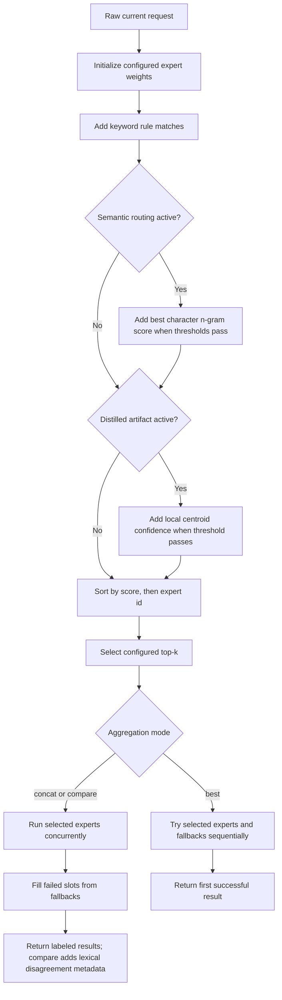

# Routing

myMoE uses a local routing layer before generation. The router decides which configured expert should answer a request, then the orchestrator calls the selected local model endpoint.

For the router's place in the complete runtime, see [How myMoE works](how-it-works/README.md#5-routing-selection-and-fallbacks).

## Default Strategy

The default live profile uses `strategy = distilled`:

1. expert base weights provide a stable default,
2. keyword rules add explicit high-confidence signals,
3. semantic route examples add language-aware intent matching through local character n-grams,
4. a local distilled route artifact adds classifier-style scores trained from curated route labels.

This keeps runtime routing cheap and offline. The heavy general model is not used to classify every request because that would add latency, occupy the most expensive context, and make routing fail whenever the heavy endpoint is unavailable.

## Multilingual Behavior

The router is multilingual where a profile has configured examples, learned
centroid features, keyword rules, or sufficiently close lexical overlap. Three
coverage lists must remain separate:

- `configs/app.json` declares response-language hints for Italian, English,
  French, German, Spanish, Portuguese, Dutch, Polish, Arabic, Hindi, Japanese,
  Korean, and Chinese, plus automatic detection.
- each MoE profile owns its own routing examples and keywords, so profile
  coverage can differ from the app-level response hints;
- the current disjoint 52-case router holdout evaluates four prompts each in
  Arabic, German, English, Spanish, French, Hindi, Italian, Japanese, Korean,
  Dutch, Swedish, Turkish, and Chinese.

The model response language is a separate concern. The provider system instruction tells the selected model to answer in the user's language unless asked otherwise. Actual answer quality still depends on the selected model.

This is not a universal-language guarantee. To support additional languages
reliably, add route examples and independent eval cases for those languages.
A future local multilingual embedding matcher can fit behind the router
boundary, but the current config parser implements only `char_ngrams`, so that
backend would require code plus a new validated config method.

## Decision Flow

For each expert, the router computes:

```text
score = base expert weight
      + keyword rule contributions
      + accepted semantic contribution
      + accepted distilled-artifact contribution
```

Semantic contribution is applied only for `hybrid` or `distilled` strategy and
only when the configured minimum score and winner margin pass. The distilled
contribution is applied only for `distilled` strategy and only when the local
artifact confidence passes its threshold. Experts are then sorted by score
descending and expert id ascending, which makes ties deterministic.



An enabled but missing or invalid distilled artifact fails router
initialization. It does not silently downgrade the configured strategy.

## Why Not Route With the Largest Model?

Using the largest model as the default classifier is usually the wrong local tradeoff:

- it adds one extra heavy inference call before every answer,
- it increases latency for simple requests,
- it makes the whole app depend on the most memory-hungry process,
- it consumes context that should be used for the user's actual task.

The larger model is better used as:

- the primary general-purpose expert,
- an offline teacher for creating route labels,
- an optional judge for eval creation and regression checks.

## Similar Tool Patterns

Common agent and RAG frameworks use similar separation:

- [Semantic Router](https://docs.aurelio.ai/semantic-router/get-started/introduction) uses a semantic decision layer to route requests by meaning instead of waiting for a full LLM generation.
- [LlamaIndex routers](https://developers.llamaindex.ai/python/framework/module_guides/querying/router/) select among query engines or tools based on the query and available choices.
- [Haystack ConditionalRouter](https://docs.haystack.deepset.ai/docs/conditionalrouter) routes data through different pipeline paths by evaluating configured conditions.
- [LangGraph workflows and agents](https://docs.langchain.com/oss/python/langgraph/workflows-agents) model deterministic workflow paths and dynamic agent steps as graph nodes and edges.

myMoE keeps the same pattern local and config-driven. The current implementation uses deterministic rules, local semantic examples, and a local distilled classifier artifact; the same contract can later host multilingual embeddings without changing the UI or orchestrator.

The current distilled artifact is a local `char_ngram_centroid` classifier
trained from curated route labels. Artifact v2 records a fingerprint plus the
training prompt ids and hashes. It is not a cloud dependency and can be
regenerated with:

```bash
uv run --locked --python 3.12 python experiments/build_route_label_dataset.py \
  --eval experiments/eval_set_live_general.jsonl \
  --out experiments/route_labels_live_general.jsonl
uv run --locked --python 3.12 python experiments/train_distilled_router.py \
  --labels experiments/route_labels_live_general.jsonl \
  --out outputs/router-distilled-live-general.json
```

The source file above is training data, not an unbiased eval. Run the disjoint
holdout with:

```bash
uv run --locked --python 3.12 python experiments/run_smoke_eval.py \
  --config configs/moe.live.general-mlx.example.json \
  --eval experiments/eval_set_live_general_holdout_v5.jsonl \
  --training-labels experiments/route_labels_live_general.jsonl \
  --out outputs/live-general-routing-holdout.json
```

The full quality gate exits non-zero when ids or normalized prompt hashes
overlap, when the artifact does not match the labels, when a report differs from
a fresh recomputation, or when any config/dataset/artifact provenance is stale.

## Config Shape

```json
{
  "routing": {
    "strategy": "distilled",
    "aggregation": "best",
    "top_k": 1,
    "semantic": {
      "enabled": true,
      "method": "char_ngrams",
      "min_score": 0.16,
      "margin": 0.02,
      "weight": 2.4,
      "examples": [
        {
          "expert_id": "general",
          "utterances": ["analyze this decision", "analizza questa decisione"]
        },
        {
          "expert_id": "fast_fallback",
          "utterances": ["summarize this note", "riassumi questa nota"]
        }
      ]
    },
    "distilled": {
      "enabled": true,
      "artifact_path": "outputs/router-distilled-live-general.json",
      "min_confidence": 0.08,
      "weight": 2.0
    }
  }
}
```

## Validation

Router changes must pass:

- unit tests for config parsing and route decisions,
- deterministic base and extended eval sets,
- the live disjoint routing holdout with at least 50 multilingual prompts,
- zero train/holdout id and normalized prompt-hash overlap,
- current config/training/artifact/report SHA-256 provenance,
- browser/API checks for `/api/config`, `/api/generate`, and `/api/evaluate`.
