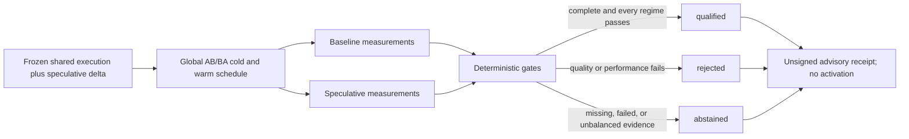

# Speculative Cell Qualifier

## What this changes in the real world

Speculative decoding is often presented as a speed switch. It is not. A draft
model, MTP head, or n-gram strategy can predict tokens for the target model to
verify in batches, but preparing those predictions costs compute and memory.
On one machine the same configuration can accelerate a workload; on another it
can make every request slower.

The Speculative Cell Qualifier answers one narrow, useful question:

> Did this exact speculative configuration beat its exact non-speculative
> baseline on this frozen workload and machine without changing output or
> violating latency and memory limits?

It returns `qualified`, `rejected`, or `abstained`. It does not enable a server,
edit a myMoE profile, or claim that the result transfers to another model,
runtime revision, machine, prompt set, or sampling policy.

## Why this belongs in myMoE

llama.cpp already implements draft-model, EAGLE-3, DFlash, MTP, several n-gram
strategies, and
[SPEED-Bench](https://github.com/ggml-org/llama.cpp/tree/master/tools/server/bench/speed-bench)
for paired performance collection. myMoE does not
duplicate that inference engine or benchmark runner. It adds the qualification
plane above them: a frozen exact-cell contract, a globally preregistered
schedule, independent gates per regime, payload-free receipts, and honest
abstention. A future live collector should reuse a content-bound SPEED-Bench
revision instead of inventing another timing loop.

The distinction matters because upstream documentation says speculative
decoding *can* accelerate generation and exposes several implementations, while
real configurations can regress. See the
[llama.cpp speculative-decoding documentation](https://github.com/ggml-org/llama.cpp/blob/master/docs/speculative.md),
the [llama.cpp server timing contract](https://github.com/ggml-org/llama.cpp/blob/master/tools/server/README.md#post-v1chatcompletions),
and a documented
[Apple Silicon MTP regression](https://github.com/ggml-org/llama.cpp/issues/23752).
vLLM likewise warns that gains depend on model, hardware, traffic, and sampling;
see its [speculative decoding guide](https://docs.vllm.ai/en/latest/features/speculative_decoding/).

## Decision flow



## Exact-cell binding

The plan contains exactly one shared execution binding for both arms:

- llama.cpp revision and binary SHA-256;
- the existing myMoE runtime-binding-manifest SHA-256;
- target-model and hardware-profile SHA-256;
- every non-speculative runtime-setting SHA-256;
- text-only request/sampling-policy SHA-256;
- cold/warm regime-protocol SHA-256;
- harness and collector code SHA-256; and
- adapter and qualifier contract SHA-256.

The baseline and candidate then contain only the isolated speculative delta:
mode, speculative-configuration SHA-256, and an exact draft-model SHA-256 when
that mode needs one. Their speculative-configuration digests must differ. The
plan also binds the frozen workload, sorted case digests, policy, cold/warm
regimes, trial count, and order seed.

Cross-request stateful `ngram-cache` and `ngram-mod` are deliberately rejected
in this alpha. `ngram-mod` shares a pool across server slots and `ngram-cache`
maintains statistics, so they require reset/cache telemetry that the current
adapter cannot verify. Per-request history modes such as `ngram-simple` remain
eligible. Stateful modes can return only with a stronger collector contract.

This comparison is a **cell** comparison, not a model leaderboard. Changing one
bound component requires a new plan and fresh evidence.

## Qualification gates

The default policy requires four repetitions for every case in both `cold` and
`warm` regimes. Each trial binds its global sequence index and deterministic
AB/BA order, so reordering or selectively keeping favorable runs produces
abstention.

The receipt reports separately:

- exact output SHA-256 and generated-token count mismatches;
- cold and warm median paired generation-throughput ratios;
- cold and warm candidate/baseline p95 end-to-end latency ratios;
- cold and warm candidate/baseline p95 time-to-first-token ratios;
- peak candidate memory;
- generated and accepted draft-token counts; and
- arm failures, case coverage, regime coverage, and order balance.

Default thresholds are configurable and digest-bound: each regime needs at
least `1.10x` median speedup, no p95 end-to-end regression, at most `1.05x` p95
TTFT, and at least `5%` draft-token acceptance. Exact output/token equality is
not optional. Candidate memory has one explicit absolute peak budget. Missing
acceptance, incomplete/failing evidence, or schedule drift abstains rather than
silently shrinking or pooling the sample. Full-precision floating-point values
drive gates and are preserved in the receipt; presentation layers may round
them only for display.

## llama.cpp adapter boundary

`llama_cpp_speculative_adapter.py` accepts a completed, text-only llama.cpp
OpenAI-style chat or text completion plus host-observed TTFT, total latency, and
exact runtime-process-tree peak memory. It cross-checks
`usage.completion_tokens` against `timings.predicted_n`, reads `predicted_ms`,
`draft_n`, and `draft_n_accepted`, hashes a canonical envelope containing the
visible text surface and finish reason, and discards the text. Tool calls,
function calls, hidden-reasoning fields, ambiguous messages, and non-terminal
finish reasons fail closed rather than being treated as equivalent text.

The adapter deliberately does not:

- start, stop, restart, download, or configure llama.cpp;
- open a network connection;
- infer whether a run was truly cold;
- discover which process owns an endpoint;
- retain prompts or generated output; or
- turn a receipt into routing authority.

An external collector remains responsible for numeric-loopback transport,
streaming first-content timing, process-tree memory measurement, cache-regime
discipline, the frozen global schedule, and binding observations to the plan.
For live llama.cpp work, the intended starting point is an exact content-bound
SPEED-Bench revision. That boundary avoids pretending an in-process parser can
attest its host.

## Command workflow

Create the replaceable template directly from the installed wheel:

```bash
mymoe-speculative init --out ./speculative-plan.json --json
```

The command refuses to overwrite an existing path and requests mode `0600` on
POSIX. On Windows it relies on the destination directory's ACL and does not
claim to create an owner-only ACL. Validate the edited frozen plan without model
access:

```bash
mymoe-speculative inspect --plan ./speculative-plan.json --json
```

The generated object is identical to
[`configs/speculative-cell-plan.example.json`](../configs/speculative-cell-plan.example.json).
Replace every synthetic digest and identifier with exact local evidence. Leave
the self-digest fields empty while authoring; `inspect` recomputes and reports
the plan, baseline-cell, candidate-cell, and policy digests that every trial
must bind.

Evaluate canonical JSONL trial evidence offline:

```bash
mymoe-speculative qualify \
  --plan ./speculative-plan.json \
  --trials ./speculative-trials.jsonl \
  --out ./speculative-receipt.json \
  --json
```

Exit `0` means the exact evidence qualified. Exit `2` means valid evidence was
rejected or caused abstention. Exit `1` means malformed or unavailable input.
`--out` refuses replacement and requests mode `0600` on POSIX; on Windows its
confidentiality depends on the parent ACL. Receipts are content-free but not
confidential: stable digests reveal equality and workload shape, so do not
publish private workload receipts casually.

## Deterministic contract benchmark

Run the checked, model-free benchmark:

```bash
uv run python experiments/benchmark_speculative_cell_qualifier.py --check
```

It exercises:

- a complete cell that passes every gate;
- output, latency, TTFT, speed, and memory regressions that reject;
- incomplete evidence that abstains;
- deterministic AB/BA order;
- global schedule enforcement and independent cold/warm gates;
- llama.cpp timing/usage cross-checking; and
- canonical text-envelope-only retention with agentic surfaces rejected.

The generated artifact is
[`outputs/speculative-cell-qualifier-contract.json`](../outputs/speculative-cell-qualifier-contract.json).
It is a synthetic contract fixture. It makes no live speed, memory, quality, or
cost claim.

## Threat model and limits

| Threat | Current control | Residual limit |
| --- | --- | --- |
| Compare different targets, binaries, harnesses, requests, or machines | One shared execution binding plus one isolated speculative delta | A dishonest producer can lie about what those digests represent |
| Cherry-pick or reorder favorable trials | Frozen cases, global sequence indices, cold/warm regimes, and deterministic AB/BA order | The host can fabricate a complete-looking set |
| Prime a cross-request cache | Stateful `ngram-cache` and `ngram-mod` are excluded from the alpha | Other hidden runtime state still relies on the bound regime protocol |
| Speed up by changing output | Canonical text surface, finish reason, and generated-token count must match; agentic surfaces are rejected | Hash equality is not universal semantic equivalence |
| Hide one bad regime or latency tail | Cold and warm have independent median, p95 end-to-end, TTFT, and acceptance gates | Small workloads still have limited statistical power |
| Ignore draft overhead | Acceptance and absolute peak-memory gates | Energy and thermal state are not yet measured |
| Reuse stale evidence | Plan binds exact cell, hardware, workload, and policy | Receipts currently have no signed freshness authority |
| Treat qualification as permission | `activation_authorized: false` is invariant | An external system could ignore the contract |
| Leak prompts or answers | Trial and receipt contracts store only hashes and counters | Stable hashes can reveal low-entropy or repeated data |

The receipt is `host_attested_unsigned_advisory`. It verifies schema, binding,
coverage, order, and arithmetic; it cannot prove the collector was honest, the
workload was representative, the cold state was real, or the host clocks and
memory counters were accurate. Promotion into an active myMoE profile requires
a separate trusted producer and policy boundary that does not exist in this
alpha.

## Next evidence tranche

The next useful increment is a controlled wrapper around a pinned llama.cpp
SPEED-Bench revision for two already-running, explicit numeric-loopback servers.
It should capture streaming TTFT, server timings, exact process-tree
memory/swap, runtime health, restart-based cold state, and the frozen global
schedule, then emit the strict trial contract. Stateful n-gram modes need
explicit cache/reset telemetry before admission. A second adapter should be
added only after this collector produces a complete live negative or positive
result; MLX is the likely next runtime.
