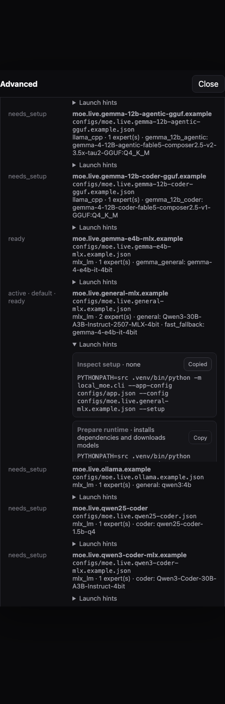
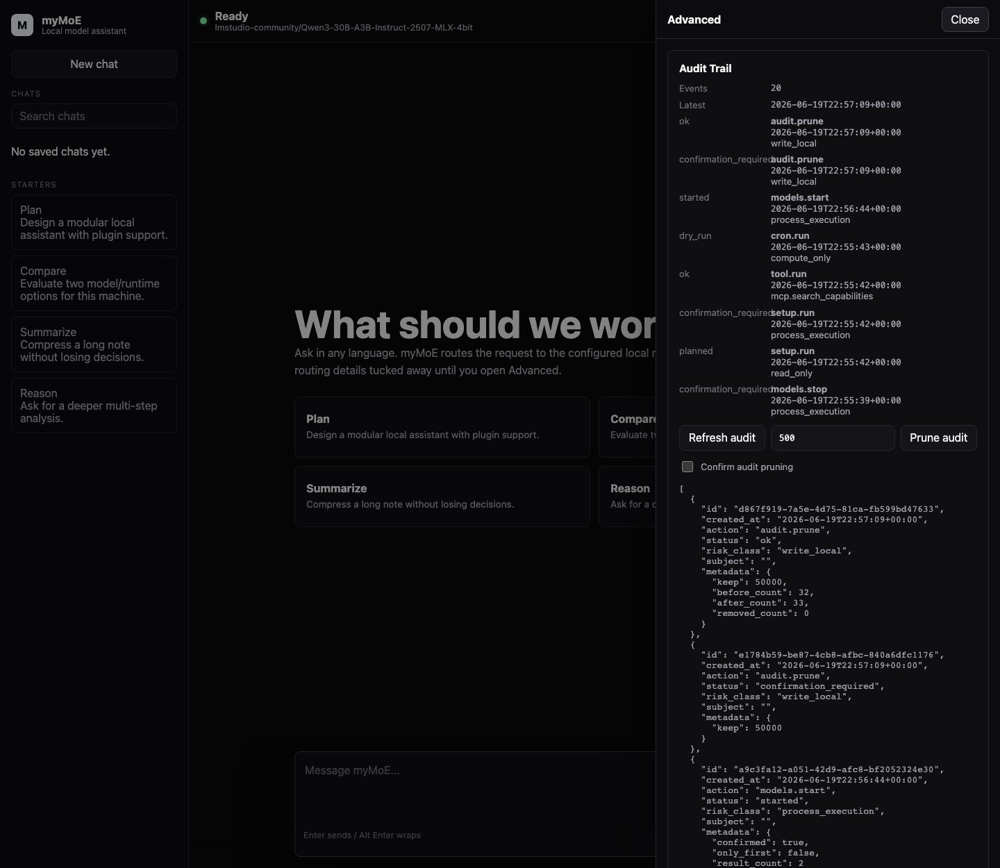
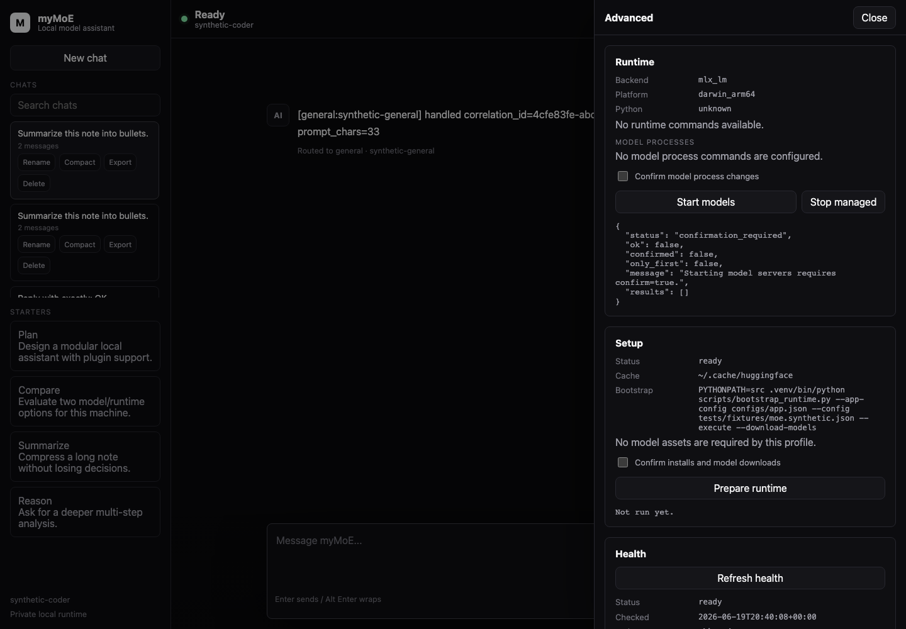
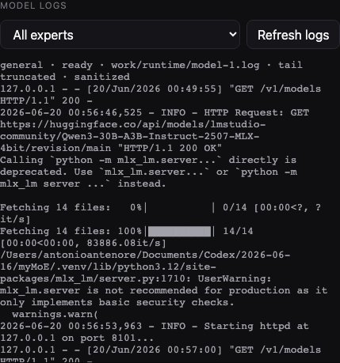
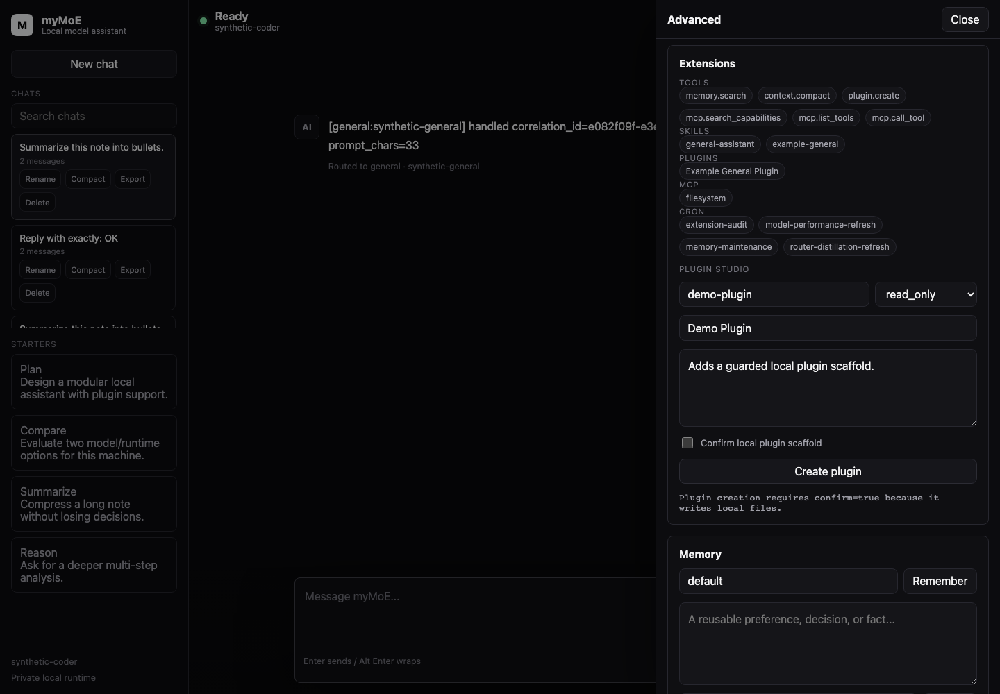
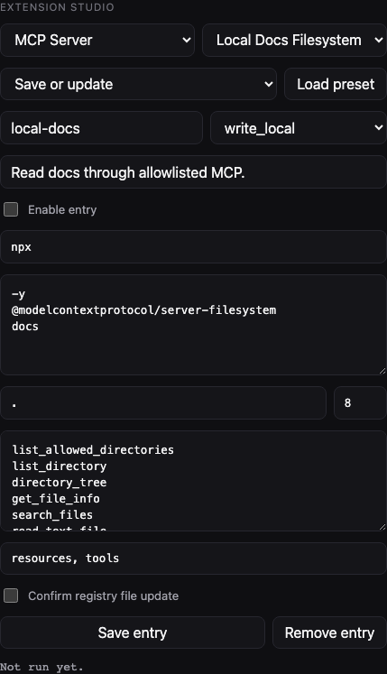
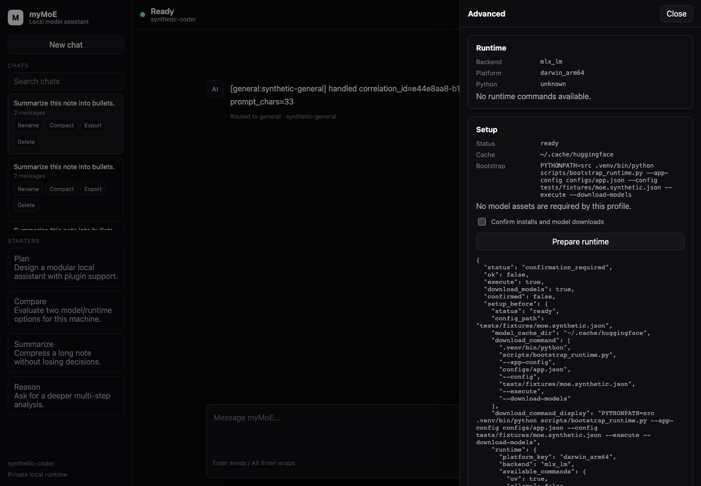

# UI And CLI

## Web UI

Run the local UI with the default live config:

```bash
PYTHONPATH=src .venv/bin/python -m local_moe.web \
  --port 8089
```

Then open:

```text
http://127.0.0.1:8089
```

Start the configured local model server first:

```bash
PYTHONPATH=src .venv/bin/python scripts/start_local_models.py --only-first
PYTHONPATH=src .venv/bin/python -m local_moe.web --port 8089
```

List saved chat sessions:

```bash
curl http://127.0.0.1:8089/api/chats
```

Search saved chats by title or message content:

```bash
curl 'http://127.0.0.1:8089/api/chats?query=router'
```

Continue a saved chat by passing the returned session id:

```bash
curl -X POST http://127.0.0.1:8089/api/generate \
  -H 'Content-Type: application/json' \
  --data '{"session_id":"<session-id>","prompt":"Continue this plan."}'
```

Stream a saved chat response progressively:

```bash
curl -N -X POST http://127.0.0.1:8089/api/generate/stream \
  -H 'Content-Type: application/json' \
  --data '{"session_id":"<session-id>","prompt":"Continue this plan."}'
```

Rename, compact, export, or delete a saved chat:

```bash
curl -X PATCH http://127.0.0.1:8089/api/chats/<session-id> \
  -H 'Content-Type: application/json' \
  --data '{"title":"Architecture notes"}'

curl -X POST http://127.0.0.1:8089/api/chats/<session-id>/compact \
  -H 'Content-Type: application/json' \
  --data '{}'

curl http://127.0.0.1:8089/api/chats/<session-id>/export.md

curl -X DELETE http://127.0.0.1:8089/api/chats/<session-id>
```

Inspect runtime health:

```bash
curl http://127.0.0.1:8089/api/health
```

Inspect setup readiness:

```bash
curl http://127.0.0.1:8089/api/setup
```

Save and search local memories:

```bash
curl -X POST http://127.0.0.1:8089/api/memory \
  -H 'Content-Type: application/json' \
  --data '{"text":"Antonio prefers local-first modular apps.","scope":"default","kind":"preference"}'

curl 'http://127.0.0.1:8089/api/memory?scope=default&query=Antonio%20local-first'

curl -X DELETE 'http://127.0.0.1:8089/api/memory/<record-id>?confirm=true'
```

Import pasted local knowledge into the same retrieval path:

```bash
curl -X POST http://127.0.0.1:8089/api/knowledge \
  -H 'Content-Type: application/json' \
  --data '{"title":"Project notes","content":"Paste local reference text here.","scope":"default","confirm":true}'

curl 'http://127.0.0.1:8089/api/knowledge?scope=default'

curl -X DELETE 'http://127.0.0.1:8089/api/knowledge/<document-id>?confirm=true'
```

Export and restore local user data:

```bash
curl -X POST http://127.0.0.1:8089/api/data/export \
  -H 'Content-Type: application/json' \
  --data '{"confirm":true}'

curl -X POST http://127.0.0.1:8089/api/data/import \
  -H 'Content-Type: application/json' \
  --data '{"bundle":{"schema_version":"mymoe.local-data.v1","data":{"chats":{"sessions":[]},"memory":{"records":[]}}},"mode":"merge","confirm":true}'
```

The UI is a dependency-free shadcn/new-york inspired chat surface. The default view is intentionally simple for non-technical users:

- left rail with a new chat action and starter prompts,
- persisted local chat sessions,
- central chat transcript,
- sticky composer,
- concise model status,
- Advanced drawer hidden by default.

Chat sessions are stored by the web server in `<runtime.work_dir>/chats.json`. The browser does not own durable chat state. On startup, the UI lists saved sessions and loads the most recently updated session unless the URL includes `?new_chat=true`. The sidebar can search, rename, compact, export, and delete saved sessions. When a saved session continues, the web API builds bounded local context with the configured context policy, retrieved local memories, and returns context telemetry with the generation response.

The browser prefers `/api/generate/stream`, a server-sent event response with `route`, `content`, `final`, and `error` events. The chat bubble updates as content arrives, then the `final` event persists the exchange and refreshes the session list. If streaming is unavailable before content starts, the UI falls back to the regular `/api/generate` JSON endpoint.

The Compact action calls the configured local compaction expert, stores a durable session summary, and reuses that summary in later context bundles. Exported Markdown includes the current summary.

The Local Data section exports and restores a portable JSON bundle with chat sessions and memory records. Export and restore both require explicit confirmation because the bundle contains private user content. Restore defaults to `merge`; `replace` is available for deliberate migration or reset workflows.

The Audit Trail section reads `/api/audit` and shows recent sensitive host-side actions with status, action name, timestamp, risk class, subject id, and compact metadata. It can also call `/api/audit/prune` to keep the latest configured number of audit events after an explicit confirmation. The prune action writes its own `audit.prune` event, so the trail still records that older entries were removed. It is an operational trail, not a content archive: chat text, memory text, environment variables, and model log bodies are not written to the audit file.

The Memory section stores local records in `<runtime.work_dir>/memory.jsonl`. Records saved under the `default` scope are automatically retrieved for matching chat prompts and injected into the model context while routing still uses only the current user prompt. The same panel can check memory maintenance totals, prune only expired temporal records after confirmation, and forget one record by id after the user checks the deletion confirmation box.

The Knowledge section is the local RAG import path. It accepts pasted notes or documentation, chunks the text into `knowledge` records with document metadata, and stores those chunks in the same memory file. It requires an explicit confirmation checkbox because it writes local records, and its forget action requires a separate confirmation before deleting all chunks for a document id. It does not read arbitrary files from the browser.

The Advanced drawer contains runtime commands, System Doctor, setup readiness, runtime health with a manual refresh action, configured models, latest performance decision, last routing metadata, extension registry, the allowlisted tool runner, cron controls, and the deterministic router eval button. Users who only want to chat do not need to see backend details.

Setup readiness is side-effect free. It reports the bootstrap command, configured model cache path, and whether each model asset appears present, missing, partial, or runtime-dependent.

The Setup section also exposes a guarded "Prepare runtime" action backed by `/api/setup/run`. Without confirmation it reports `confirmation_required`; with confirmation it runs only the install and model-download commands derived from the active configuration. The same flow is available from CLI through `--prepare-runtime`.

The Profiles section calls `/api/config/profiles` and lists runnable config profiles discovered from `configs/`, plus the currently active config even when it lives elsewhere. It is read-only: it shows active/default flags, setup readiness, backend, expert count, and model names so operators can decide which profile to launch or prepare without editing JSON blindly.

System Doctor calls `/api/doctor` and combines setup, health, model process reachability, extension audit, and cron state into one `ready`, `attention`, or `blocked` report with recommendations. The same panel can download a privacy-safe support bundle from `/api/support-bundle/download.json`.

Performance calls `/api/performance` and shows the current benchmark status, measured candidate coverage, selected primary general expert, selected fallback/compaction expert, and top ranked model scores. It is read-only and does not start a benchmark. The Markdown handoff report is available from `/api/performance/report.md`.

The Runtime section exposes configured model process state from `/api/models/processes`. "Start models" requires confirmation, starts only commands generated from the active runtime plan, and skips endpoints that already respond. "Stop managed" requires confirmation and terminates only model processes started by the current web server. Model Logs calls `/api/models/logs` and shows bounded sanitized tails from the same runtime-plan-generated log paths, with no arbitrary path input from the browser.

The Extensions section includes registry audit, Extension Studio, and Plugin Studio. The audit calls `/api/extensions/audit` and reports plugin reference issues before a workflow relies on them. Extension Studio reads safe starter templates from `/api/extensions/templates`, lets operators configure MCP server and cron job entries through form controls, then writes through `/api/extensions/configure` only after explicit confirmation. Plugin Studio writes a local `plugin.json` plus plugin-local `SKILL.md` through `/api/plugins`, requires confirmation, refreshes the extension registry, and runs the same audit immediately after creation.

The Tools section exposes only configured local tools. It accepts JSON input and returns JSON output from `/api/tools/run`. The default examples are safe to inspect; `data.export`, `data.import`, `knowledge.ingest`, `memory.prune_expired`, `memory.forget`, `plugin.create`, and `extension.configure` still require `confirm: true` before returning private data or writing/deleting local files.

`extension.configure` is the lower-level self-configuration tool for operators who prefer JSON payloads or CLI automation. It can upsert or remove MCP server and cron job entries, writes only to the active app config's registry paths, validates each entry before writing, refreshes the web registry, and updates the in-process cron runner immediately. Extension Studio uses the same validation path but avoids hand-editing registry JSON for common MCP and cron setup work.

MCP tool discovery is available through `mcp.list_tools`. It starts an enabled stdio MCP server and lists its declared tools, but only when the app config has `permissions.allow_process_execution=true` and the tool input includes `confirm_process_execution: true`. The default app config blocks process execution, so the UI can show the tool contract without silently launching processes.

MCP tool calls are available through `mcp.call_tool`. Calls require the same process permission plus `confirm_tool_call: true`, and the selected MCP tool must appear in that server's `allowed_tools` list.

The bundled MCP-enabled example uses the local filesystem MCP server. It is useful for verifying integration, but it is marked `write_local` because the upstream server advertises write/edit tools.

The Cron section shows the background automation state from `/api/cron`: whether auto-run is configured, the active policy, the polling interval, auto-runnable jobs, manual-only jobs, due jobs, and last run time. Manual execution still uses `/api/cron/run`. Read-only memory maintenance can run automatically; expired-memory pruning is a separate write-local job and requires the "Confirm local write jobs" checkbox, matching the CLI `--cron-confirm-writes` flag.

Chat responses are rendered with a small safe Markdown renderer. It supports bold, emphasis, inline code, fenced code blocks, links, blockquotes, headings, and bullet lists while escaping model-provided HTML before formatting. Streaming updates use the same renderer, so partial Markdown remains escaped while the answer is still arriving.

Keyboard behavior:

- `Enter` sends the current prompt.
- `Alt+Enter` inserts a newline.

## Screenshots

Chat-first empty state:


Composer with multiline prompt support before sending:


Advanced runtime, setup, model, routing, extension, MCP, tools, cron, and eval drawer. Cron includes background automation status plus a local "Run due jobs" action backed by the allowlisted scheduler runner:


Runtime profile discovery shows runnable local model profiles and setup readiness without mutating runtime state:



Audit Trail exposes recent operational events plus guarded retention pruning:



Runtime process controls require confirmation before starting or stopping configured model servers:



Model Logs shows sanitized bounded tails for startup and artifact debugging:



Plugin Studio creates local plugin scaffolds with an explicit confirmation guard:



Extension Studio configures MCP server and cron job entries from guarded presets without editing JSON files by hand:



Guarded runtime preparation is available from the same Advanced drawer. Without confirmation, the action returns a structured `confirmation_required` result and performs no installs or downloads:



Live generation through a local Gemma 4 E4B model, including Markdown rendering and route metadata:


Mobile layout check for the same chat-first flow:


## CLI

Single prompt:

```bash
PYTHONPATH=src .venv/bin/python -m local_moe.cli \
  --prompt "Analyze the tradeoff between a single local model and a routed MoE."
```

JSON output:

```bash
PYTHONPATH=src .venv/bin/python -m local_moe.cli \
  --prompt "Summarize this plan." \
  --json
```

Interactive shell:

```bash
PYTHONPATH=src .venv/bin/python -m local_moe.cli \
  --interactive
```

Eval mode:

```bash
PYTHONPATH=src .venv/bin/python -m local_moe.cli \
  --config configs/moe.live.fast-mlx.example.json \
  --eval experiments/eval_set_extended.jsonl
```

Eval mode can run against any live local config. Normal UI and CLI usage should use a live local model config.

Setup readiness:

```bash
PYTHONPATH=src .venv/bin/python -m local_moe.cli \
  --config configs/moe.live.general-mlx.example.json \
  --setup
```

Run an allowlisted tool:

```bash
PYTHONPATH=src .venv/bin/python -m local_moe.cli \
  --run-tool mcp.search_capabilities \
  --tool-input '{"query":"filesystem"}'
```

Configure a cron job through the guarded tool runner:

```bash
PYTHONPATH=src .venv/bin/python -m local_moe.cli \
  --run-tool extension.configure \
  --tool-input '{"surface":"cron_job","definition":{"id":"daily-audit","description":"Run extension audit once per day.","enabled":true,"schedule":{"type":"interval","seconds":86400},"command":["extension.audit"],"risk_class":"compute_only"},"confirm":true}'
```

Configure a disabled MCP server entry without launching it:

```bash
PYTHONPATH=src .venv/bin/python -m local_moe.cli \
  --run-tool extension.configure \
  --tool-input '{"surface":"mcp_server","definition":{"name":"local-docs","description":"Read local documentation through MCP.","command":"npx","args":["-y","@modelcontextprotocol/server-filesystem","docs"],"enabled":false,"risk_class":"write_local","capabilities":["resources","tools"],"transport":"stdio","cwd":".","env":{},"timeout_seconds":8,"allowed_tools":["list_allowed_directories","list_directory","read_text_file","search_files"]},"confirm":true}'
```

List tools from an enabled MCP server after explicitly enabling process execution in a separate app config:

```bash
PYTHONPATH=src .venv/bin/python -m local_moe.cli \
  --app-config configs/app.mcp-enabled.local.example.json \
  --run-tool mcp.list_tools \
  --tool-input '{"server":"filesystem","confirm_process_execution":true}'
```

Call an allowlisted MCP tool:

```bash
PYTHONPATH=src .venv/bin/python -m local_moe.cli \
  --app-config configs/app.mcp-enabled.local.example.json \
  --run-tool mcp.call_tool \
  --tool-input '{"server":"filesystem","tool_name":"list_allowed_directories","arguments":{},"confirm_process_execution":true,"confirm_tool_call":true}'
```

Run cron jobs that write local artifacts:

```bash
PYTHONPATH=src .venv/bin/python -m local_moe.cli \
  --run-cron \
  --cron-confirm-writes
```
