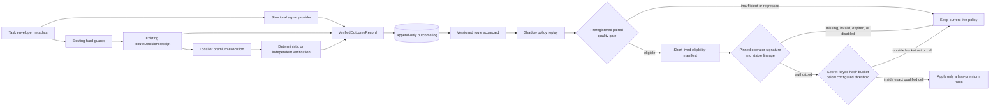

# Verified Outcome Routing and Signed Canary Authority

## In Plain English

- The lab first proves a narrower route against disjoint, verified evidence; it
  does not learn from live prompts or silently change production behavior.
- A manifest that passes that gate is still only evidence. A human operator
  must sign a separate, short-lived authorization with a key the runtime
  already trusts.
- Even then, only task fingerprints assigned to at most 500 of 10,000
  secret-keyed hash buckets can move, and only from a more-premium route to a
  less-premium route. This is repeatable sampling, not a hard quota on live
  requests. Every missing, changed, expired, mismatched, or ineligible input
  keeps the existing guarded route.
- The feature is disabled in the shipped configuration. This repository does
  not include a real empirical manifest, operator key, assignment secret, or
  signed activation.

The Verified Outcome Routing Lab is the evidence layer for the Hybrid
Assistant Bridge. It answers a narrower question than semantic or complexity
routing:

> For this capability and difficulty band, which policy would have delivered a
> mechanically verified result with the best acceptable quality, cost,
> latency, privacy, and premium-use profile?

The lab records content-free outcomes, builds a versioned scorecard, replays
alternative decisions offline, and can qualify a preregistered paired holdout.
A passing qualification emits a short-lived, content-addressed canary manifest
that is an eligibility prerequisite only. The separate Signed Route Canary
Authority can consume it only when an operator-signed authorization, pinned
public key, stable configuration, evidence lineage, deterministic assignment,
and all existing authority, budget, capability, privacy, and execution-scope
guards agree.

## Why This Is a Separate Layer

The local `RuleRouter` already solves expert affinity with deterministic rules,
character n-gram examples, and a distilled local artifact. The Execution Scope
Guard decides where a request is allowed to run. The Assistant Bridge owns
local execution, independent verification, bounded premium escalation, and
content-free route receipts.

The lab reuses all three boundaries:



This avoids building another provider gateway or another four-tier prompt
classifier. Existing projects already cover those areas: [vLLM Semantic
Router](https://github.com/vllm-project/semantic-router), [LiteLLM Auto
Routing](https://docs.litellm.ai/docs/proxy/auto_routing), and
[RouteLLM](https://github.com/lm-sys/RouteLLM). myMoE instead closes the
decision-to-verification loop while retaining its local-first authority model.

## Content-Free Contracts

### `TaskSignals`

The built-in provider uses only fields already present in the route receipt:
capability identifiers, tool count, risk class, objective length, constraint
count, and a deterministic context-token estimate derived from objective
length. The decision path does not accept an unattested context override. It
never stores or classifies the objective text. The provider emits:

- a request fingerprint;
- declared capabilities;
- `simple`, `medium`, `complex`, or `very_complex`;
- confidence and an explicit abstention flag;
- structural counters and provider identity.

The provider interface is replaceable. A future vLLM Semantic Router or
LiteLLM adapter can emit the same contract, but it cannot expand the set of
routes admitted by myMoE's hard guards.

### `VerifiedOutcomeRecord`

Each append-only record binds:

- the route receipt and task fingerprints;
- bridge configuration, signal-provider configuration, selected-runtime, and
  complete runtime-plan digests;
- planned route and final provider identifiers;
- capability/difficulty signals and confidence;
- verification status, evidence strength, evidence digest, and failure class;
- latency, token counts, premium calls, remote payload size, and optional cost.

Prompt text, response text, constraints, diffs, verifier output, and reasoning
are not fields in this schema. Cost remains absent unless the caller supplies a
versioned pricing contract or a measured amount.

For Verified Hybrid Execution, the summary row is deliberately not a trust
anchor. It points to a content-addressed receipt containing the original task
signals, pre-attestation Bridge result metadata, candidate manifest and
changeset, and independently signed evaluation envelopes. Qualification
reloads those objects, verifies the signatures and policy, recomputes exact
configured token cost, and requires the reconstructed row to match byte for
byte. A signed negative evaluation is preserved as a failed outcome; missing,
malformed, late, untrusted, or incomplete evidence is inconclusive instead.

`route_canary` is an optional alpha extension to `RouteDecisionReceipt` 2.0 and
`VerifiedOutcomeRecord` 1.0. Current readers accept legacy payloads that omit
the field. Older strict readers reject canary-bearing payloads as having an
unknown field, so producers and consumers must be upgraded together when this
extension is used; it is not forward-compatible with older binaries.

### `RouteScorecard`

The builder aggregates compatible records by bridge configuration digest,
signal-provider configuration digest, the complete local-plus-premium runtime
plan digest, route plan, the exact canonical capability set, and difficulty.
Marginal evidence for `analysis` and `code` cannot be combined into evidence
for an `analysis + code` request. Evidence gathered under different signal
rules or runtime plans also remains in separate cells. Each cell contains
sample counts, verified success, p95 latency, mean tokens, premium calls,
remote payload, and cost when complete. Abstained signals are always excluded,
and the artifact records the configured minimum confidence used to exclude
weak signals. The artifact also binds its source digest and freshness window.
Mixed cohorts, stale artifacts, non-finite metrics, and insufficient evidence
fail closed.

### `ShadowRouteDecision`

The shadow selector receives the current receipt, its hard-eligible routes,
signals, a scorecard, and a replaceable profile policy. It reports the current
route, recommendation, candidate exclusions, normalized utility components,
policy digest, and scorecard digest. The decision also binds the complete route
receipt, runtime plan, task fingerprint, content-addressed signal artifact, and
its own decision digest. Signal files are re-derived through the configured
provider before lookup, so recomputing a digest after changing a difficulty or
confidence value does not bypass the provider contract. `applied` is always
`false` in contract version 1.

### Paired promotion contracts

`VerifiedRoutingEvidencePlan` freezes the exact task fingerprints, normalized
item hashes, AB/BA order, profile, capability set, difficulty, baseline and
candidate routes, configuration, signal-provider and runtime-plan digests,
scorecard source, evaluator implementation, requested canary size, and expiry
before holdout execution. Schema 1.0 accepts only monotone transitions toward
less premium use:

- `premium -> local_then_verify`;
- `premium -> local`;
- `local_then_verify -> local`.

The evaluator requires the supplied scorecard to rebuild byte-for-byte from
the exact training outcome set, rejects task, record, or receipt overlap with
the holdout, rejects overlap of normalized intents even when their wording and
task fingerprints differ, and evaluates every planned pair using
intention-to-treat. Both training and holdout rows must reconstruct from the
same preregistered public trust policy and execution harness. Missing arms,
weak evidence, stale records, incomplete planned coverage, or thin cells are
`inconclusive`; they are never silently removed. Candidate-only failures,
hard-invariant failures, profile quality regressions, latency regressions, or
increased premium calls, remote payload, or measured cost are `ineligible`.

`VerifiedRoutingPromotionReport` is always content-addressed and contains only
aggregate metrics and lineage digests. `VerifiedRoutingCanaryManifest` is
written only for an `eligible` report. It is capped by configuration to 500 of
10,000 deterministic assignment buckets and 24 hours, lists exact enabled
cells, preserves the hard-guard invariants, and sets `applied=false` plus
`authority=structural_eligibility_only`. The bucket threshold is not a quota on
the observed request share. Neither artifact contains prompts, responses,
diffs, verifier output, or task fingerprints.

The manifest never authorizes itself. `VerifiedRoutingCanaryAuthorization` is
a separate canonical JSON payload in a one-signature Ed25519 DSSE envelope. It
binds an activation id, manifest, effective Bridge configuration, route policy,
scorecard, operator key id, maximum assignment-bucket threshold, and a time
window contained inside the manifest window. The Bridge configuration in turn
binds the exact runtime-configuration digest. Runtime code holds only the public
key; signing material stays outside myMoE.

For an authorized request, the runtime derives a stable bucket from an HMAC of
the content-free task fingerprint using an environment secret. The secret's
SHA-256 must match the salt digest frozen in the manifest, but the secret itself
is never placed in configuration or an artifact. Repeated requests with the
same fingerprint stay in the same bucket; as a result, the observed traffic
share may be lower or higher than the configured basis points. A decision
applies only when the shadow recommendation matches one exact qualified cell
and moves monotonically toward less premium use. The decision and its lineage
are bound back into the route receipt and verified outcome.

## Freeze a Future Canary Before Collecting Its Evidence

This preparation is required only if the evidence may later authorize a runtime
canary. A shadow-only study can skip it and keep `verified_routing` disabled.

The exact Bridge configuration is part of every scorecard cell and canary
manifest. Enabling verified routing after training or qualification changes that
digest and makes the earlier cells ineligible. Prepare the final identity before
collecting training or holdout evidence:

1. Generate the Ed25519 operator key outside the repository. Install only its
   public key at the final runtime path and freeze the operator key id plus the
   DER SubjectPublicKeyInfo digest returned by
   `ed25519_public_key_sha256`. Keep the private key offline when possible.
2. Generate and securely retain one random printable assignment secret of 32 to
   1,024 UTF-8 bytes without line breaks. Freeze its SHA-256 as
   `ASSIGNMENT_SALT_SHA256`; do not place the secret itself in configuration or
   an evidence artifact.
3. Create the final runtime configuration from
   [`configs/verified-routing-runtime.example.json`](../configs/verified-routing-runtime.example.json).
   Give it the stable route-policy path, future scorecard, manifest and
   authorization paths, public-key path and digest, assignment-secret
   environment-variable name, and chronology path. Paths for artifacts that do
   not exist yet are intentional.
4. Point the final Bridge configuration at that runtime file and set
   `verified_routing.enabled=true`. Load this same configuration before
   collecting promotion training and holdout records. A missing scorecard,
   manifest, or authorization is not activation: runtime evaluation fails
   closed and retains the guarded baseline.
5. Keep the enabled Bridge/runtime values, public key, assignment secret, route
   policy, signal provider, and runtime plan unchanged through training,
   qualification, signing, and the canary window. Any change creates different
   evidence lineage and requires fresh evidence and authorization.

The secret need not be exposed to the Bridge process until activation, but its
value and hash must already be fixed. This ordering avoids a configuration
digest that changes only after the evidence has been collected.

## Run the Shadow Loop

Start from a JSON export of `BridgeRunResult.metadata_payload()`. The export may
contain route, verifier, command, and capsule metadata, but must not contain the
user-facing `result.content` object.

When preparing a future canary, every training export in this section must come
from the final enabled configuration frozen above. With no valid authorization
installed, the route remains the normal guarded baseline.

Install the project with the `assistant-bridge` extra. It includes the
cross-platform process lock used by the append-only outcome store while the
base myMoE distribution remains dependency-free.

Derive structural signals without loading the task text:

```bash
PYTHONPATH=src python3 experiments/derive_route_signals.py \
  --bridge-metadata work/bridge-run-metadata.json \
  --out work/task-signals.json
```

Append the verified result. Omit `--estimated-cost-usd` unless the value comes
from a real, versioned pricing or accounting contract:

```bash
PYTHONPATH=src python3 experiments/record_verified_outcome.py \
  --bridge-metadata work/bridge-run-metadata.json \
  --signals work/task-signals.json \
  --store work/verified-routing-outcomes.jsonl
```

Build a scorecard from deterministic and independently attested evidence:

```bash
PYTHONPATH=src python3 experiments/build_route_scorecard.py \
  --records work/verified-routing-outcomes.jsonl \
  --minimum-evidence-strength independent \
  --minimum-confidence 0.70 \
  --ttl-seconds 2592000 \
  --out work/verified-routing-scorecard.json
```

Ask for a shadow recommendation. This command cannot execute a provider or
alter the receipt's live route:

```bash
PYTHONPATH=src python3 experiments/recommend_verified_route.py \
  --bridge-metadata work/bridge-run-metadata.json \
  --signals work/task-signals.json \
  --scorecard work/verified-routing-scorecard.json \
  --policy configs/verified-routing-policy.example.json \
  --out work/verified-routing-decision.json
```

Run the deterministic contract simulation used by CI:

```bash
make eval-verified-routing
```

Its committed output is
[`outputs/verified-routing-shadow-eval.json`](../outputs/verified-routing-shadow-eval.json).
The example policy normalizations are saturation scales, not provider prices;
replace them with values appropriate to the measured environment.

## Qualify a Paired Holdout

First commit or otherwise attest the training scorecard, gate policy, and case
list before executing the holdout. Training records, scorecard cells, and the
planned holdout must use the exact enabled Bridge/runtime lineage frozen before
evidence collection. The case list is a JSON array matching the `PromotionCase`
contract. Set `ASSIGNMENT_SALT_SHA256` to the already-frozen assignment-secret
digest. Create `work/verified-routing-pricing.json` as a canonical
`VerifiedPairedPricingContract` for every provider/model that either arm can
invoke; rates are exact decimal USD strings and the file contains no
credentials. Then freeze the content-addressed evidence plan:

```bash
PYTHONPATH=src python3 experiments/freeze_verified_routing_plan.py \
  --cases work/verified-routing-plan-cases.json \
  --route-policy configs/verified-routing-policy.example.json \
  --scorecard work/verified-routing-scorecard.json \
  --gate-policy configs/verified-routing-promotion.example.json \
  --created-at 2026-07-19T10:00:00+00:00 \
  --canary-basis-points 500 \
  --manifest-ttl-seconds 86400 \
  --assignment-salt-sha256 "$ASSIGNMENT_SALT_SHA256" \
  --assistant-bridge-config configs/assistant-bridge.canary.local.json \
  --attestation-config configs/assistant-bridge-workflow.local.json \
  --attestation-exchange-dir /absolute/private/paired-attestation \
  --pricing-contract work/verified-routing-pricing.json \
  --out work/verified-routing-evidence-plan.json
```

The freeze command is provider-free. It opens the already initialized public
trust, CAS, and directory-exchange configuration only to derive the exact
attestation policy, runner source identity, and semantic execution-harness
identity. It does not accept caller-written harness hashes. The same Bridge,
workflow, sidecar protocol settings, clock contract, signal provider, and
pricing lineage must be used during collection.

Older schema-1.0 plans that omit these proof-preregistration extensions remain
readable for inspection and diagnostic reports. They cannot execute a paired
case, emit a canary manifest, or be signed; freeze a new plan from the inspected
configuration instead of editing an old plan.

Install the Assistant Bridge extra to expose the paired runner:

```bash
python -m pip install -e '.[assistant-bridge]'
```

The status command reads only the metadata-only paired journal; it does not load
the task, application policy, Bridge configuration, or a provider:

```bash
install -d -m 700 /absolute/private/mymoe-paired
mymoe-paired status \
  --run-dir /absolute/private/mymoe-paired/case-0001 \
  --json
```

Execution is available only after composing the built-in directory exchange
with a separately operated signed verifier, its public-key trust policy, and a
preinitialized immutable evidence store. Reuse a reviewed two-phase workflow
configuration such as
[`configs/assistant-bridge-workflow.example.json`](../configs/assistant-bridge-workflow.example.json),
but replace the placeholder verifier digest and public-key path with the real
independent verifier contract. The workflow file must contain public
verification material only; the myMoE process must never receive the private
signing key.

Create the exchange outside both the source workspace and other paired state.
It and its two child directories must already exist and be private before the
CLI starts:

```bash
install -d -m 700 \
  /absolute/private/paired-attestation \
  /absolute/private/paired-attestation/requests \
  /absolute/private/paired-attestation/responses
```

The CAS named by `state.cas_path` in the workflow configuration must also have
been initialized by the two-phase lifecycle; `mymoe-paired` opens it without
creating it. With those prerequisites, execute the one plan case whose
fingerprint exactly matches the task:

```bash
mymoe-paired run \
  --task work/assistant-task.json \
  --plan work/verified-routing-evidence-plan.json \
  --bridge-config configs/assistant-bridge.json \
  --app-config configs/app.json \
  --workflow-config configs/assistant-bridge-workflow.json \
  --attestation-exchange-dir /absolute/private/paired-attestation \
  --workspace /absolute/path/to/source-workspace \
  --run-dir /absolute/private/mymoe-paired/case-0001 \
  --outcome-store /absolute/private/mymoe-paired/holdout.jsonl \
  --json
```

The runner accepts no caller-supplied pricing or lifecycle/operation digests;
it consumes the pricing contract embedded in the frozen plan and derives the
remaining bindings internally. The run directory and outcome store must be
outside the governed source workspace and must not overlap each other. Exit
code `0` means a complete or otherwise known status, `1` means an ambiguous
uncheckpointed claim or unreadable state that cannot prove retry is safe, `2`
means an invalid contract or configuration, and `3` means an operational
failure while no ambiguous provider claim was present.

Journal and outcome records omit task and response bodies, but stable task and
objective hashes plus provider/runtime metadata are linkable and may be
dictionary-guessed. They are sensitive artifacts and must never be published.
The store enforces directory mode `0700` and file mode `0600` on POSIX; Windows
ACL privacy remains an operator responsibility, and filesystems without stable
`FileIdInfo` support are rejected fail-closed.

`--workflow-config` and `--attestation-exchange-dir` are an inseparable pair.
If either is omitted, `run` fails before creating journal/outcome state or
calling a provider with `signed_verifier_required` (or an invalid-composition
error) and exit code `2`. The CLI does not generate signing keys, self-sign
evidence, or silently substitute a deterministic in-process check.

### Directory attestation sidecar protocol

The sidecar is an independently launched process, not an importable verifier
inside myMoE. It cooperatively watches `requests/` for
`request-<64-hex-id>.json`. Each request is canonical JSON, is atomically
published without overwrite, and binds the complete `CandidateBinding`, its
SHA-256 digest, the exact disposable verifier-workspace path, and an absolute
deadline. On POSIX, the adapter accepts only owner-controlled `0700`
directories and `0600`, single-link, non-symlink artifacts.

For each request, the sidecar must independently validate the request contract,
deadline, full binding, and workspace, run the declared verifier in that
disposable workspace, and create signed DSSE evidence matching the public trust
policy. It then atomically publishes one canonical
`response-<same-id>.json` in `responses/` with exactly these fields:
`schemaVersion`, `contract`, `requestId`, `bindingSha256`, and `envelopes`.
`envelopes` is a non-empty bounded list of canonical base64-encoded DSSE bytes.
The adapter rejects replayed IDs, wrong bindings, duplicate envelopes,
noncanonical or oversized responses, links, permissive modes, and responses
arriving after the configured deadline. Requests are retained on timeout so an
operator can diagnose an indeterminate verification boundary; do not blindly
retry them.

No signing key or private verifier implementation belongs in this repository,
workflow file, exchange request, or myMoE process. Public keys are loaded from
the workflow trust configuration and only verified envelopes enter the CAS.
Running the sidecar under the same OS account provides process and key
separation, not a hostile-user security boundary; use a distinct OS principal,
host, or hardware-backed signer when stronger trust is required. Request and
response files include stable, linkable hashes and a workspace path, so keep
the entire exchange private and never publish it. On Windows, restrictive ACLs
remain an operator-managed prerequisite.

The runner honors the preregistered AB/BA order, uses disposable snapshots, and
appends every planned result to the holdout store. Do not stop early or discard
timeout, blocked, abstained, or inconclusive outcomes. `mymoe-paired` does not
fabricate an independent verifier attestation: evidence without the required
independent verifier remains diagnostic and cannot qualify. An authentic
signed failure is recorded as a failed arm and remains part of
intention-to-treat; only a missing, invalid, timed-out, quorum-incomplete, or
unreadable proof makes the arm indeterminate. Then evaluate the complete set:

```bash
PYTHONPATH=src python3 experiments/qualify_verified_routing.py \
  --plan work/verified-routing-evidence-plan.json \
  --gate-policy configs/verified-routing-promotion.example.json \
  --route-policy configs/verified-routing-policy.example.json \
  --scorecard work/verified-routing-scorecard.json \
  --training-records work/verified-routing-training.jsonl \
  --holdout-records work/verified-routing-holdout.jsonl \
  --assistant-bridge-config configs/assistant-bridge.canary.local.json \
  --attestation-config configs/assistant-bridge-workflow.local.json \
  --evidence-cas /absolute/private/two-phase-cas \
  --evaluated-at 2026-07-19T18:00:00+00:00 \
  --report work/verified-routing-promotion-report.json \
  --manifest work/verified-routing-canary-manifest.json
```

The manifest output path must not already exist; use a unique per-run path so a
failed rerun cannot leave an older eligible artifact looking current. Exit code
`0` means eligible and writes both files. Exit code `2` means the
evidence is inconclusive; exit code `3` means a measured guardrail failed. The
latter two write the report but never the manifest. Content-addressed writes
are atomic, idempotent for identical bytes, and refuse to overwrite different
content.

The included default gate requires at least 50 unique task pairs overall and
20 per exact cell, a Wilson 95% lower success bound at or above the active
profile floor, zero candidate-only failures, complete cost evidence, p95
latency at most `1.10x` baseline and below the absolute configured ceiling,
non-increasing premium calls/egress/cost, and at least one objective
improvement. Failure classes are blocking unless the gate explicitly lists
them as non-blocking verification or runtime failures; unknown real bridge
codes therefore fail closed. Repeated executions of the same task remain
diagnostic and do not increase the planned unique-task count.

## Sign, Install, and Stop a Canary

Treat activation as a controlled deployment, not as an automatic continuation
of evaluation. The eligible manifest does not authorize itself.

1. Verify that the final enabled Bridge/runtime configuration, public key,
   assignment-secret hash, route policy, scorecard, and artifact paths are still
   exactly the values frozen before evidence collection. Put the eligible
   manifest at its already-declared runtime path. Do not edit configuration to
   install it.
2. Inspect the manifest's actual `not_before` and `expires_at`. Keep the Ed25519
   private key outside the repository and runtime host when possible. The
   signing command accepts a bounded, regular, non-link, unencrypted Ed25519 PEM
   and reruns the paired promotion gate from the frozen plan, gate policy,
   training outcomes, and holdout outcomes. It signs only when the reconstructed
   eligible manifest exactly matches the installed manifest, including its
   report, evaluator, cells, threshold, lineage, and window. Sign an activation
   whose complete active window is inside the emitted manifest window. In the
   example below, the requested expiry is one hour earlier than the maximum
   24-hour expiry implied by the qualification example; use an earlier value if
   the emitted manifest expires sooner:

```bash
PYTHONPATH=src python3 experiments/sign_verified_routing_canary.py \
  --manifest work/verified-routing-canary-manifest.json \
  --plan work/verified-routing-evidence-plan.json \
  --gate-policy configs/verified-routing-promotion.example.json \
  --training-records work/verified-routing-training.jsonl \
  --holdout-records work/verified-routing-holdout.jsonl \
  --assistant-bridge-config configs/assistant-bridge.canary.local.json \
  --attestation-config configs/assistant-bridge-workflow.local.json \
  --evidence-cas /absolute/private/two-phase-cas \
  --runtime-config configs/verified-routing-runtime.local.json \
  --private-key /secure/offline/operator-private.pem \
  --activation-id canary-2026-07-19-01 \
  --issued-at 2026-07-19T18:55:00+00:00 \
  --not-before 2026-07-19T19:00:00+00:00 \
  --expires-at 2026-07-20T17:00:00+00:00 \
  --maximum-canary-basis-points 500 \
  --out work/verified-routing-canary-authorization.dsse.json
```

3. Confirm that `--out` is the unchanged authorization path declared by the
   runtime configuration. The signing command writes the DSSE envelope there
   and refuses to overwrite an existing authorization.
4. Supply the pre-frozen assignment secret to the Bridge process through the
   environment variable named by `assignment_secret_env` (the example uses
   `MYMOE_ROUTE_CANARY_SECRET`), then reload the unchanged enabled
   configuration. The loader rejects changed digests, symlinked or unstable
   authority files, wrong keys, invalid signatures, stale evidence, unsafe
   bucket thresholds, and time windows outside the manifest.
5. Inspect route receipts and verified outcomes for `route_canary` lineage. A
   request outside the configured hash buckets or exact enabled cell keeps its
   baseline; this is expected, not an activation failure. Measure the observed
   canary traffic directly because a 500-bucket threshold is not a 5% traffic
   quota.

The runtime also updates a locked, content-bound local chronology record
and rejects clock rollback, activation rollback, or signed equivocation while
that prior state remains intact. This detects discontinuity in one trusted local
file; it is not tamper-resistant storage, an append-only external ledger, a
cross-host consensus mechanism, or a trusted timestamp. A filesystem writer
that can delete or replace the chronology can break that continuity.

The configuration kill switch is
`verified_routing.enabled=false` in the Bridge configuration. Reload the Bridge
after changing it; no canary decision is then evaluated. Expiry also stops the
canary automatically, while a missing authorization, public key, manifest,
scorecard, policy, or assignment secret, or an invalid or unwritable chronology
fails closed to the existing baseline. Disabling is a runtime pause, not by
itself cryptographic revocation: returning to the identical enabled
configuration before expiry can make the same authorization valid again. Remove
or rotate the authorization for revocation. Re-enabling after any other
configuration or evidence change requires a newly bound authorization and fresh
qualified evidence for the changed lineage.

## Evidence Hierarchy

Scorecards can set a minimum evidence strength. The supported order is:

1. deterministic tests, contracts, and verifiers;
2. independently attested evidence;
3. explicit user evaluation;
4. a versioned judge rubric;
5. implicit interaction feedback.

The shipped example accepts only the first two classes. An inconclusive record
is retained for diagnostics but is not counted as verified success or failure.

## Policy Profiles

The five existing user profiles remain distinct objectives, not model names:

| Profile | Shadow objective | Non-negotiable boundary |
| --- | --- | --- |
| `economy` | Minimize expected cost and premium use after a quality floor. | Never exceed the receipt budget or eligible routes. |
| `balanced` | Trade verified success against latency, cost, egress, and premium use. | Existing scope and consent still win. |
| `quality` | Maximize verified success, then latency and cost. | Capability and authority gaps still block. |
| `privacy` | Minimize remote payload and premium use. | Remote remains unavailable without the existing explicit opt-in. |
| `offline` | Compare local plans only. | Remote candidates are always excluded. |

Weights, evidence floors, confidence thresholds, freshness, and minimum sample
counts live in JSON configuration rather than provider-specific code.

## Evaluation Contract

The deterministic lab compares three policies on the same cases:

- `local_only`;
- the current profile baseline;
- the verified shadow recommendation.

It reports verified success, false-local rate, unnecessary-premium rate,
escalation precision/recall, premium calls and tokens, optional cost, p95
latency, remote egress, Brier score, and expected calibration error. Results are
stratified by capability, difficulty, language, and context band when those
dimensions are available.

Synthetic fixtures validate formulas, signatures, assignment, chronology, and
invariants; they are not product-performance evidence. A live policy must be
trained and evaluated on disjoint, versioned records from the target
environment. The repository does not ship an empirical canary manifest because
no real paired Assistant Bridge holdout has yet met that contract.

## Safety Invariants

- Shadow analysis cannot add a route absent from the original receipt.
- `privacy` and `offline` cannot be softened by utility weights.
- Missing, stale, low-confidence, or statistically thin evidence returns the
  current baseline route and an abstention reason.
- Scorecard generation never learns from prompt or response bodies.
- A canary manifest is evidence, not runtime authority. Only a separately
  signed, bounded authorization can enable its exact cells.
- Runtime canary application is limited to at most 500 of 10,000 secret-keyed
  assignment buckets and to transitions toward less premium use. The bucket
  threshold is deterministic but is not a quota on observed traffic. It never
  adds a route, increases premium use, or weakens a hard guard.
- Missing, malformed, changed, untrusted, expired, or mismatched activation
  inputs retain the baseline route. The shipped configuration disables the
  authority entirely.
- The local durable chronology rejects clock rollback, activation rollback,
  and signed equivocation only while its previous state remains intact. It is
  not tamper-resistant storage or an external timestamp authority.
- There is no live weight mutation, online learning, exploration, or automatic
  broad policy activation.

`VerifiedPairedRunRoot` now freezes the plan, case, normalized item, guarded
routes, AB/BA slots, one source snapshot, Bridge/runner lineage, and pricing
contract before the first provider call. The metadata-only paired journal
writes a durable claim before each invocation, links the second outcome to the
first, and permits resume only after a complete first checkpoint. A recovered
claim without a checkpoint is indeterminate and cannot be retried
automatically.
Each `VerifiedOutcomeRecord` carries that paired lineage, a CSPRNG run-instance
nonce, exact derived cost evidence, and a receipt for the signed source
artifacts. A legacy, replayed, reordered, cross-snapshot, normalized-intent
overlap, or cost-incomplete holdout is never eligible.

The paired journal and the signed receipt have different jobs. The journal is
the operational authority for safe resume and exactly-once claims. The DSSE
envelopes plus content-addressed receipt are the evaluation authority for
integrity, provenance, and signed time. A crash after a row append but before
its checkpoint can make a run permanently non-resumable; if both independently
signed arms already exist, the pair can still be analyzed, but it never
authorizes a retry. Neither content addressing nor a valid signature proves
that benchmark inputs are representative or that the verifier's checks capture
the right real-world quality.

The runtime still requires a separate pinned operator signature, a contained
activation window, and consistent local chronology in addition to an eligible
manifest. That signature authorizes a bounded deployment decision; it does not
change the meaning of the underlying evaluation. The local chronology detects
discontinuity only relative to the state it can still read; deletion or
replacement by a filesystem writer is outside its guarantee.

The outcome loop is intentionally conservative: optimization starts only after
authority and verifiability are already established.
