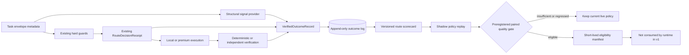

# Verified Outcome Routing Lab

The Verified Outcome Routing Lab is a shadow-only feedback layer for the
Hybrid Assistant Bridge. It answers a narrower question than semantic or
complexity routing:

> For this capability and difficulty band, which policy would have delivered a
> mechanically verified result with the best acceptable quality, cost,
> latency, privacy, and premium-use profile?

Version 1 never changes a live route. It records content-free outcomes, builds
a versioned scorecard, replays alternative decisions offline, and can qualify a
preregistered paired holdout. A passing qualification emits a short-lived,
content-addressed canary manifest that is an eligibility prerequisite only; no
runtime code consumes it. Activation remains deferred until the runtime can
apply that manifest without bypassing an existing authority, budget,
capability, or execution-scope guard.

## Why This Is a Separate Layer

The local `RuleRouter` already solves expert affinity with deterministic rules,
character n-gram examples, and a distilled local artifact. The Execution Scope
Guard decides where a request is allowed to run. The Assistant Bridge owns
local execution, independent verification, bounded premium escalation, and
content-free route receipts.

The lab reuses all three boundaries:



This avoids building another provider gateway or another four-tier prompt
classifier. Existing projects already cover those areas: [vLLM Semantic
Router](https://github.com/vllm-project/semantic-router), [LiteLLM Auto
Routing](https://docs.litellm.ai/docs/proxy/auto_routing), and
[RouteLLM](https://github.com/lm-sys/RouteLLM). myMoE instead closes the
decision-to-verification loop while retaining its local-first authority model.

## Content-Free Contracts

### `TaskSignals`

The built-in provider uses only fields already present in the route receipt:
capability identifiers, tool count, risk class, objective length, constraint
count, and a deterministic context-token estimate derived from objective
length. The decision path does not accept an unattested context override. It
never stores or classifies the objective text. The provider emits:

- a request fingerprint;
- declared capabilities;
- `simple`, `medium`, `complex`, or `very_complex`;
- confidence and an explicit abstention flag;
- structural counters and provider identity.

The provider interface is replaceable. A future vLLM Semantic Router or
LiteLLM adapter can emit the same contract, but it cannot expand the set of
routes admitted by myMoE's hard guards.

### `VerifiedOutcomeRecord`

Each append-only record binds:

- the route receipt and task fingerprints;
- bridge configuration, signal-provider configuration, selected-runtime, and
  complete runtime-plan digests;
- planned route and final provider identifiers;
- capability/difficulty signals and confidence;
- verification status, evidence strength, evidence digest, and failure class;
- latency, token counts, premium calls, remote payload size, and optional cost.

Prompt text, response text, constraints, diffs, verifier output, and reasoning
are not fields in this schema. Cost remains absent unless the caller supplies a
versioned pricing contract or a measured amount.

### `RouteScorecard`

The builder aggregates compatible records by bridge configuration digest,
signal-provider configuration digest, the complete local-plus-premium runtime
plan digest, route plan, the exact canonical capability set, and difficulty.
Marginal evidence for `analysis` and `code` cannot be combined into evidence
for an `analysis + code` request. Evidence gathered under different signal
rules or runtime plans also remains in separate cells. Each cell contains
sample counts, verified success, p95 latency, mean tokens, premium calls,
remote payload, and cost when complete. Abstained signals are always excluded,
and the artifact records the configured minimum confidence used to exclude
weak signals. The artifact also binds its source digest and freshness window.
Mixed cohorts, stale artifacts, non-finite metrics, and insufficient evidence
fail closed.

### `ShadowRouteDecision`

The shadow selector receives the current receipt, its hard-eligible routes,
signals, a scorecard, and a replaceable profile policy. It reports the current
route, recommendation, candidate exclusions, normalized utility components,
policy digest, and scorecard digest. The decision also binds the complete route
receipt, runtime plan, task fingerprint, content-addressed signal artifact, and
its own decision digest. Signal files are re-derived through the configured
provider before lookup, so recomputing a digest after changing a difficulty or
confidence value does not bypass the provider contract. `applied` is always
`false` in contract version 1.

### Paired promotion contracts

`VerifiedRoutingEvidencePlan` freezes the exact task fingerprints, normalized
item hashes, AB/BA order, profile, capability set, difficulty, baseline and
candidate routes, configuration, signal-provider and runtime-plan digests,
scorecard source, evaluator implementation, requested canary size, and expiry
before holdout execution. Schema 1.0 accepts only monotone transitions toward
less premium use:

- `premium -> local_then_verify`;
- `premium -> local`;
- `local_then_verify -> local`.

The evaluator requires the supplied scorecard to rebuild byte-for-byte from
the exact training outcome set, rejects task, record, or receipt overlap with
the holdout, and evaluates every planned pair using intention-to-treat. Missing
arms, weak evidence, stale records, incomplete planned coverage, or thin cells
are `inconclusive`; they are never silently removed. Candidate-only failures,
hard-invariant failures, profile quality regressions, latency regressions, or
increased premium calls, remote payload, or measured cost are `ineligible`.

`VerifiedRoutingPromotionReport` is always content-addressed and contains only
aggregate metrics and lineage digests. `VerifiedRoutingCanaryManifest` is
written only for an `eligible` report. It is capped by configuration to 5% and
24 hours, lists exact enabled cells, preserves the hard-guard invariants, and
sets `applied=false` plus `authority=structural_eligibility_only`. Neither
artifact contains prompts, responses, diffs, verifier output, or task
fingerprints.

## Run the Shadow Loop

Start from a JSON export of `BridgeRunResult.metadata_payload()`. The export may
contain route, verifier, command, and capsule metadata, but must not contain the
user-facing `result.content` object.

Install the project with the `assistant-bridge` extra. It includes the
cross-platform process lock used by the append-only outcome store while the
base myMoE distribution remains dependency-free.

Derive structural signals without loading the task text:

```bash
PYTHONPATH=src python3 experiments/derive_route_signals.py \
  --bridge-metadata work/bridge-run-metadata.json \
  --out work/task-signals.json
```

Append the verified result. Omit `--estimated-cost-usd` unless the value comes
from a real, versioned pricing or accounting contract:

```bash
PYTHONPATH=src python3 experiments/record_verified_outcome.py \
  --bridge-metadata work/bridge-run-metadata.json \
  --signals work/task-signals.json \
  --store work/verified-routing-outcomes.jsonl
```

Build a scorecard from deterministic and independently attested evidence:

```bash
PYTHONPATH=src python3 experiments/build_route_scorecard.py \
  --records work/verified-routing-outcomes.jsonl \
  --minimum-evidence-strength independent \
  --minimum-confidence 0.70 \
  --ttl-seconds 2592000 \
  --out work/verified-routing-scorecard.json
```

Ask for a shadow recommendation. This command cannot execute a provider or
alter the receipt's live route:

```bash
PYTHONPATH=src python3 experiments/recommend_verified_route.py \
  --bridge-metadata work/bridge-run-metadata.json \
  --signals work/task-signals.json \
  --scorecard work/verified-routing-scorecard.json \
  --policy configs/verified-routing-policy.example.json \
  --out work/verified-routing-decision.json
```

Run the deterministic contract simulation used by CI:

```bash
make eval-verified-routing
```

Its committed output is
[`outputs/verified-routing-shadow-eval.json`](../outputs/verified-routing-shadow-eval.json).
The example policy normalizations are saturation scales, not provider prices;
replace them with values appropriate to the measured environment.

## Qualify a Paired Holdout

First commit or otherwise attest the training scorecard, gate policy, and case
list before executing the holdout. The case list is a JSON array matching the
`PromotionCase` contract. Freeze it into a content-addressed evidence plan:

```bash
PYTHONPATH=src python3 experiments/freeze_verified_routing_plan.py \
  --cases work/verified-routing-plan-cases.json \
  --route-policy configs/verified-routing-policy.example.json \
  --scorecard work/verified-routing-scorecard.json \
  --gate-policy configs/verified-routing-promotion.example.json \
  --created-at 2026-07-19T10:00:00+00:00 \
  --canary-basis-points 500 \
  --manifest-ttl-seconds 86400 \
  --assignment-salt-sha256 "$ASSIGNMENT_SALT_SHA256" \
  --out work/verified-routing-evidence-plan.json
```

Run both arms from equivalent disposable snapshots, honor the preregistered
AB/BA order, use an independent verifier, and append every planned result to
the holdout store. Do not stop early or discard timeout, blocked, abstained, or
inconclusive outcomes. Then evaluate the complete set:

```bash
PYTHONPATH=src python3 experiments/qualify_verified_routing.py \
  --plan work/verified-routing-evidence-plan.json \
  --gate-policy configs/verified-routing-promotion.example.json \
  --route-policy configs/verified-routing-policy.example.json \
  --scorecard work/verified-routing-scorecard.json \
  --training-records work/verified-routing-training.jsonl \
  --holdout-records work/verified-routing-holdout.jsonl \
  --evaluated-at 2026-07-19T18:00:00+00:00 \
  --report work/verified-routing-promotion-report.json \
  --manifest work/verified-routing-canary-manifest.json
```

The manifest output path must not already exist; use a unique per-run path so a
failed rerun cannot leave an older eligible artifact looking current. Exit code
`0` means eligible and writes both files. Exit code `2` means the
evidence is inconclusive; exit code `3` means a measured guardrail failed. The
latter two write the report but never the manifest. Content-addressed writes
are atomic, idempotent for identical bytes, and refuse to overwrite different
content.

The included default gate requires at least 50 unique task pairs overall and
20 per exact cell, a Wilson 95% lower success bound at or above the active
profile floor, zero candidate-only failures, complete cost evidence, p95
latency at most `1.10x` baseline and below the absolute configured ceiling,
non-increasing premium calls/egress/cost, and at least one objective
improvement. Failure classes are blocking unless the gate explicitly lists
them as non-blocking verification or runtime failures; unknown real bridge
codes therefore fail closed. Repeated executions of the same task remain
diagnostic and do not increase the planned unique-task count.

## Evidence Hierarchy

Scorecards can set a minimum evidence strength. The supported order is:

1. deterministic tests, contracts, and verifiers;
2. independently attested evidence;
3. explicit user evaluation;
4. a versioned judge rubric;
5. implicit interaction feedback.

The shipped example accepts only the first two classes. An inconclusive record
is retained for diagnostics but is not counted as verified success or failure.

## Policy Profiles

The five existing user profiles remain distinct objectives, not model names:

| Profile | Shadow objective | Non-negotiable boundary |
| --- | --- | --- |
| `economy` | Minimize expected cost and premium use after a quality floor. | Never exceed the receipt budget or eligible routes. |
| `balanced` | Trade verified success against latency, cost, egress, and premium use. | Existing scope and consent still win. |
| `quality` | Maximize verified success, then latency and cost. | Capability and authority gaps still block. |
| `privacy` | Minimize remote payload and premium use. | Remote remains unavailable without the existing explicit opt-in. |
| `offline` | Compare local plans only. | Remote candidates are always excluded. |

Weights, evidence floors, confidence thresholds, freshness, and minimum sample
counts live in JSON configuration rather than provider-specific code.

## Evaluation Contract

The deterministic lab compares three policies on the same cases:

- `local_only`;
- the current profile baseline;
- the verified shadow recommendation.

It reports verified success, false-local rate, unnecessary-premium rate,
escalation precision/recall, premium calls and tokens, optional cost, p95
latency, remote egress, Brier score, and expected calibration error. Results are
stratified by capability, difficulty, language, and context band when those
dimensions are available.

Synthetic fixtures validate formulas and invariants; they are not product
performance evidence. A live policy must be trained and evaluated on disjoint,
versioned records from the target environment. The repository does not ship an
empirical canary manifest because no real paired Assistant Bridge holdout has
yet met that contract.

## Safety Invariants

- Shadow analysis cannot add a route absent from the original receipt.
- `privacy` and `offline` cannot be softened by utility weights.
- Missing, stale, low-confidence, or statistically thin evidence returns the
  current baseline route and an abstention reason.
- Scorecard generation never learns from prompt or response bodies.
- A canary manifest is evidence, not runtime authority. No live weight
  mutation, exploration, manifest consumption, or automatic policy activation
  exists in version 1.

The plan records intended AB/BA order and normalized item hashes, but the
current `VerifiedOutcomeRecord` does not itself attest workspace snapshot or
execution order. The runner and independent verifier must preserve those
properties externally until a future paired-run envelope binds them directly.
Content addressing detects mutation but does not authenticate the producer or
provide a trusted timestamp. A runtime consumer must additionally require a
pinned signature and trusted chronology; schema 1.0 therefore remains
non-authoritative and unapplied.

The outcome loop is intentionally conservative: optimization starts only after
authority and verifiability are already established.
